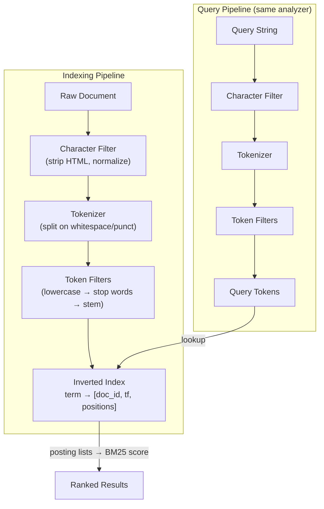

# [BEE-380] Full-Text Search Fundamentals

:::info
How full-text search engines convert raw documents into inverted indexes, score results with BM25, and why SQL `LIKE` is the wrong tool for relevance-ranked search.
:::

## Context

Almost every application eventually needs to let users search through text: product descriptions, support tickets, articles, user-generated content. The instinct is to reach for `LIKE '%keyword%'` in SQL. That works for a few hundred rows. At any meaningful scale, or when users expect results ranked by relevance rather than insertion order, it breaks down.

Full-text search (FTS) is the discipline of indexing and querying natural-language text efficiently. Its core abstractions -- the inverted index, the analysis pipeline, and relevance scoring -- appear in every serious search system, from Lucene-based engines (Elasticsearch, OpenSearch, Solr) to database-native FTS (PostgreSQL, SQLite FTS5). Understanding these fundamentals lets you reason about trade-offs across all of them.

## Principle

**Why `LIKE` is insufficient**

A `LIKE '%keyword%'` query performs a sequential scan: it reads every row and applies a pattern match. It cannot use a B-tree index, it has no awareness of word boundaries or morphology, and it returns results in no meaningful order. It gives you rows that contain the byte sequence, not documents that are relevant to the concept.

Full-text search addresses three fundamental limitations of `LIKE`:

| Limitation | `LIKE '%...%'` | Full-Text Search |
|---|---|---|
| Performance | Full sequential scan; O(n) | Inverted index lookup; sub-linear |
| Linguistic support | Exact byte match only | Stemming, stop words, synonyms |
| Relevance ranking | None (arbitrary order) | Scored by term frequency, IDF, length |

**The inverted index**

An inverted index is the core data structure of full-text search. It maps every unique term (token) in the corpus to the list of documents containing it:

```
term         → posting list
"database"   → [doc:3, doc:7, doc:12]
"index"      → [doc:1, doc:3, doc:9, doc:12]
"search"     → [doc:1, doc:7]
```

Each entry in a posting list typically stores the document ID, the term frequency within that document, and optionally the positions of occurrences (required for phrase search and proximity ranking). This structure allows the engine to answer "which documents contain term X" in microseconds rather than scanning every document.

The inverted index is constructed offline (at index time) and consulted at query time. Writes are more expensive than reads -- this asymmetry is a key design constraint.

**The analysis pipeline**

Before a document reaches the inverted index, it passes through an analysis pipeline. The same pipeline runs on query text, so index and query tokens are comparable.

The pipeline has three stages:

1. **Character filter** (optional): Pre-processes the raw character stream before tokenization. Examples: strip HTML tags, expand ligatures (fi → fi), normalize Unicode.
2. **Tokenizer**: Splits the character stream into tokens -- usually on whitespace and punctuation. A standard tokenizer on `"full-text search"` produces `["full", "text", "search"]`.
3. **Token filters** (one or more, chained): Transform individual tokens. Common filters include:
   - **Lowercase**: `"Database"` → `"database"`
   - **Stop-word removal**: discard high-frequency, low-information words (`"the"`, `"a"`, `"is"`)
   - **Stemming / lemmatization**: reduce inflected forms to a root (`"running"` → `"run"`, `"databases"` → `"database"`)
   - **Synonym expansion**: index `"DB"` alongside `"database"`

Different fields need different analyzers. A product name field might skip stop-word removal; a code search field might treat `.`, `_`, and `-` as token boundaries rather than splitting on them.

Engines such as Lucene, Elasticsearch, and OpenSearch MUST apply the same analyzer at index time and query time. A mismatch (e.g., index with stemming, query without) causes silently wrong results.

**Relevance scoring: TF-IDF and BM25**

Given an inverted index, the engine must decide which matching documents are most relevant. The two dominant models are TF-IDF and its successor, BM25.

*TF-IDF*

TF-IDF scores a document by combining two signals:

- **Term Frequency (TF)**: how often the query term appears in the document. More occurrences → higher score.
- **Inverse Document Frequency (IDF)**: how rare the term is across the entire corpus. Common terms (`"the"`) contribute little; rare terms (`"speleothem"`) contribute much.

```
score(D, t) = TF(t, D) × IDF(t)

IDF(t) = log(N / df(t))
  N    = total number of documents
  df(t) = number of documents containing term t
```

TF-IDF has a critical flaw: raw TF grows linearly and is not normalized by document length. A long document that mentions a term ten times is scored identically to a short document with the same raw count, even though the term is proportionally far more prominent in the short one.

*BM25 (Okapi BM25)*

BM25 (Best Matching 25), developed by Stephen E. Robertson, Karen Spärck Jones, and colleagues at City University London through the 1980s and 1990s, addresses both weaknesses of TF-IDF:

```
score(D, Q) = Σ IDF(qᵢ) × [f(qᵢ, D) × (k₁ + 1)] / [f(qᵢ, D) + k₁ × (1 - b + b × |D| / avgdl)]

  f(qᵢ, D) = term frequency of query term qᵢ in document D
  |D|       = length of document D (in tokens)
  avgdl     = average document length across the corpus
  k₁        = term frequency saturation (typically 1.2–2.0; Lucene default: 1.2)
  b         = length normalization (0 = disabled, 1 = full; default: 0.75)
```

Two improvements over TF-IDF:

1. **TF saturation**: The `k₁` parameter applies a diminishing-returns curve to term frequency. The 10th occurrence of a term contributes far less to score than the 1st. TF-IDF scores grow without bound; BM25 scores plateau.
2. **Length normalization**: The `b` parameter penalizes long documents. A term appearing 5 times in a 10-word document is more significant than the same count in a 500-word document. BM25 adjusts for this.

BM25 has been the default similarity function in Lucene (and by extension Elasticsearch) since version 6.0 (2016). It is also the default in many other systems and is widely considered the standard baseline for keyword search relevance.

**When to use built-in database FTS vs. a dedicated search engine**

Database-native FTS (PostgreSQL with `tsvector`/`tsquery` and GIN indexes; SQLite FTS5) is appropriate when:

- The document corpus is moderate in size (millions of rows, not billions)
- Search is a secondary feature alongside transactional queries
- Operational simplicity matters -- one fewer system to run and monitor
- You need strong consistency between indexed and stored data

A dedicated search engine (Elasticsearch, OpenSearch, Solr) is appropriate when:

- Relevance tuning matters: custom analyzers, field boosting, function scoring
- You need advanced query features: fuzzy matching, geospatial, aggregations, facets
- The corpus is very large or the query rate is high enough to warrant horizontal scaling
- Near-real-time indexing latency is a product requirement

Engineers MUST NOT default to a dedicated search engine for every text search need. The operational burden (replication, snapshot management, index lifecycle, cluster sizing) is substantial. Start with your existing database's FTS capabilities; migrate to a dedicated engine when you have a concrete capability gap.

Engineers SHOULD evaluate the trade-off explicitly: query complexity required, corpus size, write-to-search latency requirements, and team's operational capacity.

Engineers MAY co-index data in both a database and a search engine for applications that need both transactional integrity and advanced search, but MUST account for the synchronization lag and consistency window this introduces.

## Visual

The following diagram shows the two paths data travels: the indexing pipeline (top) and the query pipeline (bottom), both producing tokens that meet in the inverted index.



## Example

The following pseudo-code illustrates the three phases of a full-text search system in a language-neutral style:

```
// --- INDEXING PHASE ---

function analyze(text, analyzer):
    tokens = analyzer.charFilter(text)
    tokens = analyzer.tokenize(tokens)
    tokens = analyzer.tokenFilter(tokens)   // lowercase, stem, stop words
    return tokens

function indexDocument(docId, text, index):
    tokens = analyze(text, defaultAnalyzer)
    for each token in tokens:
        index[token].postingList.add({
            docId:     docId,
            frequency: count(token, tokens),
            positions: positionsOf(token, tokens)
        })

// --- QUERY PHASE ---

function search(queryText, index, corpus):
    queryTokens = analyze(queryText, defaultAnalyzer)  // same analyzer!
    candidates  = intersect(index[t].postingList for t in queryTokens)
    scored      = []

    N     = corpus.documentCount
    avgdl = corpus.averageDocumentLength
    k1    = 1.2
    b     = 0.75

    for each docId in candidates:
        score = 0
        for each term in queryTokens:
            tf  = index[term][docId].frequency
            df  = index[term].postingList.length
            idf = log((N - df + 0.5) / (df + 0.5) + 1)
            dl  = corpus.documentLength(docId)

            score += idf * (tf * (k1 + 1)) / (tf + k1 * (1 - b + b * dl / avgdl))

        scored.append({docId, score})

    return sortDescending(scored)
```

**PostgreSQL FTS example**

```sql
-- Create a GIN index on a tsvector column
ALTER TABLE articles ADD COLUMN search_vector tsvector;

UPDATE articles
SET search_vector = to_tsvector('english', title || ' ' || body);

CREATE INDEX articles_fts_idx ON articles USING GIN (search_vector);

-- Query with ranking
SELECT title, ts_rank(search_vector, query) AS rank
FROM articles, to_tsquery('english', 'database & index') query
WHERE search_vector @@ query
ORDER BY rank DESC
LIMIT 10;
```

## Common Mistakes

1. **Using the wrong analyzer at query time.** If you index with stemming (`"running"` → `"run"`) but query without it, the query term `"running"` will not match index token `"run"`. Always ensure the same analyzer is applied to both index and query paths.

2. **Treating `LIKE '%term%'` as an FTS substitute.** Pattern matching cannot use indexes (a leading wildcard forces a sequential scan), returns no relevance score, and does not handle morphological variation. For anything beyond exact substring matching, use a proper FTS facility.

3. **Indexing everything with a single generic analyzer.** A code search, a legal document corpus, and a product catalog have different tokenization needs. Using one analyzer for all fields will degrade precision. Invest time in choosing per-field analyzers appropriate to the content type.

4. **Ignoring index-to-search latency.** Inverted indexes are built asynchronously. In Elasticsearch, newly indexed documents are visible only after a refresh (default interval: 1 second). In PostgreSQL, the `tsvector` column must be updated explicitly (via trigger or application logic) before new content is searchable. Assume FTS is near-real-time, not synchronous.

5. **Adding a dedicated search engine before exhausting built-in options.** Elasticsearch clusters have real operational overhead: JVM tuning, shard sizing, snapshot policies, upgrade management. If your workload fits within PostgreSQL FTS or SQLite FTS5, the simpler path is almost always better.

6. **Not storing positions when phrase search is required.** Inverted index posting lists can omit position data to save space. Without positions, phrase queries (`"credit card"` must appear as an adjacent pair) are impossible. Decide early whether phrase search is a requirement and configure the index accordingly.

## Related BEEs

- [BEE-100](../Data Storage and Database Fundamentals/100.md) -- Database Fundamentals: storage engines and index structures that underpin both relational and search systems.
- [BEE-300](../Architecture Patterns/300.md) -- Architecture Patterns Overview: where to place a search engine in a broader system design.

## References

- [How full-text search works -- Elastic Docs](https://www.elastic.co/docs/solutions/search/full-text/how-full-text-works)
- [Practical BM25 Part 2: The BM25 Algorithm and its Variables -- Elastic Blog](https://www.elastic.co/blog/practical-bm25-part-2-the-bm25-algorithm-and-its-variables)
- [Okapi BM25 -- Wikipedia](https://en.wikipedia.org/wiki/Okapi_BM25)
- [PostgreSQL Full-Text Search Introduction -- PostgreSQL Docs](https://www.postgresql.org/docs/current/textsearch-intro.html)
- [Preferred Index Types for Text Search -- PostgreSQL Docs](https://www.postgresql.org/docs/current/textsearch-indexes.html)
- [org.apache.lucene.analysis package -- Apache Lucene 8.0.0 API](https://lucene.apache.org/core/8_0_0/core/org/apache/lucene/analysis/package-summary.html)
- [SQLite FTS5 Extension -- SQLite.org](https://www.sqlite.org/fts5.html)
