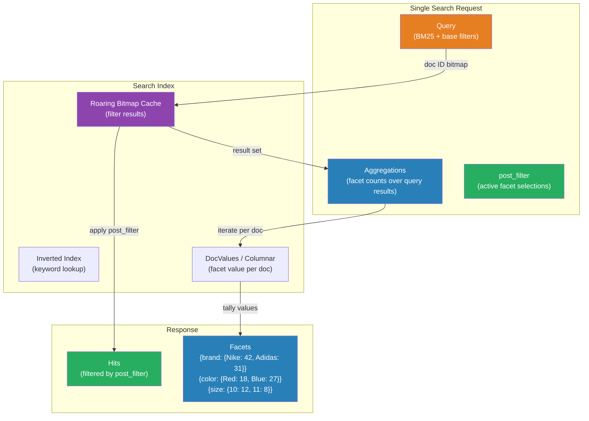

# [BEE-382] Faceted Search and Filtering

:::info
Faceted search lets users iteratively narrow large result sets by selecting attribute values — a pattern pioneered by UC Berkeley's Flamenco project and now standard on every e-commerce, library, and enterprise search interface.
:::

## Context

Before faceted navigation existed, finding a product on an early e-commerce site meant either knowing its exact name or browsing through rigid category trees. In 2002, Professor Marti Hearst and her team at the UC Berkeley School of Information launched the Flamenco project (FLexible information Access using MEtadata in Novel COmbinations), a research system that applied hierarchical faceted metadata to guide users through large collections. Flamenco was released as open-source in 2006, by which time Amazon, eBay, and library systems had already adopted the pattern commercially. Today, the sidebar filter panel on every e-commerce site is a direct descendant of that research.

The engineering challenge faceted search solves is real: a corpus of one million products cannot be browsed by scrolling. Users need to express intent through progressive refinement — "show me running shoes, size 10, under $100, in stock" — without knowing in advance which of those attributes they want to apply, or in which order. The system must return not just the matching items, but also the counts of how many items remain available under each remaining filter option, so the user can see where the data is before they click.

That count requirement — computing facet value frequencies over a filtered result set, for every facet, in a single query — is what makes faceted search a distinct engineering problem from ordinary filtering. It cannot be naively solved with repeated SQL `COUNT(*)` queries; at scale, it demands specialized data structures and query execution strategies.

## Design Thinking

Faceted search sits at the intersection of information architecture and backend infrastructure. Two decisions made at design time determine almost everything about how the system performs:

**Facet cardinality** — how many distinct values a facet has. A "gender" facet with values {Male, Female, Unisex} is low-cardinality. A "brand" facet with 50,000 vendors is high-cardinality. Low-cardinality facets can be exhaustively enumerated; high-cardinality facets typically require top-N truncation, search-within-facet, or approximate counting.

**Filter logic** — how multiple facet selections combine. The standard UX convention is:
- **Within a facet**: OR logic. Selecting "Nike" and "Adidas" shows products from either brand.
- **Across facets**: AND logic. Selecting "Nike" under Brand AND "Running" under Category shows Nike running shoes only.

This asymmetry is non-obvious but critical. It means the aggregation query for the "Brand" facet must exclude any brand filters already applied (so users can see counts for other brands) while still applying all other active facets (Color, Size, Category). Getting this wrong produces facets that silently show zero counts for valid selections.

## Best Practices

### Separate aggregations from result filtering

MUST NOT apply facet filters inside the main search query when computing aggregations. If you filter the query to `color:red`, the terms aggregation for the color facet will only see red documents, making it appear no other colors exist.

The correct pattern splits concerns:

1. Run the search query with all non-color filters applied.
2. Compute the color terms aggregation over that result set (showing all available colors given the other filters).
3. Apply the color filter via `post_filter` after aggregation — narrowing the returned hits without affecting the aggregation scope.

In Elasticsearch and OpenSearch, `post_filter` exists precisely for this purpose:

```json
{
  "query": {
    "bool": {
      "filter": [
        { "term": { "category": "running-shoes" } },
        { "range": { "price": { "lte": 100 } } }
      ]
    }
  },
  "aggs": {
    "brand-facet": {
      "terms": { "field": "brand.keyword", "size": 20 }
    },
    "color-facet": {
      "terms": { "field": "color.keyword", "size": 10 }
    },
    "size-facet": {
      "terms": { "field": "size.keyword", "size": 15 }
    }
  },
  "post_filter": {
    "term": { "brand.keyword": "nike" }
  }
}
```

The aggregations see all running shoes under $100. The returned hits are further narrowed to Nike only. The brand facet still shows counts for all brands — which is what the user needs to understand what would happen if they switched brands.

### Use keyword fields for facet aggregations

MUST index facet fields as `keyword` type (or the equivalent non-analyzed column type in your storage engine). Analyzed text fields are tokenized, meaning a product with `brand: "New Balance"` would produce tokens `["new", "balance"]`, creating facet entries for `"new"` and `"balance"` rather than `"New Balance"`. Terms aggregations on analyzed fields produce meaningless results.

In Elasticsearch, use multi-fields to keep both a searchable analyzed version and a keyword version:

```json
"brand": {
  "type": "text",
  "fields": {
    "keyword": { "type": "keyword" }
  }
}
```

Search on `brand` (analyzed); facet on `brand.keyword` (exact).

### Cap facet size and provide search-within-facet for high cardinality

SHOULD NOT return all values for high-cardinality facets in a single response. A brand facet with 50,000 values would transmit enormous payloads for every search request. Set `size` on terms aggregations to the maximum number of values the UI can usefully display (typically 10–20). Expose a search-within-facet input for users who need a specific value not in the top-N.

For distributed search clusters, the `size` setting interacts with shard-level aggregation accuracy. Each shard returns its own top-N, and the coordinating node merges them. A facet value that is #15 on shard A and #12 on shard B may be globally #8, but will be missed if `size` is set to 10. SHOULD set `shard_size` to a multiple of `size` (commonly 1.5× to 3×) to reduce this over-request error, at the cost of network overhead.

### Keep facet indexes in sync with the source of truth

MUST ensure facet field values in the search index reflect current product/content state. A product that is out of stock but still shows with a non-zero count in the "In Stock" facet creates a broken user experience. Index updates SHOULD be applied within the latency window your users tolerate — typically seconds to minutes for e-commerce, not hours.

When using a dedicated search engine alongside a primary database, maintain an explicit sync pipeline. Treat the search index as a derived view, not a source of truth, and design for the possibility that it will be temporarily behind or rebuilt from scratch.

### Design facet display order deliberately

MAY order facets by: (a) business priority (most impactful filters first), (b) discriminative power (facets that reduce the result set most effectively first), or (c) query-time signal (facets with the widest distribution of values, computed at request time). Static ordering by business priority is simplest to implement and often sufficient. Dynamic ordering based on result-set distribution adds latency and complexity with marginal UX benefit for most use cases.

SHOULD collapse facets with zero results rather than showing them as greyed-out. Zero-count facets are visual noise and mislead users into believing they have filtered out content that was always unavailable to them.

## Deep Dive

### How search engines count facets internally

Facet counting requires knowing, for each possible facet value, how many documents in the current result set have that value. The naive approach — for each value, intersect its posting list with the query result set and count — is O(V × N) where V is the number of facet values and N is the result set size. This becomes prohibitive for high-cardinality fields.

Modern search engines use two optimizations:

**DocValues / columnar storage**: Rather than reading the inverted index (which maps terms to documents), facet aggregations read a columnar structure that maps document IDs to their field values. Iterating the result set and looking up each document's facet value is more cache-friendly than navigating posting lists for each term.

**Roaring bitmaps**: The result set itself is represented as a compressed bitmap over document IDs (roaring bitmaps, adopted in Lucene 5). Counting the intersection of this bitmap with the per-facet-value posting list is reduced to a bitwise AND followed by a popcount — operations that modern CPUs execute in bulk. Apache Lucene uses roaring bitmaps for filter caching; each cached filter is a roaring bitmap of matching doc IDs that can be instantly intersected with other bitmaps during aggregation.

For very high-cardinality facets, Elasticsearch and Solr support approximate counting via sampling. LinkedIn's Galene search stack, for example, segments the document ID space into ranges and linearly interpolates facet density functions to estimate counts — achieving 7× reduction in CPU load and 11× reduction in p99 latency versus exact counting, with a median error rate under 5%.

### Range facets

Numeric and date fields require range facets rather than term facets. A price field with 500 distinct values produces an unusable facet of 500 options; bucketing into `$0–$25`, `$25–$50`, `$50–$100`, `$100+` is what users need.

Range facet strategies:

- **Fixed boundaries**: Defined at index/query time. Simple but inflexible — buckets must be chosen before knowing the data distribution.
- **Histogram / auto-interval**: The engine computes bucket boundaries automatically based on the data range divided by a requested bucket count. Useful for dates: "group by month" or "group by year."
- **Dynamic range from result statistics**: Query the min/max of the field in the current result set, then define bucket boundaries proportionally. More accurate but requires two query phases.

In Elasticsearch, `date_histogram` aggregation supports calendar-aware intervals (`month`, `year`) that correctly handle varying month lengths and leap years:

```json
"year-facet": {
  "date_histogram": {
    "field": "published_at",
    "calendar_interval": "year",
    "format": "yyyy",
    "min_doc_count": 1
  }
}
```

Setting `min_doc_count: 1` suppresses empty buckets, keeping the facet display clean.

### Pivot and hierarchical facets

Pivot facets (Solr terminology) or nested aggregations (Elasticsearch) produce a tree structure: facet values for field A, and for each value, the facet values for field B. This is useful for "Country → Region → City" drill-down navigation.

```json
"geography": {
  "terms": { "field": "country.keyword" },
  "aggs": {
    "region": {
      "terms": { "field": "region.keyword" }
    }
  }
}
```

Hierarchical facets work best when the tree is shallow (2–3 levels) and each level has low to moderate cardinality. Deep hierarchies with high cardinality at each level produce combinatorial explosions in aggregation size and latency.

## Visual



## Example

The following pseudocode illustrates a complete faceted search request and how to parse the response for UI rendering.

```
// -- REQUEST BUILDER --

function buildFacetedSearchRequest(query, activeFilters, activeFacetFilters):
    // Base filters: non-facet constraints (e.g., in_stock, price range)
    baseFilters = activeFilters                          // e.g., {price: {lte: 100}}

    // Facet filters: the facet selections the user has made
    // Applied via post_filter, NOT inside the main query
    postFilter = buildBoolFilter(activeFacetFilters)     // e.g., {brand: "Nike", color: "Red"}

    return {
        query: {
            bool: {
                must:   buildTextQuery(query),           // BM25 relevance
                filter: buildBoolFilter(baseFilters)     // price, availability, etc.
            }
        },
        aggs: {
            "brand-agg":  { terms: { field: "brand.keyword",  size: 20, shard_size: 60 } },
            "color-agg":  { terms: { field: "color.keyword",  size: 10, shard_size: 30 } },
            "size-agg":   { terms: { field: "size.keyword",   size: 15, shard_size: 45 } },
            "price-hist": {
                histogram: { field: "price", interval: 25, min_doc_count: 1 }
            }
        },
        post_filter: postFilter,
        size: 20,         // hits per page
        from: page * 20   // pagination offset
    }

// -- RESPONSE PARSER --

function parseFacets(response):
    facets = {}

    for facetName, aggResult in response.aggregations:
        if aggResult has "buckets":
            facets[facetName] = {
                bucket.key: bucket.doc_count
                for bucket in aggResult.buckets
                if bucket.doc_count > 0       // omit zero-count values
            }

    return facets

// -- UI RENDERING --

function renderSidebar(facets, activeFilters):
    for facetName, valueCounts in facets:
        renderFacetGroup(
            title:  facetName,
            values: [
                { label: value, count: count, checked: value in activeFilters[facetName] }
                for value, count in valueCounts
                sorted by count descending
            ]
        )
```

**Result: a single round-trip** returns both the paginated hits and the facet sidebar data, with counts reflecting the current filter state.

## Failure Modes

**Stale facet counts after writes** — The search index is eventually consistent with the source of truth. A product deleted from the database may still appear in facet counts for minutes or hours, depending on the sync interval. Users may select a facet value and find zero results because the underlying documents have since been removed. Mitigate by running a zero-count guard at result rendering and by reducing index sync latency for high-visibility data.

**Facet explosion on unbounded `size`** — Setting `size: 10000` on a terms aggregation to "show all values" transfers enormous payloads and imposes aggregation cost proportional to cardinality. Always set a reasonable `size` ceiling and offer search-within-facet for the long tail.

**Over-relying on `post_filter` for correctness without understanding its cost** — `post_filter` runs after the main query phase and does not benefit from query-level filter optimizations (like filter caching). For result sets where post-filtering removes a large fraction of documents, the wasted scoring and retrieval cost adds up. Profile your filter distribution before choosing between `post_filter` and restructuring the query itself.

**Aggregation accuracy in distributed clusters** — In a sharded index, terms aggregations produce approximate results. The default `size: 10` may miss globally-popular facet values that are only locally top-N on some shards. ALWAYS increase `shard_size` when accuracy matters, and document the trade-off between accuracy and network/compute cost.

**Ignoring multi-select logic** — Many teams implement faceted search where selecting two values in the same facet applies AND logic, showing only products that have both values simultaneously. This is almost never correct — a user selecting "Red" and "Blue" wants to see any red or blue product, not products that are simultaneously both. Test multi-select behavior explicitly during implementation.

## Related BEEs

- [BEE-380](380.md) -- Full-Text Search Fundamentals: the inverted index, analysis pipeline, and BM25 scoring that underpin search engines used to implement faceted search.
- [BEE-381](381.md) -- Search Relevance Tuning: how to measure and improve result ranking within the hit set that facets operate over.
- [BEE-73](../API Design and Communication Protocols/73.md) -- Pagination Patterns: faceted search responses are paginated; offset, cursor, and keyset pagination all apply.
- [BEE-202](../Caching/202.md) -- Cache Eviction Policies: popular facet queries benefit from application-layer caching of aggregation results.

## References

- [Faceted Metadata for Information Architecture and Search -- Marti A. Hearst, CHI 2006](https://flamenco.berkeley.edu/talks/chi_course06.pdf)
- [Flamenco Project Home -- UC Berkeley School of Information](https://flamenco.berkeley.edu/)
- [The Many Facets of Faceted Search -- LinkedIn Engineering](https://engineering.linkedin.com/faceting/many-facets-faceted-search)
- [Filter search results (post_filter) -- Elasticsearch Reference](https://www.elastic.co/guide/en/elasticsearch/reference/current/filter-search-results.html)
- [Faceted Search Tutorial -- Elasticsearch Labs](https://www.elastic.co/search-labs/tutorials/search-tutorial/full-text-search/facets)
- [Faceting -- Apache Solr Reference Guide](https://solr.apache.org/guide/solr/latest/query-guide/faceting.html)
- [Frame of Reference and Roaring Bitmaps -- Elastic Blog](https://www.elastic.co/blog/frame-of-reference-and-roaring-bitmaps)
- [Better bitmap performance with Roaring bitmaps -- Lemire et al., arXiv:1402.6407](https://arxiv.org/abs/1402.6407)
- [Design Patterns: Faceted Navigation -- A List Apart](https://alistapart.com/article/design-patterns-faceted-navigation/)
