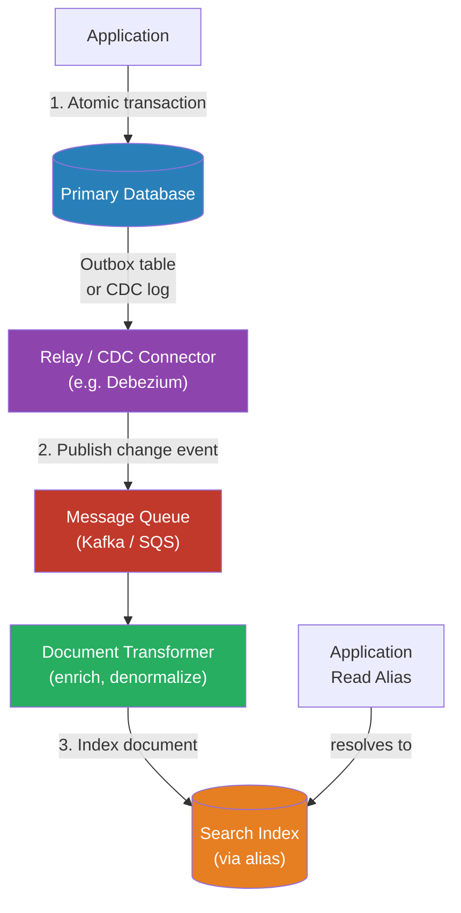

# [BEE-384] Search Indexing Pipelines and Data Synchronization

:::info
Keeping a search index consistent with its authoritative data source requires a deliberate synchronization strategy — naive dual writes lose data on partial failures, while robust pipelines trade some consistency for reliability.
:::

## Context

A search index is a derived data structure: it is built from a primary data store (a relational database, a document store, an event log) and must stay synchronized as that source changes. The indexing pipeline is the mechanism that moves changes from the source of truth into the search index.

This sounds straightforward but conceals a hard problem: the source database and the search index are two independent systems. Writing to both atomically — as if they were a single system — is not possible. This is the *dual-write problem*, described in detail by Confluent and others in the context of databases and message brokers. If the application writes to the database and then the search index, a crash between the two writes leaves them inconsistent. If the order is reversed, a failed database write can still produce an indexed document that has no backing record.

The consequences range from stale search results (a minor nuisance) to phantom records in search that point to deleted data (a user-facing error) to missing records that exist in the database but are invisible to search (a loss-of-function bug).

Four synchronization patterns address this problem at different points on the complexity-reliability curve: application-level dual write, the transactional outbox pattern, change data capture (CDC), and periodic polling. Each has a place, and choosing the wrong one for the scale and consistency requirements of the system is a common source of production incidents.

In addition to synchronization, the pipeline must handle *document transformation*: the shape of data in the database (normalized rows, foreign-key relationships) differs from the shape needed in the search index (denormalized, pre-joined documents). This transformation adds latency and complexity to every pipeline.

## Design Thinking

Think of the search index as a *read model* (similar to the read side of a CQRS architecture — see BEE-102). It exists to serve queries efficiently; the authoritative state lives elsewhere. This framing has two implications:

1. **Consistency is eventually consistent by design.** Accept that there will be a window — measured in milliseconds to seconds — between a write to the source and its visibility in search. Design the product UX accordingly. If a user creates a record and immediately searches for it, the record may not yet appear. This is normal and should be communicated clearly rather than hidden.

2. **The pipeline should be idempotent.** Reprocessing the same change event — whether due to a retry, a redelivery, or a full reindex — must produce the same result. Index operations in most search engines are idempotent by default when the document ID is stable: indexing the same document twice with the same ID replaces the first with the second. Deletions require more care.

The choice of synchronization pattern is primarily a function of two variables: how much indexing lag is tolerable, and how much operational complexity the team can maintain.

## Best Practices

### Synchronization Strategy Selection

Engineers MUST NOT use naive application-level dual writes (write to database, then write to search index in the same request handler) in any production system where consistency matters. There is no recovery path when the second write fails after the first succeeds.

Engineers SHOULD use the **transactional outbox pattern** when the source of truth is a transactional SQL database and sub-second indexing lag is not required. The outbox pattern writes a change event to an `outbox` table in the same transaction as the business write, guaranteeing that the event exists if and only if the business record exists. A separate relay process reads the outbox and publishes to the search index.

Engineers SHOULD use **change data capture (CDC)** when very low indexing lag is required (under one second), when the source database's transaction log can be tailed (PostgreSQL logical replication, MySQL binlog, MongoDB change streams), or when adding an outbox table to the schema is not feasible. CDC tools such as Debezium read directly from the transaction log, making all committed changes visible to downstream consumers without modifying application code. The trade-off is significant operational complexity: CDC requires running a dedicated connector process, managing replication slots or binlog positions, and handling connector lag and failover.

Engineers MAY use **polling** — periodically querying the source database for records modified since the last poll (using an `updated_at` timestamp) — only when the source lacks CDC support and the outbox pattern is too invasive. Polling introduces inherent lag equal to the poll interval, cannot detect hard deletes (a deleted row leaves no `updated_at`), and adds periodic query load to the database. It is appropriate for small corpora or low-frequency update workloads.

### Document Transformation

Engineers MUST define the document shape for the search index explicitly before building the pipeline. The indexed document is often a denormalized join across multiple tables (e.g., a product document that includes category name, seller name, and inventory count, all from separate tables). Changes to any of those tables must trigger reindexing of the affected documents.

Engineers SHOULD keep transformation logic out of the synchronization layer. Separate the *event* (a row changed) from the *enrichment* (fetching related data and building the full document). This separation makes the pipeline testable: the transformer can be unit-tested in isolation.

Engineers MUST handle partial enrichment failures gracefully. If the transformer cannot fetch a required related record (because it was deleted concurrently, or because the enrichment service is unavailable), the pipeline MUST NOT silently drop the event. Retry with backoff, or route to a dead-letter queue for manual inspection.

### Schema Evolution and Zero-Downtime Reindexing

Engineers MUST avoid pointing application code directly at a named index. Use an alias (in Lucene-based engines) or a logical name that can be remapped. This decouples the application from the physical index, enabling zero-downtime schema migrations.

When a mapping change requires full reindexing (e.g., changing a field's data type, adding a new analyzed field that must be applied to all existing documents), Engineers SHOULD follow the alias-swap pattern:
1. Create a new index with the updated mapping.
2. Begin writing new events to both the old and new indexes simultaneously (dual-write window).
3. Reindex all historical documents into the new index using a background job.
4. Atomically swap the alias from the old index to the new one.
5. Stop writing to the old index; keep it briefly as a rollback target.

Engineers MUST NOT modify an existing index mapping in place when the change is not backwards-compatible. Many search engines permit adding new fields dynamically but do not permit changing existing field types. Attempting to do so will produce a mapping conflict error.

### Monitoring

Engineers MUST monitor indexing lag — the time between a write to the source and its appearance in search results. Alert on lag that exceeds the product's stated consistency window.

Engineers SHOULD run periodic consistency checks: compare document counts and a sample of records between the source database and the search index. Silent drift — where the pipeline appears healthy but documents are missing or stale — is a common failure mode.

## Visual



## Example

**Outbox pattern schema (PostgreSQL):**

```sql
-- Business table
CREATE TABLE products (
    id         UUID PRIMARY KEY,
    name       TEXT NOT NULL,
    price      NUMERIC(10,2),
    updated_at TIMESTAMPTZ DEFAULT now()
);

-- Outbox table in the same database
CREATE TABLE search_outbox (
    id          UUID PRIMARY KEY DEFAULT gen_random_uuid(),
    entity_type TEXT NOT NULL,           -- 'product'
    entity_id   UUID NOT NULL,
    operation   TEXT NOT NULL,           -- 'upsert' | 'delete'
    created_at  TIMESTAMPTZ DEFAULT now()
);

-- In a single transaction, write both:
BEGIN;
UPDATE products SET name = 'Widget Pro', updated_at = now() WHERE id = $1;
INSERT INTO search_outbox (entity_type, entity_id, operation)
    VALUES ('product', $1, 'upsert');
COMMIT;
-- If either fails, both are rolled back. No orphan outbox event.
```

**Relay process (pseudocode):**

```
loop:
    events = db.query("SELECT * FROM search_outbox ORDER BY created_at LIMIT 100 FOR UPDATE SKIP LOCKED")
    for event in events:
        if event.operation == 'upsert':
            record = db.query("SELECT p.*, c.name AS category FROM products p
                               JOIN categories c ON p.category_id = c.id
                               WHERE p.id = $1", event.entity_id)
            if record is None:
                // Deleted between outbox write and relay — treat as delete
                searchIndex.delete(event.entity_id)
            else:
                searchIndex.upsert(buildDocument(record))
        elif event.operation == 'delete':
            searchIndex.delete(event.entity_id)

        db.query("DELETE FROM search_outbox WHERE id = $1", event.id)
    sleep(500ms)
```

**Zero-downtime alias swap:**

```
// Create new index with updated mapping
PUT /products_v2 { "mappings": { ... } }

// Background reindex (reads v1, writes v2)
POST /_reindex { "source": { "index": "products_v1" }, "dest": { "index": "products_v2" } }

// While reindexing: dual-write new events to both v1 and v2
// (handled in transformer — check current alias target, write to both)

// When reindex completes, atomically swap the alias
POST /_aliases {
    "actions": [
        { "remove": { "index": "products_v1", "alias": "products" } },
        { "add":    { "index": "products_v2", "alias": "products" } }
    ]
}

// Application reads via alias "products" — sees no disruption
```

## Related BEEs

- [BEE-102](../Architecture Patterns/102.md) -- CQRS: the search index is a canonical example of a CQRS read model, synchronized from the write model via an event pipeline
- [BEE-163](../Transactions and Data Integrity/163.md) -- Saga Pattern: the outbox relay is a saga step — a distributed operation guaranteed by local transaction plus async compensation
- [BEE-222](../Messaging and Event-Driven/222.md) -- Delivery Guarantees: the outbox-to-queue step must provide at-least-once delivery; the transformer must be idempotent
- [BEE-380](380.md) -- Full-Text Search Fundamentals: the inverted index structure that the pipeline is populating
- [BEE-383](383.md) -- Vector Search and Semantic Search: embedding generation belongs in the transformer stage of the same pipeline

## References

- [Dual-Write Problem -- Confluent](https://www.confluent.io/blog/dual-write-problem/)
- [Transactional Outbox Pattern -- AWS Prescriptive Guidance](https://docs.aws.amazon.com/prescriptive-guidance/latest/cloud-design-patterns/transactional-outbox.html)
- [How to Use Change Data Capture (CDC) with Elasticsearch -- Datacater](https://datacater.io/blog/2021-09-15/how-to-use-cdc-with-elasticsearch.html)
- [Changing Mapping with Zero Downtime -- Elastic Blog](https://www.elastic.co/blog/changing-mapping-with-zero-downtime)
- [Zero Downtime Reindex in Elasticsearch -- tuleism.github.io](https://tuleism.github.io/blog/2021/elasticsearch-zero-downtime-reindex/)
- [Kleppmann, M. (2017). Designing Data-Intensive Applications. O'Reilly. Chapter 11: Stream Processing](https://www.oreilly.com/library/view/designing-data-intensive-applications/9781491903063/)
