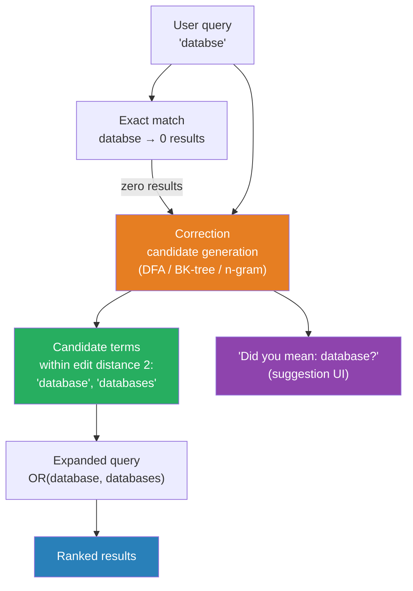

# [BEE-387] Spelling Correction and Fuzzy Search

:::info
Fuzzy search finds results that approximately match the query, tolerating typos and misspellings — at the cost of higher query latency driven by the number of unique terms in the index, not the number of documents.
:::

## Context

Users misspell queries. Studies of search log data consistently show that somewhere between 10–15% of queries contain at least one spelling error. A search engine that returns no results for "recieve" instead of "receive", or "databse" instead of "database", frustrates users and degrades the system's utility.

The mathematical foundation for spelling correction is **edit distance** — a measure of how many single-character operations are required to transform one string into another. Vladimir Levenshtein defined the most widely-used variant in 1965, giving it his name. The Levenshtein distance between "kitten" and "sitting" is 3: substitute k→s, substitute e→i, insert g at the end. A spelling correction system finds dictionary words whose Levenshtein distance from the query term is small (typically 1 or 2).

The naïve approach — compute the edit distance from the query to every term in the dictionary — is O(|query| × |dict_size|) and is too slow for interactive search. Three techniques make fuzzy matching tractable at scale:

**Deterministic Finite Automaton (DFA):** The approach used by Lucene and therefore Elasticsearch. Given a query term and a maximum edit distance, the algorithm constructs a finite automaton that accepts any string within that edit distance of the query. This automaton is then run against the sorted term dictionary, pruning entire branches efficiently. The cost depends on the number of unique terms in the index (not the number of documents), and is roughly an order of magnitude slower than an exact term query.

**BK-trees:** A metric tree structure built on Levenshtein distance. Each node stores a word; children are stored at edges labeled with their distance from the parent. A query prunes branches whose distance from the query cannot possibly yield results within the fuzziness threshold. BK-trees are well-suited for in-process spell checkers over a fixed dictionary.

**N-gram indexing:** Index every contiguous n-gram (typically trigram) of each term. A query generates its own n-grams and finds terms sharing a minimum number of them. N-gram similarity is O(1) per candidate term lookup and handles substitutions and insertions well, but is less precise than edit distance for deletions. It is the approach used by PostgreSQL's `pg_trgm` extension for fuzzy text matching and similarity search.

Beyond single-term correction, **phrase-level spelling correction** ("Did you mean …?") requires a language model. Google's approach, described in the context of their web search system, treats phrase correction as a noisy-channel problem: given the observed query, find the intended query that maximizes the product of the language model probability and the edit probability. In practice, large-scale systems train on query logs — seeing that users who type "recieve" immediately re-search for "receive" provides a strong training signal.

The **Damerau–Levenshtein distance** extends Levenshtein by adding transposition (swapping two adjacent characters) as a primitive operation at cost 1. Transposition accounts for a large share of real typing errors (people swap adjacent keys on a keyboard), so fuzziness=1 in Damerau-Levenshtein catches more real typos than fuzziness=1 in pure Levenshtein. Lucene uses Damerau-Levenshtein.

## Design Thinking

Fuzzy search and spelling correction serve overlapping but distinct purposes:

- **Fuzzy search** returns results that approximately match the query. The user may or may not know they made an error. The system simply finds near-matches and returns them.
- **Spelling correction** ("Did you mean?") preserves the original results but offers an alternative interpretation. It is appropriate when the original query returns results — you do not want to silently override a valid but unusual search term.

The two can be combined: show results for the original query, show a "did you mean" suggestion if the query has a likely correction, and automatically correct only when the original query returns zero results.

A critical design decision is when NOT to apply fuzzy matching: product codes, IDs, version strings, and technical identifiers must match exactly. `v1.0` and `v1.0.0` are different; `SKU-12345` and `SKU-12346` are different products. Apply fuzzy matching selectively by field type, not globally across all indexed fields.

## Best Practices

Engineers MUST NOT enable fuzzy matching globally on all fields. Apply it to natural-language fields (titles, descriptions, names) and keep exact matching for identifiers, codes, and structured fields. A fuzzy match against a field containing UUIDs or SKUs produces meaningless results at high latency cost.

Engineers SHOULD limit fuzziness to a maximum edit distance of 1 or 2. Distance 1 catches most single-character typos (one keystroke error). Distance 2 catches more cases but expands the search space substantially and can return results the user finds surprising. Fuzziness 0 means exact match; AUTO mode (used in Elasticsearch) applies fuzziness=0 for short terms, 1 for medium, and 2 for long terms.

Engineers MUST set `prefix_length` (or its equivalent) when using DFA-based fuzzy search. Requiring the first N characters to match exactly (typically 2–3) dramatically reduces the automaton's expansion space and can bring a 10x slow fuzzy query close to the speed of a normal query. Users rarely mistype the first characters of a word; this is a safe optimization.

Engineers SHOULD implement "Did you mean?" as a separate suggestion pass (a term or phrase suggester), not as a replacement for the main query. The suggestion runs in parallel with the main query. If results exist for the original query and a high-confidence correction exists, show both. If the original query returns zero results, automatically rerun with the corrected query and indicate the correction.

Engineers SHOULD use n-gram indexing as an alternative to runtime fuzzy queries when the query volume is high and the term dictionary is relatively stable. Pre-indexed trigrams support fuzzy filtering without per-query automaton construction. PostgreSQL `pg_trgm` and similar extensions make this straightforward for text search over moderate-sized corpora.

Engineers MUST monitor the latency distribution of fuzzy queries separately from exact queries. Fuzzy query latency degrades with index size (specifically with unique term count), not document count. A schema refactor that dramatically increases unique terms can cause a fuzzy query that was fast at 10M documents to become unacceptably slow at 50M.

Engineers SHOULD apply query-level fuzziness (fuzzy at query time) for user-facing searches, and index-time ngram expansion for scenarios requiring the highest throughput. The trade-off: query-time fuzzy is simpler to maintain and always reflects the current index; index-time ngrams require more storage but deliver consistent latency regardless of unique term count.

## Visual



## Example

**Levenshtein distance (dynamic programming):**

```
// Compute edit distance between two strings — O(m × n) time and space
function editDistance(a, b):
    m = len(a)
    n = len(b)
    dp = matrix of size (m+1) × (n+1), initialized to 0

    for i in 0..m:  dp[i][0] = i    // deleting all of a
    for j in 0..n:  dp[0][j] = j    // inserting all of b

    for i in 1..m:
        for j in 1..n:
            if a[i-1] == b[j-1]:
                dp[i][j] = dp[i-1][j-1]   // characters match — no operation
            else:
                dp[i][j] = 1 + min(
                    dp[i-1][j],    // delete from a
                    dp[i][j-1],    // insert into b
                    dp[i-1][j-1]   // substitute
                )

    return dp[m][n]

editDistance("database", "databse")  // → 1 (one deletion)
editDistance("recieve", "receive")   // → 2 (two substitutions)
```

**Fuzzy query with prefix anchoring (Elasticsearch-style DSL):**

```json
{
  "query": {
    "match": {
      "title": {
        "query": "databse",
        "fuzziness": "AUTO",
        "prefix_length": 2,
        "max_expansions": 50
      }
    }
  },
  "suggest": {
    "term_suggest": {
      "text": "databse",
      "term": {
        "field": "title",
        "suggest_mode": "missing"
      }
    }
  }
}
// prefix_length=2: 'da' must match exactly (fast pruning)
// max_expansions=50: limit automaton expansion to 50 candidate terms per shard
// suggest_mode=missing: only suggest when query matches no docs
```

**PostgreSQL trigram similarity (n-gram approach):**

```sql
-- Enable trigram extension
CREATE EXTENSION IF NOT EXISTS pg_trgm;
CREATE INDEX products_name_trgm_idx ON products USING GIST (name gist_trgm_ops);

-- Find products similar to a potentially misspelled name
SELECT name, similarity(name, 'databse') AS sim
FROM products
WHERE name % 'databse'          -- % operator: similarity > threshold (default 0.3)
ORDER BY sim DESC
LIMIT 10;

-- Threshold tuning: lower = more permissive, higher = stricter
SET pg_trgm.similarity_threshold = 0.4;
```

## Related BEEs

- [BEE-380](380.md) -- Full-Text Search Fundamentals: the analysis pipeline and inverted index that fuzzy queries operate against
- [BEE-381](381.md) -- Search Relevance Tuning: fuzzy matches should receive lower boost scores than exact matches in relevance scoring
- [BEE-385](385.md) -- Autocomplete and Typeahead Search: autocomplete is complementary to spelling correction — autocomplete prevents errors; correction handles them after they occur

## References

- [Levenshtein distance -- Wikipedia](https://en.wikipedia.org/wiki/Levenshtein_distance)
- [How to Use Fuzzy Searches in Elasticsearch -- Elastic Blog](https://www.elastic.co/blog/found-fuzzy-search)
- [Elasticsearch Suggestion: Term Suggester, Phrase & Completion -- Opster](https://opster.com/guides/elasticsearch/how-tos/elasticsearch-suggestion-term-phrase-completion/)
- [SymSpell: 1 million times faster spelling correction through Symmetric Delete -- GitHub](https://github.com/wolfgarbe/symspell)
- [pg_trgm: Trigram Matching for PostgreSQL -- PostgreSQL Docs](https://www.postgresql.org/docs/current/pgtrgm.html)
- [Fuzzy Search: A Comprehensive Guide to Implementation -- Meilisearch](https://www.meilisearch.com/blog/fuzzy-search)
