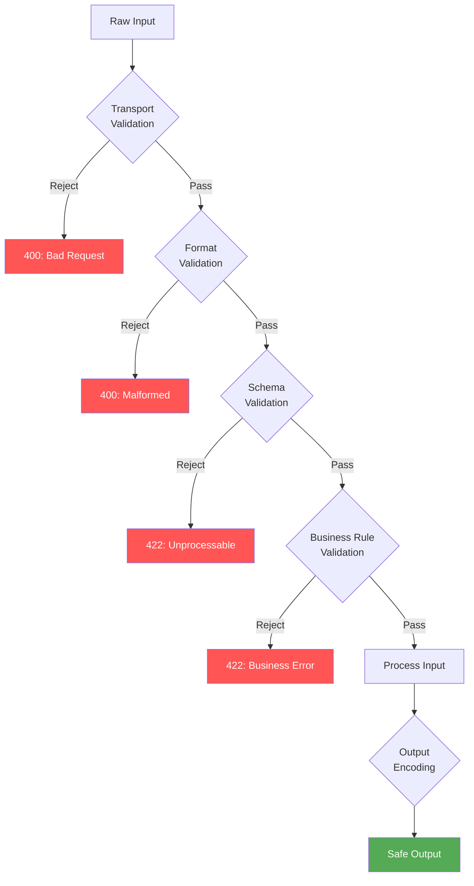

# [BEP-31] Input Validation and Sanitization

:::info
Validate at every system boundary. Never trust external input.
:::

## Context

Every system that accepts input from the outside world -- users, APIs, files, environment variables, upstream services -- is a potential attack surface. Injection vulnerabilities (SQL injection, XSS, command injection, path traversal) consistently rank among the most exploited weaknesses in production systems. The root cause is nearly always the same: the application trusted input it should not have trusted, or processed data before establishing that it was safe to do so.

CWE-20 (Improper Input Validation) is one of the most pervasive root-cause weaknesses catalogued by MITRE. OWASP lists injection as a top-tier risk year after year. The defenses are well-understood; the failures are almost always implementation oversights, not unsolved problems.

This principle defines the required approach to input validation and sanitization across all backend services.

## Principle

**Validate all input at every system boundary using an allowlist approach. Reject anything that does not conform. Never rely on sanitization as a substitute for rejection.**

### Validation vs. Sanitization

These are different operations with different purposes. Both are sometimes needed, but they must not be confused:

| | Validation | Sanitization |
|---|---|---|
| **Purpose** | Determine whether input is acceptable | Transform input into a safe form |
| **On failure** | Reject and return an error | Modifies or strips the data |
| **When to use** | Always, at the boundary | Only for specific outputs (HTML rendering, display) |
| **Risk if misused** | None -- rejection is safe | Can mask bugs, hide attack attempts, corrupt data |

Sanitization has a legitimate role: when rendering user-supplied content into HTML, output encoding (sanitization) prevents XSS. But sanitizing input to make it "valid" instead of rejecting it is a mistake -- it hides the fact that something sent you bad data and can produce unexpected behavior downstream.

**Rule: validate first, reject on failure. Sanitize only at output boundaries for display purposes.**

### Allowlist vs. Denylist

Always prefer allowlists over denylists.

A **denylist** (blocklist) defines what is not allowed. It will always be incomplete. Attackers probe for encodings, Unicode variants, null bytes, and other representations that bypass the list. Maintaining a denylist is an arms race you will lose.

An **allowlist** (safelist) defines exactly what is permitted. Everything else is rejected. It is inherently complete by definition: if you haven't explicitly allowed it, it is blocked.

```
// Denylist -- incomplete, fragile
if input.contains("'") || input.contains("--") || input.contains("DROP") {
    reject()
}

// Allowlist -- exhaustive by definition
if !input.matches(/^[a-zA-Z0-9_\-]{1,64}$/) {
    reject()
}
```

### Validate at System Boundaries

Validation must happen at every point where data crosses a trust boundary:

- HTTP request parameters, headers, cookies, body
- Data read from a database (before acting on it in business logic)
- Data received from upstream services, message queues, event streams
- File contents, environment variables, configuration inputs
- CLI arguments and user prompts

Internal service-to-service calls are not exempt. A compromised upstream service, a misconfigured producer, or a data migration error can all introduce malformed data. Validate at the consumer boundary regardless of the source's reputation.

## Validation Layers

Input should pass through a defined sequence of checks, each layer rejecting before the next layer is reached.



**Layer 1 -- Transport validation:** Content-Type matches declared format. Size is within limits. Encoding is valid (UTF-8 or as declared). Reject oversized payloads before parsing.

**Layer 2 -- Format validation:** The payload can be parsed as the declared format (valid JSON, valid XML, valid multipart). Field types match expectations (string, integer, boolean).

**Layer 3 -- Schema validation:** Fields conform to defined constraints -- length limits, allowed characters, value ranges, required vs. optional, enum membership. Use a schema validation library (JSON Schema, Zod, Pydantic, Joi, etc.) rather than hand-rolling checks.

**Layer 4 -- Business rule validation:** Cross-field consistency (start date before end date), referential integrity, authorization-level checks (does this user own this resource).

**Output encoding:** When writing to HTML, SQL, shell commands, file paths, LDAP queries -- encode for the target context. This is the final defense and is separate from input validation.

## Injection Attack Types and Defenses

### SQL Injection

The attacker inserts SQL syntax into a field that is interpolated directly into a query.

**Without validation and parameterization:**
```python
# Dangerous: user_id is interpolated directly
query = f"SELECT * FROM users WHERE id = '{user_id}'"
# user_id = "' OR '1'='1" → dumps entire users table
# user_id = "'; DROP TABLE users; --" → destroys data
```

**With parameterized queries (primary defense):**
```python
# Safe: the driver separates code from data
query = "SELECT * FROM users WHERE id = ?"
cursor.execute(query, (user_id,))
```

Parameterized queries (also called prepared statements) are the primary and mandatory defense against SQL injection. Input validation is a secondary defense -- even if a value passes validation, it must still go through a parameterized query. Never construct SQL by string concatenation.

### Cross-Site Scripting (XSS)

The attacker injects script content that executes in another user's browser. Stored XSS is particularly dangerous because the payload persists in the database and fires for every subsequent viewer.

**Validation side:** Reject inputs that contain HTML/script syntax if the field does not require it. A "username" field that accepts `<script>alert(1)</script>` as a valid value is an input validation failure.

**Output encoding side (mandatory even with input validation):**
```python
# Input stored: <script>alert(document.cookie)</script>
# Output rendered without encoding -- stored XSS fires
html = f"<p>Hello, {username}</p>"

# Output with context-aware encoding -- safe
html = f"<p>Hello, {html_escape(username)}</p>"
```

Always encode output for the rendering context. HTML encoding, JavaScript encoding, and URL encoding are different operations applied in different contexts.

### Command Injection

User input is passed to a shell command. The attacker appends additional commands with `;`, `&&`, `|`, or backticks.

```python
# Dangerous
os.system(f"convert {filename} output.png")
# filename = "foo.jpg; rm -rf /" → catastrophic

# Safe: use array form, never shell=True with user input
subprocess.run(["convert", filename, "output.png"])
```

Prefer APIs that accept argument arrays over shell string execution. If shell execution is unavoidable, validate the input strictly against an allowlist before use.

### Path Traversal

The attacker uses `../` sequences to access files outside the intended directory.

```python
# Dangerous
file_path = os.path.join(BASE_DIR, user_supplied_filename)
open(file_path)  # user_supplied_filename = "../../etc/passwd"

# Safe: canonicalize and check containment
resolved = os.path.realpath(os.path.join(BASE_DIR, user_supplied_filename))
if not resolved.startswith(os.path.realpath(BASE_DIR)):
    raise ValueError("Path traversal detected")
```

### LDAP Injection

User input is interpolated into an LDAP filter. Attackers use `*`, `(`, `)`, `\`, and null bytes to manipulate filter logic.

```
# Dangerous
filter = f"(uid={username})"
# username = "*)(uid=*))(|(uid=*" → bypass authentication

# Safe: escape special characters per RFC 4515
filter = f"(uid={ldap_escape(username)})"
```

## Schema Validation for Structured Input

For JSON APIs, declare and enforce schema at the boundary using a validation library. Do not manually check individual fields after parsing -- the schema library should reject the request before it reaches business logic.

```python
# JSON Schema example
user_schema = {
    "type": "object",
    "required": ["username", "email", "age"],
    "properties": {
        "username": {
            "type": "string",
            "pattern": "^[a-zA-Z0-9_]{3,32}$"
        },
        "email": {
            "type": "string",
            "format": "email",
            "maxLength": 254
        },
        "age": {
            "type": "integer",
            "minimum": 0,
            "maximum": 150
        }
    },
    "additionalProperties": false
}

# Validate before any business logic
errors = validate(request.json, user_schema)
if errors:
    return 422, {"errors": errors}
```

Key constraints to always declare: `maxLength` on strings, `minimum`/`maximum` on numbers, `pattern` for structured strings, `additionalProperties: false` to block undeclared fields, `required` for mandatory fields.

## Content Type and Size Limits

Enforce before parsing:

```python
MAX_BODY_SIZE = 1 * 1024 * 1024  # 1 MB

# Check Content-Type
if request.content_type not in ALLOWED_CONTENT_TYPES:
    return 415, "Unsupported Media Type"

# Check size before reading body
content_length = request.headers.get("Content-Length", 0)
if int(content_length) > MAX_BODY_SIZE:
    return 413, "Payload Too Large"

# Validate encoding
try:
    body = request.data.decode("utf-8")
except UnicodeDecodeError:
    return 400, "Invalid encoding"
```

Never parse a body before enforcing size limits -- a 10 GB JSON body will exhaust memory before schema validation has a chance to run.

## Defense in Layers: Summary

No single control is sufficient. The correct posture applies overlapping defenses:

| Layer | Control | Stops |
|---|---|---|
| Transport | Size limits, Content-Type, encoding check | DoS via large payloads, encoding attacks |
| Format | Parser validation | Malformed payloads reaching business logic |
| Schema | Schema library with allowlist patterns | Type confusion, over-posting, range violations |
| Business rules | Domain-specific validation | Logic errors, referential violations |
| Query layer | Parameterized queries | SQL injection |
| Output | Context-aware encoding | XSS, template injection |

If one layer is bypassed or has a gap, the next layer catches it. A single missing layer does not mean the system is compromised; multiple missing layers in the same path is how exploits succeed.

## Common Mistakes

**1. Relying on client-side validation alone.**
Client-side validation improves UX. It provides zero security. An attacker will send raw HTTP requests and bypass every JavaScript check you wrote. Server-side validation is mandatory and cannot be skipped because client-side is present.

**2. Using a denylist instead of an allowlist.**
Denylists are always incomplete. Unicode normalization, double encoding, null byte injection, and dozens of other techniques exist specifically to bypass naive denylists. Define what is allowed; reject everything else.

**3. Sanitizing invalid input instead of rejecting it.**
When a field contains `<script>` and you strip the tags and store the rest, you have masked a potential attack attempt, corrupted the user's intent, and created a false sense of security. Reject inputs that do not conform to the schema. Return a 400 or 422. Make the caller fix their input.

**4. Validating input but not encoding output.**
Input validation reduces what can enter the system. Output encoding prevents what is stored from being executed when rendered. Stored XSS requires both: validation to catch obvious injections, and output encoding to prevent anything that slipped through from executing. Both are required -- neither replaces the other.

**5. Trusting internal service input.**
Microservices communicate over networks. An upstream service can be compromised, misconfigured, or operating on corrupted data. A validation bypass at service A does not mean service B can skip validation. Each service validates input at its own boundary regardless of source trust level.

## References

- [OWASP Input Validation Cheat Sheet](https://cheatsheetseries.owasp.org/cheatsheets/Input_Validation_Cheat_Sheet.html)
- [OWASP Injection Prevention Cheat Sheet](https://cheatsheetseries.owasp.org/cheatsheets/Injection_Prevention_Cheat_Sheet.html)
- [OWASP SQL Injection Prevention Cheat Sheet](https://cheatsheetseries.owasp.org/cheatsheets/SQL_Injection_Prevention_Cheat_Sheet.html)
- [OWASP OS Command Injection Defense Cheat Sheet](https://cheatsheetseries.owasp.org/cheatsheets/OS_Command_Injection_Defense_Cheat_Sheet.html)
- [OWASP LDAP Injection Prevention Cheat Sheet](https://cheatsheetseries.owasp.org/cheatsheets/LDAP_Injection_Prevention_Cheat_Sheet.html)
- [CWE-20: Improper Input Validation](https://cwe.mitre.org/data/definitions/20.html)

## Related BEPs

- [BEP-30](/en/Security%20Fundamentals/30) -- OWASP Top 10 overview
- [BEP-75](/en/API%20Design/75) -- API error handling and response structure
- [BEP-143](/en/Data%20Formats/143) -- Encoding formats and serialization
