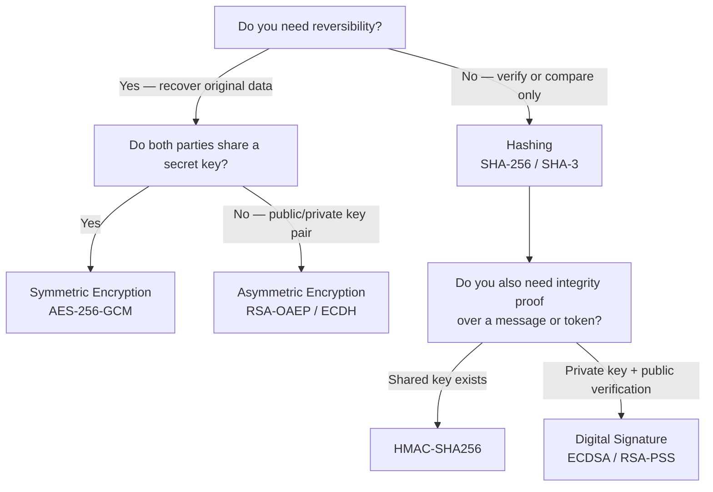

# [BEP-34] Cryptographic Basics for Engineers

:::info
Cryptography is the foundation of secure communication and data storage. Understanding when to hash, when to encrypt, and which algorithms to choose prevents the class of vulnerabilities that arise from misapplied or home-grown crypto.
:::

## Context

Cryptography is not just an academic topic — it is present in nearly every production backend: password storage, token signing, API key generation, database encryption, and HTTPS. Most cryptographic mistakes are not mathematical; they are engineering mistakes: picking the wrong primitive for the job, using a broken algorithm, or mismanaging keys.

Reference materials:
- OWASP Cryptographic Storage Cheat Sheet: https://cheatsheetseries.owasp.org/cheatsheets/Cryptographic_Storage_Cheat_Sheet.html
- OWASP Password Storage Cheat Sheet: https://cheatsheetseries.owasp.org/cheatsheets/Password_Storage_Cheat_Sheet.html
- NIST SP 800-175B Rev. 1 — Guideline for Using Cryptographic Standards: https://csrc.nist.gov/pubs/sp/800/175/b/r1/final
- Latacora — Cryptographic Right Answers: https://www.latacora.com/blog/2018/04/03/cryptographic-right-answers/

## Principle

**Use established algorithms from vetted libraries for the exact purpose they were designed for. Choose the simplest primitive that solves your problem, never invent your own protocol, and treat key management as a first-class concern.**

---

## Choosing the Right Primitive

The most common engineering mistake is not a mathematical error — it is picking the wrong tool. Before writing a single line, answer two questions:

1. Do you need to recover the original data later?
2. Do both parties share a key, or do they need to exchange one?



The sections below explain each branch in detail.

---

## Hashing

A **cryptographic hash function** maps arbitrary input to a fixed-size digest. The operation is one-way: given the digest, you cannot recover the input. Two different inputs must not produce the same digest (collision resistance).

Approved algorithms:
- **SHA-256** and **SHA-3** — general-purpose hashing (content checksums, commitment schemes, hash-based data structures)
- **SHA-384**, **SHA-512** — higher output length for protocol requirements

Broken algorithms — do not use for any security purpose:
- **MD5** — collision attacks demonstrated since 2004
- **SHA-1** — practically broken for collision resistance since 2017

### Hashing is not password storage

Plain hashing (even with SHA-256) is unsuitable for passwords. Passwords have low entropy and are vulnerable to precomputed rainbow tables and GPU brute-force. Password storage requires a **slow, salted, memory-hard** algorithm. See the Password Hashing section below.

---

## Symmetric Encryption

Symmetric encryption uses a single shared key for both encryption and decryption. It is fast and appropriate for bulk data protection: encrypting files, database fields, or payloads between two services that already share a secret.

**Recommended algorithm: AES-256-GCM**

AES (Advanced Encryption Standard) with a 256-bit key in **GCM (Galois/Counter Mode)** provides:
- Confidentiality: ciphertext reveals nothing about the plaintext
- Integrity and authenticity: a tampered ciphertext fails decryption and raises an error (authenticated encryption)
- Performance: hardware acceleration is available on most modern CPUs

| Property | Value |
|----------|-------|
| Key size | 256 bits (32 bytes) |
| IV / Nonce size | 96 bits (12 bytes), **unique per encryption** |
| Authentication tag | 128 bits (16 bytes) |

The nonce must never be reused with the same key. Nonce reuse in GCM breaks both confidentiality and integrity.

### Block cipher mode pitfall — ECB

ECB (Electronic Codebook) mode encrypts each block independently. Identical plaintext blocks produce identical ciphertext blocks. This leaks structural patterns from the plaintext, making it unsuitable for encrypting anything with repetition (images, structured data, even predictable headers).

```
# ECB leaks structure
BLOCK 1: "Hello, World!!!" → C1
BLOCK 2: "Hello, World!!!" → C1  ← identical ciphertext reveals identical plaintext

# GCM does not leak structure
BLOCK 1: "Hello, World!!!" → R1
BLOCK 2: "Hello, World!!!" → R2  ← different ciphertext every time
```

Always use an authenticated mode (GCM, CCM) or CBC combined with HMAC (Encrypt-then-MAC). Never use ECB.

---

## Asymmetric Encryption

Asymmetric (public-key) encryption uses a key pair: the public key encrypts (or verifies), the private key decrypts (or signs). It solves key distribution — you can share the public key openly.

### Encryption — RSA-OAEP

For encrypting a message to a specific recipient:

- **RSA-OAEP** with SHA-256 and a 2048-bit (minimum) or 4096-bit key
- RSA is only suitable for small payloads (a session key, a token). For large data, encrypt the data symmetrically and use RSA to encrypt the AES key (hybrid encryption)

### Key Agreement — ECDH / X25519

For establishing a shared secret over an untrusted channel:

- **X25519** (Curve25519 ECDH) is the current recommendation — fast, safe from common implementation pitfalls, and widely supported
- **ECDH on P-256** is acceptable where NIST curves are required

### Key sizes and algorithm choices

| Algorithm | Minimum key / curve | Recommended |
|-----------|--------------------|--------------------|
| RSA | 2048-bit | 3072-bit or 4096-bit |
| ECDSA | P-256 (256-bit) | P-256 or P-384 |
| ECDH | P-256 | X25519 |
| AES | 128-bit | 256-bit |

---

## Password Hashing

Passwords must never be stored as plaintext, reversibly encrypted, or hashed with a general-purpose algorithm. They require an algorithm specifically designed to be slow, to increase the cost of brute-force attacks, and to include a per-password salt to defeat precomputed table attacks.

**Recommended algorithms in order of preference:**

1. **Argon2id** — winner of the Password Hashing Competition (2015); memory-hard, resistant to GPU and ASIC attacks. Preferred for new systems.
2. **scrypt** — memory-hard; widely available. Acceptable if argon2id is unavailable.
3. **bcrypt** — work-factor based; well-understood; not memory-hard. Acceptable for legacy compatibility.
4. **PBKDF2** — only if the above are unavailable (FIPS compliance contexts). Weaker than the others against GPU attacks.

### Password storage flow (pseudocode)

```
function store_password(plaintext_password):
    salt = generate_random_bytes(16)          # unique per user, per credential
    hash = argon2id(
        password = plaintext_password,
        salt     = salt,
        memory   = 64 MiB,                   # tune based on your threat model
        iterations = 3,
        parallelism = 1
    )
    return encode_and_store(hash)             # hash includes salt in standard format

function verify_password(plaintext_password, stored_hash):
    return argon2id_verify(stored_hash, plaintext_password)   # constant-time comparison
```

The hash format produced by argon2id, scrypt, and bcrypt embeds the algorithm, parameters, and salt — you do not need to store the salt separately.

---

## Message Authentication Codes (HMAC)

A **MAC (Message Authentication Code)** proves that a message was produced by a party that knows the shared key, and that the message has not been altered in transit. It provides integrity and authenticity, not confidentiality.

**Recommended: HMAC-SHA256**

HMAC constructs a MAC from a hash function using two nested hash operations, making it resistant to length-extension attacks.

Common uses:
- Signing API request parameters to prevent tampering (see BEP-11 for JWT)
- Verifying webhook payloads (compare HMAC of incoming body against expected HMAC)
- Generating secure session tokens by binding payload to a server secret

```
function sign_webhook_payload(payload_bytes, secret_key):
    return hmac_sha256(key=secret_key, message=payload_bytes)

function verify_webhook_payload(payload_bytes, received_signature, secret_key):
    expected = hmac_sha256(key=secret_key, message=payload_bytes)
    return constant_time_compare(expected, received_signature)   # never use ==
```

Use constant-time comparison when checking MACs. A regular `==` operator may short-circuit on the first mismatched byte, leaking timing information that allows an attacker to forge signatures byte by byte.

---

## Digital Signatures

A **digital signature** uses a private key to sign a message and a public key to verify it. Anyone with the public key can verify the signature, but only the holder of the private key can produce it.

Signatures provide:
- Authenticity — the message was produced by the key holder
- Non-repudiation — the signer cannot deny signing
- Integrity — the message has not been altered

**Recommended algorithms: ECDSA (P-256), Ed25519, RSA-PSS**

### Signing flow (pseudocode)

```
# Signing (server or client with private key)
function sign_payload(payload):
    digest = sha256(payload)
    signature = ecdsa_sign(private_key, digest)
    return base64url_encode(signature)

# Verification (any party with public key)
function verify_payload(payload, signature_b64):
    digest = sha256(payload)
    signature = base64url_decode(signature_b64)
    return ecdsa_verify(public_key, digest, signature)
```

Digital signatures are the foundation of JWT (JWS), TLS certificates, code signing, and HTTPS certificate chains. See BEP-11 for JWT-specific guidance.

---

## TLS as Applied Cryptography

TLS (Transport Layer Security) is not a separate topic — it is an application of the primitives above:

- **Key exchange**: ECDH ephemeral key exchange establishes a shared session key
- **Authentication**: the server's TLS certificate contains a public key; the certificate authority's signature proves its authenticity
- **Symmetric encryption**: the session key is used with AES-GCM for bulk data encryption
- **Integrity**: HMAC (or AEAD tags) on each TLS record prevents tampering

TLS 1.3 (RFC 8446) is the current standard. TLS 1.2 is still widely deployed. TLS 1.0 and 1.1 are deprecated and must not be used.

For backend TLS configuration, see BEP-53.

---

## Encoding Is Not Encryption

**Base64 is encoding, not encryption.** A common mistake is to treat base64-encoded data as protected. Base64 encodes binary data into printable ASCII characters for transport or storage — it adds no secrecy. Any party can decode it instantly without a key.

| Operation | Purpose | Reversible | Requires key |
|-----------|---------|-----------|-------------|
| Base64 encoding | Binary-to-text transport | Yes | No |
| Hashing | Fingerprint / verify | No (one-way) | No |
| Symmetric encryption | Confidentiality | Yes | Yes (shared) |
| Asymmetric encryption | Confidentiality | Yes | Yes (key pair) |

Do not store encrypted data and call it "base64-encoded." Do not call base64-decoded content "decrypted."

---

## Common Mistakes

### 1. Using MD5 or SHA-1 for password storage

MD5 and SHA-1 are broken and must not be used for any security-sensitive purpose. Even intact hash functions (SHA-256) are wrong for passwords — they are too fast. Use argon2id, scrypt, or bcrypt.

### 2. ECB mode for block ciphers

ECB encrypts each block independently, leaking structural patterns. The [ECB penguin](https://en.wikipedia.org/wiki/Block_cipher_mode_of_operation#Electronic_codebook_(ECB)) demonstrates this visually — a bitmap image encrypted with ECB mode retains its visual structure. Use GCM or CBC with HMAC.

### 3. Hardcoding encryption keys

Keys hardcoded in source code are committed to version control, visible in build artifacts, and shared across all deployments. Rotate them and use a secrets manager (see BEP-32).

### 4. Rolling your own crypto protocol

Combining correct building blocks incorrectly produces broken systems. Chaining SHA-256 in a novel way, XOR-ing with a key, or implementing a custom HMAC variant are common examples. Use well-audited libraries and established protocols.

### 5. Confusing encoding with encryption

As described above, base64 and hex are encoding schemes. Calling encoded data "encrypted" is a false sense of security.

### 6. Nonce / IV reuse

Reusing an IV with the same key in AES-GCM completely breaks confidentiality and allows an attacker to recover the key. Generate a fresh random nonce for every encryption operation.

### 7. Comparing MACs with `==`

String or byte-array equality operators are not constant-time. Always use a constant-time comparison function when verifying MACs and signatures to prevent timing attacks.

---

## Related BEPs

- **BEP-11** — JWT Signatures: applies HMAC-SHA256 and ECDSA to produce and verify JSON Web Tokens.
- **BEP-32** — Secrets Management: key storage, rotation, and access control for encryption keys and secrets.
- **BEP-53** — TLS Configuration: TLS version requirements, cipher suite selection, and certificate management.
