# [BEE-489] HTTP Security Headers

:::info
HTTP security response headers instruct the browser how to handle rendering, resource loading, framing, and transport — forming a defense-in-depth layer that hardens the client-side surface of any web-facing backend service.
:::

## Context

When a browser loads a page, dozens of behavioral decisions are made automatically: whether to follow a redirect from HTTPS to HTTP, whether to render an external script, whether to allow the page to be embedded inside an iframe, whether to send the full URL in the `Referer` header to third-party domains. These decisions are the browser's defaults — and the defaults exist for maximum compatibility, not maximum security.

HTTP security headers give the server the ability to override those defaults. They are response headers — set in server configuration or middleware — that communicate a security policy to the browser for that response's origin. They do not replace transport security (TLS), authentication, or authorization, but they close classes of vulnerabilities that would otherwise be open regardless of application-layer correctness.

The formal standardization of this space began with RFC 6797 (Strict-Transport-Security, November 2012), followed by RFC 7034 (X-Frame-Options). The W3C introduced Content Security Policy Level 1 in 2012 and Level 3 as a Candidate Recommendation. The OWASP Secure Headers Project maintains a lifecycle classification of all active, draft, and deprecated headers. As of 2023, the project defines twelve active security headers, one working-draft header, and five deprecated ones — including headers that, if present, create new vulnerabilities and MUST be disabled.

The 2018 British Airways Magecart attack illustrates what security headers prevent in practice. Attackers injected a 22-line JavaScript credit-card skimmer into the payment page. The script ran in the browser for 15 days, capturing payment data from 380,000 customers. A properly deployed Content-Security-Policy with `script-src 'nonce-xyz' 'strict-dynamic'` would have blocked the injected script — it had no matching nonce. The ICO issued a £20M fine under GDPR. The attack's success required no server-side exploit; it required only the absence of a browser-side security policy.

## Best Practices

### Strict-Transport-Security (HSTS)

HSTS — defined in RFC 6797 — tells the browser that this origin MUST only be contacted over HTTPS for the declared `max-age` period. Once received over HTTPS, the browser will refuse to establish a plain HTTP connection to that origin, silently upgrading any `http://` navigation and rejecting any server that presents an invalid certificate.

**MUST set on every HTTPS response:**

```
Strict-Transport-Security: max-age=63072000; includeSubDomains; preload
```

`max-age=63072000` is two years, the minimum required by hstspreload.org. `includeSubDomains` extends the policy to every subdomain — MUST only be set after verifying that all subdomains support HTTPS. `preload` signals intent to be listed in the browser's built-in HSTS preload list (maintained by Google, embedded in Chrome, Firefox, Edge, and Safari). Preloading is effectively permanent: removal from the list takes months and cannot be forced.

**MUST NOT set HSTS on HTTP responses** — the header is ignored in that context, but the presence of `Strict-Transport-Security` on an HTTP response is a configuration error that can confuse debugging.

Rollout sequence: start with `max-age=300` (five minutes) in staging, verify no subdomains break, increase to `max-age=86400`, then `max-age=31536000` (one year), then submit to hstspreload.org for `preload`.

### Content-Security-Policy (CSP)

CSP is the most powerful and most complex security header. It defines the origins from which the browser is permitted to load each class of resource — scripts, stylesheets, images, fonts, media, API calls — and the conditions under which inline content executes. A correctly deployed CSP makes XSS attacks non-executable: even if an attacker injects a `<script>` tag into the page, the browser refuses to run it.

**MUST NOT use `unsafe-inline` or `unsafe-eval` in `script-src`.** These directives defeat XSS protection by allowing all inline scripts and `eval()` respectively. They exist only as a compatibility escape hatch for legacy applications.

The strict approach recommended by the OWASP CSP Cheat Sheet uses per-response nonces:

```
Content-Security-Policy:
  default-src 'none';
  script-src 'nonce-{random}' 'strict-dynamic';
  style-src 'self' 'nonce-{random}';
  img-src 'self' https:;
  font-src 'self';
  connect-src 'self';
  frame-ancestors 'none';
  form-action 'self';
  base-uri 'self';
  report-to default
```

`{random}` is a cryptographically random value generated per response — at least 128 bits from a CSPRNG, base64-encoded. The nonce is also injected as an attribute (`nonce="..."`) into every `<script>` and `<style>` tag in the HTML template. `strict-dynamic` propagates trust from nonce-carrying scripts to scripts they dynamically load — preventing the policy from breaking modern JavaScript bundlers that inject child scripts at runtime.

For applications without server-side templating (static sites, CDN-served SPAs), hash-based CSP is an alternative: the SHA-256 hash of each inline script is computed offline and placed in `script-src`:

```
Content-Security-Policy: script-src 'sha256-abc123...=' 'strict-dynamic';
```

**SHOULD deploy CSP in Report-Only mode first:**

```
Content-Security-Policy-Report-Only: default-src 'self'; report-to default
```

This header logs violations to the `report-to` endpoint without blocking anything. Monitor violation reports for two to four weeks to identify legitimate resources blocked by the policy before switching to enforcing mode.

`frame-ancestors 'none'` is the CSP replacement for `X-Frame-Options: DENY` and MUST be preferred — it is more expressive and more consistently enforced in modern browsers.

### X-Frame-Options

**SHOULD set for compatibility with browsers that do not support CSP `frame-ancestors`:**

```
X-Frame-Options: DENY
```

`SAMEORIGIN` permits embedding within the same origin. `ALLOW-FROM` — which permitted embedding from a specific third-party origin — was never consistently implemented in browsers and MUST NOT be used; CSP `frame-ancestors` MUST be used instead for granular origin allowlists.

### X-Content-Type-Options

**MUST set on all responses:**

```
X-Content-Type-Options: nosniff
```

Without this header, browsers perform MIME type sniffing: if the declared `Content-Type` is `text/plain` but the content looks like JavaScript, the browser may execute it as JavaScript. `nosniff` forces the browser to honor the declared `Content-Type` exactly, preventing content-type confusion attacks.

### Referrer-Policy

**MUST set to control information leakage in the `Referer` header:**

```
Referrer-Policy: strict-origin-when-cross-origin
```

This policy sends the full URL (`https://example.com/private/settings?token=abc`) for same-origin navigations but only the origin (`https://example.com`) for cross-origin navigations, and nothing for downgrades (HTTPS → HTTP). This prevents session tokens, user IDs, or internal path structures from being leaked to third-party analytics scripts, CDNs, or external link targets.

### Permissions-Policy

Permissions-Policy (formerly Feature-Policy) controls access to browser APIs — camera, microphone, geolocation, payment, USB — for the current page and for embedded iframes. For most backend services, the appropriate baseline is to explicitly disable all APIs not required:

```
Permissions-Policy: geolocation=(), camera=(), microphone=(), usb=(), payment=()
```

An empty parenthesis `()` means the API is denied to the page and all its subframes.

### Cross-Origin Headers (COOP, COEP, CORP)

The 2018 Spectre CPU vulnerability demonstrated that JavaScript timer precision could be used to exfiltrate data across process boundaries via speculative execution side channels. In response, browsers restricted `SharedArrayBuffer` and high-resolution `performance.now()` by default. These APIs are unlocked only when the page achieves **cross-origin isolation**, which requires:

```
Cross-Origin-Opener-Policy: same-origin
Cross-Origin-Embedder-Policy: require-corp
```

COOP `same-origin` places the page in its own browsing context group, preventing cross-origin windows (popups) from gaining a reference to this page. COEP `require-corp` requires that all cross-origin resources loaded by the page explicitly opt in by serving:

```
Cross-Origin-Resource-Policy: cross-origin
```

or be loaded via CORS. Only services that require `SharedArrayBuffer` (e.g., WebAssembly multi-threading, audio worklets, or video processing) need to deploy COOP+COEP. For all other services, CORP alone on API endpoints prevents cross-origin resource reads.

### Cache-Control for Sensitive Responses

Authentication pages, account data pages, payment confirmation pages, and API responses containing PII MUST NOT be stored in shared caches:

```
Cache-Control: no-store
```

`no-store` prevents any caching entity — browser, CDN, reverse proxy — from persisting the response. `no-cache` (which requires revalidation but still stores the response) is insufficient for sensitive data.

### Remove Information Disclosure Headers

**MUST remove or replace headers that reveal the technology stack:**

- `Server: Apache/2.4.51` → set to a generic value (`Server: webserver`) or remove
- `X-Powered-By: PHP/8.1` → remove entirely
- `X-AspNet-Version`, `X-AspNetMvc-Version` → disable in framework configuration

These headers enable passive fingerprinting: an attacker can enumerate the exact server version and query known CVE databases for applicable exploits. Removing them does not prevent a determined attacker but eliminates the passive enumeration vector.

### Deprecated Headers to Disable

**MUST set `X-XSS-Protection: 0` if the header is present.** The XSS auditors built into Internet Explorer and early Chrome were found to create new XSS vulnerabilities rather than preventing them. All major browsers have removed the auditor. The header must be explicitly set to `0` to prevent any residual auditor from activating, and CSP MUST be used instead.

**MUST NOT deploy HTTP Public Key Pinning (HPKP).** HPKP allowed a site to declare which CAs or public keys were valid for its certificate. In practice, misconfiguration caused permanent site lockouts. All major browsers removed HPKP support. It is absent from the OWASP active list.

`Expect-CT` is similarly obsoleted: Certificate Transparency is now mandatory for all publicly trusted CA issuances and is enforced at the CA level, not the application level.

## Visual

```mermaid
flowchart TD
    Browser["Browser"]:::client
    Server["Backend Server"]:::server

    subgraph "Transport"
        HSTS["Strict-Transport-Security\nforce HTTPS, preload list"]:::transport
    end

    subgraph "Content Execution"
        CSP["Content-Security-Policy\nscript/style/resource allow list\nnonce + strict-dynamic"]:::content
        XCTO["X-Content-Type-Options: nosniff\nno MIME sniffing"]:::content
        XFO["X-Frame-Options: DENY\nclickjacking protection"]:::content
    end

    subgraph "Information Control"
        RP["Referrer-Policy\nno URL leakage cross-origin"]:::info
        PP["Permissions-Policy\ndisable camera/mic/geo"]:::info
        Server_hdr["Remove Server / X-Powered-By\nno fingerprinting"]:::info
    end

    subgraph "Cross-Origin Isolation"
        COOP["Cross-Origin-Opener-Policy\nsame-origin browsing context"]:::isolation
        COEP["Cross-Origin-Embedder-Policy\nrequire-corp on subresources"]:::isolation
        CORP["Cross-Origin-Resource-Policy\nopt-in cross-origin reads"]:::isolation
    end

    subgraph "Sensitive Data"
        CC["Cache-Control: no-store\nno caching of PII/auth pages"]:::cache
    end

    Server -->|"sends headers"| Browser
    Browser -->|"enforces policy"| HSTS
    Browser -->|"enforces policy"| CSP
    Browser -->|"enforces policy"| XCTO
    Browser -->|"enforces policy"| XFO
    Browser -->|"enforces policy"| RP
    Browser -->|"enforces policy"| PP
    Browser -->|"enforces policy"| COOP
    Browser -->|"enforces policy"| COEP

    style Browser fill:#2980b9,color:#fff
    style Server fill:#27ae60,color:#fff
    style HSTS fill:#8e44ad,color:#fff
    style CSP fill:#c0392b,color:#fff
    style XCTO fill:#c0392b,color:#fff
    style XFO fill:#c0392b,color:#fff
    style RP fill:#e67e22,color:#fff
    style PP fill:#e67e22,color:#fff
    style Server_hdr fill:#e67e22,color:#fff
    style COOP fill:#16a085,color:#fff
    style COEP fill:#16a085,color:#fff
    style CORP fill:#16a085,color:#fff
    style CC fill:#7f8c8d,color:#fff
```



## Example

**Express.js (Node.js) — Helmet middleware:**

Helmet is the standard security headers library for Express. It sets the majority of headers correctly by default:

```js
import helmet from 'helmet'
import express from 'express'

const app = express()

// Helmet defaults: HSTS, X-Content-Type-Options, X-Frame-Options,
// Referrer-Policy, X-DNS-Prefetch-Control, X-Download-Options,
// X-Permitted-Cross-Domain-Policies. Does NOT set CSP by default.
app.use(helmet())

// CSP requires explicit configuration because it is application-specific.
// Generate a nonce per request and make it available to templates.
app.use((req, res, next) => {
  res.locals.cspNonce = crypto.randomBytes(16).toString('base64')
  next()
})

app.use(
  helmet.contentSecurityPolicy({
    directives: {
      defaultSrc: ["'none'"],
      scriptSrc: ["'strict-dynamic'", (req, res) => `'nonce-${res.locals.cspNonce}'`],
      styleSrc: ["'self'", (req, res) => `'nonce-${res.locals.cspNonce}'`],
      imgSrc: ["'self'", 'https:'],
      connectSrc: ["'self'"],
      fontSrc: ["'self'"],
      frameAncestors: ["'none'"],
      formAction: ["'self'"],
      baseUri: ["'self'"],
      reportTo: 'default',
    },
  })
)

// Permissions-Policy is not yet in Helmet's defaults; add manually.
app.use((req, res, next) => {
  res.setHeader('Permissions-Policy', 'geolocation=(), camera=(), microphone=()')
  next()
})

// Suppress stack-revealing headers.
app.disable('x-powered-by') // removes X-Powered-By: Express
```

**Nginx — static header configuration:**

```nginx
server {
    listen 443 ssl;

    # HSTS: two years, subdomains, preload-eligible
    add_header Strict-Transport-Security "max-age=63072000; includeSubDomains; preload" always;

    # MIME sniffing prevention
    add_header X-Content-Type-Options "nosniff" always;

    # Clickjacking (belt + suspenders alongside CSP frame-ancestors)
    add_header X-Frame-Options "DENY" always;

    # Referrer leakage control
    add_header Referrer-Policy "strict-origin-when-cross-origin" always;

    # Disable unused browser APIs
    add_header Permissions-Policy "geolocation=(), camera=(), microphone=()" always;

    # Disable broken XSS auditor (legacy browsers)
    add_header X-XSS-Protection "0" always;

    # Suppress server version
    server_tokens off;

    # CSP: application-specific — must be set by upstream app, not Nginx,
    # because nonce generation requires per-request server-side logic.
    # For fully static sites with no inline scripts, a hash-based policy works:
    # add_header Content-Security-Policy "default-src 'none'; script-src 'sha256-abc123=='; ..." always;
}
```

**Verifying headers — command line:**

```bash
# Inspect all response headers from a live endpoint
curl -sI https://example.com | grep -iE '(strict-transport|content-security|x-content-type|x-frame|referrer|permissions|x-xss)'

# Check HSTS preload status
# https://hstspreload.org/?domain=example.com

# Mozilla Observatory: automated scoring across all headers
# https://observatory.mozilla.org/analyze/example.com
```

## Common Mistakes

**Deploying HSTS on a domain before all subdomains support HTTPS.** `includeSubDomains` applies to every subdomain. A staging or internal subdomain without a valid certificate becomes unreachable from any browser that cached the HSTS policy. Verify every subdomain first.

**Adding `preload` to HSTS without understanding the consequences.** Preloading is effectively irreversible: requesting removal from the preload list requires a global cache flush that takes six to twelve months. Domains that preload prematurely and need HTTP access later (e.g., for IoT devices or corporate proxies that cannot handle HSTS) are permanently blocked.

**Using `unsafe-inline` in CSP.** This is the single most common CSP mistake. Most engineers add `unsafe-inline` when legacy inline scripts break after deploying CSP. The correct fix is to extract inline scripts to external files or add nonces to them. `unsafe-inline` completely negates XSS protection and makes the CSP header functionally useless for script injection defense.

**Setting CSP only in HTML `<meta>` tags.** A `<meta http-equiv="Content-Security-Policy">` tag can enforce resource loading directives but cannot enforce `frame-ancestors`, `sandbox`, or `report-to` — those directives are silently ignored when set via meta. Security headers must be set as HTTP response headers.

**Setting `X-Frame-Options: ALLOW-FROM origin`.** The `ALLOW-FROM` variant was defined in RFC 7034 but was never consistently implemented in browsers. It does not work in Chrome or Firefox. Use CSP `frame-ancestors 'https://trusted.example.com'` for per-origin allowlists.

## Related BEEs

- [BEE-33](33.md) -- CORS and Same-Origin Policy: the mechanism controlling cross-origin data reads; security headers control browser behavior on the content itself
- [BEE-34](34.md) -- Cryptographic Basics for Engineers: SHA-256 hash computation underpins hash-based CSP; the cryptography behind nonce generation
- [BEE-482](../Security/482.md) -- Zero-Trust Security Architecture: security headers are the browser-side enforcement layer of the zero-trust model
- [BEE-488](488.md) -- OWASP API Security Top 10: security headers address multiple API security risks, including information disclosure and injection via XSS

## References

- [OWASP HTTP Headers Cheat Sheet — OWASP](https://cheatsheetseries.owasp.org/cheatsheets/HTTP_Headers_Cheat_Sheet.html)
- [OWASP Content Security Policy Cheat Sheet — OWASP](https://cheatsheetseries.owasp.org/cheatsheets/Content_Security_Policy_Cheat_Sheet.html)
- [RFC 6797: HTTP Strict Transport Security (HSTS) — IETF (2012)](https://datatracker.ietf.org/doc/html/rfc6797)
- [RFC 7034: HTTP Header Field X-Frame-Options — IETF](https://datatracker.ietf.org/doc/html/rfc7034)
- [Content-Security-Policy — MDN Web Docs](https://developer.mozilla.org/en-US/docs/Web/HTTP/Headers/Content-Security-Policy)
- [Strict-Transport-Security — MDN Web Docs](https://developer.mozilla.org/en-US/docs/Web/HTTP/Reference/Headers/Strict-Transport-Security)
- [OWASP Secure Headers Project — owasp.org](https://owasp.org/www-project-secure-headers/)
- [Making your website cross-origin isolated using COOP and COEP — web.dev](https://web.dev/articles/coop-coep)
- [HSTS Preload List Submission — hstspreload.org](https://hstspreload.org/)
- [Mozilla Observatory — observatory.mozilla.org](https://observatory.mozilla.org/)
