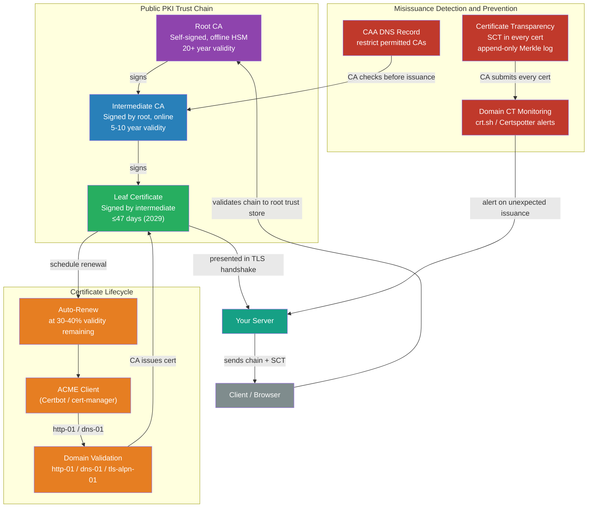

# [BEE-491] TLS Certificate Lifecycle and PKI

:::info
Public Key Infrastructure (PKI) is the chain-of-trust system that makes TLS identities verifiable — understanding how certificates are structured, issued, renewed, revoked, and monitored is essential for operating any backend service that communicates over the internet or an internal network.
:::

## Context

Every TLS connection begins with a certificate exchange. The certificate asserts: "I am `api.example.com`, and here is my public key." The question the client must answer is: "Should I believe this assertion?" The answer comes from PKI — a hierarchy of trust anchors (root CAs) that have verified the chain leading from the certificate back to a trusted root.

The X.509 certificate format, defined in RFC 5280 (2008), is the foundation. It encodes the subject identity, the public key, the issuing CA, and the validity window — along with extensions that constrain how the certificate may be used. The key extension for TLS is `subjectAltName` (SAN): RFC 2818 deprecated the use of the Common Name (CN) field for hostname matching, and browsers stopped accepting CN-only certificates around 2017. Any certificate that does not include the intended hostnames in the SAN field will be rejected.

Certificate issuance was historically a slow, manual, error-prone process: apply to a Certificate Authority, prove domain ownership by responding to a human-mediated challenge, wait hours for issuance, copy-paste the certificate into server configuration, and remember to renew before expiry. This process generated a predictable class of outages — production services going down because a certificate expired and no one remembered to renew it.

The ACME protocol (RFC 8555, March 2019), designed by Richard Barnes, Jacob Hoffman-Andrews, Daniel McCarney, and James Kasten and operationalized by Let's Encrypt, automated the entire issuance-and-renewal loop. Let's Encrypt issued its first certificate in September 2015 and surpassed 500 million active certificates by 2024. Automation changed the economics: ACME-managed certificates are free, renewable every 60-90 days without manual intervention, and rotation is a routine background process rather than an exceptional event.

The CA/Browser Forum, the standards body governing public CAs and browser vendors, approved Ballot SC-081v3 on April 11, 2025, mandating a scheduled reduction of maximum certificate validity: 200 days from March 2026, 100 days from 2027, and 47 days from March 2029. SAN domain validation data reuse drops to 10 days from March 2026. At 47-day validity with 10-day validation reuse, manual certificate management becomes operationally impossible — ACME automation is no longer optional.

## The Certificate Trust Hierarchy

Public PKI is organized into three tiers:

**Root CA** — A root certificate is self-signed: it asserts its own trustworthiness. It is trusted because it is embedded in the operating system and browser trust stores maintained by Apple, Microsoft, Mozilla, and Google. There are approximately 130–150 trusted root CAs globally. Root private keys are kept strictly offline in air-gapped Hardware Security Modules, never used for direct issuance, and their certificates are valid for 20+ years.

**Intermediate CA** — Root CAs delegate issuance to intermediate CAs. The intermediate is signed by the root but kept online, because certificate issuance requires an online signing key. If an intermediate is compromised, only it needs to be revoked — the offline root remains valid. Let's Encrypt currently issues from four active intermediates: R12, R13 (RSA), E7, E8 (ECDSA P-384). Each is signed by ISRG Root X1 (RSA 4096, offline, valid until 2030) or ISRG Root X2 (ECDSA P-384, offline, valid until 2035).

**Leaf / End-Entity Certificate** — The certificate a server presents to clients. Signed by an intermediate CA, identifying the server via SAN hostnames, valid for a CA/Browser Forum-determined maximum period (398 days currently, shrinking to 47 days by 2029).

When a client validates a certificate, it builds a chain from leaf → intermediate → root and verifies each signature. Servers MUST include the intermediate certificate(s) in their TLS handshake — clients cannot always fetch them from the network via the AIA extension, particularly in environments with strict egress controls or high-latency connections.

## Best Practices

### Automate Certificate Issuance and Renewal with ACME

**MUST NOT manage public certificates manually.** Certificate expiry is the most common cause of avoidable TLS outages. Manual renewal requires remembering to act before an arbitrary future date — a process that fails predictably under operational pressure.

**MUST deploy an ACME client for all public-facing certificates.** ACME (RFC 8555) automates the four-step cycle: account registration, order submission, domain validation challenge completion, and certificate finalization. Common clients:

- **Certbot** (Python, by EFF): the canonical CLI client; supports Apache, Nginx, standalone, and DNS challenge plugins
- **Caddy**: a web server with ACME built in; acquires and renews certificates without any configuration
- **cert-manager** (Kubernetes): a controller that manages `Certificate` and `Issuer` resources, handles ACME challenges via Ingress annotations or DNS01 solvers, and automatically rotates secrets
- **acme.sh**: a POSIX shell client; lightweight, no dependencies, used heavily for DNS-01 challenges

ACME supports three challenge types. `http-01` is simplest (place a file at `/.well-known/acme-challenge/<token>`) but requires port 80 to be reachable. `dns-01` requires creating a `_acme-challenge` TXT record; it is the only type that supports wildcard certificates and works behind firewalls. `tls-alpn-01` uses the ALPN TLS extension; useful for TLS-only environments where port 80 is blocked.

**SHOULD configure renewal to occur when 30–40% of the validity period remains.** For a 90-day Let's Encrypt certificate, this means renewal at day 60–63. Renewing too late leaves no time to debug failures; renewing too early wastes issuance capacity. Let's Encrypt's default Certbot renewal threshold is 30 days remaining.

### Serve the Complete Certificate Chain

**MUST include the intermediate CA certificate(s) in the server's TLS configuration**, not only the leaf certificate. Browsers and HTTP clients that encounter a leaf certificate without its chain may attempt to fetch intermediates via the AIA (Authority Information Access) extension URL — but this adds a network round-trip on every new connection, fails in air-gapped environments, and is not supported by all TLS implementations.

Verify the chain is complete:
```bash
# The output should show: leaf → intermediate(s) → root
openssl s_client -connect example.com:443 -showcerts 2>/dev/null | openssl x509 -noout -text | grep -A1 "Issuer\|Subject"
```

Let's Encrypt ACME clients issue `fullchain.pem` (leaf + intermediate) as the recommended deployment artifact. Never deploy `cert.pem` (leaf only) as the server certificate file.

### Monitor Certificate Expiry

**MUST monitor certificate expiry independently of the renewal automation.** Automation can fail silently: ACME challenge completion can break if DNS changes, firewall rules shift, or the ACME client process dies. A monitoring system that checks expiry independently catches these failures before they cause outages.

Expiry monitoring options:
- `prometheus-cert-exporter` or Blackbox Exporter's `tls` probe: exports `ssl_earliest_cert_expiry` metric; alert when expiry is fewer than 14 days away
- External monitoring services (UptimeRobot, Datadog Synthetics) that check TLS expiry from outside the infrastructure
- `openssl s_client` in a scheduled health check:
  ```bash
  # Returns 0 if cert expires in more than N days
  openssl s_client -connect example.com:443 </dev/null 2>/dev/null \
    | openssl x509 -noout -checkend 1209600  # 14 days in seconds
  ```

**SHOULD alert at 14 days remaining** for certificates with 90-day validity, and at 30 days for longer-lived internal certificates.

### Understand and Configure Revocation

When a certificate's private key is compromised, the certificate must be revoked before its natural expiry. Two classical mechanisms exist:

**CRL (Certificate Revocation List)**: A signed list of revoked serial numbers, periodically published by the CA. Clients download and cache the CRL. Problems: CRLs can be many megabytes (Mozilla's CRLite pre-filters them), have staleness bounded by publication frequency (typically 24–72 hours), and require clients to track and parse them.

**OCSP (Online Certificate Status Protocol, RFC 6960)**: Clients query the CA's OCSP responder with the certificate's serial number and receive a real-time `good/revoked/unknown` response. Problems: adds a network round-trip per TLS connection, leaks browsing behavior to the CA, and all major browser implementations use "soft fail" — if the OCSP responder is unreachable, the connection proceeds. An attacker who has compromised a certificate can block OCSP traffic to prevent revocation from taking effect.

**OCSP Stapling** eliminates the client-side round-trip: the server fetches and caches the OCSP response and includes it in the TLS handshake via the `status_request` extension. The client receives a recent, CA-signed attestation of the certificate's status without a separate network call. OCSP stapling SHOULD be enabled on any server where OCSP is still used.

The industry is moving away from real-time revocation infrastructure entirely. The CA/Browser Forum made OCSP optional for public CAs in 2023. Let's Encrypt ended its OCSP service on August 6, 2025. The preferred model is **short-lived certificates**: if a certificate expires in 47 days, the maximum exposure window from a compromised certificate that is not immediately revocable is bounded to weeks rather than years.

### Prevent Misissuance with CAA Records

**SHOULD publish CAA DNS records** to restrict which CAs are permitted to issue certificates for a domain. Defined in RFC 8659, CAA records are checked by CAs before issuance as a mandatory baseline requirement:

```
; Only Let's Encrypt may issue single-name certs
example.com.  IN  CAA  0  issue    "letsencrypt.org"
; Nobody may issue wildcard certs
example.com.  IN  CAA  0  issuewild ";"
; Violation reports sent here
example.com.  IN  CAA  0  iodef    "mailto:security@example.com"
```

A CA that receives an issuance request for `example.com` but is not listed in the `issue` tag must refuse. CAA is a preventative control — it stops misissuance before it happens. It is complementary to Certificate Transparency (which detects it after).

Limitation: a compromised or malicious root CA can ignore CAA. CAA constrains honest CAs from making mistakes; it does not constrain adversarial ones.

### Monitor Certificate Transparency Logs

**SHOULD configure domain monitoring against CT logs** to detect unauthorized certificate issuance. Certificate Transparency (RFC 9162), designed by Ben Laurie and Adam Langley at Google following the 2011 DigiNotar breach, requires every publicly trusted CA to submit every issued certificate to an append-only Merkle tree log. Browsers verify that a certificate is accompanied by a valid Signed Certificate Timestamp (SCT) — a cryptographic commitment from the log that the certificate has been (or will be) included.

The DigiNotar incident: on July 10, 2011, an attacker compromised DigiNotar's CA infrastructure and issued a wildcard certificate for `*.google.com`. Iranian users were subjected to TLS man-in-the-middle interception for over a month. The certificate was detected because Chrome had a hardcoded pin for Google properties — a fragile, non-general solution. CT was built to make such detections systematic.

Any certificate issued for a domain appears in public CT logs within the Maximum Merge Delay (typically 24 hours). Services like `crt.sh` index all CT logs. Domain owners can subscribe to new-issuance alerts:

- **crt.sh**: `https://crt.sh/?q=example.com` — passive search; can be queried programmatically
- **Certspotter** (SSLMate): active monitoring with webhook/email alerts on new issuances
- **Google Certificate Transparency Dashboard**: `https://transparencyreport.google.com/https/certificates`

When an unexpected certificate appears in CT logs for a domain, it MUST be investigated immediately — either a misconfigured automation issued it legitimately, or an attacker has obtained a mis-issued certificate.

### Internal PKI for Service-to-Service mTLS

Public CAs are unsuitable for internal service communication: they cannot issue certificates for internal hostnames (`.internal`, `.cluster.local`, RFC 1918 IP addresses without going through the ACME challenge), require external network connectivity, and impose CA/Browser Forum-mandated maximum validity periods that may not fit internal rotation requirements.

**SHOULD use an internal CA or service-mesh-managed PKI for service-to-service mTLS.** Options:

- **HashiCorp Vault PKI Secrets Engine**: an internal CA that issues short-lived certificates on demand, with configurable maximum validity, SANs, and IP SANs. Vault PKI integrates with Kubernetes via vault-agent or CSI driver.
- **step-ca** (Smallstep): an ACME-compatible internal CA; supports all ACME challenge types, SCEP for legacy devices, and OIDC-based certificate issuance
- **AWS Private CA** / **GCP Certificate Authority Service**: cloud-managed internal CAs with HSM-backed root keys
- **SPIFFE/SPIRE**: the CNCF workload identity standard. SPIRE agents attest workloads via platform metadata (Kubernetes pod identity, AWS instance identity documents, Linux kernel namespaces), then issue **SVIDs (SPIFFE Verifiable Identity Documents)** — X.509 certificates with a `spiffe://trust-domain/workload` URI in the SAN field. SVIDs rotate automatically before expiry. Istio, Linkerd, and Envoy use SPIFFE SVIDs for transparent mTLS between services.

**MUST NOT generate a root CA key without an HSM or equivalent tamper-resistant hardware.** An internal CA root that lives on a standard server filesystem has the same trust properties as any file on that server.

## Visual



## Common Mistakes

**Deploying only the leaf certificate without the intermediate chain.** Clients that cannot build the chain from AIA fetching — air-gapped systems, strict-egress environments, some IoT firmware — will reject the certificate. Always deploy `fullchain.pem` (leaf + all intermediates up to but not including the root, which clients already have in their trust store).

**Conflating certificate rotation with key rotation.** Certificate rotation means replacing an expiring certificate with a new one — which may reuse the same private key. Key rotation means generating a new private key and obtaining a new certificate for it. After a key compromise, certificate rotation is insufficient: the new certificate must be issued for a newly generated private key. ACME clients regenerate the private key by default on each renewal unless configured otherwise.

**Trusting automation without monitoring it.** ACME clients are resilient but not infallible. The http-01 challenge breaks if the server's webroot path changes, if a reverse proxy strips `.well-known` requests, or if the port 80 redirects are removed. The dns-01 challenge breaks if the API credentials for the DNS provider rotate. A certificate that fails to renew will expire silently unless expiry is monitored independently of the renewal process.

**Issuing wildcard certificates from public CAs for internal services.** Wildcard certificates work for `*.example.com` but cannot cover `api.internal` or `service.namespace.svc.cluster.local`. Even where they technically work, a wildcard covers all subdomains — a compromise of the wildcard private key covers all services simultaneously. Internal services SHOULD use an internal CA that issues per-service certificates with narrow SANs.

**No CAA records.** Without CAA, any of the 130+ trusted root CAs can issue a certificate for a domain. The domain owner may never find out — unless they monitor CT logs, which most teams do not. CAA and CT monitoring together close the gap.

## Related BEEs

- [BEE-34](34.md) -- Cryptographic Basics for Engineers: the asymmetric cryptography (RSA, ECDSA) underlying certificate key pairs and signature chains
- [BEE-53](../Networking/53.md) -- TLS/SSL Handshake: the protocol mechanics that use certificates — how certificates are presented and verified at connection time
- [BEE-467](../Distributed Systems/467.md) -- Service-to-Service Authentication: mTLS as an authentication strategy; this article covers the PKI layer that makes mTLS work
- [BEE-490](490.md) -- Cryptographic Key Management and Key Rotation: the private key behind a certificate is subject to all key management requirements — DEK/KEK, HSM storage, cryptoperiods

## References

- [RFC 8555: Automatic Certificate Management Environment (ACME) — IETF (2019)](https://datatracker.ietf.org/doc/html/rfc8555)
- [RFC 5280: Internet X.509 PKI Certificate and CRL Profile — IETF](https://www.rfc-editor.org/rfc/rfc5280)
- [RFC 9162: Certificate Transparency Version 2.0 — IETF (2022)](https://www.rfc-editor.org/rfc/rfc9162.html)
- [RFC 8659: DNS CAA Resource Record — IETF](https://datatracker.ietf.org/doc/html/rfc8659)
- [CA/Browser Forum Ballot SC-081v3: Reducing Validity and Data Reuse Periods (April 2025)](https://cabforum.org/2025/04/11/ballot-sc081v3-introduce-schedule-of-reducing-validity-and-data-reuse-periods/)
- [Let's Encrypt: Chains of Trust](https://letsencrypt.org/certificates/)
- [Certificate Transparency — MDN Web Docs](https://developer.mozilla.org/en-US/docs/Web/Security/Defenses/Certificate_Transparency)
- [OWASP: Certificate and Public Key Pinning](https://owasp.org/www-community/controls/Certificate_and_Public_Key_Pinning)
- [SPIFFE/SPIRE Use Cases — spiffe.io](https://spiffe.io/docs/latest/spire-about/use-cases/)
