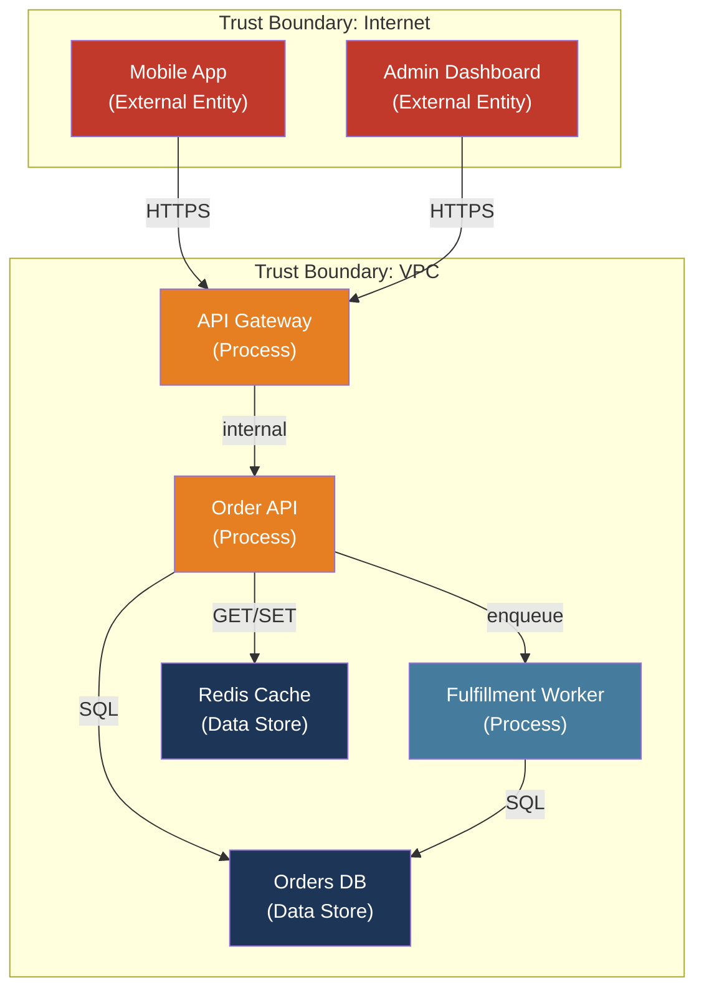

# [BEE-502] Threat Modeling

:::info
Threat modeling is a structured, design-phase exercise that asks "what can go wrong?" before a line of production code is written — identifying threats, rating their risk, and assigning mitigations while changes are still cheap.
:::

## Context

The dominant framework for software threat modeling — STRIDE — was created by Praerit Garg and Loren Kohnfelder at Microsoft in 1999 as an internal tool for systematically cataloging security threats. Microsoft embedded it into its Security Development Lifecycle (SDL) after the Windows security crisis of the early 2000s, which prompted Bill Gates's 2002 "Trustworthy Computing" memo and a multi-year program to retrofit security discipline into product development. Adam Shostack, who led threat modeling at Microsoft, formalized the methodology in "Threat Modeling: Designing for Security" (Wiley, 2014), which remains the industry reference.

The problem threat modeling solves is sequencing. Security vulnerabilities are discovered at every stage of software development, but the cost of fixing them scales steeply: a threat identified at the design phase costs a whiteboard conversation. The same threat found during code review requires a pull request. Found in QA it requires a sprint. Found in production it requires an incident. IBM's Systems Science Institute estimated a factor-of-100 cost difference between fixing a defect at the design stage versus post-deployment. Threat modeling shifts security left — not as a slogan, but as a structured practice that makes "what could an attacker do?" a design constraint alongside performance and correctness.

Bruce Schneier independently introduced Attack Trees in 1999 as a complementary technique: representing an attacker's goal as the root of a tree and attack paths as branches, with AND-nodes (all sub-goals must succeed) and OR-nodes (any path suffices). Attack trees excel at decomposing a specific attack goal into sub-goals for quantitative risk analysis. STRIDE and attack trees are complementary: STRIDE enumerates threat categories across a system; attack trees explore one threat in depth.

## Process: Data Flow Diagrams and STRIDE

Threat modeling has four steps: decompose the system, identify threats, rate risks, mitigate.

### Step 1: Draw a Data Flow Diagram

A Data Flow Diagram (DFD) is the input to STRIDE analysis. It has five elements:

| Element | Notation | Represents |
|---------|----------|-----------|
| External entity | Rectangle | Users, third-party services, mobile apps |
| Process | Circle/oval | Code that transforms data — API handlers, workers, services |
| Data store | Parallel lines | Databases, caches, queues, file systems |
| Data flow | Arrow | Data moving between elements |
| Trust boundary | Dashed box | Where data crosses security zones (internet → VPC, service → database) |

A Level-0 DFD shows the system as a single process and its external actors. A Level-1 DFD decomposes the main system into its subsystems, data stores, and key flows. Most threat modeling exercises work at Level 1.

For a typical e-commerce order service, a Level-1 DFD might show: a mobile client and an admin dashboard as external entities; an order API service, a fulfillment worker, and a notification service as processes; a PostgreSQL orders database and a Redis cache as data stores; and trust boundaries at the API gateway (internet-facing) and the internal service mesh (VPC-internal).

### Step 2: Apply STRIDE at Every Trust Boundary and Element

STRIDE maps six threat categories to DFD elements. At each trust boundary crossing and each element, ask whether each STRIDE category applies:

| Letter | Category | Target Elements | Backend Example |
|--------|----------|----------------|-----------------|
| **S** | Spoofing | Processes, external entities | JWT token stolen from localStorage and replayed; API key leaked in a client-side log; service A impersonates service B by forging a service-to-service token |
| **T** | Tampering | Data flows, data stores | Order total modified in transit on unencrypted HTTP; SQL injection rewrites a database query; a message payload altered in a queue without integrity checks |
| **R** | Repudiation | Processes, data stores | A refund is issued with no audit trail; an admin deletes records with no log of who initiated it; a webhook is replayed without a timestamp check |
| **I** | Information Disclosure | Data flows, data stores, processes | BOLA returns another user's order data; stack trace in a 500 response exposes internal paths; PII appears in application logs shipped to a third-party aggregator |
| **D** | Denial of Service | Processes, data stores | An unauthenticated endpoint accepts unbounded query parameters that trigger a full table scan; a missing rate limit allows request floods; a regex with catastrophic backtracking consumes a CPU core |
| **E** | Elevation of Privilege | Processes | A regular user calls an admin endpoint unprotected by role checks (BFLA); an SSRF vulnerability lets an attacker reach the cloud metadata service and obtain IAM credentials |

### Step 3: Rate Each Threat

For each identified threat, assign a risk score. CVSS (Common Vulnerability Scoring System), maintained by FIRST, is the industry standard. The CVSS 4.0 base score combines:

- **Attack Vector** (Network / Adjacent / Local / Physical)
- **Attack Complexity** (Low / High)
- **Attack Requirements** (None / Present)
- **Privileges Required** (None / Low / High)
- **User Interaction** (None / Passive / Active)
- **Confidentiality / Integrity / Availability Impact** (None / Low / High) — for both the vulnerable system and downstream systems

A simpler alternative for internal triage is a 3×3 Likelihood × Impact matrix, producing Low / Medium / High / Critical ratings without the CVSS learning curve. Use CVSS when communicating with security teams or external auditors; use the matrix for internal design reviews.

### Step 4: Assign Mitigations and Track

Each threat gets one of four dispositions:

- **Mitigate**: implement a control that reduces likelihood or impact (preferred)
- **Accept**: document that the risk is understood and within tolerance (requires sign-off)
- **Transfer**: push the risk to a third party (insurance, vendor responsibility)
- **Avoid**: remove the feature or design element that introduces the threat

Mitigations flow into the development backlog with the same priority as functional requirements. A threat model that produces a list but no tickets has no effect.

## Best Practices

**MUST perform threat modeling before implementing a new service, API surface, or data store** — not after. A threat model review of a design document is a conversation. A threat model review of a deployed service requires code changes, potentially schema migrations, and re-deployment. The value collapses when the exercise is done post-hoc.

**MUST identify all trust boundaries in the DFD before beginning STRIDE analysis.** Trust boundaries are where the highest-value threats concentrate: data leaving the browser, data entering the VPC, data crossing service accounts, data moving from the application tier to the database. A STRIDE analysis that ignores trust boundaries misses the most exploitable attack surfaces.

**SHOULD conduct threat modeling as a collaborative exercise** with at least one engineer who built the feature, one who understands the attack surface (security champion or security engineer), and ideally a product manager who can accept risk on behalf of the business. Solo threat modeling produces incomplete models — the author's blind spots stay blind.

**SHOULD treat the threat model as a living document.** A threat model written for v1 of a service becomes inaccurate when a new integration, a new data store, or a dependency update changes the trust boundary map. Trigger a model update for: new external integrations, changes to authentication or authorization, new data types classified as PII or sensitive, significant traffic pattern changes, and after any security incident on the system.

**SHOULD document accepted risks explicitly and obtain sign-off.** An accepted risk that is undocumented is an unknown risk — no one will review it, and it will never be re-evaluated. An accepted risk with a written rationale, a risk owner, and a review date is a deliberate business decision. Use a threat register to track all threats regardless of disposition.

**MAY use OWASP Threat Dragon** for small to medium systems. Threat Dragon is a free, open-source diagramming tool that renders DFDs and generates a threat list from the diagram using a built-in STRIDE rule engine. For larger systems, commercial tools (IriusRisk, Threatlocker, Microsoft Threat Modeling Tool) offer automation and integration with issue trackers.

## Threat Register Template

```
| ID   | Component          | STRIDE | Threat Description                              | Likelihood | Impact | Risk   | Mitigation                            | Status     |
|------|--------------------|--------|-------------------------------------------------|-----------|--------|--------|---------------------------------------|------------|
| T-01 | Order API → DB     | T      | SQL injection via order search parameter        | High      | High   | Critical| Prepared statements; input validation | Mitigated  |
| T-02 | Admin dashboard    | E      | Admin endpoints accessible to regular users     | Medium    | High   | High   | RBAC check on all /admin/* routes     | In progress|
| T-03 | Fulfillment worker | R      | Order state change not audit-logged             | Low       | Medium | Medium | Append audit log on every state change| Accepted   |
| T-04 | Notification svc   | I      | Email address logged in plaintext to Datadog    | High      | Medium | High   | Log user_id only; mask email in logs  | In progress|
```

## Visual



Data flows crossing the Internet→VPC trust boundary are where Spoofing, Tampering, and Information Disclosure threats are most severe. Data flows within the VPC but between services are where Elevation of Privilege threats concentrate (service-to-service authentication). Data flows into the database boundary are where Tampering (injection) and Information Disclosure (BOLA) threats live.

## When to Threat Model

| Trigger | Scope |
|---------|-------|
| New service or microservice | Full Level-1 DFD of the new service |
| New external integration | Data flows to and from the third-party system |
| Authentication or authorization change | All endpoints and data stores affected |
| New data type added (especially PII) | Data at rest, data in transit, data in logs |
| Significant architecture change | Affected subsystems |
| Post-incident review | The system involved in the incident |
| Annual review | All production services with no prior model |

## Related BEEs

- [BEE-30](30.md) -- OWASP Top 10 for Backend: STRIDE threats map directly to OWASP Top 10 categories — Injection (T), Broken Access Control (E/I), Security Misconfiguration (D/I)
- [BEE-497](497.md) -- SSRF: identified as an Elevation of Privilege and Information Disclosure threat in a DFD where the API service can reach internal network endpoints
- [BEE-499](499.md) -- BOLA: an Information Disclosure threat at data store access points where object-level ownership is not verified
- [BEE-501](501.md) -- Data Privacy and PII Handling: Information Disclosure threats targeting PII inform which data stores require encryption and log scrubbing
- [BEE-462](462.md) -- Audit Logging Architecture: Repudiation threats are mitigated by ensuring every sensitive action is captured in a tamper-evident audit log

## References

- [Adam Shostack. Threat Modeling: Designing for Security — Wiley, 2014](https://www.wiley.com/en-us/Threat+Modeling:+Designing+for+Security-p-9781118809990)
- [Adam Shostack. Threat Modeling Resources — shostack.org](https://shostack.org/resources/threat-modeling)
- [Microsoft. Threat Modeling — microsoft.com](https://www.microsoft.com/en-us/securityengineering/sdl/threatmodeling)
- [OWASP. Threat Modeling Cheat Sheet — cheatsheetseries.owasp.org](https://cheatsheetseries.owasp.org/cheatsheets/Threat_Modeling_Cheat_Sheet.html)
- [OWASP. Threat Modeling Process — owasp.org](https://owasp.org/www-community/Threat_Modeling_Process)
- [OWASP Threat Dragon — github.com/OWASP/threat-dragon](https://github.com/OWASP/threat-dragon)
- [FIRST. Common Vulnerability Scoring System v4.0 — first.org](https://www.first.org/cvss/)
- [Bruce Schneier. Attack Trees — schneier.com, 1999](https://www.schneier.com/academic/archives/1999/12/attack_trees.html)
- [CMU SEI. Threat Modeling: A Summary of Available Methods — sei.cmu.edu, 2018](https://resources.sei.cmu.edu/asset_files/WhitePaper/2018_019_001_524597.pdf)
