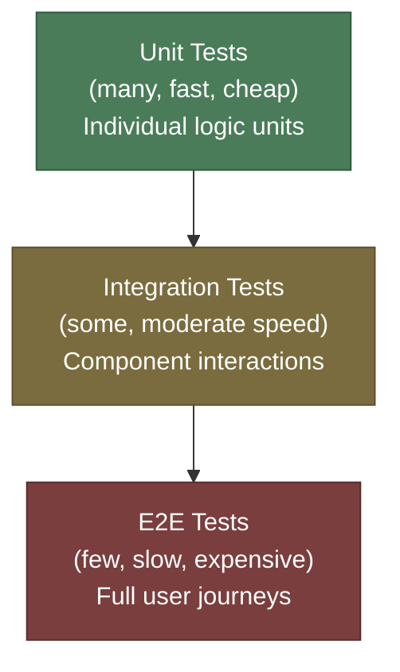

# [BEP-340] The Testing Pyramid

:::info
Structure your test suite like a pyramid: many fast unit tests at the base, fewer integration tests in the middle, and a small number of E2E tests at the top.
:::

## Context

Automated testing is not free. Every test you write has a cost: authoring time, execution time, maintenance burden, and the cognitive overhead of understanding failures. The question is not whether to test, but how to allocate effort across different types of tests to maximize confidence while keeping costs manageable.

Without a deliberate strategy, teams drift toward whichever tests feel most productive in the moment. Front-end developers write unit tests for every utility function but none for page flows. Backend developers write E2E tests because they can see the whole system working end-to-end. The result is an unbalanced suite that is either painfully slow, brittle, or leaves large gaps in coverage.

The **Test Pyramid**, introduced by Mike Cohn in *Succeeding with Agile* (2009) and popularized by Martin Fowler, provides a simple mental model for balancing speed, confidence, and cost. It divides automated tests into three levels and prescribes that you should have many tests at the base, fewer in the middle, and very few at the top.

## Principle

**Build your test suite as a pyramid: many unit tests, a meaningful layer of integration tests, and a small, curated set of E2E tests.**

Each level of the pyramid serves a different purpose. Tests at lower levels are faster, cheaper, and more isolated. Tests at higher levels provide higher confidence at the cost of speed and fragility. A healthy suite uses all three levels deliberately, relying on lower levels to catch as many failures as possible early, and reserving higher levels for scenarios only they can validate.

## The Three Levels



### Unit Tests — the base

Unit tests exercise a single function, class, or module in isolation. External dependencies — databases, network calls, file systems — are replaced with test doubles (see BEP-344).

| Property | Value |
|---|---|
| Scope | One function or class |
| Speed | Milliseconds per test |
| Isolation | Complete (no I/O, no network) |
| Quantity | Hundreds to thousands |
| What they catch | Logic bugs, edge cases, data validation errors |
| What they miss | Integration failures, configuration issues |

Unit tests are the foundation because they run fast enough to execute on every keystroke in a watch loop, they pinpoint failures to a single unit, and they are cheap to maintain. The tradeoff is that a system where all unit tests pass may still fail in production — nothing has been validated about how the pieces fit together.

Unit tests MUST test behavior, not implementation. A test that breaks every time you rename an internal variable provides no value and high maintenance cost.

### Integration Tests — the middle

Integration tests verify that two or more components work together correctly. They allow real I/O: a test may write to an actual database (via a test container), call a real HTTP endpoint, or exercise a message queue.

| Property | Value |
|---|---|
| Scope | Multiple components interacting |
| Speed | Hundreds of milliseconds to a few seconds |
| Isolation | Partial (real infrastructure, mocked third parties) |
| Quantity | Dozens to hundreds |
| What they catch | ORM mapping errors, SQL constraint violations, serialization mismatches, contract violations between services |
| What they miss | Full user journeys, multi-system workflows |

Integration tests fill the gap that unit tests leave. A unit test can verify that your order validation logic correctly rejects a negative quantity, but only an integration test can verify that the validation error is correctly returned through the HTTP layer and written to the audit log.

Integration tests SHOULD use lightweight infrastructure — test containers (e.g., Testcontainers), in-memory databases, or local Docker Compose setups — so they remain fast enough to run in CI without special infrastructure.

### E2E Tests — the top

End-to-end tests drive the system as a real user or external client would: an HTTP request comes in, travels through all services, touches real databases, and produces an observable outcome. Everything is real; nothing is mocked.

| Property | Value |
|---|---|
| Scope | Full system or major subsystem |
| Speed | Seconds to minutes per test |
| Isolation | None (full stack required) |
| Quantity | A handful per critical user journey |
| What they catch | Deployment configuration errors, cross-service data contract breaks, full-flow regressions |
| What they miss | Edge cases, failure modes (too slow to test exhaustively) |

E2E tests provide the highest confidence because they test the system as it actually runs. But they also carry the highest cost: they require a running environment, they are slow, and they are the most prone to **flakiness** — intermittent failures caused by timing issues, external dependencies, or test environment instability (see the flaky tests section below).

E2E tests MUST be kept small in number and MUST cover only critical, high-value user journeys. Do not use E2E tests to cover permutations that belong at lower levels.

## Worked Example: Order Creation

Consider an order service that accepts an HTTP request, validates the order, writes to a database, and publishes an event.

### Unit test

```
Test: OrderValidator.validate() rejects orders with negative quantities
Input: { productId: "abc", quantity: -1, price: 10.00 }
Assert: throws ValidationError("quantity must be positive")
Dependencies: none (pure function)
Catches: logic bug in validation
Misses: whether the HTTP layer calls validate() at all
```

### Integration test

```
Test: POST /orders writes the order to the database and returns 201
Setup: start test database via Testcontainers
Input: valid order payload via HTTP
Assert: response is 201, order record exists in DB with correct fields
Dependencies: real database, real HTTP handler, mocked event publisher
Catches: ORM mapping error, missing DB constraint, wrong HTTP status
Misses: whether the published event is consumed correctly downstream
```

### E2E test

```
Test: placing an order updates inventory and triggers a confirmation email
Setup: full service stack running (orders, inventory, notifications)
Steps: POST /orders → poll inventory service for stock decrement → check email queue
Assert: stock decremented by order quantity, email queued with correct order ID
Dependencies: all services real, all databases real
Catches: cross-service data contract breaks, deployment misconfiguration
Misses: edge cases (covered by unit/integration tests)
```

Each level catches what the levels below it cannot. Together they give comprehensive coverage without requiring every scenario to run through the full stack.

## Alternative: The Test Trophy

Kent C. Dodds proposed the **Testing Trophy** as a refinement of the pyramid, particularly for JavaScript applications. The trophy has a wider integration layer and adds a thin layer of **static analysis** (type checking, linting) at the base.

The core principle: *"The more your tests resemble the way your software is used, the more confidence they can give you."* ([kentcdodds.com](https://kentcdodds.com/blog/the-testing-trophy-and-testing-classifications))

In the trophy model, integration tests are the thickest layer — not unit tests — because modern tooling (Jest, Vitest, Testing Library) makes integration-style tests nearly as fast as pure unit tests, so the historical speed penalty of integration testing is less severe than it once was.

For backend services with real I/O boundaries, the pyramid model remains the more common framing. The trophy is more relevant in frontend contexts where the "integration" between a component and its rendered DOM is the primary concern.

## Google's Test Sizes

Google uses a dimension-based taxonomy — **small, medium, large** — that overlaps with but is distinct from the pyramid model. The key insight from Google's approach is that test *scope* and test *speed* are two separate axes, and both matter.

| Google size | Allowed I/O | Rough pyramid equivalent |
|---|---|---|
| Small | None (no network, no disk, no sleep) | Unit |
| Medium | localhost only (database, local HTTP) | Integration |
| Large | Any external system | E2E / system test |

Google's taxonomy enforces constraints at the infrastructure level: a "small" test that opens a network socket is rejected by the test runner, not just by convention. This strictness prevents tests from silently becoming slower as dependencies are added. ([testing.googleblog.com](https://testing.googleblog.com/2010/12/test-sizes.html))

The practical takeaway: define explicit constraints for each test level in your own project — not just by what the test does, but by what infrastructure it is allowed to touch.

## Flaky Tests and Their Cost

A **flaky test** is one that produces different results on successive runs without any code change. Flakiness is most common in E2E tests but can occur at any level.

Flaky tests are not just annoying — they are dangerous. When a team learns to re-run failing tests until they pass, the test suite loses its ability to signal real problems. A flaky suite is a suite that nobody trusts.

Common sources of flakiness:

| Source | Typical level | Fix |
|---|---|---|
| Race conditions in async code | Unit, integration | Use proper async assertions; avoid arbitrary sleeps |
| Timing-dependent assertions | E2E | Assert on outcomes, not timing; use retry with timeout |
| Shared test data | Integration, E2E | Use per-test data setup and teardown; avoid shared state |
| Order-dependent tests | Any | Ensure tests are independent; randomize execution order |
| External service availability | E2E | Mock or stub third-party services at the boundary |
| Non-deterministic data (UUIDs, timestamps) | Unit | Inject clocks and ID generators; assert on shape, not value |

Teams MUST treat flaky tests as bugs, not nuisances. A flaky test SHOULD be fixed or deleted — not re-run until it passes. Every flaky test that survives erodes confidence in the entire suite.

## Deciding Your Distribution

There is no universally correct ratio, but a useful starting point is:

- **Unit tests**: ~70% of the suite
- **Integration tests**: ~20%
- **E2E tests**: ~10%

These numbers are guidelines, not rules. The right distribution depends on your system's architecture, the speed of your integration infrastructure, and the risk profile of different failure modes.

A microservice with many external dependencies may need more integration tests proportionally. A data-transformation pipeline with pure functions may be mostly unit tests. The pyramid is a shape, not a fixed formula.

The question to ask at each level is: **can a lower-level test catch this failure with sufficient confidence?** If yes, push it down. If no — because the failure only manifests when real systems interact — move it up.

## Common Mistakes

### 1. The ice cream cone anti-pattern

The inverse of the pyramid: many E2E tests, few integration tests, almost no unit tests. This is the natural shape of a team that tests manually, then automates their manual test scripts. The suite is slow, brittle, and expensive to maintain. Symptoms: CI takes more than 30 minutes, flaky failures are routine, developers run tests only before merging.

### 2. Testing implementation details instead of behavior

Unit tests that assert on internal state (`expect(validator._cache.size).toBe(1)`) or method call order (`expect(spy).toHaveBeenCalledBefore(otherSpy)`) couple tests to implementation rather than behavior. These tests break on refactoring without indicating a real regression. Test what the code does, not how it does it.

### 3. Skipping integration tests

"All my unit tests pass so the system works." Unit tests pass because your mocks are correct — they do not prove that your database queries return what you think they do, that your HTTP client serializes the request body correctly, or that your event handler processes messages in the right order. Integration tests are what close that gap.

### 4. Flaky E2E tests everyone ignores

A test suite with known flaky tests is a test suite in decay. Once the team learns to re-run until green, the entire safety signal is compromised. Delete the flaky test if it cannot be fixed, and replace it with targeted integration tests that cover the same behavior.

### 5. 100% code coverage as a goal

Code coverage measures whether lines were executed during tests, not whether behavior was correctly validated. A test that exercises every line but asserts nothing can achieve 100% coverage. Coverage is a useful signal for finding *untested code*, not a measure of test quality. Set a minimum threshold (e.g., 80%) as a floor, not a target. Chasing 100% coverage drives teams toward trivial tests that add no confidence.

## Related BEPs

- **BEP-341** (Integration Testing for Backend Services) — detailed guidance on writing integration tests with real databases and test containers
- **BEP-342** (Contract Testing) — validate cross-service contracts without running full E2E suites
- **BEP-343** (Load Testing and Benchmarking) — performance validation outside the functional test pyramid
- **BEP-344** (Test Doubles: Mocks, Stubs, Fakes) — how to isolate units for the base of the pyramid without compromising test value

## References

- Mike Cohn, *Succeeding with Agile: Software Development Using Scrum*, Addison-Wesley (2009) — original test pyramid description
- Martin Fowler, *Test Pyramid*, martinfowler.com/bliki/TestPyramid.html (2012)
- Ham Vocke, *The Practical Test Pyramid*, martinfowler.com/articles/practical-test-pyramid.html (2018)
- Google Testing Blog, *Test Sizes*, testing.googleblog.com/2010/12/test-sizes.html (2010)
- Google Testing Blog, *Just Say No to More End-to-End Tests*, testing.googleblog.com/2015/04/just-say-no-to-more-end-to-end-tests.html (2015)
- Kent C. Dodds, *The Testing Trophy and Testing Classifications*, kentcdodds.com/blog/the-testing-trophy-and-testing-classifications
- Kent C. Dodds, *Write tests. Not too many. Mostly integration.*, kentcdodds.com/blog/write-tests
