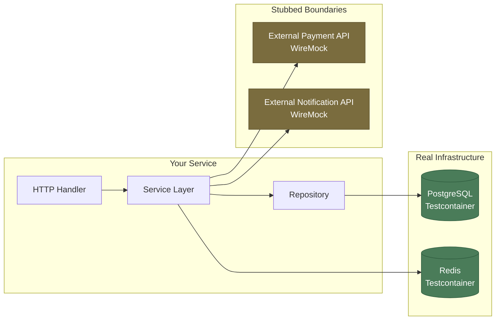

# [BEP-341] Integration Testing for Backend Services

:::info
Integration tests verify that real components work together correctly. Use real databases via Testcontainers, stub external APIs at the boundary, and manage test data with explicit setup and teardown.
:::

## Context

Unit tests give you fast feedback on logic in isolation. They pass or fail based on whether your code does what you think it does — but they cannot tell you whether your code integrates correctly with the database, the cache, the message broker, or the HTTP client. Those integrations are where production bugs live.

Integration bugs are insidious precisely because they are invisible to unit tests. An ORM mapping may be technically correct but produce a query that violates a database constraint. A serializer may serialize correctly but omit a field that downstream services depend on. A transaction boundary may be placed incorrectly, causing data written in a service call to be invisible to a subsequent read. None of these show up in unit test suites.

Integration tests exist to catch this class of failure. They exercise multiple components working together — application code, real infrastructure, and the boundaries between them — in a controlled environment that closely resembles production.

The challenge is controlling that environment: how do you spin up a real database per test run without it becoming slow, flaky, or requiring manual setup? How do you isolate test data so tests do not interfere with each other? How do you keep a test that starts a container, seeds data, calls an endpoint, and asserts database state from taking five minutes to run?

Modern tooling — particularly [Testcontainers](https://testcontainers.com/guides/introducing-testcontainers/) — has largely solved the infrastructure problem. The remaining challenges are discipline: scoping what is real vs. stubbed, managing test data lifecycle, and running tests in a way that scales in CI.

## Principle

**Integration tests MUST use real infrastructure for the components under test, stub only external dependencies outside your control, and clean up test data explicitly between every test.**

## What Integration Tests Verify

Integration tests sit between unit tests and end-to-end tests in the testing pyramid (see BEP-340). Their scope is deliberately bounded: they test one integration boundary at a time, or a small cluster of components that form a meaningful unit.

Concretely, an integration test for a backend service verifies:

- That SQL queries produce the correct results against a real database with real schema and real constraints
- That ORM entity mappings match the actual database columns
- That HTTP request handlers correctly deserialize input, pass it through the service layer, and return the correct status and response body
- That database transactions commit or roll back under the correct conditions
- That events published to a message broker contain the expected payload

What integration tests do **not** verify: full multi-service workflows (that is the domain of E2E tests), or behavior of external systems your team does not own (that is the domain of contract tests — see BEP-341).

## The Integration Test Scope



Infrastructure that your service owns and controls (database, cache, message broker) is **real**. External services your team does not own or control are **stubbed**. The rule of thumb: real for anything where behavior differences between test and production would cause bugs; stubbed for anything where the test is not about that system's behavior.

## Testing with Real Databases: Testcontainers

[Testcontainers](https://testcontainers.com/guides/introducing-testcontainers/) is a library that starts Docker containers programmatically from within your test code. It gives you a fresh, real database — PostgreSQL, MySQL, MongoDB, Redis, or others — for every test run, without manual setup.

The key properties of a Testcontainers-managed database:

- **Same database engine as production.** Behavior differences between PostgreSQL and H2 (or SQLite) are eliminated. Constraints, index behavior, JSON operators, and transaction isolation levels all behave exactly as they will in production.
- **Isolated per test run.** Each test run gets a fresh container (or the container is reset between tests). No test run inherits state from a previous one.
- **Dynamic ports.** Testcontainers assigns random ports; the connection string is read from the container object at runtime. Do not hardcode ports.
- **Pinned versions.** Use the same database version as production (`postgres:15.2`, not `postgres:latest`). Version drift between test and production is a source of subtle bugs.

### Why In-Memory Databases Are Dangerous

H2, SQLite, and similar in-memory databases are often used as "fast substitutes" for a real database in tests. This is one of the most common integration testing mistakes, and it produces a specific class of bug: tests pass in CI against the in-memory DB, but the application fails in production against the real DB.

Behavior differences that cause this:

| Feature | PostgreSQL | H2 (in-memory) |
|---|---|---|
| JSON/JSONB operators | Full support | Limited / different syntax |
| Window functions | Full support | Partial |
| `ON CONFLICT DO UPDATE` | Supported | Not supported |
| Strict type casting | Enforced | Lenient |
| Constraint timing (`DEFERRABLE`) | Supported | Not supported |
| Case sensitivity in identifiers | Configurable | Different defaults |

The [testcontainers.com guide on replacing H2](https://testcontainers.com/guides/replace-h2-with-real-database-for-testing/) documents this in detail. Use the real database engine.

## Stubbing External Services: WireMock

For external APIs — payment gateways, notification services, third-party data providers — you do not want to call the real system in tests. The goal is not to test that the payment provider's API works; it is to test that your code correctly handles the responses it receives.

[WireMock](https://wiremock.org/) is the standard tool for stubbing HTTP-based external services in integration tests. It starts an HTTP server that you configure to return specific responses for specific request patterns.

```
WireMock configuration example:
  POST /v1/payments/charge
    when body matches { "amount": 5000, "currency": "USD" }
    return 200 { "transactionId": "tx_abc123", "status": "approved" }

  POST /v1/payments/charge
    when body matches { "amount": 999999 }
    return 402 { "error": "insufficient_funds" }
```

This lets you test error-handling paths — network timeouts, 4xx errors, unexpected response shapes — without depending on a third-party sandbox environment that may be unavailable or rate-limited in CI.

WireMock is also used for **contract testing** (see BEP-341), where the stubs are derived from a shared contract rather than written manually.

## Test Data Management

How you manage test data determines whether your integration tests are reliable and independent.

### Fixtures and Factories

A **fixture** is a predefined set of data inserted into the database before a test runs. Fixtures are simple but brittle: they tend to grow over time, become shared across tests, and create implicit dependencies between tests.

A **factory** is a function that creates a domain object and persists it, with sensible defaults but configurable overrides:

```
OrderFactory.create()
  → inserts a valid order with default values

OrderFactory.create({ status: "cancelled", userId: "user-42" })
  → inserts a cancelled order owned by user-42
```

Factories are the preferred approach for most integration tests. Each test creates exactly the data it needs, nothing more. There is no implicit shared state, no requirement to understand what a shared fixture contains before writing a new test.

### Test Isolation: Transaction Rollback vs. Truncation

After each test, the database must be returned to a clean state. Two strategies exist:

**Transaction rollback**: Wrap each test in a database transaction, execute the test, then roll back. The database is returned to its pre-test state in milliseconds.

- Pros: Fast (2–4ms overhead per test vs. 20–50ms for truncation), leaves no residual state
- Cons: Does not work when the test itself verifies commit behavior. Wrapping a test in a parent transaction that always rolls back means the service's internal `COMMIT` never actually persists — the test passes in the transaction context but never tests the commit path.

**Truncation**: After each test, truncate all tables (or a defined subset) and reset sequences.

- Pros: Works regardless of whether the code under test commits transactions; accurately reflects production behavior
- Cons: Slower; requires tracking which tables need truncation; foreign key constraints require careful ordering

The rule: use transaction rollback only when the test does not verify commit behavior. Use truncation (or deletion) for tests that exercise transactional code paths. Never leave cleanup to chance.

### No Shared Test Data Between Tests

Tests that share a database state — where test B depends on data created by test A — are the leading cause of flaky integration tests. If tests run in a different order, or if test A fails, test B fails for unrelated reasons.

Every test MUST create all the data it needs in its own setup phase and clean up in its own teardown phase. Tests MUST NOT depend on the execution order of other tests.

## Worked Example: Order Creation Endpoint

This example demonstrates the full lifecycle of an integration test for a `POST /orders` endpoint that creates an order in PostgreSQL and publishes an event.

```
Test: POST /orders creates an order and publishes an event

SETUP
  1. Start PostgreSQL container (Testcontainers, postgres:15.2)
  2. Run schema migrations against the container
  3. Start WireMock, configure payment stub to return approved
  4. Seed prerequisite data: user "user-42", product "prod-99" (in stock)
  5. Register test listener on the message broker

EXECUTE
  6. POST /orders
     body: { userId: "user-42", productId: "prod-99", quantity: 2 }

ASSERT
  7. Response status: 201
  8. Response body contains orderId (UUID format)
  9. Database: orders table has one row with userId="user-42", status="confirmed"
  10. Database: inventory table has product "prod-99" with stock decremented by 2
  11. Event: OrderCreated event was published with correct orderId, userId, productId
  12. WireMock: payment endpoint was called once with the correct amount

CLEANUP
  13. Truncate orders, inventory_reservations tables
  14. Reset sequences
  (or: rollback wrapping transaction if commit behavior is not being tested)
```

The test scope is precise: one HTTP call, one service, one database, one stubbed external API, one event assertion. It does not depend on an inventory service running, a notification service, or a real payment gateway.

## CI Pipeline Integration

Integration tests require more infrastructure than unit tests and run more slowly. They MUST be treated as a distinct stage in the CI pipeline, not mixed with unit tests.

A recommended CI structure:

```
Stage 1: unit-tests
  - No I/O, no containers, no network
  - Runs in parallel across all modules
  - Must complete in < 2 minutes

Stage 2: integration-tests
  - Testcontainers, WireMock
  - Can run in parallel with per-test data isolation
  - Should complete in < 10 minutes for a medium-sized service

Stage 3: e2e-tests (optional on PR, always on main)
  - Full stack, full environment
  - Runs after integration tests pass
```

Stage 1 and Stage 2 failures block merge. Stage 3 may be deferred to post-merge on main to avoid blocking short-lived PRs.

### Parallel Test Execution

Integration tests CAN be parallelized if each test is fully isolated. Isolation requirements for parallel execution:

- Each parallel worker MUST use a separate database schema or separate container
- Test data created by one worker MUST NOT be visible to another worker
- Dynamic port assignment (default in Testcontainers) prevents port collisions automatically

The [Testcontainers best practices guide](https://www.docker.com/blog/testcontainers-best-practices/) recommends sharing one container per test class (not per test method) and using transaction rollback or per-test data factories to achieve isolation without the overhead of starting a new container per test.

## Common Mistakes

### 1. Using an in-memory database instead of the real one

H2, SQLite, and similar in-memory databases do not behave identically to PostgreSQL or MySQL. Tests that pass against H2 frequently fail against PostgreSQL in staging. The cost of fixing a prod bug caused by a constraint difference or JSON operator incompatibility vastly exceeds the cost of a slower CI run from Testcontainers.

**Fix**: Use Testcontainers with the same database engine and version as production. Replace H2 with a real database in all integration tests.

### 2. Shared test data between tests

Tests that read data created by another test become order-dependent. When tests run in parallel or execution order changes, they fail for reasons unrelated to any code change.

**Fix**: Each test creates its own data via factories. No test reads data it did not create (except immutable reference data seeded once at suite setup).

### 3. No cleanup between tests

Data written by one test leaks into the next. Tests pass in isolation but fail when run as a suite.

**Fix**: Implement an explicit cleanup strategy (transaction rollback or truncation) that runs after every test, including failing tests. Use `afterEach` / `tearDown` hooks that run unconditionally.

### 4. Integration tests too slow for CI

A test suite that takes 45 minutes does not get run. Slow tests get skipped locally, and feedback arrives too late from CI.

**Fix**: Parallelize where possible; share containers across tests in the same class; use transaction rollback (not truncation) where safe; profile slow tests and eliminate unnecessary setup.

### 5. Mocking the database

A test that mocks the database is not an integration test — it is a unit test with extra steps. You get no coverage of ORM behavior, SQL query correctness, constraint enforcement, or connection pool behavior.

**Fix**: If you find yourself mocking the repository layer in a test labeled "integration test," move the test to the unit test suite or remove the mock and use Testcontainers.

## Related BEPs

- **BEP-340** (The Testing Pyramid) — the role of integration tests in a balanced test strategy
- **BEP-341** (Contract Testing for External Services) — how WireMock stubs connect to shared contracts to catch API drift
- **BEP-341** (Test Doubles: Mocks, Stubs, Fakes) — when to use test doubles in integration tests vs. when they undermine test value

## References

- Martin Fowler, *Integration Test*, martinfowler.com/bliki/IntegrationTest.html
- Martin Fowler, *Testing Strategies in a Microservice Architecture*, martinfowler.com/articles/microservice-testing/
- Ham Vocke, *The Practical Test Pyramid*, martinfowler.com/articles/practical-test-pyramid.html (2018)
- Testcontainers, *Introducing Testcontainers*, testcontainers.com/guides/introducing-testcontainers/
- Testcontainers, *Replace H2 with a Real Database for Testing*, testcontainers.com/guides/replace-h2-with-real-database-for-testing/
- Docker, *Testcontainers Best Practices*, docker.com/blog/testcontainers-best-practices/
- Microsoft ISE Developer Blog, *Integration Testing with Testcontainers*, devblogs.microsoft.com/ise/testing-with-testcontainers/
- Gerard Meszaros, *Transaction Rollback Teardown*, xunitpatterns.com/Transaction%20Rollback%20Teardown.html
