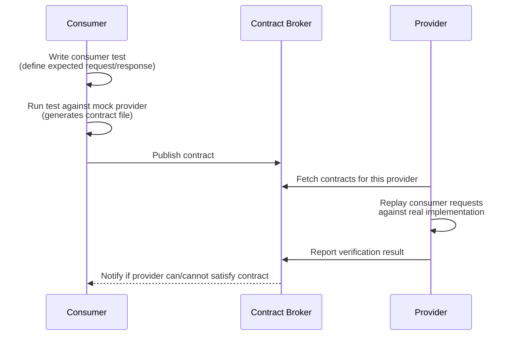

# [BEE-342] Contract Testing

:::info
Contract testing verifies that the communication agreement between a consumer and a provider is honored — without requiring both services to be deployed simultaneously. Use it to catch API breaking changes before they reach production.
:::

## Context

As systems decompose into services, the most common source of production failures is not a logic bug inside a service — it is a mismatch at the boundary between two services. One team changes the shape of a response, renames a field, or removes an endpoint. The consuming service breaks. Neither team knew this was coming because their tests ran in isolation.

The conventional answer is integration testing: deploy both services into a shared environment and test them together. But this approach creates its own problems. Shared environments are slow to provision, expensive to maintain, and hard to keep stable. They require coordination across teams. When a test fails, it is often unclear which service caused the failure. And because both services must be deployed, feedback arrives late — after code has already shipped through multiple stages of CI.

Contract testing solves a narrower problem: it verifies that a consumer's expectations about a provider are met, and that a provider's implementation satisfies all of its consumers' expectations — without deploying both services simultaneously, without a shared environment, and with fast, independent feedback to both teams.

The key insight is that most cross-service failures are not about complex behavior — they are about shape. A field was renamed. A status enum value was removed. A required parameter was added. These are all detectable by comparing the contract (what the consumer expects) against the implementation (what the provider actually produces), without executing any business logic.

## Principle

**Define explicit contracts at every service boundary. Consumers publish their expectations. Providers verify they can fulfill those expectations on every CI run. Any change that breaks a contract fails the build before deployment.**

## What Contract Testing Verifies

A contract test verifies the **shape and semantics** of a service interaction — not the behavior. This distinction matters.

| Concern | Contract Test | Integration Test |
|---|---|---|
| Response field names and types | Yes | Yes |
| Required fields are present | Yes | Yes |
| Status codes | Yes | Yes |
| Business logic correctness | No | Yes |
| Database state after a call | No | Yes |
| Multi-service orchestration | No | Yes (E2E) |

Contract testing sits between unit tests and integration tests in the testing pyramid (see BEE-340). It is faster and cheaper than integration testing because it requires no shared environment. It covers a gap that unit tests cannot: the communication boundary between two independently deployed services.

## Consumer-Driven Contracts

In a consumer-driven contract, the **consumer** specifies what it needs from the provider and publishes that specification as a contract. The provider then verifies that it can satisfy that contract.

This inverts the typical dynamic where a provider publishes a full API specification and hopes all consumers use it correctly. Instead, each consumer declares exactly what it uses — and only what it uses. The provider is not burdened with breaking changes on parts of its API that no consumer depends on.

The flow:



The broker is the coordination point. It stores all contracts and tracks which provider versions have been verified against which consumer versions. Teams can query it to answer: "Is it safe to deploy consumer v2.3 against provider v1.7?"

### Why consumer-driven

When a provider adds a new field, no existing consumer contract is broken — consumers only test fields they use. When a provider removes or renames a field, only the consumers that depend on that field will fail their contract verification. This gives providers precise, actionable feedback: "You cannot remove `amount` from the payment response because the Order Service depends on it."

## Provider-Driven Contracts: Schema-Based Validation

The complementary pattern is **provider-driven**: the provider publishes a schema (commonly an OpenAPI document), and each consumer validates its usage against that schema. The contract flows in the opposite direction — from provider to consumers.

This is less granular than consumer-driven contracts but easier to adopt at scale. Rather than requiring each consumer to write and publish tests, the provider's OpenAPI spec becomes the contract, and consumers run schema validation in their test suites to ensure they are not using the API in ways that violate the schema.

Schema-based contract testing is particularly useful for:

- Public or partner-facing APIs where consumer teams are not under your organization's control
- Early API design feedback (design the schema first, validate against it before code exists)
- Catching consumer usage of undocumented or deprecated API features

The two approaches are complementary. Consumer-driven contracts give providers fine-grained visibility into what each consumer uses. Schema-based validation gives consumers a clear machine-readable specification to validate against. Teams often use both.

## Pact: The Canonical Consumer-Driven Contract Framework

[Pact](https://docs.pact.io/) is the de facto standard for consumer-driven contract testing. It supports multiple languages (Java, JavaScript, Python, Go, Ruby, .NET, and others) and provides a complete toolchain: consumer test libraries, a contract file format (JSON), a contract broker (Pactflow or self-hosted), and provider verification tooling.

The concepts that Pact introduces apply broadly, even if a team uses a different tool:

- **Pact file**: A JSON document describing a set of interactions. Each interaction is a request (method, path, headers, body) and an expected response (status, headers, body). Generated by consumer tests.
- **Pact broker**: A service that stores pact files, tracks which provider versions have verified which consumer versions, and exposes a "can I deploy?" query.
- **Provider verification**: The provider CI job fetches the pact file and replays each request against the real provider implementation, asserting that the responses match the contract.
- **Pending pacts**: A mechanism for rolling out new consumer contracts without immediately blocking the provider's CI (the provider has time to implement the new requirement before failing).
- **Webhooks**: The broker can trigger provider CI when a new consumer contract is published, so verification is automatic and fast.

Pact is described here as a conceptual framework, not as an endorsement. The patterns apply regardless of the specific tool your team uses.

## Worked Example: Order Service and Payment Service

The Order Service (consumer) calls the Payment Service (provider) to charge for an order. The consumer needs to know the payment ID, status, and amount charged.

### Consumer defines the contract

The Order Service writes a consumer test that says:

```
Consumer: Order Service
Provider: Payment Service

Interaction: charge for an order
  Given: the payment service is available
  Request:
    method: POST
    path: /payments
    headers: { Content-Type: application/json }
    body: { orderId: "ord-123", amount: 5000, currency: "USD" }
  Expected response:
    status: 200
    body:
      id: <string, UUID format>
      status: "approved"
      amount: 5000
```

When this consumer test runs, it does not call the real Payment Service. Pact starts a mock provider that returns the expected response, and the consumer test verifies that the Order Service correctly handles this response. The interaction is recorded into a pact file.

### Provider verifies the contract

The Payment Service CI fetches the pact file and replays the request against the real Payment Service implementation:

```
Replaying: POST /payments { orderId: "ord-123", amount: 5000, currency: "USD" }

Actual response:
  status: 200
  body: { id: "pay-abc", status: "approved", amount: 5000 }

Contract says:
  id: string (UUID) -- match
  status: "approved" -- match
  amount: 5000 -- match

Result: PASS
```

### What happens when the provider removes `amount`

A new Payment Service developer refactors the response to return only `id` and `status`, removing `amount` as "redundant" (the consumer sent the amount in the request, so why return it?).

```
Replaying: POST /payments { orderId: "ord-123", amount: 5000, currency: "USD" }

Actual response:
  status: 200
  body: { id: "pay-abc", status: "approved" }

Contract says:
  amount: 5000 -- expected, but field is absent in actual response

Result: FAIL -- contract requires field "amount" but it was not present in the response
```

The Payment Service CI fails. The change is blocked before deployment. The Payment Service developer now knows that the Order Service depends on `amount` and must coordinate with that team before making this change. They have two options: keep the field, or negotiate a new contract version with the Order Service (see BEE-71 for API versioning strategy).

This is the core value of contract testing: the breaking change was caught at the exact point it was introduced, in the Payment Service's own CI pipeline, without deploying either service to a shared environment.

## Contract Testing in CI

For contract testing to provide value, it must run continuously in CI — not just when someone remembers to check.

### Consumer CI pipeline

```
Consumer CI (Order Service)
  1. Run unit tests
  2. Run consumer contract tests
     -- generates pact file
  3. Publish pact file to broker
     (tagged with branch name and version)
  4. Query broker: "Can I deploy this consumer
     against the provider version on main?"
     (fails if provider has not verified this consumer)
```

### Provider CI pipeline

```
Provider CI (Payment Service)
  1. Run unit tests
  2. Run integration tests
  3. Fetch consumer contracts from broker
     (all contracts tagged for this provider)
  4. Run contract verification against real implementation
     -- each consumer contract is replayed
  5. Report verification results to broker
  6. Fail build if any contract is not satisfied
```

### The "can I deploy?" check

The broker tracks which consumer-provider version pairs have been verified. Before deploying, each service queries the broker:

```
Can I deploy Order Service v2.3 to production
against Payment Service v1.7 (currently on main)?

Broker: YES -- Payment Service v1.7 has verified
Order Service v2.3's contract at commit abc123.
```

This transforms deployment decisions from "I think this should work" to "the system verified it works."

## Schema-Based Contract Testing with OpenAPI

When a provider publishes an OpenAPI specification, consumers can validate their usage of the API against the schema without writing explicit consumer tests.

The contract in this case is the OpenAPI document. Consumers run a validation step in their test suite:

```
Schema validation: Order Service --> Payment Service
  Load OpenAPI spec for Payment Service (v1.7)
  For each call Order Service makes to Payment Service:
    Validate request matches schema for POST /payments
    Validate response handling covers required response fields

  Result: PASS or list of violations
```

This catches:

- Consumer code sending undocumented request fields
- Consumer code accessing response fields that the schema marks as optional without null checks
- Consumer code failing to handle documented error response codes

Schema-based contract testing integrates well with API-first development (see BEE-71): the schema is designed first, both consumer and provider teams implement against it, and the schema becomes the shared source of truth.

## Contract Testing vs Integration Testing

These are complementary, not competing, approaches.

| Dimension | Contract Testing | Integration Testing |
|---|---|---|
| What it verifies | API shape and semantics | Behavior, state, and full component interactions |
| Requires both services | No | Yes |
| Feedback speed | Fast (runs in provider's own CI) | Slower (requires shared environment) |
| Catches business logic bugs | No | Yes |
| Catches breaking changes | Yes | Sometimes (only if integration suite covers that path) |
| Good for | Detecting API drift early | Verifying component interactions |

Use contract testing to catch shape mismatches early and continuously. Use integration testing to verify that components behave correctly when wired together (see BEE-341). Use E2E tests for validating full user journeys.

A contract test confirms the API contract is satisfied. An integration test confirms the application logic using that API produces the right outcome. Both are necessary.

## Common Mistakes

### 1. Using contract testing as a replacement for integration testing

Contract tests verify API shape. They do not verify that the Payment Service actually charges the correct amount, that the Order Service correctly handles a payment failure, or that data is persisted correctly. If contract tests pass and integration tests are skipped, business logic bugs will reach production.

**Fix**: Contract testing and integration testing serve different purposes. Run both. Contract tests in each service's own CI; integration tests in a controlled environment with real infrastructure.

### 2. Over-specifying contracts

A contract that asserts exact response values rather than shape is brittle. If the consumer tests assert `status: "approved"` as a literal value, the contract breaks whenever the provider runs against test data that returns `"declined"`. Similarly, asserting exact UUID values or timestamps makes every verification run fail.

**Fix**: Assert on shape and type, not exact values. Assert that `id` is a UUID-format string, not that it equals `"pay-abc"`. Assert that `amount` is a number, not that it equals 5000 (unless you are specifically testing a particular interaction with specific data). Use matcher functions rather than literal values.

### 3. No contract versioning

When a consumer's requirements change, a new contract version must be published. If contracts are overwritten in place, providers cannot distinguish between "this consumer requires the new shape" and "this consumer still works with the old shape."

**Fix**: Tag every published contract with the consumer version and branch. Keep historical versions in the broker so providers can verify backwards compatibility. Use the broker's "can I deploy?" API rather than manually tracking which versions have been verified.

### 4. Provider does not run contract verification in CI

If the provider only runs contract verification manually or infrequently, contracts go stale. The provider's implementation drifts away from the contracts, verification accumulates failures, and eventually the team stops running it.

**Fix**: Make contract verification a mandatory step in the provider's CI pipeline, on every pull request and every merge to main. Treat a contract verification failure the same as a test failure: the build does not pass.

### 5. Testing only happy path contracts

A consumer's error handling is part of its behavior. If the consumer handles `402 Payment Required` by retrying, but the contract only specifies the `200` interaction, the provider can change the `402` response shape without any contract failure — even though the consumer's retry logic will break.

**Fix**: Write consumer tests for all relevant interaction types, including error responses the consumer explicitly handles. `404`, `422`, `429`, and `503` responses that the consumer handles should all have corresponding contract interactions.

## Related BEPs

- **BEE-71** (API Versioning) — how to evolve provider APIs without breaking consumers; contract testing makes breaking changes detectable
- **BEE-142** (Schema Evolution) — strategies for evolving data schemas in a way that preserves backwards compatibility
- **BEE-340** (The Testing Pyramid) — contract testing's place between integration tests and unit tests
- **BEE-341** (Integration Testing for Backend Services) — the complementary layer that tests behavior where contract testing tests shape

## References

- Ian Robinson, *Consumer-Driven Contracts: A Service Evolution Pattern*, martinfowler.com/articles/consumerDrivenContracts.html (2006)
- Martin Fowler, *Contract Test*, martinfowler.com/bliki/ContractTest.html
- Martin Fowler, *Testing Strategies in a Microservice Architecture*, martinfowler.com/articles/microservice-testing/
- Pact Documentation, *Introduction*, docs.pact.io
- Pactflow, *What is Consumer-Driven Contract Testing?*, pactflow.io/what-is-consumer-driven-contract-testing/
- Pactflow, *Contract Testing vs Integration Testing*, pactflow.io/blog/contract-testing-vs-integration-testing/
- Microsoft ISE Developer Playbook, *Consumer-Driven Contract Testing*, microsoft.github.io/code-with-engineering-playbook/automated-testing/cdc-testing/
