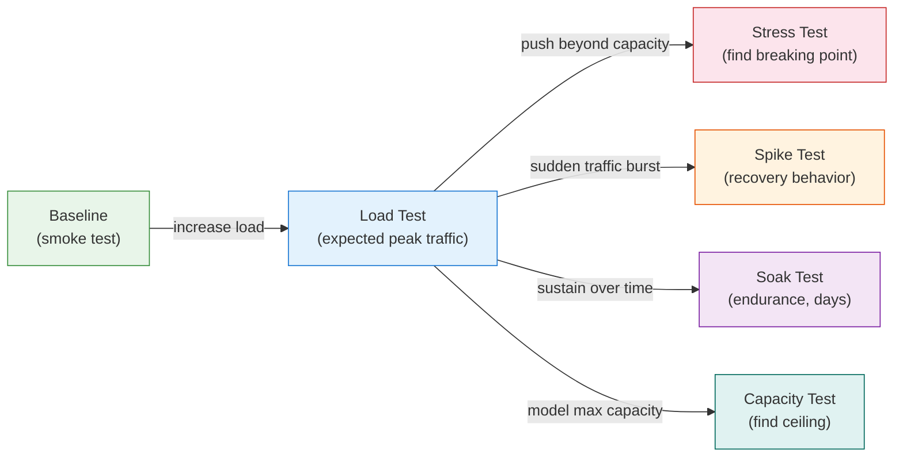

# [BEE-343] Load Testing and Benchmarking

:::info
Load testing validates that your system meets its performance and reliability targets under realistic traffic. Measure percentiles, not averages. Simulate production-like load patterns. Integrate into CI so regressions surface before deployment.
:::

## Context

A service that passes all unit, integration, and contract tests can still fail catastrophically in production. A new database query that scans a full table is undetectable in a test suite with 100 rows, but takes 8 seconds against 50 million rows. A memory leak is invisible in a test run that lasts 30 seconds, but causes an OOM crash after 6 hours of sustained traffic. An API endpoint that averages 50ms under 10 concurrent users becomes a 2-second timeout under 500.

Functional tests verify correctness. Load tests verify capacity and resilience. These are distinct concerns, and neither substitutes for the other.

The second compounding problem is measurement error. Most teams report average latency. Average latency is a dangerous number: it hides the distribution of response times, conceals outliers, and creates a false sense of performance health. A single slow request per hundred looks harmless in an average but represents a significant fraction of real users. When percentile-based metrics are missing, teams optimize for numbers that do not reflect user experience.

## Principle

**Validate performance targets with load tests before deployment. Measure and enforce percentile-based latency metrics (P50, P95, P99). Model realistic traffic patterns. Run load tests in dedicated, production-like environments as a gate on performance-sensitive changes.**

## Load Testing Types

Different questions about system behavior require different load patterns. Conflating these leads to either over-confidence (you tested too gently) or under-confidence (you tested unrealistically).



| Test Type | Question It Answers | Duration |
|---|---|---|
| **Smoke test** | Does the service start and respond under minimal load? | 1–5 minutes |
| **Load test** | Does the service meet SLOs under expected peak traffic? | 20–60 minutes |
| **Stress test** | At what point does the service fail, and how does it fail? | 30–90 minutes |
| **Spike test** | Can the service handle sudden traffic bursts and recover? | 15–30 minutes |
| **Soak test** | Does the service degrade over time (memory leaks, connection pool exhaustion)? | 4–24+ hours |
| **Capacity test** | What is the maximum throughput before performance degrades past SLOs? | 30–90 minutes |

### Load test

A load test simulates the traffic level the system is expected to see in production — typically the anticipated peak, or some multiple of current peak (1.5x or 2x to provide headroom). It answers: "Does the system meet its SLOs under normal operating conditions?" The system should handle this load without errors and within latency targets.

### Stress test

A stress test intentionally exceeds the system's expected capacity to find where and how it breaks. The question is not "does it handle the load?" but "what happens when it cannot?" A well-designed system under stress should degrade gracefully — return errors rather than hang, shed load rather than exhaust all resources, and recover automatically when load decreases. Stress tests reveal whether failure modes are safe.

### Spike test

A spike test sends a sudden, sharp increase in traffic — far above normal — and then drops back down. This simulates events like a marketing email going out, a TV advertisement airing, or a product launch moment. The test measures both how the system behaves at peak (does it handle the spike at all?) and how it recovers afterward (does it return to baseline performance, or does it remain degraded?).

### Soak test

A soak test (also called an endurance test) runs at a sustained, representative load for hours or days. It is the only test type that catches time-dependent failures: memory leaks, connection pool exhaustion, log file growth filling a disk, gradual cache degradation, or floating-point accumulation errors. A system that handles a one-hour load test perfectly can still fail in production after running for six hours.

### Capacity test

A capacity test finds the theoretical ceiling: the maximum throughput the service can sustain while remaining within SLO bounds. This is useful for infrastructure planning (how many instances do we need for 3x current traffic?) and for establishing targets for optimization work (see [BEE-303](303.md) for profiling).

## Why Average Latency Is Misleading

Most monitoring dashboards default to average (mean) latency. Average latency is the single most common measurement mistake in backend engineering.

Consider this distribution from a real API endpoint under moderate load:

| Percentile | Latency |
|---|---|
| P50 (median) | 45ms |
| P75 | 60ms |
| P95 | 310ms |
| P99 | 2,100ms |
| Average | **87ms** |

The average is 87ms. A developer reading this number concludes performance is fine — the target is 200ms. But 1 in 100 requests takes 2.1 seconds. On a page that makes 10 API calls, the probability that at least one call is in the P99 tail is roughly `1 - (0.99)^10 ≈ 10%`. One in ten page loads is slow, but the average metric shows no problem.

**Why the average lies**: The distribution of response times is not symmetric. A small number of very slow requests pull the average upward, but the median (P50) stays low. Users who hit the slow requests have a terrible experience, but they are invisible in aggregate average metrics.

### The right metrics to track

- **P50 (median)**: What a typical user experiences. Useful for general trend monitoring.
- **P95**: What 1 in 20 users experiences. A good target for SLO definitions on non-critical paths.
- **P99**: What 1 in 100 users experiences. The right target for user-facing SLOs on critical paths.
- **P99.9**: What 1 in 1000 users experiences. Relevant for high-volume services or safety-critical paths.
- **Error rate**: The fraction of requests that returned errors. Must be measured separately from latency.
- **Throughput (RPS)**: Requests per second the system is handling. Contextualize latency numbers against throughput — P99 at 10 RPS is very different from P99 at 1000 RPS.

The P99 is the most important single latency number for SLO validation (see [BEE-32](32.md)4). Set your SLO on P99, not on average, and set up alerts that fire when P99 crosses the threshold.

## Load Test Scenarios and Traffic Models

### Open model vs. closed model

This distinction is the most important conceptual choice in load test design, and the most commonly misunderstood.

**Closed model**: The load generator maintains a fixed pool of virtual users. A new request is sent only after the previous one completes. If the server slows down, the effective request rate drops — the load generator "backs off" in sync with the server.

**Open model**: The load generator sends requests at a fixed rate, regardless of whether previous requests have completed. If the server slows down, requests queue up. This is how the real world works: users do not stop arriving because the server is struggling.

The difference matters enormously under load. In a closed model, when the server degrades, the load test automatically reduces pressure on it. The test reports great latency because slow requests take longer, reducing the effective throughput — but this masks the actual problem. In an open model, degradation compounds: requests queue, latency climbs, and the test faithfully reports the user experience as it actually is.

**For API load testing, use an open model.** Tools like k6, Artillery, Gatling, and Locust all support open workload models. Use a closed model only when modeling specific constrained consumer patterns (e.g., a batch worker with a fixed thread pool).

### Ramp-up patterns

A sharp start — injecting full load from 0 — creates an artificial spike that tests your startup behavior, not your steady-state performance. For load tests, ramp up gradually:

```
Load profile example: API endpoint load test
  Phase 1 (ramp-up):    0 RPS → 1000 RPS over 5 minutes
  Phase 2 (steady state): 1000 RPS for 10 minutes
  Phase 3 (ramp-down):  1000 RPS → 0 RPS over 2 minutes

Measurement: collect P50, P95, P99, error rate at each 30-second interval
SLO target: P99 < 500ms, error rate < 0.1%
```

During the ramp-up phase, watch for:
- Error rate climbing before steady state: a sign the system cannot handle even intermediate load
- P99 spiking during ramp but recovering at plateau: usually a connection pool warm-up effect, acceptable
- P99 climbing steadily through plateau without leveling: the system is degrading, not just warming up

### Test scenario design

A load test is only as representative as its scenario. Common scenario design mistakes:

1. **Single-endpoint tests**: Real users hit many endpoints in sequence. An endpoint-only test cannot expose database locking or cache behavior from concurrent read/write patterns. Model realistic user journeys.

2. **Uniform distribution**: Real traffic is not uniform. 80% of requests may go to 20% of endpoints. Model realistic traffic ratios.

3. **Static test data**: If the test always requests the same `user_id=1`, caches heat up perfectly and the test misses cold-path behavior. Use parameterized data drawn from a large, realistic dataset.

4. **No authentication overhead**: If production requests require JWT validation, session lookups, or rate limit checks, the test must include those. A test that skips authentication measures a different system than production.

## Benchmark vs. Load Test

These terms are often used interchangeably. They mean different things.

| | Benchmark | Load Test |
|---|---|---|
| **Goal** | Establish a performance baseline; compare implementations | Validate system meets SLOs under realistic traffic |
| **Scope** | Usually a single function, algorithm, or endpoint in isolation | The full system: service, database, network, dependencies |
| **Traffic pattern** | Highly controlled, often single-threaded, repeatable | Realistic, multi-user, open-model concurrent requests |
| **Question** | "Is this implementation faster than the alternative?" | "Will this system handle production traffic within SLO?" |
| **Use when** | Choosing between algorithms; measuring optimization impact | Validating deployment readiness; capacity planning |

Benchmarks belong in unit tests and profiling sessions (see [BEE-30](30.md)3). Load tests belong in the CI/CD pipeline as a gate on system readiness.

When using microbenchmarks (e.g., Go's `testing.B`, JMH for Java), be aware that the JIT, CPU caches, and GC behavior in a benchmark harness differ significantly from production behavior. Benchmark results are comparative, not predictive.

## Load Testing in CI

Load tests are most valuable when they run automatically and gate deployments. A load test that only runs before major launches provides little protection against incremental regressions.

### Integration strategy

```
CI pipeline for performance-sensitive services:

  PR:       Smoke test (5 min) -- fast feedback, catches startup failures
  Merge:    Load test (30 min) -- validates SLOs on every merge to main
  Nightly:  Soak test (6+ hrs) -- catches memory leaks and drift
  Weekly:   Stress + capacity test -- keeps infrastructure planning data fresh
```

### Performance gates

Define explicit thresholds that fail the build:

```
Load test gates (example):
  POST /api/orders:
    - P99 < 500ms under 500 RPS
    - error rate < 0.1% under 500 RPS
  GET /api/catalog:
    - P95 < 100ms under 2000 RPS
    - error rate < 0.01% under 2000 RPS

  If any threshold is exceeded: build fails, deployment blocked
```

Track these metrics over time. A performance regression of 10ms per deploy is invisible in a single test but becomes a 100ms regression over 10 deploys. Trending matters as much as passing/failing a threshold.

### Test environment requirements

Load tests run against a dedicated environment, not a shared staging environment, and never against production (unless using a production traffic-shaping technique like shadowing). The test environment must:

- Run on infrastructure identical in configuration to production (same instance type, same database size, same memory limits)
- Use a representative dataset (same order of magnitude as production row counts, not 100 rows in a table that has 50 million in production)
- Have network topology that matches production (if production calls an external API over a real network, the test environment should too — or the test must account for this difference explicitly)
- Be isolated from other teams' workloads (shared environments produce non-deterministic results because other teams' tests create noise)

Running a load test from the same machine as the service being tested is a common mistake. Network round-trip time, which affects real users, is absent. Latency numbers will be unrealistically low.

## Coordinated Omission

Coordinated omission is a systematic measurement error first named by Gil Tene that affects most closed-model load testing tools and some open-model implementations. It is one of the most important concepts in load testing, and one of the least widely understood.

**The problem**: Suppose a load generator sends requests one at a time (closed model). A server hiccup causes the server to stall for 5 seconds. During that 5 seconds, the load generator is waiting for the stalled request — so it sends no new requests. The requests that would have been in flight during the stall period are never sent. When the stall ends, the load generator resumes as if nothing happened.

The result: the load test measures the latency of the requests it actually sent, but omits the fact that many requests were delayed before they were even sent. The reported latency histogram shows one slow request (the one that experienced the 5-second stall), when in reality, every request that would have arrived during the stall period was also delayed by 5 seconds — the load generator just never sent them.

**The fix**: Use an open workload model with a fixed arrival rate. Requests are scheduled to arrive at fixed intervals regardless of whether previous requests have completed. If a slot's request cannot be sent because the generator is busy waiting for a prior response, the request is still recorded — with a latency that includes the time it spent waiting to be sent.

Tools like wrk2 (designed by Gil Tene specifically to address this), k6 (in open workload mode), and Gatling (with open model configuration) handle this correctly. Always verify that your load testing tool uses an open workload model before trusting its latency histograms.

## SLO Validation Through Load Testing

Load tests are the primary mechanism for validating that a service's SLOs (see [BEE-32](32.md)4) are achievable, not just aspirational.

The process:

1. Define SLOs with explicit percentile targets and load conditions: "P99 latency under 500ms at 1000 RPS" is a testable SLO. "Fast response time" is not.
2. Write a load test that generates 1000 RPS and measures P99.
3. Run the load test before any change that could affect performance.
4. Fail the build if the SLO is not met.

This creates a feedback loop: SLOs set the target, load tests validate the target, and build failures enforce it. Without load tests, SLOs are promises without verification.

A related use: **capacity planning**. If the current service handles 1000 RPS within SLO on a 4-core instance, a load test can determine whether 2000 RPS requires 8 cores, 2 instances, or a database index change. Load tests give estimates (see [BEE-30](30.md)0) a quantitative foundation.

## Common Mistakes

### 1. Measuring average latency instead of percentiles

Average latency is a comfortable number that hides performance problems. A system with P99 of 2 seconds can report an average of 80ms if 99% of requests are fast. **Fix**: Always report P50, P95, and P99. Set SLOs on P99. Alert on P99.

### 2. Testing from the same network as the server

When the load generator runs on the same host or local network as the service, network round-trip time is near zero. Real user latency includes network hops. The test results are non-representative. **Fix**: Run load generators from a network location that approximates user proximity — or explicitly account for the network omission in your analysis.

### 3. Not using production-like data volumes

A database query that takes 5ms against 1,000 rows takes 15 seconds against 50 million rows. Tests with small datasets miss this entirely. **Fix**: Load the test database with a representative data volume before running load tests. Use anonymized production data snapshots where possible.

### 4. Running load tests against shared environments

Shared environments produce non-deterministic results because other test runs, CI builds, and developer activity create resource contention noise. A load test result from a shared environment is unreliable. **Fix**: Run load tests in a dedicated, isolated environment provisioned specifically for performance testing.

### 5. Coordinated omission (closed-model testing)

Using a closed workload model masks degradation by automatically reducing pressure when the server slows down. The latency histogram looks much better than reality. **Fix**: Use an open workload model that sends requests at a fixed rate, independent of response completion. Verify your load testing tool's default behavior — many tools default to closed models.

## Related BEPs

- [BEE-300](300.md) (Estimation) — load tests validate capacity estimates with measured data; use test results to calibrate estimates
- [BEE-303](303.md) (Profiling) — when a load test reveals a performance problem, profiling identifies which code path is the bottleneck
- [BEE-324](324.md) (SLOs) — load tests are the primary mechanism for validating that SLOs are achievable and enforced continuously

## References

- Gil Tene, *How NOT to Measure Latency*, strangeloop presentation, 2015 — foundational explanation of coordinated omission and percentile measurement
- Grafana k6, *Types of load testing*, grafana.com/load-testing/types-of-load-testing/
- Aerospike, *What Is P99 Latency?*, aerospike.com/blog/what-is-p99-latency/
- Artillery.io, *Understanding workload models*, artillery.io/blog/load-testing-workload-models
- StormForge, *Choosing Open or Closed Workload Models for Performance Testing*, stormforge.io/blog/open-closed-workloads/
- ScyllaDB, *On Coordinated Omission*, scylladb.com/2021/04/22/on-coordinated-omission/
- LoadForge, *P50, P95, P99: Why Percentiles Matter More Than Averages*, loadforge.com/blog/response-time-percentiles-explained
- Locust Cloud, *Closed vs Open Workload Models in Load Testing*, locust.cloud/blog/closed-vs-open-workload-models/
