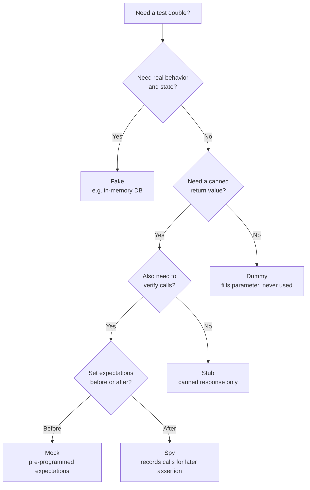

# [BEE-344] Test Doubles: Mocks, Stubs, Fakes

:::info
Five test double types, when each is appropriate, and how over-mocking creates brittle tests coupled to implementation details.
:::

## Context

When writing automated tests, most production code has dependencies: databases, external services, email systems, payment gateways. These dependencies make tests slow, unreliable, or impossible to run in isolation. The solution is to replace real dependencies with controlled substitutes during testing.

Gerard Meszaros coined the term **test double** in *xUnit Test Patterns* (2007) as the umbrella term for any object that stands in for a real dependency. Martin Fowler's article ["Mocks Aren't Stubs"](https://martinfowler.com/articles/mocksArentStubs.html) (2004, updated 2007) clarified the confusion between the specific double types. Fowler also maintains a concise reference at [martinfowler.com/bliki/TestDouble.html](https://martinfowler.com/bliki/TestDouble.html).

The original taxonomy from [xunitpatterns.com](http://xunitpatterns.com/Mocks,%20Fakes,%20Stubs%20and%20Dummies.html) defines five distinct types, each appropriate for a different situation.

## The Five Test Double Types

### Dummy

A **dummy** is passed to the system under test but never used. It satisfies a parameter requirement without participating in the test behavior.

```typescript
// OrderService requires a Logger but this test doesn't exercise logging
const nullLogger: Logger = { log: () => {}, error: () => {} };
const service = new OrderService(paymentGateway, database, nullLogger);
```

Use a dummy when a dependency is required by the constructor or signature but irrelevant to the test case at hand.

### Stub

A **stub** provides pre-programmed, canned responses to calls made during the test. It does not respond to anything outside what is explicitly configured. Stubs support **state verification**: the test asserts on the output or final state of the system under test, not on how it called the stub.

```typescript
const stubPaymentGateway: PaymentGateway = {
  charge: async (amount: number) => ({ success: true, transactionId: "txn-123" })
};

const order = await orderService.place(cart, stubPaymentGateway);
expect(order.status).toBe("confirmed"); // assert on the outcome, not the stub
```

Use a stub when you need the dependency to return a known value so you can focus on the logic downstream.

### Spy

A **spy** is a stub that also records information about how it was called (which methods, with which arguments, how many times). The test can then query those records after the fact. Spies support **behavior verification** but in a more lenient, after-the-fact style compared to mocks.

```typescript
const emailSpy = {
  sent: [] as Email[],
  send: async (email: Email) => { emailSpy.sent.push(email); }
};

await orderService.place(cart, paymentGateway, emailSpy);
expect(emailSpy.sent).toHaveLength(1);
expect(emailSpy.sent[0].to).toBe("customer@example.com");
```

Use a spy when you need to assert that a side-effect occurred, but want to write the expectation separately after the act phase.

### Mock

A **mock** is pre-programmed with expectations **before** the system under test runs. The mock itself verifies that the expected calls occurred. If the calls do not match, the mock fails the test. Mocks enforce **behavior verification**.

```typescript
// Jest mock example
const mockNotification = {
  sendOrderConfirmation: jest.fn()
};

await orderService.place(cart, paymentGateway, fakeDb, mockNotification);

expect(mockNotification.sendOrderConfirmation).toHaveBeenCalledTimes(1);
expect(mockNotification.sendOrderConfirmation).toHaveBeenCalledWith(
  expect.objectContaining({ orderId: expect.any(String) })
);
```

Use a mock when verifying that an outbound interaction occurred is the primary purpose of the test — typically for fire-and-forget side effects where there is no observable return value to assert on.

### Fake

A **fake** has a real, working implementation, but uses shortcuts that make it unsuitable for production. The canonical example is an in-memory database. Unlike stubs, fakes actually execute logic and can hold state across multiple calls.

```typescript
class InMemoryOrderRepository implements OrderRepository {
  private store = new Map<string, Order>();

  async save(order: Order): Promise<void> {
    this.store.set(order.id, order);
  }

  async findById(id: string): Promise<Order | null> {
    return this.store.get(id) ?? null;
  }

  async findByCustomer(customerId: string): Promise<Order[]> {
    return [...this.store.values()].filter(o => o.customerId === customerId);
  }
}
```

Use a fake when the dependency has meaningful internal logic (like a query engine) that you do not want to stub call by call, and when you want tests to exercise real data flows without hitting infrastructure.

## Decision Tree



## State Verification vs. Behavior Verification

This distinction, drawn sharply by Fowler, is the most important conceptual divide in test double usage.

**State verification** (classical/Detroit school): exercise the system under test, then assert on the resulting state or return value. Stubs and fakes support this style. The test does not care *how* the system produced the result.

**Behavior verification** (mockist/London school): assert that the system under test made specific calls in a specific way. Mocks and spies support this style. The test cares about the *interactions* the system performed.

Both styles are valid, but they have different trade-offs:

| | Classical (state-based) | Mockist (interaction-based) |
|---|---|---|
| Couples test to | Observable output | Internal call sequence |
| Refactoring safety | High — internals can change freely | Low — internals must stay the same |
| Diagnosing failures | Clear — wrong result | Harder — wrong call |
| Best for | Query methods, transformations | Command methods, fire-and-forget |

The practical rule: **prefer state verification by default; use behavior verification only when there is no observable state to assert on** (e.g., sending an email, publishing an event).

## Worked Example: Order Service

Consider an `OrderService` with three dependencies: a `PaymentGateway`, an `OrderRepository`, and a `NotificationService`.

```typescript
class OrderService {
  constructor(
    private payment: PaymentGateway,
    private orders: OrderRepository,
    private notifications: NotificationService
  ) {}

  async place(cart: Cart, customer: Customer): Promise<Order> {
    const result = await this.payment.charge(cart.total);
    if (!result.success) throw new PaymentError(result.reason);

    const order = Order.create(cart, customer, result.transactionId);
    await this.orders.save(order);
    await this.notifications.sendOrderConfirmation(order, customer);
    return order;
  }
}
```

A well-structured test suite for this service would use a different double type for each dependency:

```typescript
describe("OrderService.place", () => {
  let fakeDb: InMemoryOrderRepository;
  let stubPayment: PaymentGateway;
  let mockNotifications: NotificationService;

  beforeEach(() => {
    // FAKE: the repository needs real query logic across calls
    fakeDb = new InMemoryOrderRepository();

    // STUB: payment just needs to return a known success response;
    // we are not testing the payment gateway, we are testing what
    // OrderService does AFTER a successful charge
    stubPayment = {
      charge: async () => ({ success: true, transactionId: "txn-abc" })
    };

    // MOCK: notification is a fire-and-forget side effect;
    // there is no return value to assert on, so behavior verification
    // is the only option
    mockNotifications = {
      sendOrderConfirmation: jest.fn()
    };
  });

  it("saves the order after successful payment", async () => {
    const service = new OrderService(stubPayment, fakeDb, mockNotifications);
    const order = await service.place(testCart, testCustomer);

    // state verification against the fake
    const saved = await fakeDb.findById(order.id);
    expect(saved).not.toBeNull();
    expect(saved!.status).toBe("confirmed");
  });

  it("sends a confirmation notification", async () => {
    const service = new OrderService(stubPayment, fakeDb, mockNotifications);
    await service.place(testCart, testCustomer);

    // behavior verification against the mock
    expect(mockNotifications.sendOrderConfirmation).toHaveBeenCalledTimes(1);
  });

  it("throws PaymentError when payment fails", async () => {
    const failingPayment: PaymentGateway = {
      charge: async () => ({ success: false, reason: "card_declined" })
    };
    const service = new OrderService(failingPayment, fakeDb, mockNotifications);

    await expect(service.place(testCart, testCustomer))
      .rejects.toThrow(PaymentError);
  });
});
```

Why each choice:

- `fakeDb` (Fake): the service calls `save` and could call `findById` or `findByCustomer` in other tests; a stub would need re-configuration for every test, and using a mock would couple tests to the exact sequence of repository calls.
- `stubPayment` (Stub): the test is about `OrderService` behavior after payment, not about the gateway. A canned success or failure response is all that is needed.
- `mockNotifications` (Mock): `sendOrderConfirmation` returns nothing; the only way to verify the service did its job is to assert the call happened.

## Common Mistakes

### 1. Mocking everything

When every dependency is a mock, the test suite can achieve 100% pass rate while the real system does not work. Integration paths, serialization, and real logic in dependencies are never exercised. Tests that only verify call sequences tell you the code *talks to* its dependencies, not that the system *works*.

### 2. Testing mock behavior instead of real behavior

```typescript
// Wrong: this test asserts nothing about the system under test
it("calls findById", async () => {
  mockRepo.findById.mockResolvedValue(order);
  await service.getOrder(order.id);
  expect(mockRepo.findById).toHaveBeenCalledWith(order.id); // trivially true
});

// Right: assert on what the service returns
it("returns the order when found", async () => {
  mockRepo.findById.mockResolvedValue(order);
  const result = await service.getOrder(order.id);
  expect(result).toEqual(order);
});
```

### 3. Mocking types you own (mock boundaries, not internals)

Mock the interfaces at your architectural boundaries (HTTP clients, database drivers, message brokers). Do not mock internal collaborators like domain services, value objects, or utility classes. Those are implementation details. When you mock them, every internal refactor breaks tests even though behavior has not changed.

Per BEE-103 (hexagonal architecture), **ports are natural mock boundaries**. Mock the port, not the objects behind it.

### 4. Brittle mock setup

```typescript
// Brittle: test breaks if argument ordering or structure changes internally
expect(mockService.process).toHaveBeenCalledWith("ORDER", customer.id, cart.items, "USD", 0);

// Resilient: assert on semantics, not exact shape
expect(mockService.process).toHaveBeenCalledWith(
  expect.objectContaining({ type: "ORDER", currency: "USD" })
);
```

If a test breaks when you change implementation details without changing observable behavior, the test is testing the wrong thing.

### 5. Using mocks where a fake would serve better

When a dependency has stateful logic — a queue, a cache, a repository — a mock configured call-by-call becomes a maintenance burden and often misrepresents the real behavior. Write an in-memory fake once and reuse it across the whole test suite. See BEE-341 (integration testing) for cases where even fakes are insufficient and real infrastructure is required.

## Test Double Lifecycle

A test double's scope should match what it is verifying:

| Scope | When to use | Risk |
|---|---|---|
| Per-test (fresh each test) | Default for mocks and spies | Prevents state leakage between tests |
| Per-suite (shared instance) | Fakes that are read-only or reset between tests | Shared mutable state causes flaky tests |
| Global (test infrastructure) | Well-tested fakes in a dedicated `test/fakes/` module | None if immutable; avoid mutable globals |

Always reset or recreate mocks in `beforeEach`. Never share mock instances across tests.

## Principle

Use the simplest double that makes the test work:

1. **Fake** when the dependency has logic that matters to the test flow (databases, queues, caches).
2. **Stub** when you only need a controlled return value.
3. **Spy** when you need to verify a call happened but want to write the assertion after the act.
4. **Mock** when verifying a specific interaction is the primary purpose of the test.
5. **Dummy** when a dependency must be present but is not exercised.

Apply behavior verification (mocks, spies) only at architectural boundaries and only when there is no observable state to assert on. Prefer state verification everywhere else. Test doubles are a tool for isolation, not a substitute for exercising real behavior.

## Related BEPs

- [BEE-103 — Hexagonal Architecture](103.md): Ports are natural mock boundaries. Mock the port interface, not the objects behind it.
- [BEE-340 — Test Pyramid](./340.md): Unit tests with doubles form the base; the pyramid determines how many of each type to write.
- [BEE-341 — Integration Testing](./341.md): When NOT to mock — cases where real infrastructure is required for meaningful test coverage.

## References

- Martin Fowler, ["Mocks Aren't Stubs"](https://martinfowler.com/articles/mocksArentStubs.html) (2004, updated 2007)
- Martin Fowler, ["TestDouble" bliki entry](https://martinfowler.com/bliki/TestDouble.html)
- Gerard Meszaros, [*xUnit Test Patterns: Refactoring Test Code*](http://xunitpatterns.com/Mocks,%20Fakes,%20Stubs%20and%20Dummies.html) (2007)
- Kostis Kapelonis, ["Software Testing Anti-patterns"](https://blog.codepipes.com/testing/software-testing-antipatterns.html)
