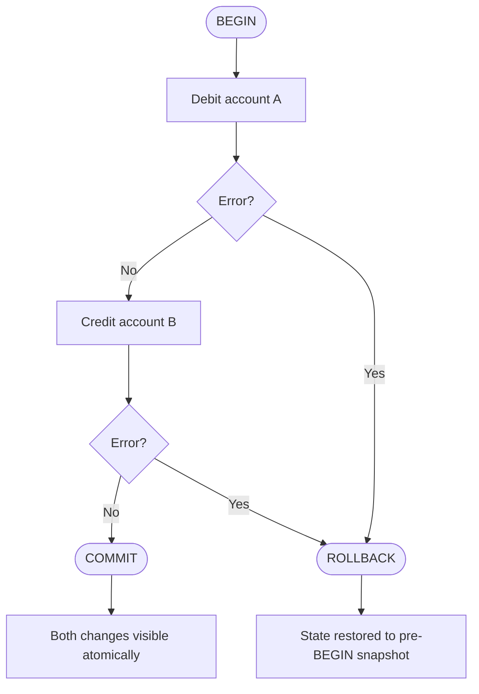

# [BEE-160] ACID Properties

:::info
ACID is not just a database feature -- it is a contract between your application and the database. Understanding it shapes every design decision you make around data integrity.
:::

## Context

In 1981, Jim Gray formalized the transaction concept in his paper ["The Transaction Concept: Virtues and Limitations"](https://jimgray.azurewebsites.net/papers/thetransactionconcept.pdf). The four properties he described -- Atomicity, Consistency, Isolation, and Durability -- remain the foundation of reliable data management in relational databases.

For application engineers, ACID is not an academic concern. Every time you write to more than one row, call more than one service, or handle a request that can fail midway, you are making implicit choices about these properties. Making them explicit leads to more correct and maintainable systems.

:::tip Deep Dive
For database-level ACID implementation details, see [DEE-10: ACID Properties](https://alivedise.github.io/database-engineering-essentials/10).
:::

## The Four Properties

### Atomicity: All or Nothing

A transaction is atomic if all of its operations succeed together, or none of them take effect. There is no partial success.

From the application's perspective, atomicity answers the question: **what is the state of the system if my operation fails halfway?**

Without atomicity, a network timeout or server crash mid-operation leaves the database in an inconsistent intermediate state -- and your application has no way to know what was and was not applied.

**The transaction lifecycle:**



Atomicity does not help you recover automatically -- it helps you fail cleanly. After a rollback, you know the database is in a consistent state and your application can safely retry or report the error.

### Consistency: Application Invariants Maintained

Consistency is the odd one out in ACID -- it is the only property that is primarily the application's responsibility, not the database's.

A transaction leaves the database in a consistent state if application-defined invariants hold before and after the transaction. The database can enforce some of these through constraints (foreign keys, NOT NULL, CHECK), but business rules like "an account balance must not go negative" or "an order must have at least one line item" are up to you.

**Practical implication:** You cannot simply open a transaction, write data, and assume consistency is guaranteed. You must encode invariants explicitly -- through database constraints where possible, and through application logic where not.

### Isolation: Concurrent Transactions Do Not Interfere

Isolation governs what one transaction can see of another transaction's in-progress work. It is the most nuanced ACID property and the one most likely to cause subtle production bugs.

Full isolation (serializable) means that concurrent transactions produce the same result as if they ran one at a time. This is safe but expensive. Most databases default to a weaker isolation level (typically Read Committed) that allows certain anomalies in exchange for better throughput.

**Choosing the right isolation level is an application design decision**, not a database default to accept blindly. See [BEE-161](./161.md) for a full treatment of isolation levels and the anomalies each one permits.

### Durability: Committed Data Survives Crashes

Once a transaction commits, the database guarantees that the changes are persisted -- surviving power failures, crashes, and restarts. In practice, this means the database has written to durable storage (or acknowledged a synchronous replica) before returning a success response.

From the application perspective, durability means: **if `COMMIT` returned success, you can trust that the data is there**. You do not need to re-verify on startup or implement your own write-ahead log.

## The Bank Transfer Example

This is the canonical example because it makes the cost of broken ACID visible.

**Without atomicity:**

```
BEGIN
  UPDATE accounts SET balance = balance - 100 WHERE id = 'A'
  -- server crashes here
  -- UPDATE accounts SET balance = balance + 100 WHERE id = 'B'  -- never runs
```

Account A loses $100. Account B receives nothing. $100 vanishes. No error is surfaced to the caller.

**With atomicity:**

```
BEGIN
  UPDATE accounts SET balance = balance - 100 WHERE id = 'A'
  -- server crashes here
ROLLBACK (automatic on crash/disconnect)
```

The debit is rolled back. Account A still has its $100. The caller receives an error and can retry.

**With isolation (two concurrent transfers on the same account):**

Assume account A has $150. Two concurrent transfers of $100 each:

```
T1: BEGIN
T2: BEGIN
T1: SELECT balance FROM accounts WHERE id = 'A'  -- reads 150
T2: SELECT balance FROM accounts WHERE id = 'A'  -- reads 150
T1: UPDATE accounts SET balance = 150 - 100 WHERE id = 'A'  -- sets to 50
T2: UPDATE accounts SET balance = 150 - 100 WHERE id = 'A'  -- sets to 50 (lost T1's write)
T1: COMMIT
T2: COMMIT
```

Under Read Committed without proper locking, both transactions can read the original balance and both succeed -- overdrawing the account. Serializable isolation or a `SELECT FOR UPDATE` prevents this.

## When to Use Transactions

Not every write requires a transaction. But you should always use one when:

- You are writing to more than one row, table, or document and they must change together.
- You are implementing a "read-then-write" pattern where the write depends on data read in the same operation.
- Partial failure would leave data in a state that is hard to detect and repair.

## When ACID Is Too Expensive

Full ACID transactions have costs: lock contention, coordination overhead, and limited horizontal scalability. In some contexts, these costs exceed the benefit.

**Eventual consistency** is the common alternative. Instead of requiring all nodes to agree before a write succeeds, the system accepts writes immediately and propagates them asynchronously. This improves availability and write throughput at the cost of temporary inconsistency.

Use eventual consistency when:
- The data is not financial or inventory-critical (e.g., view counters, activity feeds, search indexes).
- The application can tolerate reading slightly stale data.
- The reconciliation logic for resolving conflicts is well-understood and implementable.

See [BEE-165](./165.md) for patterns and trade-offs in eventual consistency.

## ACID in Distributed Systems

ACID is straightforward within a single database. Across multiple databases or services, it becomes significantly harder.

**The core problem:** a transaction that spans two databases cannot rely on either database's ACID guarantee to cover the other. If your service writes to both a relational database and a message queue, you have two separate systems with no shared transaction coordinator.

Common patterns for handling this:

- **Two-Phase Commit (2PC):** A coordinator prepares all participants, then commits. Provides ACID-like guarantees but is slow, complex, and blocks on coordinator failure. See [BEE-162](./162.md).
- **Saga pattern:** Break the distributed operation into a sequence of local transactions with compensating actions for failure. See [BEE-163](./163.md).
- **Outbox pattern:** Write the message into the same database transaction as the state change, then relay it asynchronously. Avoids dual-write problems.

**The rule of thumb:** If you need strong consistency across multiple data stores, revisit your service boundaries. The need often signals that two services should share a data store, or that one is doing too much.

## Common Mistakes

**1. Not wrapping related operations in a transaction**

Writing multiple related rows in separate statements without a transaction is the most common mistake. Any failure between statements leaves data inconsistent.

```python
# Wrong: two separate statements, no transaction
db.execute("UPDATE accounts SET balance = balance - 100 WHERE id = ?", [a_id])
db.execute("UPDATE accounts SET balance = balance + 100 WHERE id = ?", [b_id])

# Correct: both operations in one atomic transaction
with db.transaction():
    db.execute("UPDATE accounts SET balance = balance - 100 WHERE id = ?", [a_id])
    db.execute("UPDATE accounts SET balance = balance + 100 WHERE id = ?", [b_id])
```

**2. Transactions that are too large**

Long-running transactions hold locks for their entire duration, blocking other transactions. Keep transactions as short as possible. Move computation, external HTTP calls, and non-essential reads outside the transaction boundary.

**3. Assuming ACID across multiple databases**

Two `BEGIN ... COMMIT` blocks in two separate databases are two independent transactions. If the first commits and the second fails, there is no automatic rollback of the first.

**4. Ignoring isolation level choice**

Accepting the default isolation level without understanding it is a latent bug. The PostgreSQL default (Read Committed) allows non-repeatable reads and lost updates under concurrent load. Evaluate your workload against the anomalies each level permits. See [BEE-161](./161.md).

**5. Swallowing transaction errors**

Catching exceptions without rolling back is particularly dangerous in connection pool environments. An unreleased transaction holds locks and may leave the connection in a broken state.

```python
# Wrong: exception caught, transaction neither committed nor rolled back
try:
    db.execute("UPDATE ...")
    db.execute("UPDATE ...")
except Exception:
    pass  # silent failure, connection state unknown

# Correct: explicit rollback on any error
try:
    with db.transaction():
        db.execute("UPDATE ...")
        db.execute("UPDATE ...")
except Exception as e:
    logger.error("Transfer failed, rolled back", exc_info=e)
    raise
```

## Principle

Use database transactions for any multi-step write that must succeed or fail as a unit. Choose your isolation level deliberately based on the anomalies your application can and cannot tolerate. Do not assume ACID guarantees extend across multiple databases or services -- design explicitly for failure at boundaries.

## Related BEPs

- [BEE-161: Isolation Levels and Their Anomalies](./161.md) -- deep dive into isolation levels and which anomalies each allows
- [BEE-162: Distributed Transactions and Two-Phase Commit](./162.md) -- coordinating transactions across services
- [BEE-163: Saga Pattern](./163.md) -- compensating transactions for long-running distributed workflows
- [BEE-165: Eventual Consistency Patterns](./165.md) -- when to trade ACID guarantees for availability

## References

- Jim Gray, ["The Transaction Concept: Virtues and Limitations"](https://jimgray.azurewebsites.net/papers/thetransactionconcept.pdf), Tandem Computers, 1981
- Martin Kleppmann, [*Designing Data-Intensive Applications*, Chapter 7: Transactions](https://www.oreilly.com/library/view/designing-data-intensive-applications/9781491903063/ch07.html), O'Reilly Media, 2017
- [PostgreSQL Documentation: 13.2 Transaction Isolation](https://www.postgresql.org/docs/current/transaction-iso.html)
