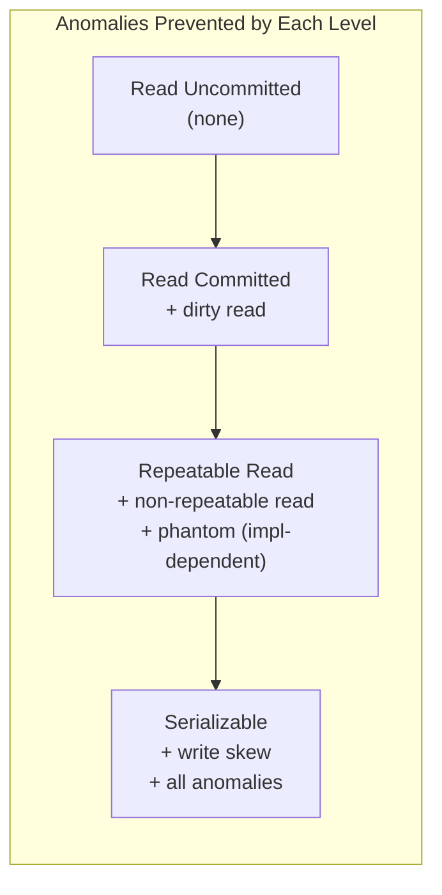

# [BEE-161] Isolation Levels and Their Anomalies

:::info
Isolation is the most nuanced ACID property. Understanding which anomalies each level prevents -- and which it allows -- is a prerequisite for writing correct concurrent code.
:::

## Context

The SQL standard defines four transaction isolation levels. Every database defaults to one of them. Most engineers accept the default without understanding what it means for concurrent behavior -- and then spend weeks debugging race conditions that the database was never asked to prevent.

The anomalies each level permits are not theoretical. Dirty reads have caused double charges. Non-repeatable reads have caused inventory oversells. Write skew has permitted users to take actions that should have been mutually exclusive. Understanding the matrix of "level vs. anomaly" is not academic preparation -- it is a prerequisite for writing correct code under concurrency.

:::tip Related
For the foundational ACID model, see [BEE-160](./160.md). For distributed transaction coordination, see [BEE-162](./162.md). For concurrency control strategies, see [BEE-245](../Concurrency/245.md).
:::

## The Four SQL Standard Isolation Levels

The SQL-92 standard defines four levels in order of increasing strictness:

1. **Read Uncommitted** -- weakest; no protection against any anomaly
2. **Read Committed** -- prevents dirty reads; default in PostgreSQL, Oracle
3. **Repeatable Read** -- prevents dirty and non-repeatable reads; default in MySQL InnoDB
4. **Serializable** -- strongest; prevents all standard anomalies including phantoms

## The Anomalies

### Dirty Read

A transaction reads data written by a concurrent transaction that has not yet committed. If that transaction later rolls back, the first transaction has read data that never officially existed.

**Example:**

```
T1: BEGIN
T1: UPDATE accounts SET balance = 0 WHERE id = 1   -- not yet committed

T2: BEGIN
T2: SELECT balance FROM accounts WHERE id = 1
    -- returns 0 (T1's uncommitted write)
T2: -- makes decision based on 0 balance

T1: ROLLBACK  -- balance reverts to original
-- T2's decision was based on data that never existed
```

**Risk level:** High. Can cause double charges, incorrect balance displays, wrong business decisions.

### Non-Repeatable Read

A transaction reads the same row twice and gets different values because another transaction committed a change between the two reads.

**Example:**

```
T1: BEGIN
T1: SELECT price FROM products WHERE id = 42
    -- returns 100

T2: BEGIN
T2: UPDATE products SET price = 200 WHERE id = 42
T2: COMMIT

T1: SELECT price FROM products WHERE id = 42
    -- returns 200 (different from first read)
T1: COMMIT
-- T1 operated on two different values for the same row
```

**Risk level:** Medium. Breaks "read your premise" logic -- a transaction that reads a value, makes a decision, then re-reads to verify can be surprised.

### Phantom Read

A transaction re-executes a query with a range condition and finds new rows that were inserted by another committed transaction.

**Example:**

```
T1: BEGIN
T1: SELECT COUNT(*) FROM bookings WHERE room_id = 5 AND date = '2026-04-07'
    -- returns 0

T2: BEGIN
T2: INSERT INTO bookings (room_id, date, user_id) VALUES (5, '2026-04-07', 99)
T2: COMMIT

T1: SELECT COUNT(*) FROM bookings WHERE room_id = 5 AND date = '2026-04-07'
    -- returns 1 (phantom row appeared)
T1: INSERT INTO bookings (room_id, date, user_id) VALUES (5, '2026-04-07', 42)
    -- double booking!
T1: COMMIT
```

**Risk level:** Medium to high. Classic source of double-booking and inventory-count bugs.

### Write Skew

Two transactions each read an overlapping set of rows, make decisions based on what they read, then write to disjoint rows -- producing a result that would not be allowed if either had run first. Neither transaction overwrites the other's data, so neither is detected as a conflict by simple locking.

**Example:** A system requires at least one doctor on call. Both doctors are currently on call.

```
T1 (Doctor Alice): BEGIN
T1: SELECT COUNT(*) FROM on_call WHERE shift = 'tonight'
    -- returns 2 (Alice and Bob)
T1: -- "2 > 1, safe to remove myself"

T2 (Doctor Bob): BEGIN
T2: SELECT COUNT(*) FROM on_call WHERE shift = 'tonight'
    -- returns 2 (Alice and Bob)
T2: -- "2 > 1, safe to remove myself"

T1: DELETE FROM on_call WHERE doctor = 'Alice' AND shift = 'tonight'
T2: DELETE FROM on_call WHERE doctor = 'Bob' AND shift = 'tonight'

T1: COMMIT
T2: COMMIT
-- No doctor on call. The invariant is broken.
-- Neither transaction wrote to the same row as the other.
```

**Risk level:** High and insidious. Cannot be prevented by row-level locking alone. Requires Serializable isolation or explicit `SELECT FOR UPDATE` on all rows that inform the decision.

## Isolation Levels vs. Anomalies: The Matrix

| Isolation Level  | Dirty Read  | Non-Repeatable Read | Phantom Read | Write Skew  |
|------------------|:-----------:|:-------------------:|:------------:|:-----------:|
| Read Uncommitted | possible    | possible            | possible     | possible    |
| Read Committed   | prevented   | possible            | possible     | possible    |
| Repeatable Read  | prevented   | prevented           | prevented*   | possible    |
| Serializable     | prevented   | prevented           | prevented    | prevented   |

\* PostgreSQL's Repeatable Read (snapshot isolation) prevents phantom reads. MySQL's Repeatable Read prevents them via gap locks. The SQL-92 standard does not require this at this level.



## How Real Databases Implement Isolation

### PostgreSQL

PostgreSQL uses **Multi-Version Concurrency Control (MVCC)** throughout. Rather than locking rows for reads, it maintains multiple committed versions of each row and gives each transaction a consistent snapshot view.

| SQL Level        | PostgreSQL Internal Behavior                                          |
|------------------|-----------------------------------------------------------------------|
| Read Uncommitted | Treated as Read Committed (PostgreSQL never shows uncommitted data)  |
| Read Committed   | Default. Each statement gets a fresh snapshot of committed data.     |
| Repeatable Read  | Snapshot isolation. Transaction sees committed data as of BEGIN.     |
| Serializable     | Serializable Snapshot Isolation (SSI). Detects cycle conflicts.      |

Key points:
- PostgreSQL's **Repeatable Read is actually snapshot isolation** -- stronger than the SQL-92 spec requires. Phantom reads do not occur.
- **Write skew is still possible at Repeatable Read**. Two transactions can both read a shared condition and write to non-overlapping rows without conflict.
- **Serializable uses SSI** (introduced in PostgreSQL 9.1): an optimistic algorithm that detects dangerous read-write dependency cycles and aborts one transaction. Readers do not block writers.

```sql
-- Set isolation for a single transaction
BEGIN ISOLATION LEVEL REPEATABLE READ;
-- or
SET TRANSACTION ISOLATION LEVEL SERIALIZABLE;
```

### MySQL InnoDB

MySQL InnoDB defaults to **Repeatable Read** and uses a combination of MVCC and locking.

| SQL Level        | MySQL InnoDB Behavior                                                        |
|------------------|------------------------------------------------------------------------------|
| Read Uncommitted | Reads are non-locking; dirty reads allowed.                                  |
| Read Committed   | Each statement reads the latest committed snapshot.                          |
| Repeatable Read  | Default. Consistent snapshot from first read. Gap locks prevent phantoms.   |
| Serializable     | All plain SELECTs become `SELECT ... FOR SHARE`. Full locking.               |

Key points:
- MySQL prevents phantom reads at Repeatable Read via **gap locks** and **next-key locks** -- locks on the gap between index values, not just individual rows. This is a locking approach rather than MVCC-only.
- Gap locks can cause **deadlocks under concurrent inserts**. They are a common source of production incidents in MySQL workloads.
- MySQL Serializable uses two-phase locking (pessimistic), not SSI. Readers block writers.

```sql
-- Check current isolation level
SELECT @@transaction_isolation;

-- Set session-level
SET SESSION TRANSACTION ISOLATION LEVEL READ COMMITTED;
```

## Snapshot Isolation and MVCC

Snapshot isolation is not a named SQL level -- it sits between Repeatable Read and Serializable in practice. Most modern databases implement their "Repeatable Read" as snapshot isolation.

**How MVCC works:**

1. Each row version carries a creation transaction ID and a deletion transaction ID.
2. When a transaction starts, it records a snapshot horizon: the highest committed transaction ID visible to this transaction.
3. Reads return the most recent row version whose creation ID is within the snapshot and whose deletion ID (if any) is beyond it.
4. Writes create new row versions rather than overwriting in place.

**Benefits:**
- Reads never block writes; writes never block reads.
- Long-running reads (e.g., analytics queries) get a stable, consistent view without locking other writers.
- Eliminates dirty reads and non-repeatable reads without acquiring any read locks.

**Limitations:**
- Write skew is still possible (two transactions read the same snapshot, then write to disjoint rows).
- MVCC requires periodic garbage collection of old row versions. In PostgreSQL this is `VACUUM`; in MySQL it is the purge thread. Neglected maintenance under high write load causes table bloat and performance degradation.

## Serializable Snapshot Isolation (SSI)

SSI, introduced in academic literature by Cahill et al. (2005) and shipped in PostgreSQL 9.1 (2011), extends snapshot isolation to full serializability without the heavy locking of two-phase locking (2PL).

**The key insight:** Every serialization anomaly (including write skew) arises from a specific pattern of read-write dependencies between concurrent transactions. SSI tracks these dependencies and aborts one transaction when a dangerous cycle is detected.

**Trade-offs vs. 2PL:**
- Readers never block writers (better read throughput than 2PL).
- False-positive aborts are possible -- a transaction may be aborted even if it would not have caused an anomaly. The application must retry.
- Lower throughput than snapshot isolation under high-conflict workloads, but usually much better than 2PL under read-heavy loads.

**When to use Serializable/SSI:**
- Financial systems where correctness is non-negotiable (account transfers, ledger operations).
- Inventory or reservation systems where double-allocation must be impossible.
- Any "check-then-act" pattern (read a condition, make a decision, write based on it).

## Choosing the Right Isolation Level

| Scenario                                              | Recommended Level                         | Rationale                                                        |
|-------------------------------------------------------|-------------------------------------------|------------------------------------------------------------------|
| Read-heavy analytics, reporting                       | Read Committed                            | No anomalies matter for reads; minimize overhead                 |
| User-facing reads, simple CRUD                        | Read Committed (default)                  | Sufficient for most cases; PostgreSQL and Oracle default         |
| Read-then-write with same rows (e.g., counters)       | Read Committed + `SELECT FOR UPDATE`      | Prevents lost updates on specific rows without full serializable |
| Inventory check-and-reserve                           | Serializable or `SELECT FOR UPDATE`       | Prevents phantom reads and write skew                            |
| Financial transfers (debit/credit same account set)   | Serializable                              | Prevents write skew on account balance invariants                |
| Consistent reporting snapshot (long read)             | Repeatable Read                           | Snapshot isolation gives stable view across multiple statements  |

**Practical rule:** Start with Read Committed. Upgrade to Serializable for any transaction that reads a condition and writes based on it, where a concurrent transaction could invalidate that condition.

## Performance Cost of Stronger Isolation

Isolation is not free. The cost increases with the strictness of the level.

| Level              | Overhead      | Blocking behavior                                      | Abort rate         |
|--------------------|---------------|--------------------------------------------------------|--------------------|
| Read Committed     | Low           | Writers block writers on same row only                 | Very low           |
| Repeatable Read    | Medium        | + Gap locks in MySQL; snapshot tracking in PostgreSQL  | Low                |
| Serializable (SSI) | Medium-high   | Readers never block writers (PostgreSQL)               | Medium (retries needed) |
| Serializable (2PL) | High          | Readers block writers, writers block readers           | Low but high latency |

**Key cost levers:**
- At Serializable, SSI (PostgreSQL) has much better read throughput than 2PL (MySQL).
- Long-running transactions at any level hold their snapshot or locks longer, increasing conflict probability.
- At high concurrency with Serializable, expect a fraction of transactions to receive serialization errors (`SQLSTATE 40001`) and require application-level retry.

## Common Mistakes

**1. Accepting the default isolation level without understanding it**

PostgreSQL defaults to Read Committed. MySQL defaults to Repeatable Read. These have different anomaly profiles. Code written assuming one database's defaults can exhibit different bugs when migrated or when the team switches databases.

```sql
-- Always check what you are running on
SHOW transaction_isolation;       -- PostgreSQL
SELECT @@transaction_isolation;   -- MySQL
```

**2. Assuming Repeatable Read prevents all anomalies**

Repeatable Read prevents dirty and non-repeatable reads. It does not prevent write skew. Two transactions can each read a shared condition, decide it is safe to proceed, and write to non-overlapping rows -- invalidating the invariant for both.

```sql
-- This write skew is possible even at Repeatable Read
BEGIN ISOLATION LEVEL REPEATABLE READ;
SELECT COUNT(*) FROM on_call WHERE shift = 'tonight';  -- reads 2
-- concurrent transaction also reads 2 and removes the other doctor
DELETE FROM on_call WHERE doctor = 'me' AND shift = 'tonight';
COMMIT;
-- now zero doctors on call
```

Fix: use `SELECT FOR UPDATE` on all rows that inform the decision, or upgrade to Serializable.

**3. Using Serializable everywhere without retry logic**

Serializable prevents all anomalies but introduces serialization failures that the application must handle. An application that does not retry on `SQLSTATE 40001` will surface database errors to users under concurrent load.

```python
# Required pattern for Serializable isolation
import time

MAX_RETRIES = 3
for attempt in range(MAX_RETRIES):
    try:
        with db.transaction(isolation="serializable"):
            # ... do the work
        break
    except SerializationFailure:
        if attempt == MAX_RETRIES - 1:
            raise
        time.sleep(0.01 * (2 ** attempt))  # exponential backoff
```

**4. Testing with a single connection**

Isolation anomalies only manifest with multiple concurrent transactions. Unit tests that open one connection and run sequentially will never reproduce dirty reads, phantom reads, or write skew -- even if the production code is vulnerable. Concurrency bugs require concurrent test clients.

**5. Not knowing which level your ORM uses**

ORMs often manage connection pools and transactions transparently. Some ORMs open a new transaction per-request; others reuse connections. The isolation level may be set at the connection, session, or transaction level, and the ORM's default may differ from the database's default.

## Principle

Know your isolation level and know what it does not prevent. Default to Read Committed for ordinary reads. Upgrade to Serializable for any transaction that reads a condition and makes a write decision based on it. Implement retry logic whenever using Serializable, because serialization failures are not errors -- they are the mechanism working correctly.

## Related BEPs

- [BEE-160: ACID Properties](./160.md) -- foundational transaction model
- [BEE-162: Distributed Transactions and Two-Phase Commit](./162.md) -- cross-service coordination
- [BEE-245: Optimistic vs. Pessimistic Concurrency](../Concurrency/245.md) -- choosing a locking strategy

## References

- [PostgreSQL Documentation: 13.2 Transaction Isolation](https://www.postgresql.org/docs/current/transaction-iso.html) -- authoritative source for PostgreSQL behavior including SSI
- [MySQL 8.4 Reference Manual: 17.7.2.1 Transaction Isolation Levels](https://dev.mysql.com/doc/refman/8.4/en/innodb-transaction-isolation-levels.html) -- InnoDB isolation and gap locking
- Martin Kleppmann, [*Designing Data-Intensive Applications*, Chapter 7: Transactions](https://www.oreilly.com/library/view/designing-data-intensive-applications/9781491903063/ch07.html), O'Reilly Media, 2017 -- comprehensive coverage of weak isolation, snapshot isolation, and SSI
- [Jepsen: Consistency Models](https://jepsen.io/consistency/models) -- formal hierarchy of consistency and isolation models
- [Wikipedia: Isolation (database systems)](https://en.wikipedia.org/wiki/Isolation_(database_systems)) -- SQL standard anomaly definitions
- A. Fekete et al., ["Making Snapshot Isolation Serializable"](https://dl.acm.org/doi/10.1145/1071610.1071615), ACM TODS, 2005 -- SSI algorithm foundations
