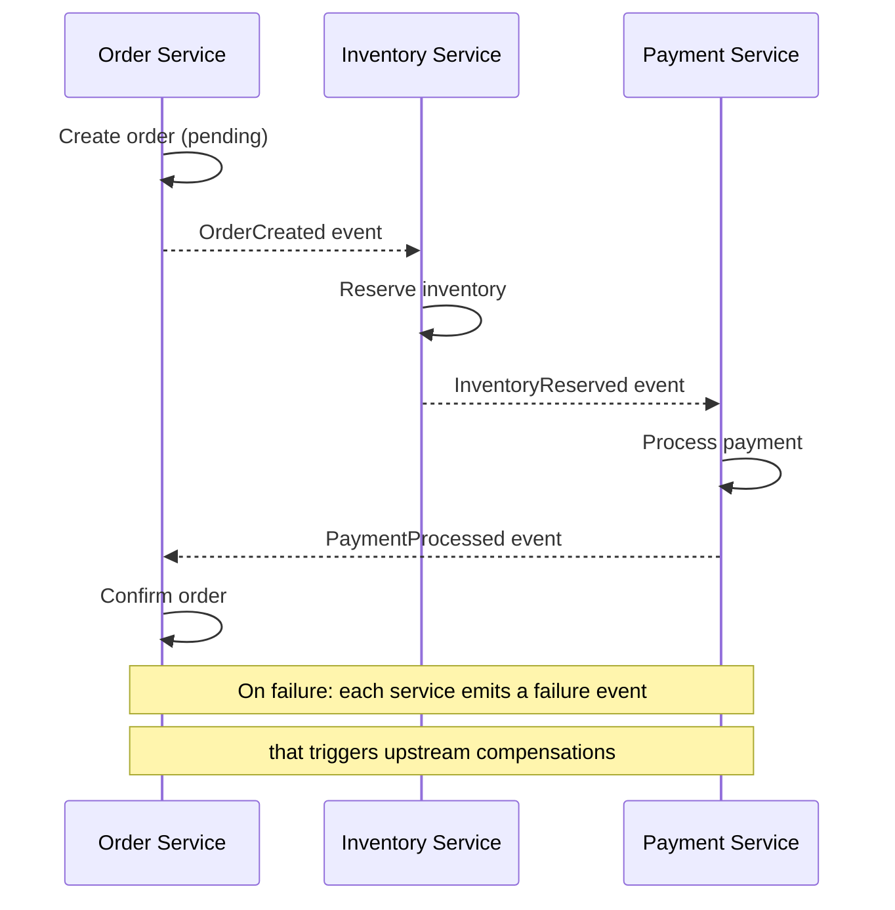
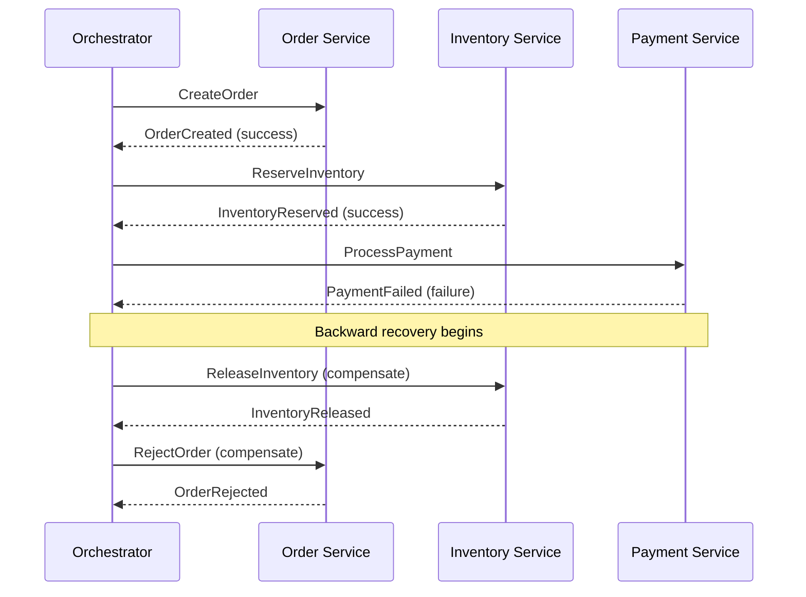
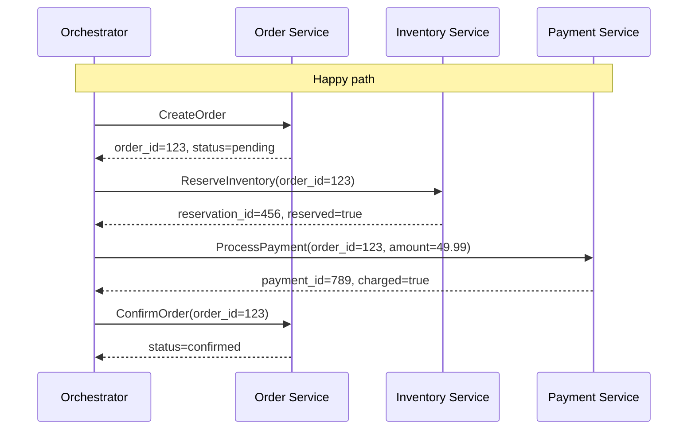
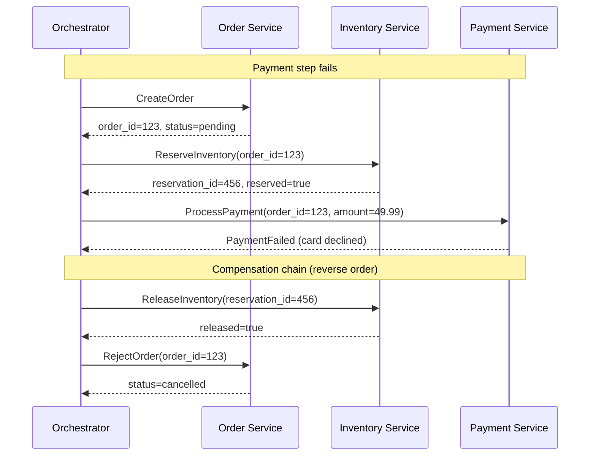

# [BEP-163] Saga Pattern

:::info
When a business workflow spans multiple services, you cannot use a single database transaction. The saga pattern breaks that workflow into a sequence of local transactions, each paired with a compensating action that undoes its effect if a later step fails. You get workflow-level consistency without cross-service locks.
:::

## Context

When a single service performs a business operation, ACID properties give you atomicity for free: either all the changes commit or none do. The moment an operation spans two or more independent services -- each with its own database -- that guarantee disappears. You cannot enlist multiple autonomous databases in a single transaction without 2PC, and 2PC brings blocking, lock retention, and coordinator-crash risk that make it unsuitable for most microservices workflows (see [BEP-162](./162.md)).

The saga pattern was first described by Hector Garcia-Molina and Kenneth Salem in their 1987 ACM SIGMOD paper ["Sagas"](https://dl.acm.org/doi/10.1145/38713.38742). The original problem was database long-lived transactions (LLTs): a single transaction that held locks for minutes or hours while it completed a complex business process. Garcia-Molina and Salem proposed breaking an LLT into a sequence of shorter transactions, each of which releases its locks immediately after committing. If the sequence must be aborted midway, compensating transactions undo the already-committed steps.

In the microservices context, Chris Richardson formalized the pattern on [microservices.io](https://microservices.io/patterns/data/saga.html) and in his book *Microservices Patterns*. Microsoft's Azure Architecture Center documents it as a first-class [cloud design pattern](https://learn.microsoft.com/en-us/azure/architecture/patterns/saga). The pattern has become the standard recommendation for long-running cross-service workflows.

## What a Saga Is

A saga is a sequence of local transactions where:

1. Each local transaction updates its own service's database and commits immediately.
2. Each step triggers the next step via an event or a command message.
3. Every local transaction has a corresponding **compensating transaction** that semantically undoes its effect.
4. If step N fails, the saga executes compensating transactions for steps N-1, N-2, ... 1 in reverse order.

The key distinction from a rollback: compensating transactions are new forward-moving transactions that reverse the business effect of a prior step. They do not undo changes at the database level -- the original transaction already committed. They apply new writes that bring the system back to a consistent business state.

**Saga guarantee:** The system reaches either the fully completed state (all steps succeeded) or the fully compensated state (all successfully completed steps have been reversed). There is no permanent partial-completion.

**What a saga does not provide:** Isolation. During execution, other transactions can observe intermediate states (e.g., an order that is `pending` while payment is being processed). This is acceptable for many business workflows but must be acknowledged explicitly.

## Choreography vs. Orchestration

There are two structural approaches to coordinating a saga.

### Choreography

Each service publishes events when its local transaction completes. Other services listen for those events and react by executing their own local transactions. There is no central coordinator -- the workflow emerges from the sequence of event emissions and reactions.



**Choreography characteristics:**
- No single point of failure for coordination
- Services are loosely coupled through events
- Workflow logic is distributed across services -- hard to see the full picture in one place
- Event chains become difficult to trace as the number of participants grows
- Testing requires simulating event sequences across multiple services

### Orchestration

A dedicated **saga orchestrator** sends command messages to participants telling them what to do. The orchestrator tracks state and decides what to do next, including which compensating transactions to invoke on failure.



**Orchestration characteristics:**
- The full workflow is visible and testable in one place (the orchestrator)
- Easier to add new participants without changing existing services
- The orchestrator is a central component that must be highly available
- Risk of the orchestrator becoming a "God object" that owns too much business logic
- Compensating transactions are explicitly commanded -- easier to reason about failure handling

**When to choose:**
- Small number of participants (2-3) with simple failure modes: choreography is fine
- Complex workflows, many participants, or workflows that require clear audit trails: prefer orchestration
- Workflows that need human approval or external system callbacks: orchestration handles these states more cleanly

## The Order Creation Saga: A Complete Example

An e-commerce order creation saga spans four services. The happy path:

1. **Order Service** -- Create order with `status=pending`
2. **Inventory Service** -- Reserve the items
3. **Payment Service** -- Charge the customer
4. **Order Service** -- Set order `status=confirmed`



Now the payment fails. The orchestrator triggers backward recovery:



The compensation chain mirrors the forward chain but runs in reverse, stopping at the step that failed (there is nothing to compensate for payment since it did not succeed).

### What each compensating transaction does

| Forward step | Compensating transaction | Semantic |
|---|---|---|
| CreateOrder → `pending` | RejectOrder → `cancelled` | Mark order as not proceeding |
| ReserveInventory | ReleaseInventory | Return reserved items to stock |
| ProcessPayment | RefundPayment | Issue a refund if charge succeeded |
| ConfirmOrder → `confirmed` | (none needed -- terminal step) | No compensation for final step |

Note that if payment succeeded but confirmation failed, `RefundPayment` would be needed. The compensating transaction set must cover every step that can be committed before a later failure.

## Compensating Transactions

Garcia-Molina's original paper called compensating transactions the semantic inverse of the forward transaction. This is different from a database rollback in several important ways:

**No lock retention:** The forward transaction already committed and released its locks. The compensating transaction is a new transaction that must acquire its own locks, observe current state, and write new data.

**Semantic, not physical, undo:** A payment charge cannot be "rolled back" at the database level -- the charge has been sent to the payment processor. The compensation is a refund, which is a new business operation with its own side effects (notification emails, fee implications, audit records).

**Must handle intermediate state changes:** Between the forward transaction and the compensation, other operations may have modified the same data. A compensating transaction must be written to handle this: check the current state, not the assumed prior state.

**Must be idempotent:** The saga coordinator may retry a compensating transaction if it fails or times out. The compensating transaction must produce the same result whether it runs once or multiple times. Using natural idempotency keys (e.g., `reservation_id`) and checking current state before applying changes achieves this. See [BEP-164](./164.md) for idempotency techniques.

## Saga Execution Coordinator

In an orchestration-based saga, the orchestrator is itself a stateful component. It must:

- Persist the current saga state to durable storage before sending each command (so it can resume after a crash)
- Track which steps have completed and which compensations have been executed
- Handle timeouts and retries for unresponsive participants
- Detect and handle the case where a compensating transaction also fails

Frameworks like [Eventuate Tram Sagas](https://eventuate.io/docs/javaspringeventsourcing/latest/getting-started-eventuate-tram-sagas.html), [Temporal](https://temporal.io/), and [AWS Step Functions](https://aws.amazon.com/step-functions/) implement this persistence and retry logic. Building a saga coordinator from scratch without a framework is possible but requires careful attention to exactly-once semantics for command delivery and compensation tracking.

## Failure Handling: Backward Recovery

The standard failure handling strategy for sagas is **backward recovery**: when a step fails, execute compensating transactions for all preceding steps in reverse order.

```
Steps completed before failure: T1, T2, T3
Step that failed: T4

Backward recovery executes: C3, C2, C1 (compensating transactions, reverse order)
```

Some saga designs also support **forward recovery**: if a step fails due to a transient error (network timeout, temporary unavailability), retry the step rather than compensating. Forward recovery requires that the step is idempotent (safe to retry). Orchestration-based sagas typically implement both: retry transient failures up to N times, then fall back to backward recovery.

**Pivot transactions** are a concept from the Microsoft pattern documentation: some steps in a saga are irreversible in practice (e.g., a payment that has already been processed by an external provider). These are pivot transactions. Once a pivot transaction commits, the saga is committed to completing forward -- compensation would require business-level reversal (refund), not a simple state reset.

## Semantic Locks

During saga execution, intermediate state is visible to other transactions. An order in `status=pending` is a real database row that other processes can read. This creates anomalies:

- A customer might try to cancel an order that is mid-saga
- A reporting query might count pending orders as a different business metric
- Two concurrent sagas might both try to reserve the same inventory

**Semantic locks** address this by marking records under active saga modification as "dirty" with an explicit status field. The `status=pending` on an order serves as a semantic lock: other code that reads this order knows it is in an intermediate saga state and should not assume it represents a confirmed business entity. Business logic must explicitly handle these transitional states: a cancellation request on a `pending` order might queue a cancel request rather than immediately cancelling.

Semantic locks are not enforced by the database -- they are a convention that must be honored in application code.

## Saga vs. 2PC: Trade-offs

| Dimension | 2PC | Saga |
|---|---|---|
| Consistency model | Strong (atomic across services) | Eventual (intermediate states visible) |
| Lock retention | Held across phases (minutes in failure cases) | Released after each local transaction |
| Availability impact | Coordinator crash blocks all participants | No cross-service blocking |
| Failure handling | Automatic rollback | Explicit compensating transactions |
| Implementation complexity | Protocol complexity in coordinator | Compensation logic per step |
| Cross-service applicability | Requires XA-capable participants | Works over HTTP/events |
| Long-running workflows | Impractical (lock window too long) | Designed for long-running workflows |

The key rule: **use a database transaction when all the data you need to change atomically lives in one database. Use a saga when the workflow spans multiple services.** Do not use 2PC across independently deployed microservices unless you have XA-capable drivers and very short lock windows.

## When to Use Sagas

Sagas are the right tool when:

- A business workflow touches data owned by two or more independent services
- The workflow involves long-running steps (seconds to minutes) where holding database locks is impractical
- Eventual consistency is acceptable: the system can tolerate a brief window where intermediate states are visible
- Compensating actions exist for each step: every forward operation has a semantically meaningful undo

Sagas are the wrong tool when:

- All the data lives in one database -- use a database transaction instead
- Strong isolation is required -- if intermediate states must never be visible to other transactions, saga cannot provide this without additional concurrency control
- No meaningful compensation exists -- if a forward step cannot be undone at all, the saga design must be reconsidered (perhaps that step should be the last one, or the invariant requires a different approach)

## Common Mistakes

**1. No compensating transactions defined**

Implementing the happy path without defining compensating transactions leaves the saga with no recovery mechanism. When a step fails, the system is stuck in a partial state indefinitely. Every step that can commit before a potential failure must have a compensating transaction, defined and tested before the saga goes to production.

**2. Compensating transactions that are not idempotent**

The saga coordinator will retry compensating transactions on failure. A compensating transaction that refunds a payment twice, or releases inventory twice, causes data corruption. Every compensating transaction must be safe to call multiple times with the same input. Use idempotency keys (the original reservation ID, the original transaction ID) and check current state before applying changes.

**3. Choreography with too many participants**

With three or four services, choreography is manageable. With seven or eight, tracing a single workflow across eight event publishers and consumers becomes extremely difficult. Debugging requires correlating events across multiple service logs by a saga correlation ID. At this scale, the lack of a central coordinator -- choreography's main advantage -- becomes a serious operational liability. Prefer orchestration once the number of participants exceeds four or five.

**4. Not handling compensation failures**

What happens when a compensating transaction fails? The compensation of the compensation? In practice, this means the system is stuck: the forward transaction committed, the backward compensation failed, and there is no automatic path forward. Production sagas must have: retry logic for transient compensation failures, a dead-letter queue or alert for persistently failing compensations, and an operational playbook for human intervention. Ignoring this is the leading cause of permanent data inconsistency in saga-based systems.

**5. Using a saga for operations that need strong consistency**

If the business rule requires that a payment and an inventory reservation are either both visible or neither visible with no intermediate states observable, a saga cannot satisfy this. Sagas provide eventual consistency with visible intermediate states. If the invariant truly cannot tolerate intermediate states, reconsider whether the data should be in a single database, or whether the consistency requirement is actually weaker than it appears under analysis.

**6. Forgetting that compensating transactions observe new state**

A compensating transaction runs after other transactions have committed. It must read current state and act on that, not assume the state is exactly what the forward transaction left. An inventory release that assumes `reserved=true` without checking will fail if another process already released or modified the reservation.

## Principle

When a business workflow spans multiple services, use a saga: a sequence of local transactions where each step commits immediately and every step has a corresponding compensating transaction that semantically reverses its effect. Use orchestration when the workflow is complex or has many participants; choreography for simple, low-participant flows. Define and test compensating transactions before going to production. Make all compensating transactions idempotent. Accept that intermediate states are visible and design application logic to handle saga-in-progress states explicitly. Do not use sagas as a substitute for a database transaction when all the data involved lives in one place.

## Related BEPs

- [BEP-160: ACID Properties](./160.md) -- why single-database transactions are the preferred baseline
- [BEP-162: Distributed Transactions and Two-Phase Commit](./162.md) -- what sagas replace and why
- [BEP-164: Idempotency and Exactly-Once Semantics](./164.md) -- making saga steps and compensations safe to retry
- [BEP-220: Messaging Patterns for Microservices](./220.md) -- event infrastructure for choreography-based sagas

## References

- Hector Garcia-Molina and Kenneth Salem, ["Sagas"](https://dl.acm.org/doi/10.1145/38713.38742), ACM SIGMOD 1987
- Chris Richardson, ["Pattern: Saga"](https://microservices.io/patterns/data/saga.html), microservices.io
- Microsoft Azure Architecture Center, ["Saga Design Pattern"](https://learn.microsoft.com/en-us/azure/architecture/patterns/saga)
- Microsoft Azure Architecture Center, ["Compensating Transaction Pattern"](https://learn.microsoft.com/en-us/azure/architecture/patterns/compensating-transaction)
- Chris Richardson, *Microservices Patterns*, Manning, 2018, Chapter 4
