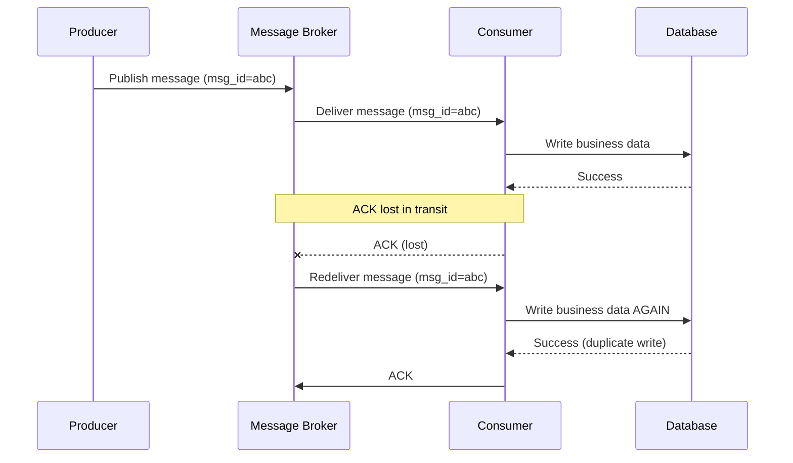
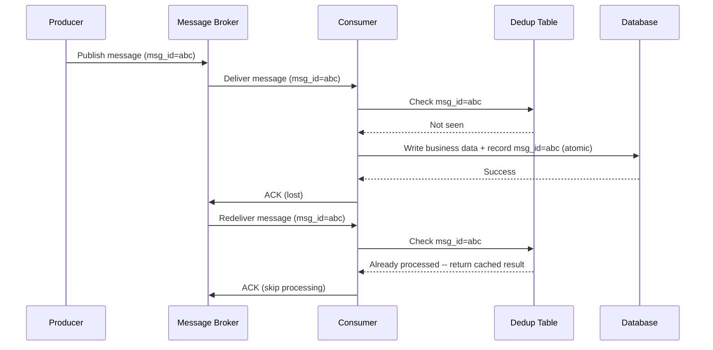
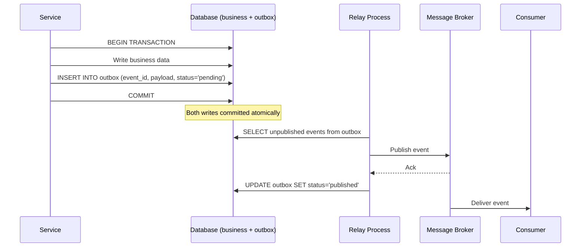

# [BEE-164] Idempotency and Exactly-Once Semantics

:::info
In distributed systems, network failures force retries, and retries produce duplicate messages. The only durable solution is making every operation idempotent: applying it multiple times must produce the same result as applying it once. "Exactly-once" processing is achieved not by eliminating duplicates in transit, but by combining at-least-once delivery with idempotent consumers.
:::

## Context

In a single-process system, a function call either succeeds or fails. There is no ambiguity. In a distributed system, a third outcome is always possible: the caller does not know whether the operation succeeded. The network call timed out -- did the server receive the request before the timeout? Did it process the request but fail to send the response? Did it not receive the request at all?

The safe answer to this uncertainty is to retry. But retrying a non-idempotent operation causes the operation to execute twice, which can produce incorrect results -- a customer charged twice, an order placed twice, an inventory count decremented twice.

This is not an edge case. Network timeouts, connection resets, broker restarts, and consumer crashes are normal events in any production distributed system. A system that cannot handle them correctly will produce incorrect data under normal operating conditions.

## What Idempotency Means

An operation is **idempotent** if applying it multiple times with the same inputs produces the same result as applying it once. The formal definition comes from mathematics: an operation `f` is idempotent if `f(f(x)) = f(x)` for all `x`.

In HTTP terms, `PUT` and `DELETE` are defined as idempotent. `GET` is both safe and idempotent. `POST` is neither. These are specifications -- the implementation must uphold them.

Idempotency applies at the business operation level, not just the HTTP method level. A `POST /payments` endpoint that creates a payment can be made idempotent by accepting an **idempotency key**: if the same key is submitted twice, the server returns the cached result of the first request instead of creating a second payment.

**Idempotent vs. safe:** These are distinct properties. A safe operation has no side effects (read-only). An idempotent operation can have side effects, but those effects are the same whether it runs once or many times. `DELETE /items/42` is idempotent (deleting an already-deleted item still leaves it deleted) but not safe (the first call does delete something). All safe operations are idempotent; not all idempotent operations are safe.

## Delivery Guarantees

Message brokers and RPC systems offer three delivery guarantees, each with a different failure profile:

| Guarantee | What it means | Risk |
|---|---|---|
| At-most-once | The message is delivered zero or one times | Data loss on failure |
| At-least-once | The message is delivered one or more times | Duplicates on retry |
| Exactly-once | The message is processed exactly once | No data loss, no duplicates |

**At-most-once** is easy to implement: fire and forget, never retry. The cost is that messages can be lost when the consumer or broker crashes. Acceptable only when losing individual events does not matter (e.g., telemetry where missing a few data points is tolerable).

**At-least-once** is the standard choice for most systems: the broker retains the message until the consumer acknowledges it. If the acknowledgment is lost, the broker redelivers. This guarantees no message is lost, but the consumer may see the same message more than once.

**Exactly-once** sounds ideal but is the hardest guarantee to provide. True exactly-once delivery requires coordination between producer, broker, and consumer that is expensive and fragile. The practical approach is: **at-least-once delivery + idempotent consumers = effectively-once processing**. The message may be delivered more than once, but the consumer's processing has no additional effect after the first.

## The Duplicate Delivery Problem

The following sequence shows how duplicates occur in a normal at-least-once system:



Without idempotency, the consumer processes the message twice and writes duplicate data.

With an idempotent consumer using a deduplication table:



The second delivery is detected and skipped. The business data is written exactly once.

## Deduplication Strategies

### Idempotency Keys

An **idempotency key** is a unique identifier attached to an operation by the caller. The server stores the key alongside the result. On subsequent requests with the same key, the server returns the stored result without re-executing the operation.

```
POST /payments
Idempotency-Key: pay_req_7f3a9b2c

{
  "amount": 49.99,
  "currency": "USD",
  "customer_id": "cust_123"
}
```

The server's behavior:
1. Check the deduplication table for `pay_req_7f3a9b2c`.
2. If not found: execute the payment, store `(pay_req_7f3a9b2c, result, expires_at)`, return the result.
3. If found and still valid: return the stored result without charging again.

The idempotency key must be generated by the **caller** before the request is sent, using a UUID or similar high-entropy value. Do not use the resource ID returned by the server -- that is only available after a successful first call.

### Natural Idempotency

Some operations are naturally idempotent without requiring explicit deduplication. Examples:

- `SET account_balance = 100.00 WHERE account_id = 42` -- setting a value is idempotent
- `INSERT ... ON CONFLICT DO NOTHING` -- upsert patterns tolerate re-execution
- `DELETE FROM reservations WHERE reservation_id = 456` -- deleting an already-deleted row is a no-op

Natural idempotency is the most robust approach when available. It requires no deduplication table, no key management, and no expiry logic. Design data models to support it where possible.

### Deduplication Table

A **deduplication table** (also called an inbox or processed-messages table) records the IDs of all messages or requests that have been processed. Before processing, the consumer checks the table. After processing, the consumer writes to the table atomically with the business write.

```sql
-- Deduplication table schema
CREATE TABLE processed_messages (
    message_id   VARCHAR(128) PRIMARY KEY,
    processed_at TIMESTAMP NOT NULL DEFAULT NOW(),
    result       JSONB,        -- cached response for idempotent APIs
    expires_at   TIMESTAMP NOT NULL
);

CREATE INDEX ON processed_messages (expires_at);
```

**Critical requirement:** The deduplication check and the business write must be **atomic**. If they are separate operations:

```
-- WRONG: race condition between check and act
1. Check: message_id not found
2. (another process also checks: not found)
3. Write business data
4. (other process also writes business data -- duplicate)
5. Insert message_id
```

The correct approach wraps both in a single database transaction:

```sql
BEGIN;
  -- Try to insert the deduplication record
  INSERT INTO processed_messages (message_id, expires_at)
  VALUES ('msg_abc', NOW() + INTERVAL '24 hours')
  ON CONFLICT (message_id) DO NOTHING;

  -- Check if the insert actually happened
  -- (affected rows = 0 means it was a duplicate)
  IF affected_rows > 0 THEN
    -- Execute business logic here
    UPDATE accounts SET balance = balance - 49.99 WHERE id = 42;
  END IF;
COMMIT;
```

The `ON CONFLICT DO NOTHING` combined with checking affected rows implements check-then-act atomically within one transaction, eliminating the race condition.

**TTL on deduplication entries is mandatory.** Without expiry, the deduplication table grows without bound and eventually becomes a performance bottleneck or runs out of disk space. Set TTL based on the maximum expected time window for retries: typically 24 hours to 7 days for API idempotency keys, shorter for message broker deduplication.

## The Outbox Pattern

A common reliability problem: you need to both update your database and publish an event to a message broker. Doing them as two separate operations creates a dual-write problem:

```
1. Update database -- success
2. Publish to message broker -- CRASH

Result: database updated, event never published
```

Or in the other order:

```
1. Publish to message broker -- success
2. Update database -- CRASH

Result: event published, database not updated
```

The **transactional outbox pattern** solves this by treating event publishing as a database write. Instead of publishing to the broker directly, the service writes the event to an `outbox` table in the same database transaction as the business data change. A separate relay process reads undelivered events from the outbox and publishes them to the broker.



The relay provides **at-least-once** delivery: if it crashes after publishing but before marking the event as published, it will republish on restart. Consumers must therefore be idempotent.

The relay can be implemented via polling (simpler, small delay) or CDC (Change Data Capture) using tools like Debezium that tail the database transaction log, which provides near-real-time publishing without polling overhead.

**Outbox pattern guarantees:**
- The event is published if and only if the business transaction commits (no dual-write problem)
- The event will eventually be published even if the broker is temporarily unavailable (relay retries)
- The event may be published more than once (at-least-once), so consumers must be idempotent

## Kafka Exactly-Once Semantics

Kafka provides exactly-once semantics through two mechanisms that work together:

### Idempotent Producer

Enabled with `enable.idempotence=true`. Each producer is assigned a unique producer ID (PID). Each message batch is assigned a monotonically increasing sequence number. The broker uses the (PID, sequence number) pair to detect and discard duplicate batches that arise from producer retries after a network failure or broker restart.

This gives exactly-once guarantees **within a single partition** for a single producer session.

### Transactions

Kafka transactions allow atomically writing to multiple partitions and committing consumer offsets. This enables exactly-once processing in consume-transform-produce pipelines:

```
consumer.poll() → process → producer.send() → consumer.commitSync()
```

All three steps are wrapped in a transaction. Either all complete or none do.

```java
producer.initTransactions();
try {
    producer.beginTransaction();
    ConsumerRecords<String, String> records = consumer.poll(Duration.ofMillis(100));
    for (ConsumerRecord<String, String> record : records) {
        // process record
        producer.send(new ProducerRecord<>("output-topic", transformedValue));
    }
    // Commit offsets as part of the transaction
    producer.sendOffsetsToTransaction(currentOffsets, consumer.groupMetadata());
    producer.commitTransaction();
} catch (Exception e) {
    producer.abortTransaction();
}
```

### Limitations of Kafka EOS

Kafka's exactly-once semantics apply **within the Kafka ecosystem** (broker-to-broker, consumer offset commits). They do not extend to external systems:

- Writing to a database as part of Kafka processing is not covered by Kafka transactions
- Sending an email or calling a third-party API is not transactional with Kafka

For external system integration, Kafka EOS must be combined with the idempotent consumer pattern and deduplication table. See the [Confluent blog post](https://www.confluent.io/blog/exactly-once-semantics-are-possible-heres-how-apache-kafka-does-it/) for the full treatment of Kafka's EOS implementation.

## Payment Processing: A Complete Example

A payment service receives payment requests via a message queue.

**Without idempotency:**

```
1. Message "charge customer X $49.99, request_id=req_001" delivered
2. Consumer charges customer X $49.99 via payment processor
3. Consumer crashes before committing offset
4. Message redelivered
5. Consumer charges customer X $49.99 AGAIN
6. Customer charged twice
```

**With idempotency key and deduplication table:**

```sql
-- When message "request_id=req_001" arrives:
BEGIN;

INSERT INTO processed_requests (request_id, expires_at)
VALUES ('req_001', NOW() + INTERVAL '24 hours')
ON CONFLICT (request_id) DO NOTHING;

-- First delivery: 1 row affected, proceed
-- Subsequent deliveries: 0 rows affected, skip

IF rows_affected = 1 THEN
    -- Call payment processor with request_id as idempotency key
    -- (payment processor also deduplicates on its side)
    charge = payment_processor.charge(
        customer_id = 'cust_X',
        amount = 49.99,
        idempotency_key = 'req_001'  -- propagate the key downstream
    );
    INSERT INTO charges (charge_id, customer_id, amount, request_id)
    VALUES (charge.id, 'cust_X', 49.99, 'req_001');
END IF;

COMMIT;
-- ACK message to broker
```

The idempotency key is propagated to the payment processor, which also deduplicates. Even if the consumer crashes between charging and committing the offset, the redelivered message skips the business logic because `req_001` is already in `processed_requests`, and the payment processor would also reject a duplicate charge with the same idempotency key.

## Common Mistakes

**1. Assuming the network is reliable**

No retry logic means no defense against duplicates -- but it also means data loss on any transient failure. Both problems require idempotency. Retries are not optional in production distributed systems.

**2. Idempotency key at the wrong layer**

An idempotency key on the HTTP request header protects the API gateway layer. If the payment processor internally generates a new transaction ID for each call, the downstream charge is not idempotent even if the API call is. Propagate idempotency keys through every layer of the call chain that has side effects.

**3. Deduplication table without TTL**

A deduplication table with no expiry is a slow-moving time bomb. At 10,000 messages per day, it grows by 3.6 million rows per year. Query performance degrades. Backups grow. Storage costs increase. Always define `expires_at` and run a periodic cleanup job.

**4. Check-then-act without atomicity**

Checking the deduplication table in one statement and writing business data in another, with no surrounding transaction, creates a race condition between concurrent consumers processing the same message. The check and the write must be atomic. Use a database transaction or a unique constraint that prevents the second write from succeeding.

**5. Confusing idempotent with safe**

`DELETE /resources/42` is idempotent (calling it twice has the same observable state as calling it once) but not safe (the first call does destroy something). Safe means no side effects; idempotent means repeatable side effects. Do not document `DELETE` as "safe to call" -- it is not. Do not assume an idempotent operation has no consequences on first call.

**6. Relying solely on Kafka EOS for end-to-end guarantees**

Kafka's exactly-once applies within Kafka. Once processing involves a database write, an outbound HTTP call, or any other external system, Kafka's transaction boundary does not cover it. Always combine Kafka EOS with an idempotent consumer pattern for any pipeline that writes outside Kafka.

## Principle

Design every operation that has side effects to be idempotent. In distributed systems, retries are unavoidable, and retries of non-idempotent operations produce incorrect data. Use idempotency keys for API calls, deduplication tables with TTL for message consumers, and natural idempotency (upserts, set-based writes) where the data model allows. Implement check-then-act atomically within a single database transaction. Use the transactional outbox pattern to eliminate dual-write problems when publishing events. Accept that exactly-once delivery is effectively-once processing: combine at-least-once delivery with idempotent consumers. Propagate idempotency keys through every layer of a call chain that has external side effects.

## Related BEPs

- [BEE-72: API Idempotency](../API%20Design/72.md) -- idempotency keys in HTTP API design
- [BEE-163: Saga Pattern](./163.md) -- saga compensating transactions must be idempotent
- [BEE-222: Delivery Guarantees](./222.md) -- at-most-once, at-least-once, exactly-once in messaging systems
- [BEE-226: Idempotent Message Processing](./226.md) -- patterns for idempotent consumers in event-driven systems

## References

- Jay Kreps, Neha Narkhede, Jun Rao, ["Kafka: a Distributed Messaging System for Log Processing"](https://dl.acm.org/doi/10.1145/2187836.2187852), LinkedIn / ACM 2011
- Confluent Engineering, ["Exactly-once Semantics is Possible: Here's How Apache Kafka Does It"](https://www.confluent.io/blog/exactly-once-semantics-are-possible-heres-how-apache-kafka-does-it/)
- Chris Richardson, ["Pattern: Transactional Outbox"](https://microservices.io/patterns/data/transactional-outbox.html), microservices.io
- Oskar Dudycz, ["Outbox, Inbox Patterns and Delivery Guarantees Explained"](https://event-driven.io/en/outbox_inbox_patterns_and_delivery_guarantees_explained/), event-driven.io
- Pradeep Loganathan, ["Idempotent Consumer Pattern"](https://pradeepl.com/blog/patterns/idempotent-consumer-pattern/)
- Strimzi, ["Exactly-once Semantics with Kafka Transactions"](https://strimzi.io/blog/2023/05/03/kafka-transactions/)
