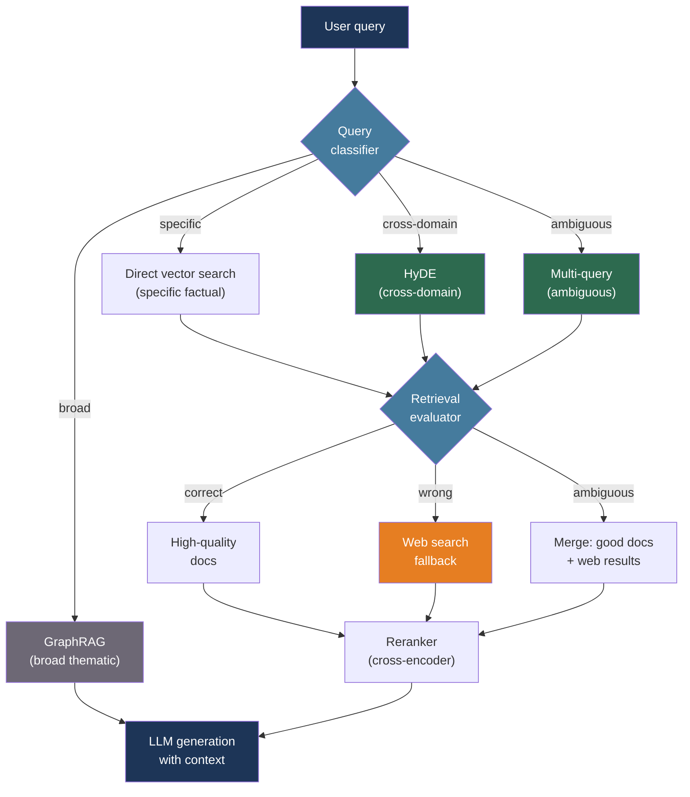

# [BEE-30029] Advanced RAG and Agentic Retrieval Patterns

:::info
Standard RAG — embed the query, retrieve top-k, generate — fails when the query is underspecified, the retrieved documents are irrelevant, or the answer requires synthesizing information across many documents; advanced retrieval patterns address each failure mode with targeted interventions at the query, retrieval, and indexing layers.
:::

## Context

Basic RAG (BEE-30007) establishes a pipeline: chunk documents, embed them, store in a vector database, embed the query, retrieve top-k by cosine similarity, inject into context, generate. This pipeline works well for narrow factual lookup over well-structured corpora. It degrades in four identifiable ways.

First, the semantic gap between a user query and a relevant document. A user asks "why does my Python script hang?" but the relevant documentation describes "thread deadlock in CPython's GIL." The query vector and the document vector are not close in embedding space. Gao et al. (arXiv:2212.10496, ACL 2023) introduced HyDE — Hypothetical Document Embeddings — to bridge this gap: generate a hypothetical document that would answer the query, embed that document, and retrieve using the hypothetical document's vector instead of the query's.

Second, query underspecification. A vague query returns vague results. Multi-query retrieval addresses this by generating multiple reformulations of the same query and unioning the retrieved sets, improving recall without changing the index.

Third, irrelevant retrieved documents silently polluting the context. Yan et al. (arXiv:2401.15884, 2024) formalized this as the Corrective RAG (CRAG) problem: a lightweight evaluator scores retrieved document relevance and, when the score falls below a threshold, triggers a web search fallback rather than passing bad documents to the generator.

Fourth, flat indexing cannot answer questions that require synthesizing across many documents or understanding at different levels of abstraction. Sarthi et al. (arXiv:2401.18059, ICLR 2024) addressed this with RAPTOR — a recursive tree of cluster summaries that enables retrieval at any level of abstraction. Microsoft's GraphRAG (Edge et al., arXiv:2404.16130, 2024) went further: extract entities and relationships to build a knowledge graph, detect communities, summarize communities hierarchically, and answer broad thematic queries using community-level summaries.

## Design Thinking

Advanced retrieval patterns compose. A production system often applies several in sequence:

1. **Query transformation** (HyDE, multi-query, step-back) — improve what gets retrieved
2. **Retrieval** — the core vector/keyword/hybrid search (BEE-30015)
3. **Retrieval evaluation and correction** (CRAG) — verify what was retrieved is relevant
4. **Reranking** (BEE-30015) — reorder retrieved documents by a cross-encoder
5. **Generation** — inject verified, ranked context into the LLM

Each layer adds latency and cost. The question is which layers to invest in based on the dominant failure mode. Profile retrieval quality first — measure recall@k and MRR on a golden query set — before adding complexity.

## Best Practices

### Apply HyDE When Queries and Documents Are Phrased Differently

**SHOULD** use HyDE for factual question-answering workloads where user queries are phrased in natural language but documents are written in technical or domain-specific language. The core insight is that a hypothetical answer is closer in embedding space to real answers than the question is:

```python
from openai import OpenAI
import numpy as np

client = OpenAI()

def hyde_retrieve(query: str, vector_db, k: int = 5) -> list:
    """
    Step 1: Generate a hypothetical document that would answer the query.
    Step 2: Embed the hypothetical document (not the query).
    Step 3: Retrieve using the hypothetical document's embedding.
    """
    # Step 1: Generate a concise hypothetical answer
    hypothetical = client.chat.completions.create(
        model="gpt-4o-mini",
        messages=[{
            "role": "user",
            "content": (
                f"Write a short passage that would directly answer this question. "
                f"Be factual and concise. Do not say you don't know.\n\n"
                f"Question: {query}"
            ),
        }],
        max_tokens=200,
        temperature=0,
    ).choices[0].message.content

    # Step 2: Embed the hypothetical document, not the query
    embedding = client.embeddings.create(
        model="text-embedding-3-small",
        input=hypothetical,
    ).data[0].embedding

    # Step 3: Retrieve against the corpus using the hypothetical vector
    return vector_db.search(embedding, k=k)
```

**MUST NOT** use HyDE when the query is already in the same domain language as the documents (e.g., querying a code search index with a code snippet). HyDE adds an LLM call; if the embedding gap is small, the latency overhead is not justified.

### Use Multi-Query Retrieval for Underspecified Queries

**SHOULD** generate multiple reformulations of the user query and union the retrieved sets when the query is short, ambiguous, or likely to be expressed differently in source documents:

```python
from langchain.retrievers.multi_query import MultiQueryRetriever
from langchain_openai import ChatOpenAI

llm = ChatOpenAI(model="gpt-4o-mini", temperature=0)

# MultiQueryRetriever generates 3 alternative phrasings internally,
# retrieves for each, and returns the deduplicated union.
retriever = MultiQueryRetriever.from_llm(
    retriever=vector_db.as_retriever(search_kwargs={"k": 5}),
    llm=llm,
)

# Equivalent to: generate variants → retrieve k per variant → deduplicate → return
docs = retriever.invoke("How do I handle connection timeouts in Python?")
```

For custom control over the number of variants and logging:

```python
from langchain_core.prompts import PromptTemplate
from langchain_core.output_parsers import BaseOutputParser

QUERY_PROMPT = PromptTemplate(
    input_variables=["question"],
    template="""Generate 4 alternative phrasings of this search query. 
Return only the queries, one per line.

Original: {question}
Alternatives:""",
)

def multi_query_retrieve(query: str, retriever, n: int = 4) -> list:
    variants = llm.invoke(QUERY_PROMPT.format(question=query)).content.strip().splitlines()
    seen_ids = set()
    all_docs = []
    for variant in [query] + variants[:n]:
        for doc in retriever.invoke(variant.strip()):
            doc_id = doc.metadata.get("id", doc.page_content[:80])
            if doc_id not in seen_ids:
                seen_ids.add(doc_id)
                all_docs.append(doc)
    return all_docs
```

### Implement CRAG to Recover from Poor Retrieval

**SHOULD** add a retrieval evaluation step when the corpus may not contain an answer to every possible query. CRAG's three-action decision logic prevents irrelevant documents from silently polluting the generation context:

```python
def evaluate_retrieval(query: str, docs: list[str]) -> str:
    """
    Returns: "correct" | "ambiguous" | "wrong"
    Uses the LLM as a lightweight relevance judge.
    For production, a fine-tuned classifier is lower latency.
    """
    scores = []
    for doc in docs:
        judgment = llm.invoke(
            f"Is this passage relevant to answering the query?\n\n"
            f"Query: {query}\n\nPassage: {doc[:500]}\n\n"
            f"Answer with just: relevant / irrelevant"
        ).content.strip().lower()
        scores.append(1 if "relevant" in judgment else 0)

    ratio = sum(scores) / len(scores) if scores else 0
    if ratio >= 0.7:
        return "correct"
    elif ratio >= 0.3:
        return "ambiguous"
    return "wrong"

def crag_retrieve(query: str, vector_db, web_search_fn) -> list[str]:
    """
    CRAG retrieval: evaluate relevance, fall back to web search if needed.
    """
    docs = vector_db.search(query, k=5)
    doc_texts = [d.page_content for d in docs]
    action = evaluate_retrieval(query, doc_texts)

    if action == "correct":
        return doc_texts
    elif action == "wrong":
        # Fall back entirely to web search
        return web_search_fn(query)
    else:  # "ambiguous"
        # Combine high-quality retrieved docs with web search results
        good_docs = [doc_texts[i] for i, s in enumerate(scores) if s == 1]
        return good_docs + web_search_fn(query)
```

**SHOULD** cache the web search results (keyed on the query) to avoid redundant searches across multiple requests for the same question.

### Use RAPTOR for Long-Document Corpora with Multi-Level Questions

**SHOULD** build a RAPTOR tree index when the corpus consists of long documents (books, technical specifications, research papers) and users ask questions at varying levels of specificity — from specific facts to broad thematic questions:

```
RAPTOR tree construction (done once at index time):

Level 0 (leaves):  [chunk₁] [chunk₂] [chunk₃] ... [chunkN]
                        ↓ cluster by embedding similarity ↓
Level 1:        [summary of cluster A] [summary of cluster B] ...
                        ↓ cluster again ↓
Level 2:        [summary of {A,B}] [summary of {C,D}] ...
                        ↓
Level k:        [root summary of the entire corpus]
```

At query time, retrieve from the level that matches the query's abstraction:
- "What is the boiling point of ethanol?" → Level 0 (specific fact, leaf chunks)
- "What are the main themes of this document?" → Level 2+ (abstract summaries)

**MUST NOT** build RAPTOR for small corpora (< 100 documents) or for corpora where queries are always specific. The tree construction requires an LLM call per cluster summary at each level, making it expensive relative to the benefit for small or homogeneous corpora.

### Use GraphRAG for Sensemaking Over Entity-Rich Corpora

**SHOULD** use GraphRAG when the corpus has dense entity relationships (news archives, legal documents, product ecosystems) and users ask broad questions like "what are the main themes?" or "how are these entities related?":

GraphRAG build pipeline (offline):

```
Documents
   ↓  LLM entity + relationship extraction
Knowledge graph (entities as nodes, relationships as edges)
   ↓  Leiden community detection algorithm
Communities (densely connected subgraphs)
   ↓  LLM summarization per community
Community reports (hierarchical: leaf → intermediate → global)
```

Query time:
- **Local search**: Query specific entities and their neighborhoods → fast, targeted
- **Global search**: Query community summaries → comprehensive, broad

**MUST NOT** use GraphRAG for latency-sensitive applications without pre-caching community summaries. Global search requires reading and reasoning over potentially hundreds of community reports; it is a batch-friendly operation, not a sub-second interactive one. Precompute community-level answers to anticipated broad questions and serve them from cache.

### Route Queries to the Appropriate Retrieval Strategy

**SHOULD** add a lightweight query router when the system serves multiple query types that benefit from different retrieval strategies:

```python
from enum import Enum

class RetrievalStrategy(Enum):
    DIRECT = "direct"         # Standard vector search: specific factual queries
    HYDE = "hyde"             # HyDE: cross-domain or technical queries
    MULTI_QUERY = "multi"     # Multi-query: ambiguous or underspecified
    GRAPH = "graph"           # GraphRAG: broad thematic queries

def classify_query(query: str) -> RetrievalStrategy:
    """Use a cheap LLM call or heuristics to classify the query."""
    word_count = len(query.split())
    q_lower = query.lower()

    # Short, specific queries → direct retrieval
    if word_count <= 6 and any(q_lower.startswith(w) for w in ["what is", "what are", "when", "who"]):
        return RetrievalStrategy.DIRECT

    # Broad thematic questions → GraphRAG
    if any(kw in q_lower for kw in ["main themes", "overall", "broadly", "summarize", "overview"]):
        return RetrievalStrategy.GRAPH

    # Ambiguous or compound questions → multi-query
    if word_count >= 15 or " and " in q_lower or " or " in q_lower:
        return RetrievalStrategy.MULTI_QUERY

    return RetrievalStrategy.HYDE  # Default: cross-domain gap is common

def adaptive_retrieve(query: str, indexes: dict) -> list:
    strategy = classify_query(query)
    if strategy == RetrievalStrategy.HYDE:
        return hyde_retrieve(query, indexes["vector"])
    elif strategy == RetrievalStrategy.MULTI_QUERY:
        return multi_query_retrieve(query, indexes["vector"])
    elif strategy == RetrievalStrategy.GRAPH:
        return indexes["graph"].global_search(query)
    return indexes["vector"].search(query, k=5)
```

## Visual



## Complexity vs. Benefit

| Pattern | Index cost | Query latency added | Best for |
|---|---|---|---|
| HyDE | None | +1 LLM call (~200 ms) | Cross-domain factual QA |
| Multi-query | None | +N × retrieval (~100–300 ms) | Ambiguous / compound queries |
| CRAG | None | +LLM judge (~200 ms), web search if triggered | Robustness when corpus coverage is uncertain |
| RAPTOR | High (LLM per cluster) | Minimal (retrieval from tree) | Long documents, mixed abstraction queries |
| GraphRAG | Very high (entity extraction + community detection) | Local: low; Global: high (batch-friendly) | Broad sensemaking over entity-rich corpora |

## Related BEEs

- [BEE-30007](rag-pipeline-architecture.md) -- RAG Pipeline Architecture: the baseline retrieval pipeline that these advanced patterns extend
- [BEE-30015](retrieval-reranking-and-hybrid-search.md) -- Retrieval Reranking and Hybrid Search: the reranking step that sits downstream of all these retrieval strategies
- [BEE-30026](vector-database-architecture.md) -- Vector Database Architecture: the HNSW index and filtering configuration that the retrieval layer queries
- [BEE-30010](llm-context-window-management.md) -- LLM Context Window Management: RAPTOR and multi-query expand the retrieved context; context packing and truncation strategies become more important

## References

- [Gao et al. Precise Zero-Shot Dense Retrieval without Relevance Labels (HyDE) — arXiv:2212.10496, ACL 2023](https://arxiv.org/abs/2212.10496)
- [Asai et al. Self-RAG: Learning to Retrieve, Generate, and Critique through Self-Reflection — arXiv:2310.11511, ICLR 2024](https://arxiv.org/abs/2310.11511)
- [Yan et al. Corrective Retrieval Augmented Generation (CRAG) — arXiv:2401.15884, 2024](https://arxiv.org/abs/2401.15884)
- [Sarthi et al. RAPTOR: Recursive Abstractive Processing for Tree-Organized Retrieval — arXiv:2401.18059, ICLR 2024](https://arxiv.org/abs/2401.18059)
- [Edge et al. From Local to Global: A Graph RAG Approach to Query-Focused Summarization — arXiv:2404.16130, 2024](https://arxiv.org/abs/2404.16130)
- [Microsoft GraphRAG — github.com/microsoft/graphrag](https://github.com/microsoft/graphrag)
- [LangChain. MultiQueryRetriever — python.langchain.com](https://python.langchain.com/docs/how_to/MultiQueryRetriever/)
