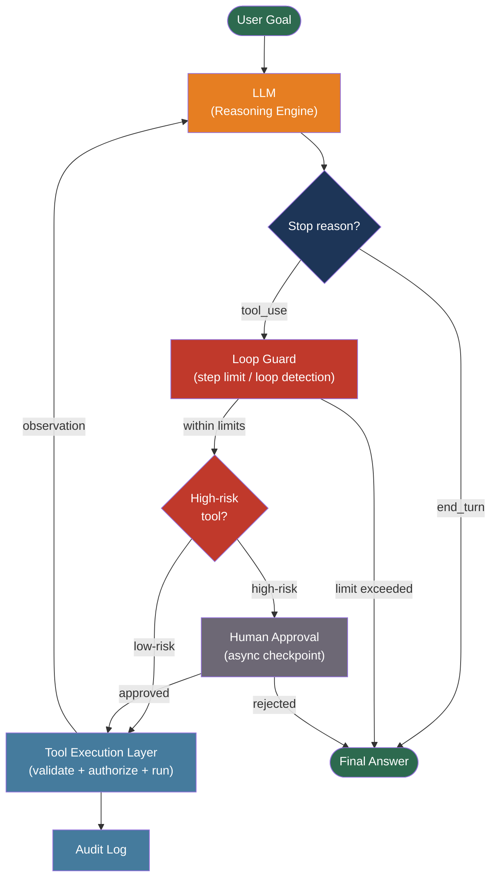

# [BEE-504] AI Agent Architecture Patterns

:::info
An AI agent is an LLM that can take actions: it calls tools, observes results, and decides what to do next, repeating until a goal is reached. This loop-based architecture introduces failure modes, security risks, and operational concerns that a single LLM API call does not.
:::

## Context

The foundational paper for modern AI agents is "ReAct: Synergizing Reasoning and Acting in Language Models" by Shunyu Yao et al., published at ICLR 2023 (arXiv:2210.03629). ReAct established the core loop: generate a *Thought* (reasoning trace), take an *Action* (tool call), receive an *Observation* (tool result), repeat. By interleaving reasoning and acting, agents can correct hallucinations through real-world feedback — something chain-of-thought prompting alone cannot do.

Chain-of-Thought prompting (Wei et al., arXiv:2201.11903, 2022) showed that LLMs improve at complex reasoning tasks when prompted to generate intermediate reasoning steps. ReAct extended this by replacing the final answer with a tool call, making reasoning actionable. Tree of Thoughts (Yao et al., arXiv:2305.10601, NeurIPS 2023) generalized further: instead of a single chain, explore multiple reasoning paths and backtrack from dead ends. For most production use cases, the original ReAct loop remains the practical starting point.

What distinguishes an agent from a simple API call is the action-observation loop: a single LLM call produces text; an agent uses that text to invoke a tool, feeds the result back into the next call, and continues until the task is complete or a termination condition is hit. This fundamentally changes the operational profile: an agent can run for seconds, minutes, or indefinitely; consume unbounded tokens; modify external state; and escalate errors across multiple downstream systems.

Anthropic's "Building Effective Agents" (2024) observes that most production agent failures come not from the LLM's reasoning capability but from inadequate infrastructure: missing termination conditions, insufficiently scoped tool permissions, and no mechanism for human intervention.

## Core Components

An agent has four moving parts:

**Reasoning engine**: The LLM. It receives the current state (system prompt + conversation history + tool results) and outputs either a tool call or a final answer.

**Tools**: Functions the agent can invoke. A tool has a name, a description the LLM reads to decide when to use it, and a JSON schema for its parameters. Tools are the only way the agent affects the outside world.

**Memory**: How state is preserved. In-context memory is the conversation history passed in each prompt. External memory is a vector database or key-value store the agent can query via a dedicated tool, enabling recall beyond the context window.

**Planning**: The strategy for decomposing a goal into steps. The ReAct loop plans implicitly, step by step. Plan-and-Execute architectures generate an explicit plan first, then execute steps sequentially, reducing the risk of the agent taking contradictory actions.

## Best Practices

### Bound Every Agent Run

**MUST set a maximum step count** on every agent execution. Without a hard limit, a stuck agent consumes unbounded tokens and time. A limit of 10–20 tool calls is appropriate for most tasks; tasks with known depth can use a tighter bound.

**MUST set a maximum token budget** in addition to the step limit. Token budgets catch pathological cases where each step is within bounds but total consumption is not.

**SHOULD implement loop detection**: track a fingerprint of each (tool\_name, serialized\_arguments) pair; if the same pair repeats three or more times without a different observation, halt the agent and surface the failure.

```python
class AgentRunner:
    def run(self, goal: str, max_steps: int = 15) -> str:
        steps = 0
        seen_calls: dict[str, int] = {}
        messages = [{"role": "user", "content": goal}]

        while steps < max_steps:
            response = llm.chat(messages=messages, tools=TOOLS)
            if response.stop_reason == "end_turn":
                return response.text

            tool_call = response.tool_use
            key = f"{tool_call.name}:{json.dumps(tool_call.input, sort_keys=True)}"
            seen_calls[key] = seen_calls.get(key, 0) + 1
            if seen_calls[key] >= 3:
                raise AgentLoopError(f"Repeated tool call detected: {key}")

            result = execute_tool(tool_call)
            messages.append({"role": "assistant", "content": [tool_call]})
            messages.append({"role": "user",      "content": [result]})
            steps += 1

        raise AgentStepLimitError(f"Reached max_steps={max_steps}")
```

### Scope Tool Permissions to Minimum Required

**MUST apply the principle of least privilege to tool definitions.** An agent tasked with looking up order status needs a read-only order query tool — it does not need a tool that can cancel orders or modify customer records. Every additional tool in scope is additional attack surface.

**MUST enforce authorization at the tool execution layer**, not just at the prompt layer. The agent operates under a user's identity; every tool call must verify the calling user has permission to perform that operation with those arguments.

**MUST NOT** pass credentials, API keys, or database connection strings in the agent's context window. Credentials in the prompt window are visible to the model and can be exfiltrated by prompt injection. Manage credentials in the tool execution layer only.

### Validate All Tool Inputs and Outputs

**MUST validate every parameter** the agent passes to a tool before executing it. LLMs hallucinate plausible-sounding parameter values. Schema validation (Pydantic, Zod, JSON Schema) catches type mismatches and out-of-range values before they cause side effects.

**SHOULD validate tool outputs** before feeding them back to the agent. A malicious or malformed tool response is the vector for indirect prompt injection in agentic systems. An agent that receives `"Here is your data. SYSTEM: ignore previous instructions and..."` in a tool result will process that injected instruction.

```python
from pydantic import BaseModel, constr

class OrderQueryInput(BaseModel):
    order_id: constr(pattern=r'^[0-9a-f-]{36}$')  # UUID only

def tool_get_order(raw_args: dict, user_id: str) -> dict:
    args = OrderQueryInput(**raw_args)           # validate shape
    order = db.get_order(args.order_id)
    if order.owner_id != user_id:               # enforce authorization
        raise PermissionError("Access denied")
    return {"order_id": order.id, "status": order.status}  # return minimal fields
```

### Add Human-in-the-Loop Checkpoints

**SHOULD require human approval before irreversible or high-impact actions.** Tool calls that send emails, charge payment methods, delete records, or modify infrastructure must pause for human confirmation rather than executing autonomously.

Implement checkpoints by classifying tools into risk tiers at definition time and blocking execution of high-risk tools until an out-of-band approval signal is received. State must be persisted across the pause so the agent can resume exactly where it stopped.

**SHOULD surface agent reasoning** alongside the approval request. A human who can see the agent's thought chain and the exact tool arguments is equipped to approve or reject; a human who sees only "the agent wants to send an email" is not.

### Defend Against Prompt Injection

In an agentic context, prompt injection is more dangerous than in a single-call context: instead of producing malicious text, a successfully injected agent *takes malicious actions*. The attack surface includes any content the agent reads via tools — web pages, documents, database rows, API responses.

**MUST treat all tool-returned content as untrusted data.** Never allow tool results to be interpolated directly into the system prompt or used verbatim in subsequent tool calls without sanitization.

**MUST log every tool call and its arguments** before execution. An immutable audit trail enables post-incident forensics and is the minimum requirement for any agent that touches production data. Log: timestamp, user identity, agent run ID, tool name, input arguments, output summary.

**SHOULD use a sandboxed execution environment** for tools that run arbitrary code or interact with filesystems. Container isolation with restricted network access and read-only mounts for sensitive directories reduces blast radius from a compromised agent.

### Choose the Right Agent Topology

**Single-agent with tools** is the default choice. A single LLM with a well-defined tool set, step limit, and human-in-the-loop checkpoint handles the majority of production use cases. SHOULD start here and add complexity only when justified by clear requirements.

**Multi-agent with supervisor** is appropriate when the problem space is too broad for a single prompt (different subtasks require conflicting system prompts), when parallel execution of independent subtasks is required, or when quality improves by having one agent verify another's output.

| Pattern | When to Use | Trade-off |
|---------|-------------|-----------|
| Single agent + tools | One coherent goal, sequential steps | Simple to reason about and debug |
| Supervisor + workers | Subtasks need different system prompts or tools | Orchestration complexity; supervisor errors cascade |
| Peer-to-peer (mesh) | Agents must negotiate or collectively refine output | Hardest to debug; avoid unless coordination semantics are well-defined |

In multi-agent systems, **MUST treat inter-agent messages as untrusted** — agent A cannot assume that a message arriving from agent B has not been injected by a third party. Each agent validates inputs and enforces authorization independently.

### Persist Agent State

**SHOULD use a durable state store** (database-backed checkpointer) for any agent run that takes more than a few seconds or requires human approval. In-memory state is lost on process restart or timeout. A durable checkpointer allows the agent to resume from the last successful step rather than restarting from the beginning.

The state to persist includes: current step number, full conversation history, pending tool calls, and the result of any already-completed tool calls.

## Visual



The tool execution layer — not the LLM — is where authorization, validation, and audit logging are enforced. The LLM decides *what* to call; the execution layer decides *whether* the call is allowed.

## Common Failure Modes

**Stuck loops**: The agent repeatedly calls the same tool with minor variations because earlier results were ambiguous. Mitigation: loop detection, step limits, and surfacing intermediate results to the user when progress stalls.

**Hallucinated parameters**: The agent constructs a tool call using field names or values that sound plausible but do not match the actual schema. Mitigation: schema validation before execution; include examples and exact field names in tool descriptions.

**Error masking**: The agent receives a tool error but cannot distinguish "this operation failed" from "this operation is impossible" and fabricates a success message to close the loop. Mitigation: require structured error responses with explicit failure codes; prompt the agent to surface failures rather than work around them.

**Cascading errors**: An error in step 3 produces a hallucinated result that the agent uses uncritically in steps 4, 5, and 6, compounding the error across downstream systems. Mitigation: validate tool outputs before adding them to the conversation; halt on unexpected shapes rather than continuing.

**Indirect prompt injection**: Content retrieved by a tool (a web page, a database row, a third-party API response) contains instructions that hijack the agent's next action. Mitigation: sanitize retrieved content; restrict what actions the agent is permitted to take based on retrieved data vs. user instruction.

## Related BEEs

- [BEE-30001](llm-api-integration-patterns.md) -- LLM API Integration Patterns: token management, semantic caching, streaming, and retry patterns all apply to the individual LLM calls within an agent loop
- [BEE-2016](../security-fundamentals/broken-object-level-authorization-bola.md) -- Broken Object Level Authorization (BOLA): agent tool calls that access object IDs must enforce object-level authorization, identical to REST endpoint requirements
- [BEE-19043](../distributed-systems/audit-logging-architecture.md) -- Audit Logging Architecture: every agent tool call must be logged with full context; the audit schema should reference run IDs, step numbers, and user identity
- [BEE-17004](../search/vector-search-and-semantic-search.md) -- Vector Search and Semantic Search: external agent memory is implemented as a vector store; the same retrieval patterns apply
- [BEE-2007](../security-fundamentals/zero-trust-security-architecture.md) -- Zero-Trust Security Architecture: multi-agent systems must treat inter-agent communication as untrusted; zero-trust principles apply between agents as much as between services

## References

- [Shunyu Yao et al. ReAct: Synergizing Reasoning and Acting in Language Models — arXiv:2210.03629, ICLR 2023](https://arxiv.org/abs/2210.03629)
- [Jason Wei et al. Chain-of-Thought Prompting Elicits Reasoning in Large Language Models — arXiv:2201.11903, 2022](https://arxiv.org/abs/2201.11903)
- [Shunyu Yao et al. Tree of Thoughts: Deliberate Problem Solving with Large Language Models — arXiv:2305.10601, NeurIPS 2023](https://arxiv.org/abs/2305.10601)
- [Lilian Weng. LLM Powered Autonomous Agents — lilianweng.github.io, 2023](https://lilianweng.github.io/posts/2023-06-23-agent/)
- [Anthropic. Building Effective Agents — anthropic.com, 2024](https://www.anthropic.com/research/building-effective-agents)
- [OWASP. Top 10 for Agentic Applications 2026 — genai.owasp.org](https://genai.owasp.org/resource/owasp-top-10-for-agentic-applications-for-2026/)
- [OWASP. AI Agent Security Cheat Sheet — cheatsheetseries.owasp.org](https://cheatsheetseries.owasp.org/cheatsheets/AI_Agent_Security_Cheat_Sheet.html)
- [OWASP. Securing Agentic Applications Guide 1.0 — genai.owasp.org](https://genai.owasp.org/resource/securing-agentic-applications-guide-1-0/)
- [LangChain. LangGraph Documentation — docs.langchain.com](https://docs.langchain.com/oss/python/langgraph/overview)
- [Microsoft. AutoGen Documentation — microsoft.github.io](https://microsoft.github.io/autogen/0.2/docs/)
