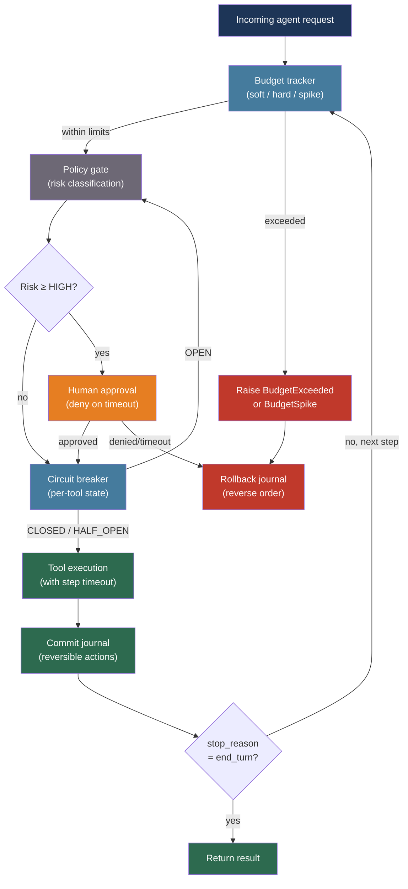

# [BEE-537] AI Agent Safety and Reliability Patterns

:::info
Production LLM agents fail at rates of 41–87% across real deployments, with failure modes spanning runaway token spend, cascading tool timeouts, coordination deadlocks, and irreversible side effects. Preventing them requires budget controls, layered timeouts, reversibility-first tool design, automated policy gates, and schema-validated inter-agent messaging.
:::

## Context

Wirfs-Brock et al. and the MAST taxonomy (arXiv:2503.13657, NeurIPS 2025) analyzed over 1,600 annotated traces across seven multi-agent system frameworks and found failure rates between 41% and 86.7% in production deployments. The 14 failure modes cluster into three categories: specification and system design failures (agents that disobey their own role description or loop without recognizing termination), inter-agent misalignment failures (agents that withhold information, reset conversation state, or ignore peer outputs), and task verification failures (premature termination or absent verification).

Unlike a stateless REST handler, an LLM agent accumulates cost with every iteration. A single unconstrained coding agent can consume $5–8 per task under normal conditions; a misconfigured loop consuming the same tool set can reach the same spend in minutes. Token-only budgets miss this risk — external tool API calls incur cost that does not appear in the model's token counter. Anthropic's framework for trustworthy agents formalizes the response: agents should maintain a minimal footprint, prefer reversible over irreversible actions, and err toward doing less when scope is ambiguous.

The engineering challenge is that these principles must be enforced mechanically, not trusted to the model's judgment. An agent in a runaway state cannot self-report. An approval gate that depends on the agent process to trigger it fails if that process is the source of the failure.

## Design Thinking

Agent safety failures compose across three vectors:

**Resource exhaustion** — unconstrained token or tool-call consumption. The correct defense is layered: a per-session soft limit triggers alerting at 50–80% of budget; a hard limit forces termination; a rate-of-change detector catches exponential loops before absolute thresholds are reached.

**Execution boundary violations** — tool calls that hang, external services that fail, or retry storms that amplify a single failure into a cascade. The correct defense layers timeouts (abort a single call), circuit breakers (halt retry waves after threshold), and bulkheads (isolate failing tool pools from healthy ones).

**Coordination failures** — inter-agent messages that carry ambiguous semantics, agents that deadlock waiting on each other, or privilege escalation through agent delegation chains. The correct defense uses schema-validated message contracts, out-of-band watchdog processes, and scope-narrowing in capability delegation.

## Best Practices

### Enforce Budget Caps with Soft and Hard Limits

**MUST** track cumulative token and tool-call cost per agent session and enforce at least two thresholds — a soft limit that fires an alert and a hard limit that terminates the agent. **SHOULD** also detect rate-of-change anomalies, which catch runaway loops before they exhaust the absolute budget:

```python
import anthropic
import time
import logging

logger = logging.getLogger(__name__)
client = anthropic.Anthropic()

class AgentBudget:
    """
    Per-session budget tracker combining absolute thresholds with
    rate-of-change anomaly detection.
    """
    def __init__(
        self,
        soft_limit_tokens: int = 40_000,
        hard_limit_tokens: int = 80_000,
        spike_multiplier: float = 3.0,    # Alert if per-step cost > 3x rolling average
        window_steps: int = 5,            # Rolling window size for rate-of-change
    ):
        self.soft_limit = soft_limit_tokens
        self.hard_limit = hard_limit_tokens
        self.spike_multiplier = spike_multiplier
        self.window_steps = window_steps

        self.total_input_tokens = 0
        self.total_output_tokens = 0
        self.step_costs: list[int] = []   # Token cost of each step

    @property
    def total_tokens(self) -> int:
        return self.total_input_tokens + self.total_output_tokens

    def record_step(self, input_tokens: int, output_tokens: int) -> None:
        """Record a completed step. Raises on hard limit or anomaly."""
        step_cost = input_tokens + output_tokens
        self.total_input_tokens += input_tokens
        self.total_output_tokens += output_tokens
        self.step_costs.append(step_cost)

        # Soft limit: alert but continue
        if self.total_tokens >= self.soft_limit:
            logger.warning(
                "agent_budget_soft_limit",
                extra={"total_tokens": self.total_tokens, "soft_limit": self.soft_limit},
            )

        # Hard limit: terminate
        if self.total_tokens >= self.hard_limit:
            raise AgentBudgetExceeded(
                f"Hard budget exceeded: {self.total_tokens} >= {self.hard_limit} tokens"
            )

        # Rate-of-change: catch exponential loops early
        if len(self.step_costs) >= self.window_steps:
            window = self.step_costs[-self.window_steps:]
            rolling_avg = sum(window[:-1]) / (len(window) - 1)
            if rolling_avg > 0 and step_cost > rolling_avg * self.spike_multiplier:
                logger.error(
                    "agent_budget_spike",
                    extra={
                        "step_cost": step_cost,
                        "rolling_avg": rolling_avg,
                        "multiplier": step_cost / rolling_avg,
                    },
                )
                raise AgentBudgetSpike(
                    f"Cost spike detected: step={step_cost}, avg={rolling_avg:.0f} "
                    f"({step_cost / rolling_avg:.1f}x threshold={self.spike_multiplier}x)"
                )

class AgentBudgetExceeded(RuntimeError): pass
class AgentBudgetSpike(RuntimeError): pass

def run_agent_with_budget(
    system: str,
    messages: list[dict],
    tools: list[dict],
    max_steps: int = 20,
) -> str:
    """
    Agentic loop with hard budget enforcement and spike detection.
    Returns final text output; raises on budget violation.
    """
    budget = AgentBudget()

    for step in range(max_steps):
        response = client.messages.create(
            model="claude-sonnet-4-6",
            max_tokens=4096,
            system=system,
            tools=tools,
            messages=messages,
        )

        # Record cost; raises if limit exceeded
        budget.record_step(
            response.usage.input_tokens,
            response.usage.output_tokens,
        )

        if response.stop_reason == "end_turn":
            return response.content[0].text

        if response.stop_reason == "tool_use":
            # (tool dispatch and result appending omitted for brevity)
            messages = _append_tool_results(messages, response)
            continue

        break

    raise RuntimeError(f"Agent did not terminate within {max_steps} steps")

def _append_tool_results(messages, response):
    """Placeholder — see BEE-520 for tool dispatch pattern."""
    return messages
```

**MUST NOT** share a single token pool across multiple concurrent agent sessions without per-session caps. Pooled budgets allow a runaway session to exhaust the quota for all concurrent users.

### Apply Layered Timeouts with Circuit Breakers

**MUST** apply timeouts at three independent layers: the individual tool call, the full agent step (all tool calls within one LLM response), and the entire agent session. A timeout at one layer does not substitute for the others:

```python
import asyncio
import functools
from dataclasses import dataclass, field
from enum import Enum

class CircuitState(Enum):
    CLOSED = "closed"       # Normal operation
    OPEN = "open"           # Failing; reject requests immediately
    HALF_OPEN = "half_open" # Probe after recovery_timeout

@dataclass
class CircuitBreaker:
    """
    Per-tool circuit breaker. Prevents retry storms from cascading
    a single tool failure into full-session failure.
    """
    failure_threshold: int = 3       # Failures before opening
    recovery_timeout: float = 30.0   # Seconds before trying again
    call_timeout: float = 10.0       # Seconds per tool call

    _state: CircuitState = field(default=CircuitState.CLOSED, init=False)
    _failures: int = field(default=0, init=False)
    _opened_at: float = field(default=0.0, init=False)

    @property
    def state(self) -> CircuitState:
        if self._state == CircuitState.OPEN:
            if time.monotonic() - self._opened_at >= self.recovery_timeout:
                self._state = CircuitState.HALF_OPEN
        return self._state

    async def call(self, fn, *args, **kwargs):
        if self.state == CircuitState.OPEN:
            raise ToolCircuitOpen(f"Circuit open; last failure {time.monotonic() - self._opened_at:.0f}s ago")

        try:
            result = await asyncio.wait_for(
                asyncio.to_thread(fn, *args, **kwargs),
                timeout=self.call_timeout,
            )
            # Success: reset
            self._failures = 0
            self._state = CircuitState.CLOSED
            return result

        except (asyncio.TimeoutError, Exception) as exc:
            self._failures += 1
            if self._failures >= self.failure_threshold:
                self._state = CircuitState.OPEN
                self._opened_at = time.monotonic()
                logger.error(
                    "circuit_breaker_opened",
                    extra={"failures": self._failures, "error": str(exc)},
                )
            if self._state == CircuitState.HALF_OPEN:
                self._state = CircuitState.OPEN
            raise

class ToolCircuitOpen(RuntimeError): pass

# Registry: one circuit breaker per tool name
_tool_circuits: dict[str, CircuitBreaker] = {}

def get_circuit(tool_name: str) -> CircuitBreaker:
    if tool_name not in _tool_circuits:
        _tool_circuits[tool_name] = CircuitBreaker()
    return _tool_circuits[tool_name]

async def dispatch_tool_with_circuit(
    tool_name: str,
    tool_fn,
    tool_input: dict,
    step_timeout: float = 30.0,
) -> dict:
    """Dispatch a tool call through its circuit breaker, with a per-step timeout."""
    circuit = get_circuit(tool_name)
    try:
        return await asyncio.wait_for(
            circuit.call(tool_fn, **tool_input),
            timeout=step_timeout,
        )
    except asyncio.TimeoutError:
        logger.error("tool_step_timeout", extra={"tool": tool_name, "timeout": step_timeout})
        return {"error": f"Tool '{tool_name}' timed out after {step_timeout}s"}
    except ToolCircuitOpen as exc:
        return {"error": str(exc)}
```

**SHOULD** treat a circuit breaker trip as a graceful failure, not a session termination. Return a structured error result to the model so it can decide whether to retry later, use an alternative tool, or stop:

```python
# Degraded but operational: model sees the error and adapts
{
    "tool_use_id": "toolu_01Xyz",
    "type": "tool_result",
    "content": '{"error": "Database circuit open — retry in 30s or proceed without this data"}',
    "is_error": True,
}
```

### Design Tools for Reversibility

**SHOULD** design every tool available to an agent to have an explicit undo path. Tools without rollback make partial execution unrecoverable:

```python
from abc import ABC, abstractmethod
from typing import Any

class ReversibleTool(ABC):
    """
    Base class for agent tools that support rollback.
    Commit journal is thread-local; orchestrator flushes or rolls back on session end.
    """

    @abstractmethod
    def execute(self, **kwargs) -> dict[str, Any]:
        """Perform the action. Returns result + a rollback token."""
        ...

    @abstractmethod
    def rollback(self, token: str) -> None:
        """Undo the action identified by token."""
        ...

class SendEmailTool(ReversibleTool):
    """
    Emails are scheduled 60s in the future; rollback cancels before send.
    This is the 'staging environment' pattern: real consequence is delayed.
    """

    def execute(self, to: str, subject: str, body: str) -> dict[str, Any]:
        scheduled_id = email_service.schedule(
            to=to, subject=subject, body=body,
            send_at=datetime.utcnow() + timedelta(seconds=60),
        )
        logger.info("email_scheduled", extra={"id": scheduled_id, "to": to})
        return {"status": "scheduled", "rollback_token": scheduled_id, "send_at": "+60s"}

    def rollback(self, token: str) -> None:
        email_service.cancel(token)
        logger.info("email_cancelled", extra={"id": token})

class DeleteRowTool(ReversibleTool):
    """Soft delete: marks row deleted_at; rollback clears the flag."""

    def execute(self, table: str, row_id: str) -> dict[str, Any]:
        db.execute(
            f"UPDATE {table} SET deleted_at = NOW() WHERE id = %s",
            (row_id,),
        )
        return {"status": "soft_deleted", "rollback_token": f"{table}:{row_id}"}

    def rollback(self, token: str) -> None:
        table, row_id = token.split(":", 1)
        db.execute(
            f"UPDATE {table} SET deleted_at = NULL WHERE id = %s",
            (row_id,),
        )
```

**SHOULD** maintain a commit journal per agent session. If the session terminates abnormally — budget exceeded, circuit open, uncaught exception — the orchestrator rolls back uncommitted actions in reverse order:

```python
class CommitJournal:
    def __init__(self):
        self._entries: list[tuple[ReversibleTool, str]] = []

    def record(self, tool: ReversibleTool, token: str) -> None:
        self._entries.append((tool, token))

    def rollback_all(self) -> None:
        for tool, token in reversed(self._entries):
            try:
                tool.rollback(token)
            except Exception as exc:
                logger.error("rollback_failed", extra={"token": token, "error": str(exc)})
```

### Gate Risky Actions with a Policy Layer

**MUST** classify tool calls by risk before execution. A policy gate intercepts each tool call, classifies its intent, and either allows, modifies, denies, or escalates:

```python
from enum import Enum

class RiskLevel(Enum):
    LOW = "low"         # Auto-execute
    MEDIUM = "medium"   # Log and execute
    HIGH = "high"       # Require human approval
    CRITICAL = "critical"  # Deny or require multi-approver

# Semantic intent classification: richer than keyword matching
RISK_PATTERNS: dict[str, RiskLevel] = {
    # Data mutation
    "delete_": RiskLevel.HIGH,
    "drop_": RiskLevel.CRITICAL,
    "truncate_": RiskLevel.CRITICAL,
    # Outbound communication
    "send_email": RiskLevel.HIGH,
    "send_sms": RiskLevel.HIGH,
    "post_webhook": RiskLevel.MEDIUM,
    # Read operations
    "search_": RiskLevel.LOW,
    "get_": RiskLevel.LOW,
    "list_": RiskLevel.LOW,
}

def classify_tool_risk(tool_name: str, tool_input: dict) -> RiskLevel:
    for prefix, level in RISK_PATTERNS.items():
        if tool_name.startswith(prefix):
            return level
    return RiskLevel.MEDIUM  # Conservative default

def policy_gate(
    tool_name: str,
    tool_input: dict,
    require_approval_fn=None,   # Async human approval callback
) -> bool:
    """
    Returns True if the tool call may proceed.
    Raises on CRITICAL; triggers approval flow on HIGH.
    """
    risk = classify_tool_risk(tool_name, tool_input)

    if risk == RiskLevel.LOW:
        return True

    if risk == RiskLevel.MEDIUM:
        logger.info("tool_gate_medium", extra={"tool": tool_name, "input": tool_input})
        return True

    if risk == RiskLevel.HIGH:
        if require_approval_fn is None:
            logger.warning("tool_gate_high_no_approver", extra={"tool": tool_name})
            return False  # Deny if no approval mechanism configured
        approved = require_approval_fn(tool_name, tool_input, timeout_seconds=300)
        if not approved:
            logger.info("tool_gate_denied", extra={"tool": tool_name})
        return approved

    if risk == RiskLevel.CRITICAL:
        logger.error("tool_gate_critical_blocked", extra={"tool": tool_name, "input": tool_input})
        raise ToolPolicyDenied(f"Tool '{tool_name}' classified as CRITICAL; denied unconditionally")

    return False

class ToolPolicyDenied(RuntimeError): pass
```

**MUST NOT** configure approval gates with an infinite timeout. An unanswered approval request must default to **deny** after a deadline — not proceed. A pending approval that never fires is equivalent to an unchecked tool call:

```python
# Approval gate with deny-on-timeout default
def require_human_approval(tool_name: str, tool_input: dict, timeout_seconds: int = 300) -> bool:
    ticket = approval_service.create(tool_name, tool_input)
    try:
        return approval_service.wait(ticket.id, timeout=timeout_seconds)
    except TimeoutError:
        logger.warning("approval_timeout_denied", extra={"tool": tool_name, "ticket": ticket.id})
        approval_service.cancel(ticket.id)
        return False  # Deny on timeout
```

### Validate Inter-Agent Messages with JSON Schema

**MUST** define explicit JSON schemas for messages passed between agents in a multi-agent system. Free-form natural language agent-to-agent messages are the primary driver of inter-agent misalignment (the largest failure category in the MAST taxonomy):

```python
from pydantic import BaseModel, Field
from typing import Literal
import uuid
from datetime import datetime

class AgentTaskRequest(BaseModel):
    """Typed contract for supervisor-to-worker task delegation."""
    request_id: str = Field(default_factory=lambda: str(uuid.uuid4()))
    issuing_agent_id: str
    task_type: Literal["summarize", "search", "code_review", "data_extraction"]
    payload: dict                       # Task-type-specific content
    max_tokens_budget: int              # Budget delegation: child cannot exceed this
    deadline_utc: datetime
    allowed_tools: list[str]            # Scope narrowing: child inherits subset of parent's tools
    require_structured_output: bool = True

class AgentTaskResult(BaseModel):
    """Typed contract for worker-to-supervisor result reporting."""
    request_id: str                     # Must match the originating request
    responding_agent_id: str
    status: Literal["completed", "failed", "partial", "needs_clarification"]
    output: dict | None = None
    error: str | None = None
    tokens_consumed: int                # Actual cost for budget accounting
    confidence: float = Field(ge=0.0, le=1.0)  # Self-reported confidence

def send_task_to_worker(worker_client, request: AgentTaskRequest) -> AgentTaskResult:
    """
    Supervisor serializes and sends; worker deserializes and validates.
    Schema validation at both ends catches mismatched assumptions early.
    """
    raw_response = worker_client.call(request.model_dump_json())
    return AgentTaskResult.model_validate_json(raw_response)
```

**SHOULD** enforce scope narrowing in delegation: a child agent's `allowed_tools` must be a strict subset of the parent's. This prevents privilege escalation through agent chaining — a compromised or misbehaving child cannot acquire capabilities its parent did not explicitly grant:

```python
def delegate_task(
    parent_allowed_tools: list[str],
    child_task: AgentTaskRequest,
) -> AgentTaskRequest:
    """Enforce scope narrowing before delegating to a child agent."""
    granted = set(child_task.allowed_tools) & set(parent_allowed_tools)
    if granted != set(child_task.allowed_tools):
        removed = set(child_task.allowed_tools) - granted
        logger.warning("delegation_scope_narrowed", extra={"removed_tools": list(removed)})
    return child_task.model_copy(update={"allowed_tools": list(granted)})
```

## Visual



## MAST Failure Taxonomy (Selected Modes)

| Category | Failure mode | Mechanical defense |
|---|---|---|
| Specification | Step repetition (FM-1.3) | Monotonic step counter + state-hash dedup |
| Specification | Context truncation (FM-1.4) | Summarize before window limit; external memory store |
| Inter-agent | Information withholding (FM-2.4) | Structured `AgentTaskResult` schema; required `output` field |
| Inter-agent | Ignoring peer input (FM-2.5) | Watchdog process outside agent ring checks for deadlock cycles |
| Inter-agent | Scope escalation | Scope-narrowing enforcement in delegation (allowed_tools intersection) |
| Verification | Premature termination (FM-3.1) | Verification step before `end_turn` is accepted |
| Verification | Absent verification (FM-3.2) | Require `confidence` field in `AgentTaskResult`; route low-confidence outputs to human |

## Related BEEs

- [BEE-30002](ai-agent-architecture-patterns.md) -- AI Agent Architecture Patterns: the agent loop design that these safety layers wrap
- [BEE-30018](llm-tool-use-and-function-calling-patterns.md) -- LLM Tool Use and Function Calling Patterns: the tool dispatch mechanism that circuit breakers and policy gates intercept
- [BEE-30022](human-in-the-loop-ai-patterns.md) -- Human-in-the-Loop AI Patterns: the approval gate mechanics and confidence-based routing that the policy layer triggers
- [BEE-12001](../resilience/circuit-breaker-pattern.md) -- Circuit Breaker Pattern: the general circuit breaker pattern applied here to per-tool reliability
- [BEE-19042](../distributed-systems/n-plus-1-query-batching.md) -- The N+1 Query Problem and Batch Loading: retry storms in agent tool calls are an agentic analog of the N+1 query problem

## References

- [Wirfs-Brock et al. Why Do Multi-Agent LLM Systems Fail? MAST Taxonomy — arXiv:2503.13657, NeurIPS 2025](https://arxiv.org/abs/2503.13657)
- [Anthropic. Our Framework for Developing Safe and Trustworthy Agents — anthropic.com, 2025](https://www.anthropic.com/news/our-framework-for-developing-safe-and-trustworthy-agents)
- [Chen et al. Sherlock: Reliable and Efficient Agentic Workflow Execution — arXiv:2511.00330, 2025](https://arxiv.org/abs/2511.00330)
- [Microsoft. Agent Governance Toolkit Architecture Deep Dive — techcommunity.microsoft.com, 2025](https://techcommunity.microsoft.com/blog/linuxandopensourceblog/agent-governance-toolkit-architecture-deep-dive-policy-engines-trust-and-sre-for/4510105)
- [Liu et al. Budget-Aware Tool-Use Enables Effective Agent Scaling (BATS) — arXiv:2511.17006, 2025](https://arxiv.org/abs/2511.17006)
- [Portkey. AI Cost Observability: A Practical Guide — portkey.ai, 2025](https://portkey.ai/blog/ai-cost-observability-a-practical-guide-to-understanding-and-managing-llm-spend/)
