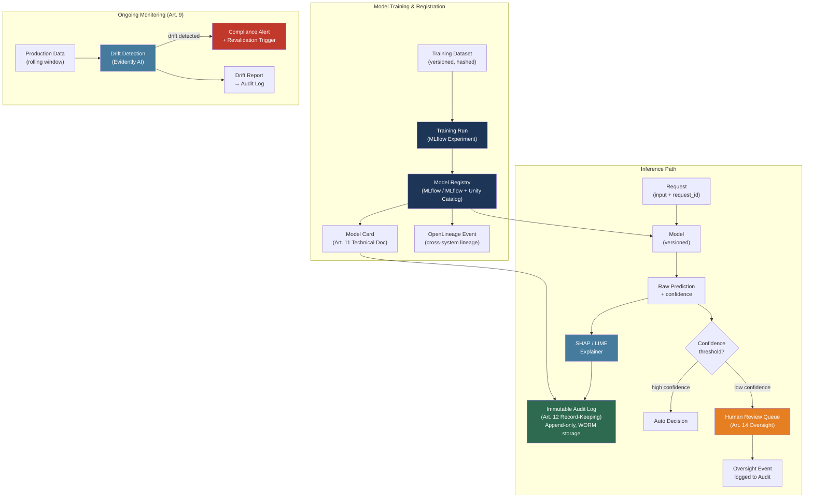

# [BEE-30079] AI Compliance and Governance Engineering

:::info
AI compliance engineering is the discipline of building backend systems that produce auditable, explainable, and documented records of AI decision-making. It is not a post-hoc checkbox process. The EU AI Act (Regulation EU 2024/1689, in force 1 August 2024) imposes legally binding obligations on high-risk AI systems — specifically: risk management systems, data governance, technical documentation, automatic event logging, transparency, human oversight, and robustness. Satisfying these obligations requires durable backend infrastructure: immutable audit logs, model registries with full lineage, structured model cards, explainability pipelines, and drift monitors. Building this infrastructure after a model is in production costs significantly more than building it from day one.
:::

## Context

Regulation of AI systems has moved from voluntary guidelines to binding law. The EU AI Act (Regulation (EU) 2024/1689, published in the Official Journal of the EU on 12 July 2024, entered into force on 1 August 2024) is the first comprehensive AI-specific regulation in force for a major economic bloc. The United States produced the NIST AI Risk Management Framework (AI RMF 1.0, NIST.AI.100-1, published 26 January 2023) as a voluntary but widely-adopted governance structure. Other jurisdictions are following: the UK published its AI Safety Institute guidance, Canada its Algorithmic Impact Assessment, and Brazil its AI Act proposal.

The EU AI Act uses a risk-based tiered approach:

- **Unacceptable Risk** (prohibited): AI systems for social scoring by public authorities, real-time remote biometric surveillance in public spaces (with narrow exceptions), manipulation of human behavior exploiting vulnerabilities, and systems that infer emotions in workplaces or schools. These are banned outright from 2 February 2025.
- **High Risk**: Systems with significant potential to harm health, safety, or fundamental rights. Covers two categories: (1) AI embedded in regulated products (medical devices, machinery, vehicles) under existing EU product safety law, and (2) systems listed in Annex III — including AI used in critical infrastructure, education, employment, essential private and public services, law enforcement, migration, and justice. Full obligations apply from 2 August 2026.
- **Limited Risk**: Systems with specific transparency obligations (e.g., chatbots must disclose they are AI; deepfakes must be labeled). Applies from 2 August 2026.
- **Minimal Risk**: Everything else. No mandatory obligations; voluntary codes of practice encouraged.

General-Purpose AI (GPAI) models have their own obligations (model evaluation, adversarial testing, technical documentation), which applied from 2 August 2025. High-risk systems embedded in regulated products have an extended transition period until 2 August 2027.

The NIST AI RMF organizes governance around four interconnected functions:

- **GOVERN**: Establishes organizational policies, roles, responsibilities, and cultures for AI risk management. Governance must exist before any AI system is deployed.
- **MAP**: Identifies and classifies AI risks in context. Requires cataloguing AI systems in use, their intended purposes, and who they affect.
- **MEASURE**: Applies quantitative, qualitative, or mixed methods to assess and monitor identified risks. Includes bias testing, accuracy benchmarking, and drift detection.
- **MANAGE**: Prioritizes and responds to risks through mitigations, incident response, and continuous improvement.

The NIST framework complements the EU Act: GOVERN and MAP align with the Act's risk classification and documentation requirements; MEASURE aligns with accuracy, robustness, and bias obligations; MANAGE aligns with post-market monitoring and record-keeping.

Most of the EU AI Act's high-risk obligations reduce to four concrete technical artifacts: **an immutable audit log**, **a model registry with lineage**, **a model card**, and **a live explainability and drift pipeline**. Building these artifacts correctly is a backend infrastructure problem.

## Technical Obligations for High-Risk AI (Articles 9–15)

The EU AI Act defines seven technical obligation categories for high-risk AI systems, codified in Articles 9 through 15 of the Regulation:

| Article | Obligation | Backend Implication |
|---|---|---|
| Art. 9 | Risk management system — continuous lifecycle process identifying foreseeable risks | Automated risk scoring at deployment; incident ticketing integration |
| Art. 10 | Data governance — training/validation data must be relevant, representative, error-free | Dataset versioning; schema validation; bias scans before training |
| Art. 11 | Technical documentation — per Annex IV, covering design, training data, testing methods | Model card generation at registration time |
| Art. 12 | Record-keeping — automatic event logging, tamper-resistant, appropriate retention | Append-only audit log for every inference, configuration change, and override |
| Art. 13 | Transparency — users must receive information about intended purpose, limitations, accuracy | Structured disclosure endpoints; model card publishing |
| Art. 14 | Human oversight — design must enable effective human oversight and intervention | Override API; confidence thresholds that trigger human review; audit trail of human decisions |
| Art. 15 | Accuracy, robustness, cybersecurity — maintain performance; resist adversarial attack | Drift detection; shadow mode evaluation; adversarial test suite |

Article 12 is the most operationally demanding. It requires AI systems to automatically record (at minimum): the period of use of each transaction, the reference database against which the system checked inputs, the input data, and verification outcomes. For LLM-based systems, this extends to prompt versions, sampled outputs, token counts, model versions, and latencies.

## Audit Trail Architecture

An AI audit trail is an append-only, tamper-evident log of all events produced by or affecting an AI system. It differs from standard application logging in two ways: events are immutable once written, and events include AI-specific context (model version, input hash, output, confidence, feature attribution).

### Event Schema

Every AI inference event MUST emit at minimum:

```python
from dataclasses import dataclass, field
from datetime import datetime, timezone
from uuid import uuid4
import hashlib, json

@dataclass
class AIAuditEvent:
    event_id: str = field(default_factory=lambda: str(uuid4()))
    event_type: str = ""            # "inference", "override", "config_change", "model_deploy"
    timestamp: str = field(
        default_factory=lambda: datetime.now(timezone.utc).isoformat()
    )
    # System identity
    model_id: str = ""              # registered model name
    model_version: str = ""        # e.g. "v2.3.1" or git SHA
    model_registry_uri: str = ""   # MLflow run URI or equivalent

    # Request context
    request_id: str = ""           # trace ID from calling service
    session_id: str = ""           # user session (pseudonymized if PII)
    user_id: str = ""              # pseudonymized subject identifier

    # AI-specific payload
    input_hash: str = ""           # SHA-256 of input; never store raw PII
    output_hash: str = ""          # SHA-256 of output
    confidence_score: float = 0.0  # model-reported confidence or probability
    decision: str = ""             # the discrete output / label / action taken
    feature_attribution: dict = field(default_factory=dict)  # SHAP or LIME top-k

    # Human oversight
    human_reviewed: bool = False
    human_override: bool = False
    override_reason: str = ""
    reviewer_id: str = ""          # pseudonymized

    # Performance
    latency_ms: float = 0.0
    tokens_input: int = 0          # for LLM systems
    tokens_output: int = 0

    def to_json_line(self) -> str:
        return json.dumps(self.__dict__)

    @staticmethod
    def hash_content(content: str) -> str:
        return hashlib.sha256(content.encode()).hexdigest()
```

### Immutable Storage

Audit logs MUST be written to append-only storage. Three common patterns:

**Write-ahead log (WAL) to object storage with integrity manifest:**

```python
import boto3, hashlib, json
from datetime import datetime, timezone

class ImmutableAuditLog:
    """
    Writes NDJSON log lines to S3 with object-level integrity checking.
    S3 Object Lock (WORM mode) prevents deletion or overwrite during retention period.
    """
    def __init__(self, bucket: str, prefix: str, retention_days: int = 730):
        self.s3 = boto3.client("s3")
        self.bucket = bucket
        self.prefix = prefix
        self.retention_days = retention_days

    def write(self, event: AIAuditEvent) -> str:
        """Write single event. Returns S3 object key."""
        line = event.to_json_line()
        key = (
            f"{self.prefix}/"
            f"{datetime.now(timezone.utc).strftime('%Y/%m/%d')}/"
            f"{event.event_id}.jsonl"
        )
        # Content-MD5 ensures atomic integrity — S3 rejects corrupted writes
        md5 = hashlib.md5(line.encode()).digest()
        import base64
        self.s3.put_object(
            Bucket=self.bucket,
            Key=key,
            Body=line.encode(),
            ContentMD5=base64.b64encode(md5).decode(),
            # Object Lock retention: WORM for the required period
            ObjectLockMode="COMPLIANCE",
            ObjectLockRetainUntilDate=(
                datetime.now(timezone.utc).replace(
                    year=datetime.now(timezone.utc).year + (self.retention_days // 365)
                )
            ),
        )
        return key
```

**PostgreSQL with row-level security and trigger-based tamper detection:**

```sql
-- Append-only table: INSERT allowed, UPDATE/DELETE denied by RLS
CREATE TABLE ai_audit_log (
    event_id        UUID PRIMARY KEY DEFAULT gen_random_uuid(),
    event_type      TEXT NOT NULL,
    ts              TIMESTAMPTZ NOT NULL DEFAULT now(),
    model_id        TEXT NOT NULL,
    model_version   TEXT NOT NULL,
    request_id      TEXT,
    user_id         TEXT,         -- pseudonymized
    input_hash      TEXT NOT NULL,
    output_hash     TEXT NOT NULL,
    confidence      FLOAT,
    decision        TEXT,
    feature_attribution JSONB,
    human_reviewed  BOOLEAN DEFAULT FALSE,
    human_override  BOOLEAN DEFAULT FALSE,
    override_reason TEXT,
    latency_ms      FLOAT,
    row_hash        TEXT          -- hash of all fields for tamper detection
);

-- Deny updates and deletes via policy
ALTER TABLE ai_audit_log ENABLE ROW LEVEL SECURITY;
CREATE POLICY no_update ON ai_audit_log FOR UPDATE USING (FALSE);
CREATE POLICY no_delete ON ai_audit_log FOR DELETE USING (FALSE);

-- Tamper-detection trigger: hash all fields on insert
CREATE OR REPLACE FUNCTION set_row_hash() RETURNS TRIGGER AS $$
BEGIN
    NEW.row_hash := encode(
        sha256((row_to_json(NEW)::text)::bytea),
        'hex'
    );
    RETURN NEW;
END;
$$ LANGUAGE plpgsql;

CREATE TRIGGER audit_row_hash
BEFORE INSERT ON ai_audit_log
FOR EACH ROW EXECUTE FUNCTION set_row_hash();
```

## Model Registry and Lineage

Article 11 (Technical Documentation) and Article 12 (Record-Keeping) together require that an operator can answer: what training data produced this model, what experiments ran to produce this version, and what inference events used this model version. This is the model lineage problem.

MLflow Model Registry is the dominant open-source solution. It captures lineage automatically when models are registered from experiment runs:

```python
import mlflow
import mlflow.sklearn
from sklearn.ensemble import GradientBoostingClassifier
import pandas as pd

# Every training run automatically records:
# - Parameters (hyperparameters)
# - Metrics (accuracy, F1, AUC)
# - Artifacts (model binary, confusion matrix)
# - Dataset metadata (name, digest, schema)
# - Git commit SHA of training code

mlflow.set_experiment("credit-risk-v3")

with mlflow.start_run(run_name="gbm-balanced-2024-q2") as run:
    # Log dataset used for training (creates lineage link)
    training_data = pd.read_parquet("s3://datasets/credit/train-v3.parquet")
    dataset = mlflow.data.from_pandas(
        training_data,
        source="s3://datasets/credit/train-v3.parquet",
        name="credit-train-v3",
        targets="default_flag",
    )
    mlflow.log_input(dataset, context="training")

    # Log validation dataset separately
    val_data = pd.read_parquet("s3://datasets/credit/val-v3.parquet")
    val_dataset = mlflow.data.from_pandas(val_data, source="s3://datasets/credit/val-v3.parquet", name="credit-val-v3")
    mlflow.log_input(val_dataset, context="validation")

    # Train
    params = {"n_estimators": 200, "max_depth": 5, "learning_rate": 0.05}
    mlflow.log_params(params)
    model = GradientBoostingClassifier(**params)
    model.fit(training_data.drop("default_flag", axis=1), training_data["default_flag"])

    # Log metrics
    mlflow.log_metrics({"accuracy": 0.882, "auc": 0.934, "f1_minority": 0.71})

    # Register model — creates lineage link to this run
    mlflow.sklearn.log_model(
        model,
        artifact_path="model",
        registered_model_name="credit-risk-classifier",
    )

    run_id = run.info.run_id
    print(f"Run ID (lineage anchor): {run_id}")

# After registration, model version 1 of "credit-risk-classifier" is linked to:
# - run_id (the experiment run above)
# - training dataset (s3://datasets/credit/train-v3.parquet + its hash)
# - validation dataset
# - all parameters and metrics
# - git commit (auto-captured from environment)
```

### OpenLineage for Cross-System Lineage

MLflow captures within-experiment lineage. When AI pipelines span multiple systems (Airflow data pipelines feeding training jobs feeding deployment targets), OpenLineage provides an open standard (LF AI & Data Foundation Graduate project, current v1.x) for cross-system lineage collection.

OpenLineage models three entities: **Jobs** (process definitions), **Runs** (job executions), and **Datasets** (inputs and outputs). Events are emitted as JSON using a documented schema and transported via HTTP or message queues to a compatible backend (Apache Atlas, Marquez, Atlan, or others).

```python
from openlineage.client import OpenLineageClient
from openlineage.client.run import RunEvent, RunState, Run, Job, Dataset
from openlineage.client.facet import (
    DatasetVersionDatasetFacet,
    SchemaDatasetFacet, SchemaField,
    SqlJobFacet,
)
from datetime import datetime, timezone
from uuid import uuid4

client = OpenLineageClient.from_environment()  # reads OPENLINEAGE_URL env var

run_id = str(uuid4())
job_name = "credit-feature-engineering"
namespace = "ml-platform"

# Emit START event when job begins
start_event = RunEvent(
    eventType=RunState.START,
    eventTime=datetime.now(timezone.utc).isoformat(),
    run=Run(runId=run_id),
    job=Job(namespace=namespace, name=job_name),
    inputs=[
        Dataset(
            namespace="s3://raw-data",
            name="credit/applications/2024-q2.parquet",
            facets={
                "version": DatasetVersionDatasetFacet(datasetVersion="sha256:a1b2c3..."),
                "schema": SchemaDatasetFacet(fields=[
                    SchemaField("application_id", "STRING"),
                    SchemaField("credit_score", "INTEGER"),
                    SchemaField("default_flag", "BOOLEAN"),
                ]),
            },
        )
    ],
    outputs=[
        Dataset(namespace="s3://features", name="credit/features/2024-q2.parquet")
    ],
)
client.emit(start_event)
```

## Model Cards

Mitchell et al. (2019) introduced model cards (arXiv:1810.03993, FAT* 2019) as short documents accompanying released models that provide benchmarked evaluation in a variety of conditions, with particular emphasis on performance across demographic subgroups and intersectional groups. Model cards are now both a best practice and, under Article 11 (Technical Documentation) and Article 13 (Transparency), a regulatory expectation for high-risk AI systems.

A complete model card MUST include these sections:

```python
from dataclasses import dataclass, field
from typing import Optional
import json

@dataclass
class ModelCard:
    # Identity
    model_name: str = ""
    model_version: str = ""
    model_type: str = ""            # "gradient-boosted-classifier", "llm", etc.
    created_date: str = ""          # ISO 8601
    registry_uri: str = ""         # link to MLflow or equivalent
    license: str = ""
    contact: str = ""              # team or role, not individual name

    # Intended use
    intended_use: str = ""         # primary purpose
    intended_users: list = field(default_factory=list)
    out_of_scope_use: list = field(default_factory=list)  # prohibited uses

    # Training data
    training_data_description: str = ""
    training_data_sources: list = field(default_factory=list)   # URIs
    training_data_size: str = ""
    training_data_time_range: str = ""
    known_data_limitations: list = field(default_factory=list)

    # Evaluation results
    primary_metrics: dict = field(default_factory=dict)   # {"accuracy": 0.88}
    disaggregated_metrics: dict = field(default_factory=dict)
    # e.g. {"age_group_18_25": {"accuracy": 0.81}, "age_group_50_plus": {"accuracy": 0.91}}
    evaluation_dataset: str = ""

    # Limitations and ethical considerations
    known_limitations: list = field(default_factory=list)
    fairness_considerations: str = ""
    privacy_considerations: str = ""
    recommendations: list = field(default_factory=list)

    # Regulatory
    risk_tier: str = ""            # "high-risk", "limited-risk", "minimal-risk"
    applicable_regulations: list = field(default_factory=list)
    human_oversight_required: bool = False
    override_mechanism: str = ""

    def to_json(self) -> str:
        return json.dumps(self.__dict__, indent=2)
```

The disaggregated metrics section is the most critical for EU AI Act compliance. Article 10 requires training data to be representative, and Article 15 requires accuracy across conditions. If a credit-risk model has 88% overall accuracy but 71% accuracy on the minority class (defaults), that disparity must be documented — suppressing it is a compliance failure, not a documentation choice.

MLflow generates model cards automatically on registration in Databricks Unity Catalog environments. For standalone MLflow, model card generation SHOULD be implemented as a post-registration hook:

```python
def generate_and_attach_model_card(
    run_id: str,
    model_name: str,
    version: str,
    card: ModelCard,
    client: mlflow.MlflowClient,
) -> None:
    """Attach model card JSON to a registered model version."""
    card_json = card.to_json()
    # Write to temp file and log as artifact
    import tempfile, os
    with tempfile.NamedTemporaryFile(
        mode="w", suffix=".json", delete=False
    ) as f:
        f.write(card_json)
        tmp_path = f.name
    try:
        client.log_artifact(run_id, tmp_path, artifact_path="model_card")
        client.update_model_version(
            name=model_name,
            version=version,
            description=f"Model card attached. Risk tier: {card.risk_tier}",
        )
        client.set_model_version_tag(
            name=model_name,
            version=version,
            key="model_card_uri",
            value=f"mlflow:/{model_name}/{version}/model_card",
        )
    finally:
        os.unlink(tmp_path)
```

## Explainability Pipeline

Article 13 (Transparency) and Article 14 (Human Oversight) together require that AI outputs be interpretable enough for a human operator to evaluate and, where necessary, override a decision. This requires attaching per-prediction explanations to audit events.

### SHAP (SHapley Additive exPlanations)

SHAP (Lundberg & Lee, "A Unified Approach to Interpreting Model Predictions", NeurIPS 2017, arXiv:1705.07874) assigns each feature an importance value for each individual prediction, grounded in Shapley values from cooperative game theory. SHAP explanations are consistent and locally accurate — the sum of SHAP values equals the model output minus the expected output.

```python
import shap
import numpy as np
import mlflow.sklearn

def build_shap_explainer(model_uri: str, background_data: np.ndarray):
    """
    Load a registered model and build a SHAP TreeExplainer (for tree-based models)
    or KernelExplainer (model-agnostic, slower).
    """
    model = mlflow.sklearn.load_model(model_uri)
    # TreeExplainer works for GBM, RandomForest, XGBoost, LightGBM
    # background_data should be a representative sample (100–1000 rows)
    explainer = shap.TreeExplainer(model, data=background_data)
    return explainer

def explain_prediction(
    explainer: shap.TreeExplainer,
    input_features: np.ndarray,
    feature_names: list[str],
    top_k: int = 5,
) -> dict:
    """
    Compute SHAP values for a single prediction.
    Returns top-k features by absolute SHAP value for audit attachment.
    """
    shap_values = explainer.shap_values(input_features)
    # For binary classification, shap_values[1] is the positive class
    if isinstance(shap_values, list):
        sv = shap_values[1][0]
    else:
        sv = shap_values[0]

    # Build ranked attribution dict
    pairs = sorted(zip(feature_names, sv.tolist()), key=lambda x: abs(x[1]), reverse=True)
    return {
        "method": "shap_tree",
        "expected_value": float(explainer.expected_value[1] if isinstance(explainer.expected_value, list) else explainer.expected_value),
        "top_features": [
            {"feature": name, "shap_value": round(val, 6)}
            for name, val in pairs[:top_k]
        ],
    }

# Usage in inference path
def predict_with_explanation(
    model_uri: str,
    explainer: shap.TreeExplainer,
    features: np.ndarray,
    feature_names: list[str],
    audit_log: ImmutableAuditLog,
    request_id: str,
    user_id: str,
) -> dict:
    model = mlflow.sklearn.load_model(model_uri)
    proba = model.predict_proba(features)[0]
    decision = "approve" if proba[1] < 0.5 else "decline"
    explanation = explain_prediction(explainer, features, feature_names)

    event = AIAuditEvent(
        event_type="inference",
        model_id="credit-risk-classifier",
        model_version="v2.3.1",
        request_id=request_id,
        user_id=user_id,
        input_hash=AIAuditEvent.hash_content(str(features.tolist())),
        output_hash=AIAuditEvent.hash_content(decision),
        confidence_score=float(proba[1]),
        decision=decision,
        feature_attribution=explanation,
    )
    audit_log.write(event)

    return {
        "decision": decision,
        "confidence": float(proba[1]),
        "explanation": explanation,
        "audit_event_id": event.event_id,
    }
```

### LIME (Local Interpretable Model-Agnostic Explanations)

LIME (Ribeiro, Singh, Guestrin, "Why Should I Trust You?", arXiv:1602.04938, KDD 2016) approximates any black-box model with a locally faithful linear model by perturbing the input and observing how the output changes. LIME is slower than SHAP for tree models but applies to any model type including neural networks, image classifiers, and text classifiers.

```python
import lime.lime_tabular
import numpy as np

def build_lime_explainer(
    training_data: np.ndarray,
    feature_names: list[str],
    class_names: list[str],
    categorical_features: list[int] = None,
) -> lime.lime_tabular.LimeTabularExplainer:
    return lime.lime_tabular.LimeTabularExplainer(
        training_data=training_data,
        feature_names=feature_names,
        class_names=class_names,
        categorical_features=categorical_features or [],
        mode="classification",
    )

def explain_with_lime(
    explainer: lime.lime_tabular.LimeTabularExplainer,
    predict_fn,   # callable: ndarray -> ndarray of probabilities
    instance: np.ndarray,
    top_k: int = 5,
) -> dict:
    explanation = explainer.explain_instance(
        instance,
        predict_fn,
        num_features=top_k,
        num_samples=1000,  # perturb 1000 times; higher = more stable, slower
    )
    return {
        "method": "lime",
        "top_features": [
            {"feature": feat, "weight": round(weight, 6)}
            for feat, weight in explanation.as_list()
        ],
    }
```

## Drift Detection and Ongoing Monitoring

Article 9 (Risk Management System) requires a continuous lifecycle process — not a one-time assessment. Models degrade as data distributions shift (data drift) or as the relationship between features and target changes (concept drift). Both are compliance failures if undetected.

Evidently AI (https://www.evidentlyai.com, Apache 2.0 licensed) is an open-source ML and LLM observability framework with 100+ pre-built metrics covering data drift, model performance, data quality, and bias:

```python
from evidently.report import Report
from evidently.metric_preset import DataDriftPreset, ClassificationPreset
from evidently.metrics import (
    DatasetDriftMetric,
    DatasetMissingValuesMetric,
    ColumnDriftMetric,
)
import pandas as pd

def run_drift_check(
    reference_data: pd.DataFrame,   # training distribution
    current_data: pd.DataFrame,     # recent production window
    target_column: str,
    feature_columns: list[str],
    drift_threshold: float = 0.1,   # PSI or Wasserstein threshold
) -> dict:
    """
    Run data drift and performance check.
    Returns dict with drift_detected flag and per-column results.
    """
    report = Report(metrics=[
        DatasetDriftMetric(stattest_threshold=drift_threshold),
        DatasetMissingValuesMetric(),
        ClassificationPreset(),
    ])
    report.run(reference_data=reference_data, current_data=current_data)

    result_dict = report.as_dict()
    drift_detected = result_dict["metrics"][0]["result"]["dataset_drift"]

    if drift_detected:
        # Write compliance event to audit log
        # Trigger human review or model revalidation workflow
        pass

    return {
        "drift_detected": drift_detected,
        "metrics": result_dict["metrics"],
    }

# Schedule this check to run daily or on each deployment
# For EU AI Act Article 9 compliance, results must be retained
# and reviewed as part of the risk management system
```

## Human Oversight Integration

Article 14 requires AI systems to be designed to enable effective human oversight — specifically, humans must be able to understand, monitor, and override AI outputs. This is not just a UI concern; it has backend API consequences.

```python
from enum import Enum

class OversightAction(str, Enum):
    APPROVED = "approved"       # human agrees with AI decision
    OVERRIDDEN = "overridden"  # human changed the AI decision
    ESCALATED = "escalated"   # human escalated to a senior reviewer
    DEFERRED = "deferred"     # decision held pending more information

def record_human_oversight(
    original_event_id: str,
    reviewer_id: str,          # pseudonymized
    action: OversightAction,
    new_decision: str | None,
    reason: str,
    audit_log: ImmutableAuditLog,
) -> str:
    """
    Records a human oversight action linked to the original inference event.
    Returns oversight event ID.
    Required for EU AI Act Article 14 compliance.
    """
    oversight_event = AIAuditEvent(
        event_type="human_oversight",
        model_id="credit-risk-classifier",
        model_version="n/a",
        request_id=original_event_id,  # links to original inference event
        reviewer_id=reviewer_id,
        human_reviewed=True,
        human_override=(action == OversightAction.OVERRIDDEN),
        override_reason=reason,
        decision=new_decision or "",
    )
    return audit_log.write(oversight_event)

# Confidence-based routing: automatically route low-confidence predictions to human review
def route_decision(
    prediction: dict,
    confidence_threshold: float = 0.75,
) -> str:
    """
    Returns 'auto' for high-confidence decisions, 'human_review' for low-confidence.
    This implements the 'human-over-the-loop' pattern required by Art. 14.
    """
    if prediction["confidence"] < confidence_threshold:
        return "human_review"
    if prediction["confidence"] > (1 - confidence_threshold):
        return "auto"
    return "human_review"
```

## Visual



## Best Practices

### Build the audit log before the model goes to production, not after

**MUST** implement the immutable audit log (Article 12 compliance) before deploying a high-risk AI system, not as a subsequent retrofit. Retrofit audit trails are invariably incomplete: they miss the exact events regulators examine first (the earliest decisions, configuration changes at launch, and any incidents in the first weeks). An audit trail that begins mid-deployment is a gap — not a partial record.

### Store input hashes, not raw inputs, in the audit log

**MUST** log a cryptographic hash (SHA-256) of inputs, not the inputs themselves. Storing raw inputs often violates data minimization requirements under GDPR (which runs in parallel with the AI Act) and creates unacceptable data retention scope. The hash uniquely identifies the input for later reproduction in a controlled context while storing no PII. If inputs must be reproducible for investigation, store them encrypted in a separate high-security store, with the audit log containing only the hash and a pointer.

### Attach SHAP or LIME explanations at inference time, not retrospectively

**SHOULD** compute and store feature attributions at inference time as part of the audit event. Post-hoc explanation generation against an old model version and a reconstructed input is unreliable: model updates, feature engineering changes, or missing input context can produce explanations inconsistent with the original decision. Computing the explanation at decision time ensures the attribution accurately reflects what the model actually used.

### Disaggregate evaluation metrics across subgroups before every deployment

**MUST** produce disaggregated accuracy metrics (by demographic group, data source, geographic region, or other relevant partitions defined in the model card) before any model version is approved for production. Article 15 requires appropriate accuracy levels. Aggregate accuracy that conceals a significantly degraded performance on a minority subgroup is a compliance failure. Block deployment via CI/CD gate if any subgroup metric falls below the defined threshold in the model card.

```python
def check_subgroup_thresholds(
    metrics: dict[str, dict],      # {"subgroup_name": {"accuracy": 0.X, "f1": 0.X}}
    thresholds: dict[str, float],  # minimum acceptable per metric
) -> list[str]:
    """Returns list of failing subgroups. Empty list = deployment approved."""
    failures = []
    for group, group_metrics in metrics.items():
        for metric_name, threshold in thresholds.items():
            actual = group_metrics.get(metric_name, 0.0)
            if actual < threshold:
                failures.append(
                    f"{group}: {metric_name}={actual:.3f} < threshold={threshold:.3f}"
                )
    return failures
```

### Use a model registry with lineage for every model entering production

**MUST** register every model that makes decisions affecting users in a model registry (MLflow or equivalent) before it is deployed. A model deployed from a Jupyter notebook without registration is unauditable: the training data, parameters, and experiment that produced it cannot be traced. Under Article 11, the inability to produce technical documentation on demand is a legal deficiency. The registry is the only reliable mechanism for linking a running model to its complete provenance.

### Treat the model card as a living document updated at every version bump

**SHOULD** update the model card — specifically the evaluation results and known limitations sections — every time a new model version is registered. A model card describing v1.0 that is still attached to v3.2 misstates the system's actual performance characteristics and intended use, creating both regulatory and liability risk. Automate model card generation as a post-training artifact in the CI/CD pipeline.

## Common Mistakes

**Conflating application logs with AI audit logs.** Standard request/response logs (nginx, CloudWatch, Datadog) capture that an endpoint was called and what HTTP status it returned. An AI audit log must additionally capture the model version, the decision, the confidence score, the feature attribution, and any human oversight action. Relying on standard application logs for AI compliance produces records that are technically true but informationally useless for a regulatory investigation.

**Using mutable storage for audit logs.** Writing audit events to a standard database table without row-level security and append-only enforcement, or to a log file on a writable volume, means an operator or attacker can alter historical records. WORM storage (S3 Object Lock, Azure Immutable Blob Storage, append-only database policies) is not optional for systems claiming Article 12 compliance.

**Running drift detection only at model deployment, not continuously.** A model that passes all checks at deployment time can degrade within weeks if the incoming data distribution shifts. Article 9 requires a continuous risk management process. A drift check that runs only once, or only when someone thinks of it, does not satisfy that requirement. Drift detection must be scheduled, results must be retained in the audit log, and detection of drift above threshold must trigger an automated review workflow.

**Producing aggregate-only model cards.** Documenting overall accuracy of 88% on a balanced test set is necessary but not sufficient. If the system will be used to make decisions affecting people in different demographic groups, accuracy must be broken down by those groups and documented in the model card. Publishing only aggregate numbers while knowing subgroup disparities exist is a transparency violation under Article 13.

**Treating model registration as optional for "internal" models.** If an AI system makes decisions affecting individuals — even internally, such as a hiring screener used by HR — it is not exempt from EU AI Act obligations if it falls within the Annex III categories. "Internal use" does not remove high-risk classification or documentation requirements. Every model making consequential decisions MUST be registered with full lineage, regardless of whether it is customer-facing.

## Related BEEs

- [BEE-30042](ai-red-teaming-and-adversarial-testing.md) -- AI Red Teaming and Adversarial Testing: adversarial testing is required by Article 15 (Accuracy, Robustness, Cybersecurity); BEE-30042 covers the test methodology that feeds the Article 9 risk management system
- [BEE-30077](llm-output-watermarking-and-ai-content-provenance.md) -- LLM Output Watermarking and AI Content Provenance: C2PA content credentials and watermarking address Article 50 (transparency obligations for AI-generated content), complementing the audit trail obligations in Article 12
- [BEE-30008](llm-security-and-prompt-injection.md) -- LLM Security and Prompt Injection: Article 15 requires cybersecurity; prompt injection is the primary cybersecurity attack surface for LLM-based high-risk systems
- [BEE-14003](../observability/distributed-tracing.md) -- Distributed Tracing: the request_id threaded through the AI audit event should be the same trace ID used by the distributed tracing system, enabling correlation of AI decisions with full system behavior

## References

- [Regulation (EU) 2024/1689 — EU AI Act official text on EUR-Lex](https://eur-lex.europa.eu/legal-content/EN/TXT/?uri=OJ:L_202401689)
- [EU AI Act enters into force — European Commission, 1 August 2024](https://commission.europa.eu/news-and-media/news/ai-act-enters-force-2024-08-01_en)
- [EU AI Act high-level summary — artificialintelligenceact.eu](https://artificialintelligenceact.eu/high-level-summary/)
- [EU AI Act implementation timeline — artificialintelligenceact.eu/implementation-timeline/](https://artificialintelligenceact.eu/implementation-timeline/)
- [Article 9: Risk Management System — artificialintelligenceact.eu/article/9/](https://artificialintelligenceact.eu/article/9/)
- [Article 12: Record-Keeping — artificialintelligenceact.eu/article/12/](https://artificialintelligenceact.eu/article/12/)
- [Article 14: Human Oversight — artificialintelligenceact.eu/article/14/](https://artificialintelligenceact.eu/article/14/)
- [NIST AI Risk Management Framework (AI RMF 1.0), NIST.AI.100-1, January 2023 — nist.gov/itl/ai-risk-management-framework](https://www.nist.gov/itl/ai-risk-management-framework)
- [NIST AI RMF document (PDF) — nvlpubs.nist.gov/nistpubs/ai/nist.ai.100-1.pdf](https://nvlpubs.nist.gov/nistpubs/ai/nist.ai.100-1.pdf)
- [Mitchell et al., "Model Cards for Model Reporting" (FAT* 2019) — arXiv:1810.03993](https://arxiv.org/abs/1810.03993)
- [Lundberg & Lee, "A Unified Approach to Interpreting Model Predictions" (NeurIPS 2017) — arXiv:1705.07874](https://arxiv.org/abs/1705.07874)
- [Ribeiro, Singh, Guestrin, "Why Should I Trust You?" LIME (KDD 2016) — arXiv:1602.04938](https://arxiv.org/abs/1602.04938)
- [MLflow Model Registry documentation — mlflow.org/docs/latest/ml/model-registry/](https://mlflow.org/docs/latest/ml/model-registry/)
- [OpenLineage specification and documentation — openlineage.io/docs/](https://openlineage.io/docs/)
- [OpenLineage GitHub (LF AI & Data Foundation) — github.com/OpenLineage/OpenLineage](https://github.com/OpenLineage/OpenLineage)
- [Evidently AI open-source ML observability — evidentlyai.com](https://www.evidentlyai.com/)
- [AI Fairness 360 (AIF360) — Trusted-AI/AIF360 on GitHub](https://github.com/Trusted-AI/AIF360)
