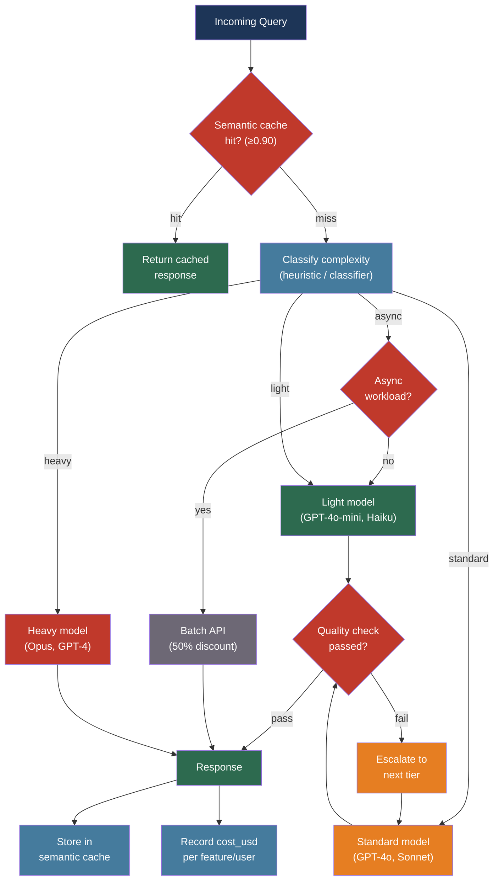

# [BEE-513] AI Cost Optimization and Model Routing

:::info
LLM API costs scale with token volume, output tokens cost 4–5× more than input tokens, and most queries do not require the most capable model — routing, caching, and batching together can cut costs by 50–98% without measurable quality loss for the workload that does not need heavy models.
:::

## Context

Token pricing is asymmetric in a way that surprises most engineers encountering it for the first time. Input tokens are cheap because processing them parallelizes efficiently across GPU cores during the prefill phase. Output tokens are expensive because generation is sequential: each token depends on all previous tokens and cannot be parallelized. The practical ratio is 4–5× at most providers. For a chatbot that generates two output tokens per input token, the effective cost per request is not the advertised input price — it is roughly nine times that price when the output multiplier is factored in.

At scale this asymmetry is decisive. A chatbot handling one million requests per day at 2,000 tokens per request generates two billion tokens daily. Choosing a model that costs ten times less for that workload saves hundreds of thousands of dollars per year. But model cost is correlated with model capability, and routing every query to the cheapest model degrades quality for the queries that need more power.

The research establishing that routing can close this gap: Chen et al.'s FrugalGPT (arXiv:2305.05176, 2023) demonstrated that an LLM cascade — trying cheaper models first and escalating to expensive models only when necessary — can match GPT-4 performance at up to 98% lower cost. LMSYS's RouteLLM (arXiv:2406.18665, 2024) showed that a lightweight router trained on human preference data reduces GPT-4-level API calls by 85% on MT Bench while maintaining quality, by learning which query types actually benefit from the stronger model.

The practical implication is that "which model do I use?" is not a deployment decision made once at launch. It is a per-request routing decision informed by query characteristics, quality requirements, and cost budgets.

## Design Thinking

Three levers reduce LLM cost, and they compose:

**Model routing** (highest leverage): Route queries to models calibrated to their difficulty. A classification task that takes 200 tokens does not need GPT-4o. A multi-step reasoning task over a long document might. Routing correctly produces quality equivalent to the best model at the average cost of the cheapest model.

**Request optimization** (moderate leverage): Reduce the token count of each request through caching, prompt compression, and batching. These techniques work independently of model selection and stack on top of routing savings.

**Infrastructure** (threshold leverage): Self-hosted open-weight models eliminate per-token costs entirely at the expense of fixed compute costs. This is the right choice only when request volume is consistently high enough to amortize the infrastructure investment.

The decision sequence: exhaust routing and request optimization first, since they require no infrastructure commitment. Evaluate self-hosting only when monthly API spend is large enough that the break-even analysis favors it (typically above $5,000–10,000/month in API costs).

## Best Practices

### Route Requests to Calibrated Models

**SHOULD** implement a routing layer that dispatches requests to different models based on estimated query complexity. The FrugalGPT cascade pattern — try the cheapest model that can handle the query class, escalate if the response fails a quality check — is the most practical production starting point.

A three-tier model hierarchy covers most workloads:

| Tier | Model examples | Cost range | Use for |
|------|---------------|-----------|---------|
| Light | GPT-4o-mini, Claude Haiku, Gemini Flash | $0.15–1.00 / M input tokens | Classification, extraction, short Q&A, summarization |
| Standard | GPT-4o, Claude Sonnet, Gemini Pro | $1.25–3.00 / M input tokens | General generation, RAG responses, code assistance |
| Heavy | Claude Opus, GPT-4 | $5.00+ / M input tokens | Complex multi-step reasoning, long-form synthesis, code generation over large codebases |

**SHOULD** build a classifier that estimates query complexity before routing. For most applications a rule-based classifier is sufficient and requires no additional API calls:

```python
def classify_query(query: str, context_tokens: int) -> str:
    # Short factual queries → light model
    if len(query.split()) < 20 and context_tokens < 500:
        return "light"
    # Queries with multi-step reasoning signals → heavy model
    reasoning_signals = ["explain why", "compare", "design", "analyze", "implement"]
    if any(s in query.lower() for s in reasoning_signals) or context_tokens > 10_000:
        return "heavy"
    return "standard"

def route(query: str, context: str, client) -> str:
    tier = classify_query(query, count_tokens(context))
    models = {"light": "gpt-4o-mini", "standard": "gpt-4o", "heavy": "claude-opus-4-6"}
    return client.complete(model=models[tier], query=query, context=context)
```

**SHOULD** validate the classifier on sampled traffic by comparing routed-model outputs against a reference heavy model. Acceptable degradation thresholds depend on the use case; for factual extraction, 1–2% accuracy difference is typically acceptable.

**MAY** use RouteLLM for router training when preference data is available. RouteLLM trains a binary router on human preference comparisons to predict when a strong model is necessary, achieving 85% cost reduction on MT Bench benchmarks. Its routers transfer across model pairs without retraining.

**SHOULD** use LiteLLM for multi-provider model management. It normalizes the API surface across OpenAI, Anthropic, Google, and self-hosted models, and implements fallback ordering so that if a model returns a rate-limit error or exceeds the context window, the next configured model handles the request automatically:

```python
import litellm

response = litellm.completion(
    model="gpt-4o-mini",
    messages=messages,
    fallbacks=["gpt-4o", "claude-sonnet-4-6"],  # escalate on failure
    context_window_fallbacks=[
        {"gpt-4o-mini": ["gpt-4o"]},  # gpt-4o-mini has smaller window
    ],
)
```

### Cache Semantically Similar Queries

For applications where users ask similar questions — customer support, documentation Q&A, internal knowledge bases — many API calls are redundant. The query "how do I reset my password?" and "what are the steps to reset my password?" should return the same answer. Semantic caching exploits this: embed the incoming query, compare against cached query embeddings, and return the cached response when similarity exceeds a threshold.

**SHOULD** implement semantic caching for any application where query distributions cluster around common topics. Cache hit rates of 30–70% are typical for customer-facing assistants with stable knowledge bases.

**SHOULD** use GPTCache or an equivalent semantic cache with a similarity threshold between 0.88 and 0.95:

```python
from gptcache import cache
from gptcache.adapter.openai import openai

# Initialize cache with embedding model and similarity threshold
cache.init(
    embedding_func=text_embedding_3_small,
    similarity_threshold=0.90,  # return cached response if cos similarity ≥ 0.90
)

# All calls through the cached client are intercepted automatically
response = openai.ChatCompletion.create(
    model="gpt-4o",
    messages=messages,
)
```

**MUST NOT** cache responses for queries where correctness depends on time (current prices, live status, today's news) or on user-specific state (account balance, order history). Set TTL to zero for these query categories.

**SHOULD** monitor cache hit rates and response quality for cached answers. A 0.90 similarity threshold sometimes returns cache hits that are accurate but incomplete relative to the new query. Sample cache hits periodically and score them on relevance.

### Use Batch APIs for Async Workloads

Both OpenAI and Anthropic offer batch processing APIs at 50% of synchronous pricing for workloads that tolerate 24-hour latency. This is the cheapest path to high-volume LLM processing for non-interactive applications.

**SHOULD** use batch processing for: document classification pipelines, nightly report generation, bulk data extraction, evaluation dataset scoring, and any other offline workflow where response time is not user-facing.

```python
# OpenAI Batch API: submit up to 50,000 requests per batch
import json
from openai import OpenAI

client = OpenAI()

# Build the batch file (JSONL format)
requests = [
    {
        "custom_id": f"doc-{i}",
        "method": "POST",
        "url": "/v1/chat/completions",
        "body": {
            "model": "gpt-4o-mini",
            "messages": [{"role": "user", "content": f"Classify: {doc}"}],
        },
    }
    for i, doc in enumerate(documents)
]

batch_file = client.files.create(
    file=("\n".join(json.dumps(r) for r in requests)).encode(),
    purpose="batch",
)
batch = client.batches.create(
    input_file_id=batch_file.id,
    endpoint="/v1/chat/completions",
    completion_window="24h",
)
# batch.id is used to poll for completion
```

**MUST NOT** use batch APIs for user-facing requests. The 24-hour completion window is a soft target; actual throughput varies with platform load.

### Control Output Token Count

Output tokens cost 4–5× more than input tokens. Uncontrolled output length is a primary cost driver for applications where the model generates long-form content.

**MUST** set `max_tokens` on every API call. Omitting it allows the model to generate up to its maximum output length (often 4K–16K tokens) for any request, including simple ones that only need a sentence.

**SHOULD** instruct the model explicitly to produce concise output when the use case does not require long responses: "Answer in one paragraph or less." "Respond with the single most relevant value, no explanation." Output instructions reduce token generation more reliably than `max_tokens` alone because they steer the model away from padding.

**SHOULD** prefer structured output (JSON with specific fields) over prose for extraction and classification tasks. A JSON response `{"category": "billing", "confidence": 0.94}` is 8 tokens. An equivalent prose response "Based on the content, this appears to be a billing inquiry with high confidence" is 18 tokens — more than twice as many, with no additional information.

**SHOULD** use stop sequences to terminate generation at natural boundaries rather than letting the model decide when it is done. For structured output, a closing brace `}` is sufficient. For prose, a double newline `\n\n` prevents multi-paragraph responses to simple questions.

### Compress Prompts for High-Volume Endpoints

For endpoints called at high frequency with large system prompts or large context injections, prompt compression directly reduces input token cost. At 10 million requests per month, reducing average prompt size by 30% saves proportionally in API costs.

**SHOULD** use LLMLingua-2 (arXiv:2403.12968) to compress large system prompts and background documents:

```python
from llmlingua import PromptCompressor

compressor = PromptCompressor(
    model_name="microsoft/llmlingua-2-bert-base-multilingual-cased-meetingbank",
    use_llmlingua2=True,
)

# Compress background context; keep instructions and query at full fidelity
compressed_context = compressor.compress_prompt(
    background_document,
    rate=0.5,  # target 50% token reduction
    force_tokens=["IMPORTANT", "WARNING", "\n"],  # always keep these
)
```

**MUST NOT** compress the user's query or the most recent conversation turns. Compression introduces information loss that is acceptable in background material but not in the primary task description.

**MAY** use DSPy (Stanford NLP, dspy.ai) for systematic prompt optimization. DSPy's optimizers automatically find concise prompt formulations that maintain accuracy on a held-out evaluation set, reducing prompt token count while preserving task performance.

### Set Cost Budgets and Monitor Spend per Feature

**MUST** attribute API cost to business dimensions — feature, user, tenant, experiment — from the first day of production. Costs that are not attributed have no owner and grow silently until they appear on a cloud billing invoice.

**SHOULD** compute and record `cost_usd` for every request as a metric (covered in BEE-511). Aggregate by `feature` to identify which parts of the application drive spend. Aggregate by `user_id` to detect per-user anomalies.

**SHOULD** set soft budget alerts and hard limits per tier:
- Alert when a feature's daily cost exceeds 2× its baseline
- Hard-limit total daily spend at the provider dashboard level (OpenAI, Anthropic both support this)
- For multi-tenant SaaS, enforce per-tenant token quotas in middleware before the LLM call

**SHOULD** review the model allocation monthly. As cheaper models improve, queries currently routed to the standard tier may perform acceptably on the light tier. Run the routing classifier against a quality benchmark after each major model release to find downgrade opportunities.

## Comparison Table

Current pricing as reference (verify at provider before budgeting; prices change):

| Model | Input $/M | Output $/M | Context | Best for |
|-------|----------|-----------|---------|---------|
| GPT-4o-mini | $0.15 | $0.60 | 128K | Classification, extraction, short Q&A |
| GPT-4o | $2.50 | $10.00 | 128K | General generation, code, multimodal |
| Claude Haiku | ~$1.00 | ~$5.00 | 200K | Fast routing, simple tasks |
| Claude Sonnet | $3.00 | $15.00 | 200K | Production generation, RAG |
| Claude Opus | $5.00 | $25.00 | 200K | Complex reasoning |
| Gemini 2.5 Flash | $0.30 | $2.50 | 1M | Long-context, cost-sensitive |
| Gemini 2.5 Pro | $1.25 | $10.00 | 200K | Strong reasoning at moderate cost |
| Batch API (any) | 50% off | 50% off | — | Async offline workloads |

## Visual



## Related BEEs

- [BEE-30001](llm-api-integration-patterns.md) -- LLM API Integration Patterns: streaming, retry with exponential backoff, and the provider client setup that cost optimization builds on top of
- [BEE-30009](llm-observability-and-monitoring.md) -- LLM Observability and Monitoring: cost attribution per feature/user/tenant and the `cost_usd` metric are prerequisites for knowing which optimization to apply first
- [BEE-30010](llm-context-window-management.md) -- LLM Context Window Management: prompt compression and context trimming reduce input token count, directly cutting the cost of high-frequency endpoints
- [BEE-30007](rag-pipeline-architecture.md) -- RAG Pipeline Architecture: semantic caching at the query level and embedding caching at the retrieval level are both cost levers in RAG systems
- [BEE-9001](../caching/caching-fundamentals-and-cache-hierarchy.md) -- Caching Fundamentals: semantic caching is a variant of application-layer caching; eviction policies, TTL, and invalidation patterns apply here

## References

- [Lingjiao Chen et al. FrugalGPT: How to Use Large Language Models While Reducing Cost and Improving Performance — arXiv:2305.05176, 2023](https://arxiv.org/abs/2305.05176)
- [Wei-Lin Chiang et al. RouteLLM: Learning to Route LLMs with Preference Data — arXiv:2406.18665, LMSYS 2024](https://arxiv.org/abs/2406.18665)
- [LMSYS. RouteLLM blog post and GitHub — lm-sys/RouteLLM](https://github.com/lm-sys/RouteLLM)
- [Huiqiang Jiang et al. LLMLingua-2: Data Distillation for Efficient and Faithful Task-Agnostic Prompt Compression — arXiv:2403.12968, ACL 2024](https://arxiv.org/abs/2403.12968)
- [Omar Khattab et al. DSPy: Compiling Declarative Language Model Calls into State-of-the-Art Pipelines — Stanford NLP — dspy.ai](https://dspy.ai/)
- [Zilliz. GPTCache: Semantic Cache for LLMs — github.com/zilliztech/GPTCache](https://github.com/zilliztech/GPTCache)
- [BerriAI. LiteLLM: Call 100+ LLMs with unified API — docs.litellm.ai](https://docs.litellm.ai/docs/routing-load-balancing)
- [OpenAI. Batch API — developers.openai.com](https://developers.openai.com/api/docs/guides/batch)
- [Anthropic. Message Batches API — platform.claude.com](https://platform.claude.com/docs/en/build-with-claude/batch-processing)
- [LMSYS. Chatbot Arena Leaderboard — lmarena.ai](https://lmarena.ai)
