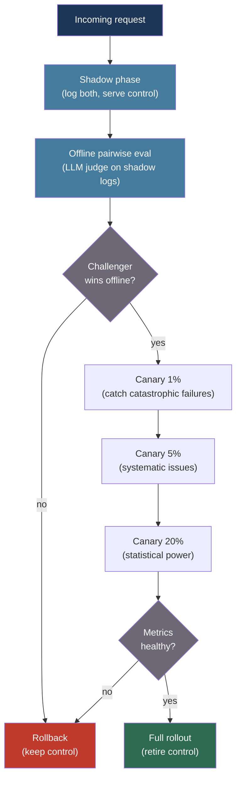

# [BEE-30034] AI Experimentation and Model A/B Testing

:::info
Testing one LLM against another in production requires more than traffic splitting — it requires choosing the right evaluation signal, accounting for the high variance of subjective text outputs, and deciding between offline comparison, shadow deployment, live A/B, and adaptive bandit strategies.
:::

## Context

Traditional software A/B tests measure deterministic outcomes: button click rates, conversion, latency. Two requests with the same input produce the same output. The statistical machinery is mature: pick a metric, estimate sample size, run until significance, ship the winner.

LLM experiments break every assumption. Two requests with the same input may produce different outputs due to temperature sampling. Quality is subjective — a response that scores 4/5 from one human evaluator scores 2/5 from another. Effect sizes are small: the difference between `claude-sonnet-4-6` and `claude-opus-4-6` on a support question may be imperceptible to half the population. These properties inflate required sample sizes dramatically and make naive "run for two weeks and check p-value" methodology unreliable.

The research community has developed compensating techniques. Chapelle et al. (ACM TOIS, 2012) showed that interleaved evaluation — presenting results from two models in the same user session and observing which the user prefers — is 10–100× more statistically sensitive than between-session A/B tests for ranking systems, exactly because it eliminates inter-user variance. Agrawal and Goyal (PMLR, 2012) proved that Thompson Sampling achieves near-optimal cumulative regret for multi-armed bandit problems, making it a principled alternative to fixed-duration A/B tests when you want to minimize exposure to the inferior model while the experiment runs.

The practical engineering challenge is building the infrastructure to capture the right signals: implicit behavioral cues (users rephrasing after a bad answer, session abandonment, retry rates) are lower cost and higher volume than explicit ratings (thumbs up/down), but noisier. Most production systems combine both.

## Design Thinking

Choosing an experimentation strategy is a function of three variables:

**Effect magnitude**: If you expect model B to be dramatically better (switching model families, major prompt overhaul), a small sample offline eval catches the signal fast. If the change is subtle (wording tweak, temperature adjustment), you need large online samples or more sensitive methods.

**Risk tolerance**: Shadow mode lets the new model fail silently while the old model serves all traffic. Live A/B exposes a percentage of real users to degraded quality if the challenger is worse. Canary (1% → 5% → 25% → 100%) limits blast radius.

**Latency of feedback**: Some quality signals are immediate (does the model complete a task successfully?). Others lag by hours or days (does the user return to the product?). Experiment design must match the feedback latency to avoid premature decisions.

## Best Practices

### Run Shadow Deployments Before Any Live Traffic Split

**SHOULD** deploy the challenger model in shadow mode before exposing it to live traffic. Shadow mode sends each incoming request to both the production model and the challenger; the production response is returned to the user, and both responses are logged for offline comparison:

```python
import asyncio
import anthropic
import logging

logger = logging.getLogger(__name__)
client = anthropic.Anthropic()

async def shadow_generate(
    messages: list[dict],
    production_model: str,
    shadow_model: str,
    system: str = "",
    request_id: str = "",
) -> str:
    """
    Run production and shadow models concurrently.
    Return the production response; log both for offline comparison.
    """
    async def call_model(model: str) -> tuple[str, dict]:
        response = client.messages.create(
            model=model,
            max_tokens=1024,
            system=system,
            messages=messages,
        )
        text = response.content[0].text
        usage = {"input": response.usage.input_tokens, "output": response.usage.output_tokens}
        return text, usage

    # Run both concurrently; production latency is not impacted by shadow
    (prod_text, prod_usage), (shadow_text, shadow_usage) = await asyncio.gather(
        asyncio.to_thread(call_model, production_model),
        asyncio.to_thread(call_model, shadow_model),
    )

    # Log for offline analysis (never return shadow response to user)
    logger.info("shadow_comparison", extra={
        "request_id": request_id,
        "production_model": production_model,
        "shadow_model": shadow_model,
        "production_response": prod_text[:200],  # Truncate for log size
        "shadow_response": shadow_text[:200],
        "production_input_tokens": prod_usage["input"],
        "shadow_input_tokens": shadow_usage["input"],
        "production_output_tokens": prod_usage["output"],
        "shadow_output_tokens": shadow_usage["output"],
    })

    return prod_text  # Always return production response to the user
```

**MUST NOT** serve shadow model responses to users, even partially. Shadow mode's value is risk-free data collection; mixing in shadow responses defeats the purpose and may introduce quality regressions.

### Assign Users to Variants with Stable Hashing

**MUST** assign users to experiment variants using a deterministic hash of the user ID rather than random sampling per request. Per-request randomization means the same user sees different model behaviors across requests, creating inconsistent experiences and corrupting within-user behavioral signals:

```python
import hashlib

def get_experiment_variant(
    user_id: str,
    experiment_id: str,
    traffic_percent_challenger: float = 0.10,
) -> str:
    """
    Stable assignment: the same user always gets the same variant
    for a given experiment. Uses SHA-256 modulo bucketing.

    traffic_percent_challenger: fraction of users routed to challenger (0.0–1.0)
    """
    # Hash user + experiment to get a stable bucket (0–9999)
    key = f"{experiment_id}:{user_id}"
    bucket = int(hashlib.sha256(key.encode()).hexdigest(), 16) % 10_000
    threshold = int(traffic_percent_challenger * 10_000)

    return "challenger" if bucket < threshold else "control"

def generate_with_experiment(
    user_id: str,
    messages: list[dict],
    system: str,
    experiment_id: str = "model-upgrade-2026-04",
    control_model: str = "claude-haiku-4-5-20251001",
    challenger_model: str = "claude-sonnet-4-6",
    traffic_pct: float = 0.10,
) -> tuple[str, str]:
    """Returns (response_text, variant_name) for logging."""
    variant = get_experiment_variant(user_id, experiment_id, traffic_pct)
    model = challenger_model if variant == "challenger" else control_model

    response = client.messages.create(
        model=model, max_tokens=1024, system=system, messages=messages,
    )
    return response.content[0].text, variant
```

**SHOULD** include the experiment ID and variant name in every log entry that records a model interaction. Without this, you cannot join production metrics (session abandonment, return rate) back to experiment assignment after the fact.

### Capture Implicit Feedback Signals

**SHOULD** instrument the application to capture implicit quality signals that require no user action beyond natural behavior. Explicit ratings (thumbs up/down) are high quality but sparse — typically 1–5% of interactions. Implicit signals are available for every interaction:

```python
from dataclasses import dataclass
from datetime import datetime
from enum import Enum

class ImplicitSignal(str, Enum):
    REPHRASED_QUERY = "rephrased_query"       # User rewrote the question immediately after
    IMMEDIATE_RETRY = "immediate_retry"         # User hit regenerate < 10s after response
    SESSION_ABANDONED = "session_abandoned"     # No follow-up within N minutes of response
    FOLLOW_UP_QUESTION = "follow_up_question"  # User asked a clarifying question (neutral signal)
    TASK_COMPLETED = "task_completed"           # User proceeded to next step in workflow

@dataclass
class InteractionEvent:
    session_id: str
    turn_id: str
    experiment_id: str
    variant: str
    model: str
    signal: ImplicitSignal
    timestamp: datetime
    metadata: dict

def log_implicit_signal(
    session_id: str,
    turn_id: str,
    variant: str,
    model: str,
    signal: ImplicitSignal,
    metadata: dict = None,
):
    event = InteractionEvent(
        session_id=session_id,
        turn_id=turn_id,
        experiment_id="model-upgrade-2026-04",
        variant=variant,
        model=model,
        signal=signal,
        timestamp=datetime.utcnow(),
        metadata=metadata or {},
    )
    event_store.append(event)

# Aggregate into per-experiment quality scores
def compute_experiment_metrics(experiment_id: str) -> dict:
    events = event_store.query(experiment_id=experiment_id)
    for variant in ("control", "challenger"):
        v_events = [e for e in events if e.variant == variant]
        total = len(v_events)
        if total == 0:
            continue
        retry_rate = sum(1 for e in v_events if e.signal == ImplicitSignal.IMMEDIATE_RETRY) / total
        abandon_rate = sum(1 for e in v_events if e.signal == ImplicitSignal.SESSION_ABANDONED) / total
        completion_rate = sum(1 for e in v_events if e.signal == ImplicitSignal.TASK_COMPLETED) / total
        print(f"{variant}: retry={retry_rate:.2%} abandon={abandon_rate:.2%} complete={completion_rate:.2%}")
```

### Scale Quality Evaluation with LLM-as-Judge

**SHOULD** automate pairwise quality comparison using an LLM judge when manual review at experiment scale is infeasible. The judge compares control and challenger responses to the same prompt and declares a winner:

```python
def pairwise_judge(
    prompt: str,
    response_a: str,
    response_b: str,
    judge_model: str = "claude-opus-4-6",  # Use a different model family as judge
) -> str:
    """
    Returns "A", "B", or "tie".
    Use a stronger or different-family model as judge to reduce self-preference bias.
    Randomize which response is labeled A vs B across calls to control for position bias.
    """
    judgment = client.messages.create(
        model=judge_model,
        max_tokens=10,
        messages=[{
            "role": "user",
            "content": (
                f"Compare these two responses to the same user prompt. "
                f"Which is better: more accurate, more helpful, and more concise?\n\n"
                f"User prompt: {prompt}\n\n"
                f"Response A:\n{response_a}\n\n"
                f"Response B:\n{response_b}\n\n"
                f"Answer with only: A, B, or tie"
            ),
        }],
    ).content[0].text.strip().upper()
    return judgment if judgment in ("A", "B", "TIE") else "tie"

def run_offline_pairwise_eval(
    shadow_log: list[dict],
    sample_size: int = 500,
) -> dict:
    """
    Randomly sample shadow log entries and run pairwise judge.
    Returns win rates for control vs challenger.
    """
    import random
    sample = random.sample(shadow_log, min(sample_size, len(shadow_log)))

    wins = {"control": 0, "challenger": 0, "tie": 0}
    for entry in sample:
        # Randomize A/B assignment to control position bias
        if random.random() < 0.5:
            a, b = entry["production_response"], entry["shadow_response"]
            a_label, b_label = "control", "challenger"
        else:
            a, b = entry["shadow_response"], entry["production_response"]
            a_label, b_label = "challenger", "control"

        winner = pairwise_judge(entry["prompt"], a, b)
        if winner == "A":
            wins[a_label] += 1
        elif winner == "B":
            wins[b_label] += 1
        else:
            wins["tie"] += 1

    total = sum(wins.values())
    return {k: v / total for k, v in wins.items()}
```

**MUST** use a different model family as the LLM judge when possible. A model judging its own outputs exhibits self-preference bias — Claude models rate Claude outputs higher, GPT models rate GPT outputs higher. Cross-family judging (use GPT-4o to judge Claude outputs) reduces this artifact.

### Use a Canary Ramp, Not a Binary Flip

**SHOULD** ramp the challenger model gradually through increasing traffic fractions rather than switching 0% → 50% in a single step. Each stage provides a safety checkpoint:

```python
CANARY_STAGES = [
    {"pct": 0.01, "min_hours": 2,  "max_retry_rate": 0.15},  # 1%: catch catastrophic failures
    {"pct": 0.05, "min_hours": 6,  "max_retry_rate": 0.12},  # 5%: validate no systematic issues
    {"pct": 0.20, "min_hours": 24, "max_retry_rate": 0.10},  # 20%: statistical power builds
    {"pct": 0.50, "min_hours": 48, "max_retry_rate": 0.10},  # 50%: near-parity comparison
    {"pct": 1.00, "min_hours": 0,  "max_retry_rate": None},  # Full rollout
]

def check_canary_health(experiment_id: str, current_pct: float) -> bool:
    """
    Check if the current canary stage is healthy enough to advance.
    Returns True if safe to advance, False if should halt or rollback.
    """
    stage = next((s for s in CANARY_STAGES if s["pct"] == current_pct), None)
    if not stage:
        return False

    metrics = compute_experiment_metrics(experiment_id)
    challenger = metrics.get("challenger", {})

    retry_rate = challenger.get("retry_rate", 1.0)
    if stage["max_retry_rate"] and retry_rate > stage["max_retry_rate"]:
        logger.warning(f"Canary unhealthy: retry_rate={retry_rate:.2%} > threshold={stage['max_retry_rate']:.2%}")
        return False

    return True
```

## Visual



## Experimentation Strategy Comparison

| Strategy | User exposure | Statistical sensitivity | Best for |
|---|---|---|---|
| Offline eval only | None | Low (static dataset) | Coarse model comparisons, prompt drafts |
| Shadow deployment | None | Medium (real inputs, no behavioral signals) | Pre-launch validation of large changes |
| Live A/B (stable assignment) | Partial | High | Quality changes with implicit behavioral signal |
| Interleaved comparison | All (mixed) | Very high (10–100× vs A/B) | Ranking/retrieval systems, search |
| Multi-armed bandit | Partial, adapts | High, minimizes regret | When fast adaptation matters more than clean causal estimate |

## Related BEEs

- [BEE-30004](evaluating-and-testing-llm-applications.md) -- Evaluating and Testing LLM Applications: the offline golden dataset evaluation that feeds the shadow deployment comparison phase
- [BEE-16004](../cicd-devops/feature-flags.md) -- Feature Flags: the traffic splitting and user assignment infrastructure that routes users to control vs challenger
- [BEE-30009](llm-observability-and-monitoring.md) -- LLM Observability and Monitoring: the metrics collection layer that surfaces retry rates, latency, and cost during canary ramps
- [BEE-30028](prompt-management-and-versioning.md) -- Prompt Management and Versioning: prompt canary rollouts follow the same ramp pattern described here

## References

- [Chapelle et al. Large-Scale Validation and Analysis of Interleaved Search Evaluation — ACM TOIS / Cornell, 2012](https://www.cs.cornell.edu/people/tj/publications/chapelle_etal_12a.pdf)
- [Agrawal & Goyal. Analysis of Thompson Sampling for the Multi-armed Bandit Problem — PMLR, 2012](http://proceedings.mlr.press/v23/agrawal12/agrawal12.pdf)
- [Spotify Research. Model Selection for Production System via Automated Online Experiments — research.atspotify.com, 2021](https://research.atspotify.com/2021/07/model-selection-for-production-system-via-automated-online-experiments)
- [Braintrust. A/B testing for LLM prompts: A practical guide — braintrust.dev](https://www.braintrust.dev/articles/ab-testing-llm-prompts)
- [Langfuse. LLM-as-Judge — langfuse.com](https://langfuse.com/docs/evaluation/evaluation-methods/llm-as-a-judge)
- [AWS. Testing models with shadow variants in Amazon SageMaker — docs.aws.amazon.com](https://docs.aws.amazon.com/sagemaker/latest/dg/model-shadow-deployment.html)
