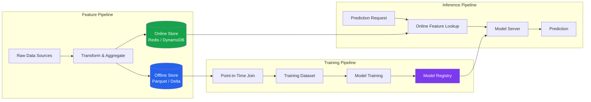

# [BEE-30081] AI Feature Stores for ML Inference

:::info
A feature store is shared infrastructure that separates feature computation from model training and inference. It provides an offline store for training datasets and an online store for low-latency serving — with a guarantee that the same feature values are available in both paths. Without this separation, duplicate transformation logic causes train-serve skew, which is the leading cause of silent accuracy degradation in production ML systems.
:::

## Context

Machine learning models in production depend on features — transformed, aggregated, or joined representations of raw data. Before dedicated feature store infrastructure, each team wrote transformation code twice: once in Python for the training pipeline and once in a serving language (Java, Go, SQL) for real-time inference. The two implementations diverged over time, causing train-serve skew: models encountered feature distributions at inference time that differed from training, silently degrading accuracy with no observable error.

Uber's Michelangelo platform, described in a September 2017 engineering blog post, formalized the feature store concept as production infrastructure. Michelangelo addressed cross-team feature reuse — features computed by one team could be shared with others — and established the offline/online duality as the central architectural abstraction. Airbnb followed with Zipline in 2018 (presented at Strata NY), reporting that the tool reduced feature generation time from months to approximately one day.

The first major academic treatment appeared in VLDB 2021 (Orr et al., "Managing ML Pipelines: Feature Stores and the Coming Wave of Embedding Ecosystems," https://dl.acm.org/doi/10.14778/3476311.3476402). Hopsworks published a feature store paper at SIGMOD 2024 (https://dl.acm.org/doi/10.1145/3626246.3653389), the first feature store paper at a top-tier database conference.

LinkedIn open-sourced Feathr in April 2022 (https://github.com/feathr-ai/feathr), originally in production since 2017. Feast (https://github.com/feast-dev/feast) became the dominant open-source option with approximately 7,000 stars and an Apache 2.0 license. Tecton, the leading commercial feature store, was founded by the original Michelangelo team and acquired by Databricks in August 2025 (https://www.databricks.com/blog/tecton-joining-databricks-power-real-time-data-personalized-ai-agents).

## The Train-Serve Skew Problem

Train-serve skew arises from four root causes:

**Duplicate transformation code.** The same feature — say, a 30-day rolling average — is implemented once in PySpark for offline training and again in the serving layer. Small implementation differences (null handling, timezone treatment, floating-point rounding) produce different values.

**Data source divergence.** Training reads from a historical data warehouse snapshot. Inference reads from a transactional database or stream. The two sources have different schemas, update cadences, or latency profiles.

**Null vs zero mismatch.** Missing values are treated as zero in one path and as null in the other. For tree models, null propagation differs from zero. For neural networks, zero imputation changes the input distribution.

**Schema drift.** Upstream data schema changes in the serving path before the training pipeline is updated, or vice versa.

A feature store eliminates skew by defining each feature once — as a single Python function or SQL expression — and materializing it to both the offline and online stores from the same code path.

```python
from feast import FeatureView, Feature, FileSource, ValueType
from feast.types import Float64, Int64
import pandas as pd
from datetime import timedelta

# Define feature logic once — used for both training and serving
user_metrics_source = FileSource(
    path="s3://data-lake/user_metrics/",
    timestamp_field="event_timestamp",
)

user_metrics_view = FeatureView(
    name="user_metrics",
    entities=["user_id"],
    ttl=timedelta(days=1),
    schema=[
        Feature(name="purchase_count_30d", dtype=Int64),
        Feature(name="avg_session_duration_7d", dtype=Float64),
        Feature(name="days_since_last_login", dtype=Int64),
    ],
    source=user_metrics_source,
)
```

## Architecture: The FTI Pipelines

The industry-standard decomposition uses three decoupled pipelines, known as FTI:



**Feature pipeline:** Reads raw data, applies transformations, and writes results to both the offline store (for training) and the online store (for serving). This is the only place where feature logic executes. Materialization is typically a batch job (hourly or daily) for historical features, supplemented by streaming computation for real-time features.

**Training pipeline:** Reads from the offline store with a point-in-time join (described below). Produces a training dataset with no label leakage.

**Inference pipeline:** At prediction time, looks up current feature values from the online store by entity key (e.g., `user_id`). The online store returns the most recently materialized values.

## Point-in-Time Correctness

Historical training datasets must reflect the feature values that would have been available at prediction time — not the values known in hindsight. A feature that is joined by exact timestamp join uses the feature value at the exact event timestamp, but in production the feature may not have been computed until seconds or minutes later.

An as-of join returns the most recent feature value that was available on or before the event timestamp:

```python
import pandas as pd

def point_in_time_join(
    entity_df: pd.DataFrame,
    feature_df: pd.DataFrame,
    entity_col: str,
    timestamp_col: str,
    feature_timestamp_col: str,
) -> pd.DataFrame:
    """
    For each row in entity_df, find the most recent feature value
    in feature_df that was available at or before entity_df[timestamp_col].

    Prevents label leakage by excluding feature values computed after
    the prediction timestamp.
    """
    entity_df = entity_df.sort_values(timestamp_col)
    feature_df = feature_df.sort_values(feature_timestamp_col)

    result = pd.merge_asof(
        entity_df,
        feature_df,
        left_on=timestamp_col,
        right_on=feature_timestamp_col,
        by=entity_col,
        direction="backward",  # as-of: most recent value before timestamp
    )
    return result


# Example usage
entity_df = pd.DataFrame({
    "user_id": [101, 101, 202],
    "event_timestamp": pd.to_datetime(
        ["2024-01-15 10:00", "2024-01-20 14:00", "2024-01-18 09:00"]
    ),
    "label": [1, 0, 1],
})

feature_df = pd.DataFrame({
    "user_id": [101, 101, 101, 202],
    "feature_timestamp": pd.to_datetime(
        ["2024-01-10 00:00", "2024-01-17 00:00", "2024-01-22 00:00", "2024-01-15 00:00"]
    ),
    "purchase_count_30d": [5, 8, 12, 3],
})

training_data = point_in_time_join(
    entity_df, feature_df, "user_id", "event_timestamp", "feature_timestamp"
)
# Row 1 (Jan 15): gets feature from Jan 10 (value=5), not Jan 17
# Row 2 (Jan 20): gets feature from Jan 17 (value=8), not Jan 22
```

## Online Serving

The online store must return feature vectors in under 10ms at production query rates. Tecton specified a target of under 5ms at 100,000 requests per second.

```python
import redis
import json
import time
from dataclasses import dataclass
from typing import Optional

@dataclass
class FeatureVector:
    entity_id: str
    features: dict[str, float | int | str]
    materialized_at: float  # unix timestamp
    age_seconds: float      # time since materialization


class OnlineFeatureStore:
    def __init__(self, redis_url: str, ttl_seconds: int = 86400):
        self.client = redis.Redis.from_url(redis_url, decode_responses=True)
        self.ttl_seconds = ttl_seconds

    def get_features(
        self,
        feature_view: str,
        entity_id: str,
        feature_names: list[str],
    ) -> Optional[FeatureVector]:
        key = f"fv:{feature_view}:{entity_id}"
        data = self.client.hgetall(key)
        if not data:
            return None

        materialized_at = float(data.get("_ts", 0))
        features = {
            name: json.loads(data[name])
            for name in feature_names
            if name in data
        }

        return FeatureVector(
            entity_id=entity_id,
            features=features,
            materialized_at=materialized_at,
            age_seconds=time.time() - materialized_at,
        )

    def materialize(
        self,
        feature_view: str,
        entity_id: str,
        features: dict[str, float | int | str],
    ) -> None:
        key = f"fv:{feature_view}:{entity_id}"
        payload = {name: json.dumps(val) for name, val in features.items()}
        payload["_ts"] = str(time.time())
        self.client.hset(key, mapping=payload)
        self.client.expire(key, self.ttl_seconds)


# Inference call with stale-value guard
def get_features_with_freshness_check(
    store: OnlineFeatureStore,
    feature_view: str,
    entity_id: str,
    feature_names: list[str],
    max_age_seconds: float = 3600,
) -> dict[str, float | int | str]:
    fv = store.get_features(feature_view, entity_id, feature_names)

    if fv is None:
        # Entity not in online store — use default or trigger on-demand compute
        return {name: 0.0 for name in feature_names}

    if fv.age_seconds > max_age_seconds:
        # Log staleness — do not fail, serve with warning
        import logging
        logging.warning(
            "Stale features for %s/%s: %.0fs old (max %s)",
            feature_view, entity_id, fv.age_seconds, max_age_seconds,
        )

    return fv.features
```

## Materialization Strategies

| Strategy | Latency | Freshness | Use Case |
|---|---|---|---|
| Batch (hourly/daily) | N/A | Minutes to hours | User-level aggregates, slow-changing features |
| Micro-batch (1–5 min) | N/A | Minutes | Session aggregates, recent event counts |
| Streaming (Kafka + Flink) | Real-time | Seconds | Real-time signals: click, add-to-cart, fraud |
| On-demand (request-time) | Adds to p99 | Always fresh | Features requiring request context |

Streaming materialization requires a stream processing job that consumes events and writes to the online store atomically:

```python
from pyflink.datastream import StreamExecutionEnvironment
from pyflink.table import StreamTableEnvironment

env = StreamExecutionEnvironment.get_execution_environment()
t_env = StreamTableEnvironment.create(env)

# Streaming feature: 1-hour rolling purchase count
t_env.execute_sql("""
    CREATE TABLE purchases (
        user_id BIGINT,
        amount DECIMAL(10,2),
        event_time TIMESTAMP(3),
        WATERMARK FOR event_time AS event_time - INTERVAL '5' SECOND
    ) WITH (
        'connector' = 'kafka',
        'topic' = 'purchases',
        'format' = 'json'
    )
""")

t_env.execute_sql("""
    CREATE TABLE user_purchase_features (
        user_id BIGINT,
        purchase_count_1h BIGINT,
        window_end TIMESTAMP(3),
        PRIMARY KEY (user_id) NOT ENFORCED
    ) WITH (
        'connector' = 'redis',
        'host' = 'redis.internal',
        'ttl' = '7200'
    )
""")

t_env.execute_sql("""
    INSERT INTO user_purchase_features
    SELECT
        user_id,
        COUNT(*) AS purchase_count_1h,
        TUMBLE_END(event_time, INTERVAL '1' HOUR) AS window_end
    FROM purchases
    GROUP BY user_id, TUMBLE(event_time, INTERVAL '1' HOUR)
""")
```

## Common Mistakes

**Skipping the offline store.** Some teams build only an online store (a Redis cache for features). Without an offline store, the training pipeline cannot reproduce historical feature values — point-in-time joins become impossible and train-serve skew is guaranteed.

**Using wall-clock time for as-of joins.** Training datasets assembled with exact-timestamp joins instead of as-of joins silently include features that were not available at prediction time. The model learns from the future. Accuracy on historical evaluation is inflated; live accuracy is lower.

**Sharing transformation code between pipelines without governance.** If the feature pipeline and a manual data science notebook both transform the same raw column in slightly different ways, the notebook version accumulates and trains a model that the feature store cannot reproduce. All transformations MUST originate from the feature store definition.

**Ignoring feature freshness in serving.** Online stores return the most recently materialized value. If materialization is hourly but a feature becomes stale after 30 minutes for your use case (e.g., fraud scoring), serving a 59-minute-old value produces a worse prediction than a default fallback. Always track `age_seconds` and define a maximum staleness threshold per feature view.

**Over-indexing on real-time features.** Streaming computation is significantly more complex and expensive than batch. Most features for user-level models — 30-day aggregates, cohort membership, cumulative spend — change slowly. Reserve streaming for features where freshness directly changes the prediction: fraud signals, session-level context, inventory availability.

## Related BEEs

- [BEE-30001 LLM API Integration Patterns](/ai-backend-patterns/llm-api-integration-patterns) — LLM inference pipelines that consume features from online stores for prompt augmentation
- [BEE-30007 RAG Pipeline Architecture](/ai-backend-patterns/rag-pipeline-architecture) — vector retrieval as a form of on-demand feature computation
- [BEE-30027 AI Workflow Orchestration](/ai-backend-patterns/ai-workflow-orchestration) — orchestrating the feature pipeline alongside training and serving workflows
- [BEE-6007 Database Migrations](/data-storage/database-migrations) — schema evolution in the offline store (Parquet/Delta schema changes)
- [BEE-19018 Change Data Capture](/distributed-systems/change-data-capture) — CDC as the source stream for real-time feature materialization

## References

- Uber Engineering, "Meet Michelangelo: Uber's Machine Learning Platform," September 5, 2017. https://www.uber.com/blog/michelangelo-machine-learning-platform/
- Airbnb Engineering, "Zipline: Airbnb's Machine Learning Data Management Platform," Strata NY 2018. https://conferences.oreilly.com/strata/strata-ny-2018/public/schedule/detail/68114.html
- Orr, L. et al., "Managing ML Pipelines: Feature Stores and the Coming Wave of Embedding Ecosystems," VLDB 2021. https://dl.acm.org/doi/10.14778/3476311.3476402
- Hopsworks, "A Feature Store for AI," SIGMOD 2024. https://dl.acm.org/doi/10.1145/3626246.3653389
- Feast documentation. https://docs.feast.dev/
- Databricks, "Tecton Joining Databricks," August 2025. https://www.databricks.com/blog/tecton-joining-databricks-power-real-time-data-personalized-ai-agents
- AWS SageMaker Feature Store concepts. https://docs.aws.amazon.com/sagemaker/latest/dg/feature-store-concepts.html
- Vertex AI Feature Store overview. https://cloud.google.com/vertex-ai/docs/featurestore/latest/overview
