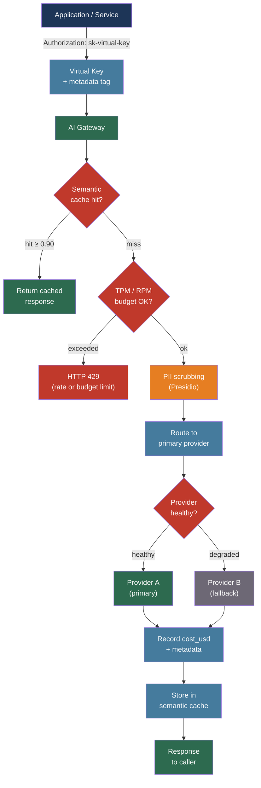

# [BEE-515] AI Gateway Patterns

:::info
An AI gateway is a reverse proxy purpose-built for LLM traffic that centralizes token-based rate limiting, multi-provider failover, cost attribution, semantic caching, and PII scrubbing — concerns that a standard API gateway handles inadequately because LLM requests and responses are asymmetric in size, cost, and latency in ways that HTTP-level primitives do not model.
:::

## Context

The standard API gateway model handles requests at the HTTP level: it rate-limits by request count, routes by path, and logs headers and status codes. This model breaks for LLM traffic. A single LLM request might consume anywhere from 50 tokens to 50,000 tokens in its response. Rate limiting by request count lets a single client exhaust a provider's token-per-minute (TPM) quota with a handful of requests that trigger long generations. HTTP-level logging captures no information about model choice, token consumption, or cost. Provider API keys live in application code rather than being centrally managed.

The operational pattern that emerged by 2024 is the AI gateway: a proxy layer that understands the LLM request/response format, extracts token counts from responses, and enforces policies that the application layer should not have to implement independently. The AI gateway is not a replacement for an API gateway — it sits behind an API gateway that handles TLS termination, authentication, and coarse-grained routing, and in front of LLM providers.

The primary open-source implementation is LiteLLM Proxy (BerriAI), which normalizes the OpenAI API interface across 100+ model providers and adds virtual key management, budget enforcement, semantic caching, and fallback routing. Commercial equivalents include Portkey, Cloudflare AI Gateway, Kong AI Gateway, and Azure API Management's AI gateway capabilities.

## Design Thinking

An AI gateway addresses five concerns that an application cannot address cleanly on its own:

**Token-level rate limiting**: Provider quotas are denominated in tokens per minute, not requests per minute. An application that enforces RPM limits but not TPM limits will hit provider 429 errors unpredictably. The gateway tracks token consumption from response metadata and enforces TPM limits before requests leave the data center.

**Multi-provider failover**: Any single provider has regional outages, context-window limits on specific models, and rate limits that vary by account tier. A gateway that maintains a provider health model can route around failures without application code changes.

**Cost attribution**: LLM API spend with no attribution has no owner and grows silently. The gateway is the one place where every LLM call passes through — making it the right place to tag spend by team, feature, or tenant before it reaches the provider.

**Centralized credential management**: Rotating provider API keys is painful when keys are embedded in many services. A gateway issues virtual keys to services and holds the real provider keys centrally; rotation happens in one place.

**Compliance enforcement**: PII scrubbing and prompt/response logging for audit must happen reliably, not as a best-effort application concern. The gateway enforces it at the network layer.

## Best Practices

### Use Virtual Keys for Access Control and Budget Enforcement

**MUST** issue virtual keys to every consumer of the AI gateway rather than distributing real provider API keys. Virtual keys decouple gateway credentials from provider credentials: when a provider key rotates, only the gateway configuration changes.

**SHOULD** assign per-key budgets and rate limits that reflect the consumer's role:

```yaml
# LiteLLM Proxy: virtual key configuration
model_list:
  - model_name: "gpt-4o"
    litellm_params:
      model: openai/gpt-4o
      api_key: os.environ/OPENAI_API_KEY
  - model_name: "claude-sonnet"
    litellm_params:
      model: anthropic/claude-sonnet-4-6
      api_key: os.environ/ANTHROPIC_API_KEY

general_settings:
  master_key: sk-gateway-master   # admin key; never distributed to consumers

# Virtual key properties set via API:
# POST /key/generate
# {
#   "models": ["gpt-4o", "claude-sonnet"],
#   "max_budget": 50.00,           # USD hard limit; 429 after exhaustion
#   "tpm_limit": 100000,           # tokens per minute
#   "rpm_limit": 100,              # requests per minute
#   "budget_duration": "1d",       # reset daily
#   "team_id": "search-team",
#   "metadata": {"feature": "semantic-search"}
# }
```

**SHOULD** organize keys in a three-level hierarchy: organization → team → key. Budget limits at higher levels cascade to lower levels, preventing a single team from exhausting the organization's monthly budget.

**MUST NOT** share a virtual key between production and non-production environments. Keys carry budgets; a load test that exhausts a production budget before a real traffic peak is a service disruption.

### Enforce Token-Based Rate Limits, Not Just Request-Based

**MUST** enforce TPM (tokens per minute) rate limits at the gateway, separate from RPM limits. RPM alone does not bound token consumption:

```python
# Without TPM limits: 5 RPM allows unlimited token consumption
# Request 1: 50 tokens (simple classification)
# Request 2: 48,000 tokens (long document analysis)
# Both pass RPM check; second exhausts a 50K TPM quota

# With TPM enforcement at gateway:
# Gateway reads usage.total_tokens from provider response
# Deducts from per-key TPM counter
# Returns HTTP 429 with Retry-After when limit reached
```

**SHOULD** set TPM limits that leave headroom for concurrent requests. A key with a 100K TPM limit should alert at 80K utilization — the last 20% may already be in-flight requests whose token counts are not yet known.

**SHOULD** configure both provider-level failover (when a provider returns 429) and pre-emptive routing (when a key's TPM utilization exceeds a threshold, route to a secondary provider rather than waiting for a 429):

```yaml
# LiteLLM router: provider-level fallback on rate limit
router_settings:
  routing_strategy: "usage-based-routing-v2"
  model_group_alias:
    gpt-4o-primary:
      - model: openai/gpt-4o
        tpm: 500000
        rpm: 1000
    gpt-4o-fallback:
      - model: azure/gpt-4o-eastus
        tpm: 500000
        rpm: 1000

  fallbacks:
    - gpt-4o-primary: ["gpt-4o-fallback"]
  context_window_fallbacks:
    - gpt-4o-mini: ["gpt-4o"]   # escalate when context exceeds mini's limit
```

### Implement Multi-Provider Failover with Circuit Breaking

**SHOULD** configure the gateway to treat provider health as a first-class concern. A healthy failover chain has at least two independent providers for each model tier:

| Tier | Primary | Secondary | Tertiary |
|------|---------|-----------|---------|
| Light | OpenAI gpt-4o-mini | Anthropic Haiku | Google Gemini Flash |
| Standard | OpenAI gpt-4o | Anthropic Sonnet | Azure gpt-4o |
| Heavy | Anthropic Opus | OpenAI gpt-4 | — |

**SHOULD** use exponential backoff with jitter on provider errors before triggering failover. Transient rate limits (429) recover within seconds; circuit-breaking on the first 429 causes unnecessary provider switching:

```python
# LiteLLM retry and fallback configuration
import litellm

litellm.set_verbose = False
response = litellm.completion(
    model="gpt-4o",
    messages=messages,
    num_retries=3,
    # Retry on these status codes before triggering fallback
    retry_on=[429, 500, 503],
    fallbacks=[
        {"gpt-4o": ["azure/gpt-4o", "anthropic/claude-sonnet-4-6"]}
    ],
    context_window_fallbacks=[
        {"gpt-4o-mini": ["gpt-4o"]}  # escalate on ContextWindowExceededError
    ],
    timeout=30,
)
```

**SHOULD** track provider latency and error rate at the gateway and expose them as metrics. P95 TTFT (time-to-first-token) per provider is the leading indicator of provider degradation before hard errors appear.

### Attribute Cost at Every Request

**MUST** record `cost_usd`, `input_tokens`, `output_tokens`, `model`, and at minimum one business dimension (`team_id`, `feature`, `tenant_id`) for every request that passes through the gateway. This data is the prerequisite for knowing which optimization to apply first (see BEE-513).

**SHOULD** enforce the tagging at the gateway rather than trusting the application layer:

```bash
# Consumer passes metadata in the request; gateway records it
curl https://ai-gateway.internal/v1/chat/completions \
  -H "Authorization: Bearer sk-virtual-key-abc" \
  -H "X-Gateway-Metadata: {\"feature\":\"doc-search\",\"tenant\":\"acme\"}" \
  -d '{"model": "gpt-4o", "messages": [...]}'

# Gateway extracts cost from response, writes to cost ledger:
# {
#   "key_id": "sk-virtual-key-abc",
#   "team_id": "search-team",
#   "feature": "doc-search",
#   "tenant": "acme",
#   "model": "openai/gpt-4o",
#   "input_tokens": 1240,
#   "output_tokens": 380,
#   "cost_usd": 0.004700,
#   "timestamp": "2026-04-15T03:22:11Z"
# }
```

**SHOULD** set daily budget alerts at 50% and 80% of the monthly budget, and hard limits at 100%. A hard limit at the gateway returns HTTP 429 with a budget-exhausted error code — this is preferable to a surprise on the monthly invoice.

### Apply Semantic Caching at the Gateway Layer

Gateway-level semantic caching operates independently of application caches and benefits all consumers without per-application implementation:

**SHOULD** enable semantic caching at the gateway for request distributions that cluster around common questions. Cache hit rates of 30–70% are typical for knowledge-base and support workloads:

```yaml
# LiteLLM: semantic cache with Redis vector store
cache:
  type: "redis-semantic"
  redis_url: "redis://cache.internal:6379"
  similarity_threshold: 0.90   # cosine similarity; cached response returned above this
  ttl: 3600                    # 1-hour TTL; tune per workload freshness requirements
  # Keys cached: model + normalized message list hash
  # Near-duplicate queries return the same response without hitting the provider
```

**MUST NOT** cache responses to queries that include real-time context (current time, live prices, user-specific state). Tag these request patterns with `Cache-Control: no-store` at the application layer and honor the header at the gateway.

### Scrub PII Before Requests Leave the Perimeter

**MUST** configure PII scrubbing for any gateway that handles user-submitted text destined for a third-party provider. PII in prompts is transmitted to and potentially logged by the provider.

**SHOULD** scrub at the network layer, not the application layer, so that the policy applies to all consumers uniformly:

```python
# LiteLLM: callback-based PII scrubbing before provider call
import litellm
from presidio_analyzer import AnalyzerEngine
from presidio_anonymizer import AnonymizerEngine

analyzer = AnalyzerEngine()
anonymizer = AnonymizerEngine()

def scrub_pii(messages: list[dict]) -> list[dict]:
    scrubbed = []
    for msg in messages:
        if msg["role"] == "user":
            results = analyzer.analyze(text=msg["content"], language="en")
            anonymized = anonymizer.anonymize(text=msg["content"], analyzer_results=results)
            scrubbed.append({**msg, "content": anonymized.text})
        else:
            scrubbed.append(msg)
    return scrubbed

# Register as pre-call hook in LiteLLM
litellm.pre_call_hook = lambda kwargs, **_: {
    **kwargs,
    "messages": scrub_pii(kwargs["messages"])
}
```

**SHOULD** log scrubbing events (entity type detected, not the entity value) for compliance audit trails. This demonstrates that PII controls are operating without reintroducing PII into logs.

### Choose Deployment Topology Deliberately

Two deployment topologies cover most team configurations:

**Centralized gateway** — a single gateway deployment handles all LLM traffic across services:

```
Services → [AI Gateway] → [LLM Providers]
              |
           [Cost DB]
           [Cache]
           [Audit Log]
```

Advantages: one place for policy, one audit trail, one cost dashboard. Appropriate for teams with fewer than 10 services consuming LLMs.

**Sidecar per namespace** — each product namespace runs its own gateway instance with shared backing stores:

```
[Team A services] → [Gateway A] ─┐
[Team B services] → [Gateway B] ─┤→ [LLM Providers]
[Team C services] → [Gateway C] ─┘
                        |
              [Shared Cost DB / Cache]
```

Advantages: data-residency compliance, per-team policy autonomy, failure isolation. Required when different teams have different regulatory requirements (HIPAA vs. non-regulated).

**SHOULD** start with a centralized gateway. The operational complexity of sidecar deployments — each gateway instance has its own configuration, upgrade cycle, and failure mode — is only justified by concrete compliance or isolation requirements.

## Visual



## Related BEEs

- [BEE-19036](../distributed-systems/api-gateway-patterns.md) -- API Gateway Patterns: the general-purpose gateway pattern that the AI gateway sits behind; TLS termination, authentication, and path routing remain there
- [BEE-30011](ai-cost-optimization-and-model-routing.md) -- AI Cost Optimization and Model Routing: the gateway is the enforcement point for model routing tiers and per-feature cost budgets described in cost optimization
- [BEE-30009](llm-observability-and-monitoring.md) -- LLM Observability and Monitoring: TTFT, token throughput, and cost_usd metrics emitted by the gateway feed the observability dashboards and alert rules
- [BEE-30008](llm-security-and-prompt-injection.md) -- LLM Security and Prompt Injection: PII scrubbing and output guardrails configured at the gateway implement part of the defense-in-depth strategy for LLM security
- [BEE-12007](../resilience/rate-limiting-and-throttling.md) -- Rate Limiting and Throttling: token-per-minute enforcement is a domain-specific application of the general rate limiting patterns covered there

## References

- [BerriAI. LiteLLM Proxy — Simple Proxy Server — docs.litellm.ai](https://docs.litellm.ai/docs/simple_proxy)
- [BerriAI. LiteLLM Virtual Keys — docs.litellm.ai](https://docs.litellm.ai/docs/proxy/virtual_keys)
- [BerriAI. LiteLLM Router — Load Balancing — docs.litellm.ai](https://docs.litellm.ai/docs/routing)
- [Portkey. AI Gateway Documentation — portkey.ai/docs](https://portkey.ai/docs/product/ai-gateway)
- [Kong Inc. AI Gateway — developer.konghq.com](https://developer.konghq.com/ai-gateway/)
- [Cloudflare. AI Gateway — developers.cloudflare.com](https://developers.cloudflare.com/ai-gateway/)
- [Microsoft. GenAI Gateway Capabilities in Azure API Management — learn.microsoft.com](https://learn.microsoft.com/en-us/azure/api-management/genai-gateway-capabilities)
- [OWASP. GenAI Security Project — genai.owasp.org](https://genai.owasp.org/)
- [Redis. What Is Semantic Caching? Guide to Faster, Smarter LLM Apps — redis.io](https://redis.io/blog/what-is-semantic-caching/)
- [Anthropic. Building Effective Agents — anthropic.com/research](https://www.anthropic.com/research/building-effective-agents)
