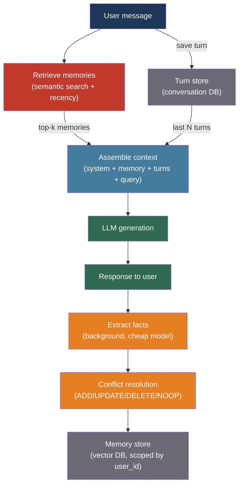

# [BEE-519] AI Memory Systems for Long-Running Agents

:::info
The context window is the agent's entire working memory — bounded, ephemeral, and lost between sessions. Giving agents durable memory requires explicitly storing episodic records, extracted facts, and retrieved context outside the context window, then loading only what is relevant at query time.
:::

## Context

An LLM agent with no external memory is stateless between invocations. Each session starts fresh: the user's name, preferences, prior decisions, and everything that happened in the last conversation are gone. For short-lived tasks this is acceptable. For long-running applications — a coding assistant that tracks a codebase over weeks, a customer support agent that handles the same customer across multiple tickets, a personal assistant that accumulates user preferences — statelessness is a fundamental capability gap.

The MemGPT paper (Packer et al., arXiv:2310.08560, 2023) framed this as an operating system analogy: the context window is RAM, small and fast but volatile; external storage is disk, large and persistent but requiring explicit load/store operations. Just as an OS swaps memory pages between RAM and disk to give programs the illusion of unlimited memory, an agent with external storage can maintain the illusion of unlimited context. MemGPT's open-source successor, the Letta framework, implements this as a production-grade agent runtime.

The Generative Agents paper (Park et al., arXiv:2304.03442, 2023) approached memory from a different angle: simulated human agents that maintain a stream of episodic memories and periodically consolidate them into higher-level reflections. Their retrieval model scores candidate memories on three dimensions — recency, importance, and relevance — and retrieves the highest-scoring combination, closely mirroring how human episodic memory is thought to work.

At production scale, Mem0 (arXiv:2504.19413, 2025) demonstrated that automatic memory extraction and a conflict-resolution update cycle produces a 26% improvement on LLM-as-a-Judge benchmarks over unaugmented models, with 91% lower P95 latency than naive full-history approaches, by keeping only salient facts in the retrieval pool rather than raw conversation turns.

## Design Thinking

Cognitive science distinguishes four memory types that map directly onto agent architecture:

| Memory type | Cognitive role | Agent implementation |
|-------------|---------------|---------------------|
| Working | Active reasoning | Context window — what the model sees right now |
| Episodic | Specific past events | Conversation turn database, retrievable by time or semantic search |
| Semantic | General facts and knowledge | Extracted fact store (key-value or vector) |
| Procedural | How to perform tasks | System prompt, tool definitions, fine-tuned weights |

The engineering challenge is the boundary between working and the three long-term types. Information enters the context window on every request; most of it should not persist; a small fraction is genuinely worth keeping. Identifying and storing that fraction — without flooding the semantic store with noise — is the core problem.

Three design decisions follow from this:

**What triggers memory write?** Write on every turn (high noise), write when the agent decides (tool call overhead), or write asynchronously in a background process (latency-safe but eventual consistency). Background consolidation is the most production-appropriate for non-critical facts.

**What triggers memory read?** Load the last N turns (simple, predictable), or embed the current query and retrieve semantically similar memories (better relevance, added latency). Most systems combine both: recent turns always, older memories on semantic retrieval.

**How is memory structured?** Raw conversation turns (high fidelity, high cost), extracted fact triples (compact, lossy), or hierarchical summaries (intermediate). The Generative Agents reflection pattern — summarize episodes into higher-level observations — is a middle path.

## Best Practices

### Layer Memory by Volatility and Access Pattern

**SHOULD** implement at least two memory tiers:

```
┌─────────────────────────────────────────┐
│  Context Window (working memory)        │  ~8K–32K tokens, ephemeral
│  ┌──────────────────┐                   │
│  │ System prompt    │ ← procedural      │
│  │ Core facts       │ ← semantic (hot)  │
│  │ Recent turns     │ ← episodic (hot)  │
│  │ Retrieved memory │ ← episodic/semantic│
│  └──────────────────┘                   │
└─────────────────────────────────────────┘
         ↕  load/store on each turn
┌─────────────────────────────────────────┐
│  External Storage (long-term memory)   │  unbounded, persistent
│  ┌──────────────────┐                   │
│  │ Episodic store   │ ← conversation DB │
│  │ Semantic store   │ ← fact vector DB  │
│  │ Archival store   │ ← full history    │
│  └──────────────────┘                   │
└─────────────────────────────────────────┘
```

**MUST** keep recent conversation turns in the context window on every request. Semantic retrieval of old memories cannot replace the coherence of the last 3–5 turns; always include those verbatim.

**SHOULD** limit the in-context portion of retrieved memory to a fixed token budget (e.g., 20% of the context window). Unbounded memory retrieval can push the current query and recent turns out of context, defeating the purpose.

### Extract and Store Semantic Facts Asynchronously

**SHOULD** run memory extraction in a background task after each user turn, not in the critical path:

```python
import asyncio
from anthropic import AsyncAnthropic

client = AsyncAnthropic()

EXTRACTION_PROMPT = """
Analyze this conversation turn and extract any facts worth remembering about the user.
Return a JSON list of facts. Each fact: {"fact": "...", "category": "preference|identity|context"}
If nothing is worth remembering, return [].
Only include durable facts, not transient states.

User message: {user_message}
Assistant response: {assistant_response}
"""

async def extract_and_store(
    user_id: str,
    user_message: str,
    assistant_response: str,
    memory_store,
):
    """Runs after the response is already sent to the user."""
    response = await client.messages.create(
        model="claude-haiku-4-5-20251001",  # cheap model for extraction
        max_tokens=512,
        messages=[{
            "role": "user",
            "content": EXTRACTION_PROMPT.format(
                user_message=user_message,
                assistant_response=assistant_response,
            ),
        }],
    )
    facts = json.loads(response.content[0].text)
    for fact in facts:
        await memory_store.upsert(user_id=user_id, **fact)
```

**MUST NOT** block the response to the user while memory extraction runs. Extraction adds latency; users should receive the response first.

**SHOULD** use a cheap, fast model for extraction (Haiku, gpt-4o-mini) rather than the primary generation model. Extraction is a classification/parsing task, not a reasoning task.

### Retrieve Memory Before Generating

**SHOULD** retrieve relevant memories as part of the context assembly step before calling the generation model:

```python
async def assemble_context(
    user_id: str,
    user_query: str,
    memory_store,
    turn_store,
    system_prompt: str,
    context_budget: int = 8000,
) -> list[dict]:
    # 1. Always include recent turns (last 5)
    recent_turns = await turn_store.get_recent(user_id, n=5)

    # 2. Retrieve semantically relevant memories
    relevant_memories = await memory_store.search(
        user_id=user_id,
        query=user_query,
        top_k=10,
    )

    # 3. Fit within context budget
    memory_text = format_memories(relevant_memories)
    if len(tokenize(memory_text)) > context_budget * 0.20:
        relevant_memories = relevant_memories[:5]  # trim if over budget
        memory_text = format_memories(relevant_memories)

    return [
        {"role": "system", "content": system_prompt},
        {"role": "system", "content": f"[User memory]\n{memory_text}"},
        *recent_turns,
        {"role": "user", "content": user_query},
    ]
```

**SHOULD** score retrieved memories by combining recency and relevance, following the Generative Agents approach:

```python
import math
from datetime import datetime, timezone

def memory_score(memory: dict, query_embedding: list[float]) -> float:
    # Recency: exponential decay with 1-hour half-life
    age_hours = (datetime.now(timezone.utc) - memory["created_at"]).total_seconds() / 3600
    recency = math.exp(-0.693 * age_hours)  # 0.693 ≈ ln(2)

    # Relevance: cosine similarity (pre-computed and stored with memory)
    relevance = cosine_similarity(query_embedding, memory["embedding"])

    # Importance: LLM-rated 1-10 at extraction time, normalized
    importance = memory.get("importance", 5) / 10.0

    return recency * 0.3 + relevance * 0.5 + importance * 0.2
```

### Use a Conflict-Resolution Update Cycle

New facts frequently contradict old ones ("the user used to prefer Python, now prefers TypeScript"). Storing both creates noise; the agent must resolve conflicts on write:

**SHOULD** implement ADD / UPDATE / DELETE / NOOP logic when writing new facts, following the Mem0 pattern:

```python
CONFLICT_PROMPT = """
New fact: {new_fact}
Existing similar facts: {existing_facts}

Decide the operation:
- ADD: new fact is novel, no conflict
- UPDATE: new fact supersedes an existing fact (return the ID to update)
- DELETE: new fact contradicts an existing fact (return the ID to delete)
- NOOP: new fact is already captured

Respond with JSON: {{"operation": "ADD|UPDATE|DELETE|NOOP", "target_id": "..."}}
"""

async def upsert_memory(user_id: str, new_fact: str, memory_store, llm):
    # Search for similar existing facts
    candidates = await memory_store.search(user_id=user_id, query=new_fact, top_k=5)

    if not candidates:
        await memory_store.insert(user_id=user_id, fact=new_fact)
        return

    decision = await llm.extract_json(
        CONFLICT_PROMPT.format(new_fact=new_fact, existing_facts=format_facts(candidates))
    )
    match decision["operation"]:
        case "ADD":    await memory_store.insert(user_id=user_id, fact=new_fact)
        case "UPDATE": await memory_store.update(decision["target_id"], fact=new_fact)
        case "DELETE": await memory_store.delete(decision["target_id"])
        case "NOOP":   pass  # nothing to do
```

### Scope Memory to Users and Enforce Deletion

**MUST** scope all memory reads and writes to an authenticated user identifier. Memory from user A must never appear in user B's context:

```python
# Every query is scoped — no cross-user leakage possible
async def search_memory(user_id: str, query: str) -> list[dict]:
    return await vector_db.query(
        collection="agent_memory",
        vector=embed(query),
        filter={"user_id": {"$eq": user_id}},  # hard filter, not soft
        top_k=10,
    )
```

**MUST** implement a deletion API that removes all memory for a user on request. GDPR Article 17 (right to erasure) requires that persistent personal data be deletable:

```python
async def delete_user_memory(user_id: str, memory_store, turn_store):
    """Hard delete — removes all stored data for this user."""
    await memory_store.delete_all(user_id=user_id)
    await turn_store.delete_all(user_id=user_id)
    # Log the deletion for compliance audit trail
    await audit_log.record(action="memory_erasure", user_id=user_id)
```

**SHOULD** set TTL (time-to-live) on episodic records. Verbatim conversation turns do not need to be kept indefinitely; 30–90 days covers most re-engagement windows. Extracted semantic facts have longer useful lifetimes but should also be reviewed periodically.

### Apply the Reflection Pattern for Long-Running Sessions

For agents that accumulate many episodic memories over time, direct retrieval becomes noisy. The Generative Agents reflection pattern consolidates episodic memories into higher-level semantic observations:

**MAY** run periodic reflection to synthesize episodic records:

```python
REFLECTION_PROMPT = """
Given these recent conversation summaries, generate 3-5 high-level observations
about this user that would help an assistant serve them better in the future.
Be specific and factual. No speculation.

Recent memories:
{memories}
"""

async def run_reflection(user_id: str, memory_store, llm):
    # Run when accumulated importance score exceeds threshold
    recent = await memory_store.get_recent_episodic(user_id, n=20)
    total_importance = sum(m["importance"] for m in recent)
    if total_importance < 100:  # threshold from Generative Agents paper
        return

    observations = await llm.extract_list(
        REFLECTION_PROMPT.format(memories=format_episodes(recent))
    )
    for obs in observations:
        await memory_store.insert(
            user_id=user_id,
            fact=obs,
            type="reflection",
            importance=8,  # reflections are high-importance by definition
        )
```

## Visual



## Related BEEs

- [BEE-30002](ai-agent-architecture-patterns.md) -- AI Agent Architecture Patterns: memory systems are a key component of the stateful agent architecture; orchestrator and subagent patterns interact with memory at different scopes
- [BEE-30007](rag-pipeline-architecture.md) -- RAG Pipeline Architecture: semantic memory retrieval uses the same ANN search and reranking pipeline as RAG; memory and RAG share vector infrastructure
- [BEE-30010](llm-context-window-management.md) -- LLM Context Window Management: the in-context portion of memory competes with retrieved documents, conversation history, and system prompt for the same token budget
- [BEE-30014](embedding-models-and-vector-representations.md) -- Embedding Models and Vector Representations: memory retrieval depends on embedding quality; the same model selection and caching considerations apply to memory embeddings

## References

- [Charles Packer et al. MemGPT: Towards LLMs as Operating Systems — arXiv:2310.08560, 2023](https://arxiv.org/abs/2310.08560)
- [Joon Sung Park et al. Generative Agents: Interactive Simulacra of Human Behavior — arXiv:2304.03442, 2023](https://arxiv.org/abs/2304.03442)
- [Mem0 Team. Mem0: Building Production-Ready AI Agents with Scalable Long-Term Memory — arXiv:2504.19413, 2025](https://arxiv.org/abs/2504.19413)
- [Theodore R. Sumers et al. Cognitive Architectures for Language Agents — arXiv:2309.02427, 2023](https://arxiv.org/abs/2309.02427)
- [Letta. Stateful Agents Framework — github.com/letta-ai/letta](https://github.com/letta-ai/letta)
- [Mem0. Universal Memory Layer for AI Agents — github.com/mem0ai/mem0](https://github.com/mem0ai/mem0)
- [OpenAI. Memory and New Controls for ChatGPT — openai.com](https://openai.com/index/memory-and-new-controls-for-chatgpt/)
- [GDPR Article 17. Right to Erasure — gdpr-info.eu](https://gdpr-info.eu/art-17-gdpr/)
