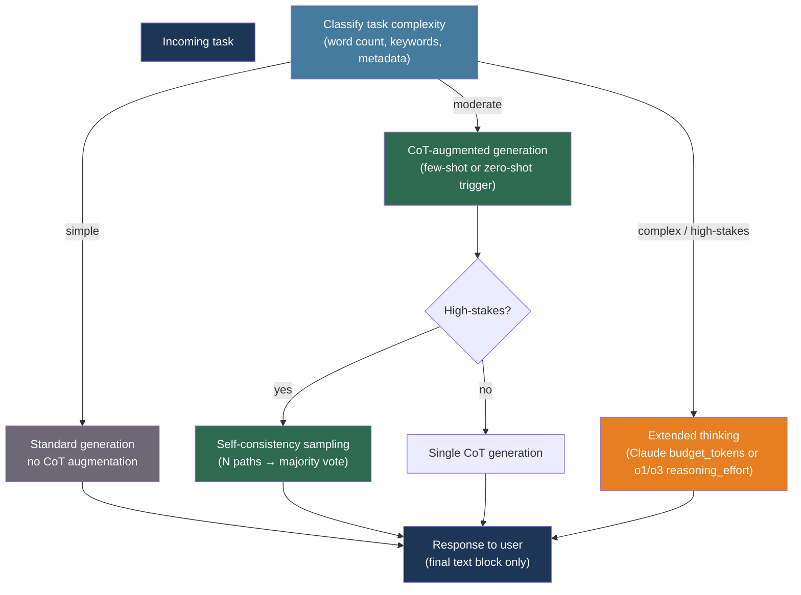

# [BEE-525] Chain-of-Thought and Extended Thinking Patterns

:::info
Chain-of-thought prompting and extended thinking models both trade inference cost for reasoning quality — the key engineering decisions are knowing when that trade is worth making, how to invoke each approach, and how to route between them based on task complexity.
:::

## Context

LLMs are autoregressive: they predict one token at a time, and each token is conditioned only on what came before. This means that asking a model to produce an answer directly collapses all reasoning into a single generation step with no opportunity for intermediate error correction. Wei et al. (arXiv:2201.11903, NeurIPS 2022) showed that providing worked examples — demonstrations where intermediate reasoning steps appear before the final answer — dramatically improves accuracy on multi-step arithmetic and commonsense reasoning benchmarks. Kojima et al. (arXiv:2205.11916, NeurIPS 2022) showed that the same effect is achievable without examples: appending "Let's think step by step" to the user's question causes the model to produce a reasoning trace before the answer, improving zero-shot performance by up to 40 percentage points on some benchmarks.

The mechanism is informational. The reasoning tokens become part of the prompt for the next prediction: each step the model writes conditions the generation of subsequent steps, effectively giving the model working memory that extends beyond the original prompt. Wang et al. (arXiv:2203.11171, ICLR 2023) extended this with self-consistency: sample the same reasoning-augmented prompt multiple times at temperature > 0, then take the most frequent final answer. This marginalization over reasoning paths consistently outperforms single-sample CoT.

The next generation of reasoning models internalizes this process. OpenAI's o1/o3 series and Anthropic's extended thinking mode run chain-of-thought reasoning internally before producing a response, spending additional compute at inference time rather than requiring prompt engineering. Snell et al. (arXiv:2408.03314, 2024) showed that this test-time compute scaling is more efficient than simply using a larger model: a smaller model with 4× more test-time compute can outperform a model 14× larger on reasoning benchmarks. DeepSeek-R1 (arXiv:2501.12948, 2025) demonstrated that pure reinforcement learning on outcome rewards causes models to spontaneously develop self-reflection, verification, and backtracking behaviors — without any labeled reasoning traces in training.

## Design Thinking

There are two distinct mechanisms and they are not interchangeable:

**Prompt-based CoT** works on any model by adding reasoning instructions or examples to the prompt. It is low-cost to add, increases output token count (and therefore cost and latency linearly), and the reasoning is visible and controllable. The thinking appears in the output that users see.

**Model-native extended thinking** (o1/o3, Claude extended thinking) runs an internal reasoning phase before generating the final response. The reasoning is separate from the visible output, typically costs more per token, but produces qualitatively different reasoning — the model can backtrack, revisit, and verify in ways that linear CoT cannot. This is test-time compute scaling.

The routing decision between these modes (and between thinking-heavy and standard generation) should be made at the task level, not the query level. Most production systems work better with a tiered routing layer that classifies incoming tasks and selects the appropriate inference mode.

## Best Practices

### Use Prompt-Based CoT for Standard Models

**SHOULD** add few-shot CoT examples to the system prompt for tasks that consistently require multi-step reasoning. Concrete examples outperform instruction-only ("reason step by step") for structured domains:

```python
MATH_SYSTEM_PROMPT = """You are a math tutor. When solving problems, always show
your reasoning before stating the answer.

Example:
User: A store sells 3 apples for $1.50. How much do 7 apples cost?
Assistant: Each apple costs $1.50 / 3 = $0.50. Seven apples cost 7 × $0.50 = $3.50.
The answer is $3.50.

Always follow this format: work through the problem step by step, then state the final answer."""
```

**SHOULD** append a zero-shot CoT trigger to the user message when few-shot examples are impractical (dynamic tasks, varied domains). "Let's think step by step" and "Work through this carefully" are the most reliably effective triggers:

```python
def add_cot_trigger(user_message: str, task_type: str) -> str:
    triggers = {
        "math": "Let's think step by step.",
        "code_review": "Let's analyze this carefully, checking each part.",
        "planning": "Let's break this down into steps.",
        "default": "Let's think through this step by step.",
    }
    return f"{user_message}\n\n{triggers.get(task_type, triggers['default'])}"
```

**MUST NOT** ask for the final answer before the reasoning. "What is the answer? Show your work" causes the model to commit to an answer and then rationalize it — the opposite of useful reasoning. Ask for reasoning first, answer last.

**SHOULD** use self-consistency sampling for high-stakes decisions where accuracy matters more than latency. Sample 3–5 reasoning paths and take the majority answer:

```python
import asyncio
from collections import Counter
from openai import AsyncOpenAI

client = AsyncOpenAI()

async def self_consistent_answer(prompt: str, n: int = 5) -> str:
    """Sample n reasoning paths and return the most common final answer."""
    tasks = [
        client.chat.completions.create(
            model="gpt-4o",
            messages=[{"role": "user", "content": prompt}],
            temperature=0.7,  # Non-zero temperature required for diversity
        )
        for _ in range(n)
    ]
    responses = await asyncio.gather(*tasks)
    # Extract final answers from each response (application-specific parsing)
    answers = [extract_final_answer(r.choices[0].message.content) for r in responses]
    return Counter(answers).most_common(1)[0][0]
```

### Use Extended Thinking for Complex, High-Stakes Tasks

**SHOULD** route to Claude's extended thinking mode when the task involves multi-step reasoning that cannot be reliably completed in a single linear pass — complex code analysis, multi-step planning, mathematical proof, or decisions with high consequence:

```python
import anthropic

client = anthropic.Anthropic()

def solve_with_extended_thinking(problem: str, budget_tokens: int = 10_000) -> dict:
    """
    Returns {"thinking": str, "answer": str, "thinking_tokens": int}.
    budget_tokens: minimum 1,024; typical range 2,000–30,000.
    """
    response = client.messages.create(
        model="claude-sonnet-4-6",
        max_tokens=16_000,
        thinking={"type": "enabled", "budget_tokens": budget_tokens},
        messages=[{"role": "user", "content": problem}],
    )

    thinking_text = ""
    answer_text = ""
    for block in response.content:
        if block.type == "thinking":
            thinking_text = block.thinking
        elif block.type == "text":
            answer_text = block.text

    return {
        "thinking": thinking_text,
        "answer": answer_text,
        "thinking_tokens": response.usage.cache_read_input_tokens,
        "input_tokens": response.usage.input_tokens,
        "output_tokens": response.usage.output_tokens,
    }
```

For Claude Sonnet 4.6 and Opus 4.6, prefer adaptive thinking which calibrates reasoning depth automatically:

```python
response = client.messages.create(
    model="claude-sonnet-4-6",
    max_tokens=16_000,
    thinking={"type": "adaptive", "effort": "medium"},  # or "high" for hardest tasks
    messages=[{"role": "user", "content": problem}],
)
```

**SHOULD** use OpenAI o1/o3 for tasks in their strength domains (mathematical reasoning, code generation, formal verification) and set `reasoning_effort` based on the cost-quality tradeoff acceptable for the workload:

```python
from openai import OpenAI

client = OpenAI()

def solve_with_o1(problem: str, effort: str = "medium") -> str:
    """
    effort: "low" (faster, cheaper), "medium" (default), "high" (best quality)
    o1/o3 perform chain-of-thought internally — do NOT add CoT prompts.
    """
    response = client.chat.completions.create(
        model="o3",
        messages=[
            # Note: o1-2024-12-17+ uses developer role, not system
            {"role": "developer", "content": "You are an expert software engineer."},
            {"role": "user", "content": problem},
        ],
        reasoning_effort=effort,
    )
    return response.choices[0].message.content
```

**MUST NOT** add "Let's think step by step" or other CoT trigger phrases when calling o1/o3 models. These models run internal reasoning independently of such prompts; adding them can confuse the model or degrade performance.

**MUST NOT** attempt to elicit or display o1/o3's internal reasoning chain. OpenAI does not expose reasoning tokens via the API, and attempting to reconstruct or "jailbreak" the reasoning chain violates their usage policy.

### Implement a Task Complexity Router

**SHOULD** build a lightweight routing layer that selects the inference mode based on task signals, rather than always using the most expensive model:

```python
from enum import Enum

class InferenceMode(Enum):
    STANDARD = "standard"           # gpt-4o, claude-sonnet-4-6 (no extended thinking)
    COT_AUGMENTED = "cot"           # Standard model + CoT prompt
    EXTENDED_THINKING = "extended"  # Claude extended thinking / o1/o3

TASK_SIGNALS = {
    # Keywords that suggest reasoning-heavy tasks
    "hard": ["prove", "derive", "verify", "optimize", "analyze the complexity",
             "debug", "step by step", "multi-step"],
    "medium": ["explain", "compare", "evaluate", "design", "review"],
}

def classify_task(user_message: str, task_metadata: dict | None = None) -> InferenceMode:
    msg_lower = user_message.lower()
    word_count = len(user_message.split())

    # Explicit metadata overrides heuristics
    if task_metadata:
        if task_metadata.get("requires_proof") or task_metadata.get("high_stakes"):
            return InferenceMode.EXTENDED_THINKING

    # Heuristic classification
    hard_signals = sum(1 for kw in TASK_SIGNALS["hard"] if kw in msg_lower)
    if hard_signals >= 2 or word_count > 300:
        return InferenceMode.EXTENDED_THINKING

    medium_signals = sum(1 for kw in TASK_SIGNALS["medium"] if kw in msg_lower)
    if medium_signals >= 1 or word_count > 100:
        return InferenceMode.COT_AUGMENTED

    return InferenceMode.STANDARD


async def route_and_generate(user_message: str, task_metadata: dict | None = None) -> str:
    mode = classify_task(user_message, task_metadata)

    if mode == InferenceMode.EXTENDED_THINKING:
        result = solve_with_extended_thinking(user_message, budget_tokens=10_000)
        return result["answer"]
    elif mode == InferenceMode.COT_AUGMENTED:
        augmented = add_cot_trigger(user_message, "default")
        # Call standard model with CoT-augmented prompt
        return await standard_generate(augmented)
    else:
        return await standard_generate(user_message)
```

### Budget Tokens Proportionally to Task Difficulty

**SHOULD** scale `budget_tokens` with estimated task difficulty rather than using a fixed value. A budget that is too small forces the model to truncate its reasoning; a budget that is too large wastes tokens on simple tasks:

| Task type | Recommended budget_tokens |
|-----------|--------------------------|
| Simple factual with one reasoning step | 1,024–2,000 |
| Multi-step math or logic (3–5 steps) | 2,000–5,000 |
| Complex code analysis or planning | 5,000–15,000 |
| Formal reasoning, proofs, hard research | 15,000–30,000 |

**SHOULD NOT** surface raw thinking tokens to end users by default. Thinking content is verbose internal reasoning that confuses rather than reassures most users. Log it for debugging and quality analysis, but present only the final `text` block to the user. Expose thinking as a developer tool when building AI-assisted debugging interfaces.

## Visual



## When Not to Use Extended Thinking

Extended thinking is not always the right choice. Avoid it when:

- **Latency is the primary constraint.** Extended thinking adds a reasoning phase before the first visible token, increasing TTFT by seconds or more. Real-time conversational features cannot absorb this.
- **The task is primarily retrieval or classification.** Factual lookup, sentiment classification, and simple summarization do not benefit from extended reasoning; the model knows the answer or does not, and more thinking does not change that.
- **The output format is simple.** If the answer is a boolean, a short label, or a number, extended thinking produces verbose reasoning for a trivial conclusion.
- **Budget is not available.** Reasoning tokens are billed as output tokens and can significantly exceed the final answer in token count for hard tasks.

## Related BEEs

- [BEE-30001](llm-api-integration-patterns.md) -- LLM API Integration Patterns: the retry, timeout, and streaming patterns for standard model calls apply to extended thinking calls; the higher latency of extended thinking makes timeout configuration more important
- [BEE-30005](prompt-engineering-vs-rag-vs-fine-tuning.md) -- Prompt Engineering vs RAG vs Fine-Tuning: CoT prompting is a prompt engineering technique that sits alongside RAG and fine-tuning in the capability ladder
- [BEE-30010](llm-context-window-management.md) -- LLM Context Window Management: extended thinking outputs consume the context window; thinking blocks from previous turns must be handled carefully in multi-turn conversations
- [BEE-30011](ai-cost-optimization-and-model-routing.md) -- AI Cost Optimization and Model Routing: extended thinking models cost more per call; the task complexity router described here is a cost optimization layer

## References

- [Wei et al. Chain-of-Thought Prompting Elicits Reasoning in Large Language Models — arXiv:2201.11903, NeurIPS 2022](https://arxiv.org/abs/2201.11903)
- [Kojima et al. Large Language Models are Zero-Shot Reasoners — arXiv:2205.11916, NeurIPS 2022](https://arxiv.org/abs/2205.11916)
- [Wang et al. Self-Consistency Improves Chain of Thought Reasoning — arXiv:2203.11171, ICLR 2023](https://arxiv.org/abs/2203.11171)
- [Yao et al. Tree of Thoughts: Deliberate Problem Solving with Large Language Models — arXiv:2305.10601, NeurIPS 2023](https://arxiv.org/abs/2305.10601)
- [Snell et al. Scaling LLM Test-Time Compute Optimally — arXiv:2408.03314, 2024](https://arxiv.org/abs/2408.03314)
- [DeepSeek Team. DeepSeek-R1: Incentivizing Reasoning via RL — arXiv:2501.12948, 2025](https://arxiv.org/abs/2501.12948)
- [Anthropic. Extended Thinking — platform.claude.com](https://platform.claude.com/docs/en/build-with-claude/extended-thinking)
- [OpenAI. Reasoning Models (o1/o3) — platform.openai.com](https://platform.openai.com/docs/guides/reasoning)
