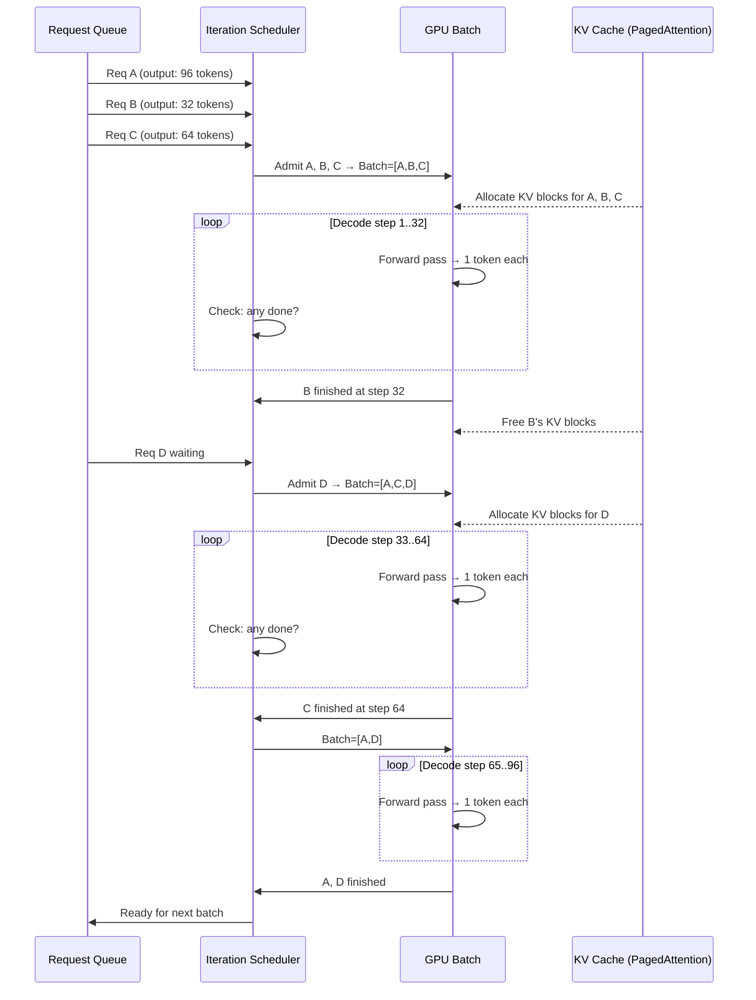

# [BEE-30065] Continuous Batching and Iteration-Level Scheduling

:::info
Continuous batching schedules LLM inference at the granularity of a single decode iteration rather than at the granularity of a full request. When a sequence finishes, its slot is immediately reassigned to the next waiting request — eliminating the idle-GPU problem that plagues static batching and lifting throughput by 2–36× at equivalent latency.
:::

## Context

In a dense transformer forward pass, all sequences in a batch share the same compute graph. Static batching requires every sequence in a batch to finish before any new request can enter — the system must wait for the longest-running sequence before it can reclaim GPU resources. This causes two compounding problems.

First, **head-of-line blocking**: a single 2,048-token response forces 31 shorter requests to hold their GPU memory slots for thousands of decode steps they will never use. Second, **GPU underutilization**: under typical production traffic where output lengths follow a Zipf-like distribution, static batching wastes 60–80% of available compute on padding and blocked slots.

**Orca** (Yu et al., USENIX OSDI 2022) introduced the solution: **iteration-level scheduling**. Rather than treating a request as the atomic unit of scheduling, Orca treats each decode step (one token generation) as the atomic unit. After every iteration, the scheduler can evict finished sequences and admit new ones from the waiting queue. The result is a batch that continuously recycles: finished requests leave, new requests enter, and the GPU stays full. Orca reported 36.9× higher throughput than NVIDIA FasterTransformer at equivalent latency on GPT-3 175B.

**vLLM** (Kwon et al., ACM SOSP 2023) combined continuous batching with **PagedAttention** — a KV cache allocator modeled on virtual memory paging. Static KV cache allocation wastes 60–80% of GPU memory due to fragmentation because each request pre-allocates its maximum possible context. PagedAttention partitions each sequence's KV cache into fixed-size blocks stored in non-contiguous memory, eliminating external fragmentation and enabling fine-grained memory reclamation as sequences finish. vLLM achieves 24× higher throughput than HuggingFace Transformers and 3.5× higher throughput than HuggingFace TGI at similar latency.

## How Continuous Batching Works

Static batching waits for the entire batch to finish before swapping in new requests:

```
Static (request-level):
Step  1: [A_t1] [B_t1] [C_t1]
Step  2: [A_t2] [B_t2] [C_t2]
...
Step 64: [A_t64] [----] [C_t64]   ← B finished at step 32; slot idle for 32 steps
Step 96: [A_t96] [----] [C_t96]   ← A finished at step 80; slot idle for 16 steps
          ↓
         NEW BATCH STARTS (D, E, F enter)
```

Continuous batching recycles slots at every decode step:

```
Continuous (iteration-level):
Step  1: [A_t1] [B_t1] [C_t1]
Step  2: [A_t2] [B_t2] [C_t2]
...
Step 32: [A_t32] [B_t32:DONE] [C_t32]
Step 33: [A_t33] [D_t1:NEW]  [C_t33]   ← D enters immediately
Step 64: [A_t64] [D_t32]    [C_t64:DONE]
Step 65: [A_t65] [D_t33]    [E_t1:NEW]  ← E enters immediately
```

The scheduler runs in a tight loop: compute one decode step → check for finished sequences → admit new requests up to the batch token budget → repeat.

## Chunked Prefill

A second problem arises even with continuous batching: **prefill starvation of decode**. Prefilling a long prompt (e.g., 32K tokens) blocks all decode steps for that entire batch iteration, spiking Time To First Token (TTFT) for every other active sequence.

**Chunked prefill** breaks large prefill operations into sub-chunks bounded by a token budget (`max_num_batched_tokens`). Between chunks, decode steps from other active sequences are interleaved:

```
Without chunked prefill:
Batch iter 1: [Long-prompt prefill: 32K tokens] ← decode stalled for all others
Batch iter 2: [D_t1] [E_t1] [F_t1]             ← long-prompt enters decode

With chunked prefill (chunk size = 512):
Batch iter 1: [Long-prompt chunk 1/64 tokens] + [D_t3] [E_t3] [F_t3]
Batch iter 2: [Long-prompt chunk 2/64 tokens] + [D_t4] [E_t4] [F_t4]
...
Batch iter 65: [Long-prompt last chunk] + [D_t67] [E_t67] [F_t67]
```

This trades a moderate increase in p50 TTFT (the long prompt takes longer overall) for a dramatic reduction in p95 TTFT. At 50 concurrent users with 32K-token inputs, chunked prefill reduces p95 TTFT from ~2,800ms to ~890ms — a 68% improvement in tail latency.

In vLLM v1.x, chunked prefill is enabled by default. In older versions:

```bash
# vLLM v0.x: enable chunked prefill explicitly
vllm serve meta-llama/Llama-3.1-8B-Instruct \
  --enable-chunked-prefill \
  --max-num-batched-tokens 512   # smaller = lower TTFT variance, higher overhead
```

## Best Practices

### Tune `max_num_batched_tokens` for your latency target

**SHOULD** treat `max_num_batched_tokens` as the primary knob between TTFT and inter-token latency (ITL):

```python
# vLLM LLMEngine configuration
from vllm import LLM, SamplingParams

# Throughput-optimized: larger batches, higher ITL
llm_throughput = LLM(
    model="meta-llama/Llama-3.1-70B-Instruct",
    max_num_batched_tokens=8192,   # large token budget per step
    max_num_seqs=256,              # more concurrent sequences
    enable_chunked_prefill=True,
)

# Latency-optimized: smaller batches, lower ITL
llm_latency = LLM(
    model="meta-llama/Llama-3.1-70B-Instruct",
    max_num_batched_tokens=2048,   # smaller token budget
    max_num_seqs=64,
    enable_chunked_prefill=True,
)
```

A larger `max_num_batched_tokens` allows more prefill tokens per step (higher throughput) but increases the time between decode steps for active sequences (higher ITL). Target ITL < 100ms for interactive chat; target throughput for batch jobs.

### Separate prefill and decode onto different replicas for strict latency SLOs

**SHOULD** use prefill-decode disaggregation when TTFT and ITL have conflicting requirements. In a disaggregated setup, a **prefill instance** processes only prompt tokens and transfers the KV cache to a **decode instance** that handles all autoregressive generation. The prefill instance can use large batch sizes optimized for compute throughput; the decode instance uses small batches for low ITL:

```bash
# Disaggregated serving with vLLM (v0.7+)
# Prefill instance: maximize prompt processing throughput
vllm serve meta-llama/Llama-3.1-70B-Instruct \
  --role prefill \
  --max-num-batched-tokens 65536 \
  --kv-transfer-config '{"kv_connector":"PyNcclConnector","kv_role":"kv_producer"}'

# Decode instance: minimize inter-token latency
vllm serve meta-llama/Llama-3.1-70B-Instruct \
  --role decode \
  --max-num-seqs 128 \
  --kv-transfer-config '{"kv_connector":"PyNcclConnector","kv_role":"kv_consumer"}'
```

**SHOULD NOT** apply disaggregation when average prompt length is short (<512 tokens). The KV cache transfer overhead exceeds the benefit for short prompts.

### Monitor scheduler queue depth and preemption rate

**MUST** instrument the following metrics to detect scheduler bottlenecks:

```python
from prometheus_client import Gauge, Counter
import time

class BatchSchedulerMetrics:
    """
    Expose continuous batching health for Prometheus scraping.
    Wire into your serving framework's scheduler loop.
    """
    waiting_requests = Gauge(
        "llm_scheduler_waiting_requests",
        "Requests queued, not yet admitted to GPU",
    )
    running_sequences = Gauge(
        "llm_scheduler_running_seqs",
        "Sequences currently occupying GPU batch slots",
    )
    preempted_sequences = Counter(
        "llm_scheduler_preemptions_total",
        "Sequences evicted from GPU due to KV cache exhaustion",
    )
    gpu_kv_cache_usage = Gauge(
        "llm_gpu_kv_cache_usage_fraction",
        "Fraction of GPU KV cache blocks in use",
    )
    tokens_per_second = Gauge(
        "llm_throughput_tokens_per_second",
        "Total tokens generated per second across all sequences",
    )

# Alert thresholds:
# waiting_requests > 50 → scheduler is backlogged; add replicas
# preempted_sequences rate > 1/min → KV cache pressure; reduce max_num_seqs
# gpu_kv_cache_usage > 0.95 → near OOM; reduce max_model_len or add GPU memory
```

**Preemption** occurs when the KV cache fills up mid-decode: the scheduler must evict a sequence (saving its KV cache to CPU or simply recomputing from scratch). Preemption is expensive (recompute) or memory-intensive (swap to CPU). A preemption rate above 1 per minute in steady state indicates the system is overloaded.

### Prefer continuous batching frameworks over custom serving for production

**SHOULD** use a proven serving framework rather than a bare HuggingFace `model.generate()` loop. The throughput differential is large:

| Framework | Relative throughput | Notes |
|---|---|---|
| HuggingFace Transformers | 1× (baseline) | Static batching, no PagedAttention |
| HuggingFace TGI | ~7× | Continuous batching, limited PagedAttention |
| vLLM | ~24× | PagedAttention + continuous batching |
| TensorRT-LLM | ~30–40× | In-flight batching, FP8 on H100 |
| SGLang | ~25–35× | RadixAttention + zero-overhead scheduler |

## Visual



## Common Mistakes

**Confusing `max_num_seqs` with `max_num_batched_tokens`.** `max_num_seqs` caps the number of concurrent sequences (memory constraint); `max_num_batched_tokens` caps the total tokens processed per iteration (compute constraint). Setting `max_num_seqs` too high with a small `max_num_batched_tokens` causes each decode step to process very few tokens per sequence, increasing overhead. The product `max_num_seqs × avg_decode_length_per_step` should not exceed `max_num_batched_tokens`.

**Using `model.generate()` with `padding=True` as a substitute for continuous batching.** Padding to the longest sequence in a batch gives the appearance of batching but wastes compute on pad tokens and still blocks new requests until the full batch finishes. This is static batching. Use a serving framework with a real continuous batching scheduler.

**Ignoring preemption metrics.** When the KV cache fills, the scheduler silently preempts sequences and recomputes from scratch. This doubles (or more) the latency for affected requests and appears as mysteriously high p99 TTFT. Always monitor preemption counters.

**Setting `max_num_batched_tokens` without enabling chunked prefill.** Without chunked prefill, `max_num_batched_tokens` must exceed `max_model_len`; otherwise vLLM will reject the configuration at startup. With chunked prefill enabled, `max_num_batched_tokens` is a tunable budget that can be smaller than `max_model_len`.

**Over-provisioning sequences for latency-sensitive workloads.** Higher concurrency improves throughput but increases inter-token latency because each GPU forward pass serves more sequences per step. For interactive chat with a p95 ITL requirement of <100ms, cap `max_num_seqs` to stay within your latency budget. Profile with a load test before setting production values.

## Related BEEs

- [BEE-30021](llm-inference-optimization-and-self-hosting.md) -- LLM Inference Optimization and Self-Hosting: the broader inference optimization landscape including hardware selection
- [BEE-30063](prefix-caching-and-kv-cache-reuse.md) -- Prefix Caching and KV Cache Reuse: how KV cache block reuse integrates with the continuous batching scheduler
- [BEE-30064](mixture-of-experts-architecture-and-serving.md) -- Mixture of Experts Architecture and Serving: MoE expert dispatch interacts with batch scheduling via Expert Parallel
- [BEE-30058](llm-load-testing-and-capacity-planning.md) -- LLM Load Testing and Capacity Planning: measuring TTFT, ITL, and throughput under continuous batching

## References

- [Yu et al. Orca: A Distributed Serving System for Transformer-Based Generative Models — USENIX OSDI 2022](https://www.usenix.org/system/files/osdi22-yu.pdf)
- [Kwon et al. Efficient Memory Management for Large Language Model Serving with PagedAttention — ACM SOSP 2023](https://arxiv.org/abs/2309.06180)
- [vLLM. Engine Arguments — docs.vllm.ai](https://docs.vllm.ai/en/stable/configuration/engine_args/)
- [vLLM. Optimization — docs.vllm.ai](https://docs.vllm.ai/en/stable/configuration/optimization/)
- [NVIDIA TensorRT-LLM. Overview — nvidia.github.io](https://nvidia.github.io/TensorRT-LLM/overview.html)
- [Zheng et al. SGLang: Efficient Execution of Structured Language Model Programs — arXiv:2312.07104](https://arxiv.org/abs/2312.07104)
