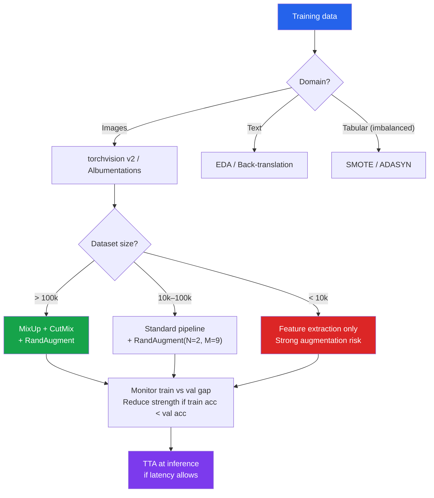

# [BEE-30093] Data Augmentation Strategies for ML Training

:::info
Data augmentation synthetically expands training datasets by applying label-preserving transformations, reducing overfitting without collecting new data — but augmentation strategies are domain-specific, and applying the wrong transforms or excessive strength can degrade performance rather than improve it.
:::

## Context

The core problem in supervised learning is generalization: the model must perform on data it has never seen. One lever is more data; another is regularization that discourages memorizing training examples. Data augmentation occupies the intersection — it creates new training examples by transforming existing ones in ways that preserve semantic meaning. A horizontally flipped image of a cat is still a cat. A sentence with a synonym substituted still has the same sentiment.

The practical importance of augmentation scales with data scarcity. ImageNet models trained with aggressive augmentation (MixUp, CutMix, RandAugment) achieve 1–2% higher top-1 accuracy than the same architecture without it. On small datasets (< 10 000 samples), augmentation can close the gap between a dataset that is too small to train and one that is large enough. On tabular data, SMOTE (Chawla et al. 2002, JAIR 16:321–357) addresses class imbalance by synthesizing minority-class examples rather than simply oversampling existing ones.

Four principles govern augmentation design. First, transforms MUST be label-preserving: a horizontal flip is valid for most natural image tasks but not for handwritten digit classification where '6' and '9' are different classes. Second, augmentation strength MUST be calibrated: too weak provides no benefit; too strong creates examples that no longer represent the original distribution. Third, augmentation is applied at training time, not at inference (except for Test-Time Augmentation). Fourth, online augmentation (applied per batch during training) introduces diversity across epochs without exploding storage, at the cost of CPU compute during data loading.

## Classical Image Augmentation with torchvision v2

Torchvision's v2 transforms API (introduced in 0.15) unifies transforms across images, bounding boxes, segmentation masks, and videos. The V1 API is still supported but V2 is preferred for new code:

```python
import torch
from torchvision.transforms import v2

# Standard augmentation pipeline for ImageNet-scale tasks
train_transforms = v2.Compose([
    v2.RandomResizedCrop(224, scale=(0.08, 1.0)),  # crop then resize
    v2.RandomHorizontalFlip(p=0.5),
    v2.ColorJitter(brightness=0.4, contrast=0.4, saturation=0.4, hue=0.1),
    v2.RandomGrayscale(p=0.2),
    v2.ToImage(),
    v2.ToDtype(torch.float32, scale=True),
    v2.Normalize(mean=[0.485, 0.456, 0.406], std=[0.229, 0.224, 0.225]),
])

# Validation transforms — no augmentation, only resize + normalize
val_transforms = v2.Compose([
    v2.Resize(256),
    v2.CenterCrop(224),
    v2.ToImage(),
    v2.ToDtype(torch.float32, scale=True),
    v2.Normalize(mean=[0.485, 0.456, 0.406], std=[0.229, 0.224, 0.225]),
])

dataset = torchvision.datasets.ImageFolder(train_dir, transform=train_transforms)
loader = DataLoader(
    dataset,
    batch_size=256,
    num_workers=8,      # CPU workers for parallel augmentation
    pin_memory=True,    # faster host-to-device transfer
    persistent_workers=True,
)
```

The `RandomResizedCrop` + `RandomHorizontalFlip` combination is the minimum effective baseline. `ColorJitter` introduces photometric invariance. `RandomGrayscale` improves robustness to color shifts.

## Advanced Augmentation: MixUp, CutMix, and RandAugment

**MixUp** (Zhang et al., ICLR 2018, arXiv:1710.09412) trains on convex combinations of pairs of training examples. Both inputs and labels are mixed:

```python
import torch
import torch.nn.functional as F

def mixup_batch(x: torch.Tensor, y: torch.Tensor, alpha: float = 0.4):
    """Apply MixUp to a batch. Returns mixed inputs and two label tensors."""
    lam = torch.distributions.Beta(alpha, alpha).sample().item()
    batch_size = x.size(0)
    idx = torch.randperm(batch_size, device=x.device)
    mixed_x = lam * x + (1 - lam) * x[idx]
    return mixed_x, y, y[idx], lam

def mixup_criterion(criterion, pred, y_a, y_b, lam):
    return lam * criterion(pred, y_a) + (1 - lam) * criterion(pred, y_b)

# Training loop usage
for x, y in loader:
    x, y_a, y_b, lam = mixup_batch(x.cuda(), y.cuda(), alpha=0.4)
    logits = model(x)
    loss = mixup_criterion(F.cross_entropy, logits, y_a, y_b, lam)
    loss.backward()
```

**CutMix** (Yun et al., ICCV 2019, arXiv:1905.04899) cuts rectangular patches from one image and pastes them onto another, mixing labels proportionally to the patch area. Unlike MixUp, which blends entire images, CutMix preserves local feature structure:

```python
def cutmix_batch(x: torch.Tensor, y: torch.Tensor, alpha: float = 1.0):
    lam = torch.distributions.Beta(alpha, alpha).sample().item()
    batch_size, _, H, W = x.shape
    idx = torch.randperm(batch_size, device=x.device)

    cut_ratio = (1 - lam) ** 0.5
    cut_h, cut_w = int(H * cut_ratio), int(W * cut_ratio)
    cy = torch.randint(H, (1,)).item()
    cx = torch.randint(W, (1,)).item()

    y1 = max(cy - cut_h // 2, 0)
    y2 = min(cy + cut_h // 2, H)
    x1 = max(cx - cut_w // 2, 0)
    x2 = min(cx + cut_w // 2, W)

    mixed_x = x.clone()
    mixed_x[:, :, y1:y2, x1:x2] = x[idx, :, y1:y2, x1:x2]
    lam_actual = 1 - (y2 - y1) * (x2 - x1) / (H * W)
    return mixed_x, y, y[idx], lam_actual
```

Torchvision v2 provides `v2.MixUp` and `v2.CutMix` as official transforms, applied after batching:

```python
from torchvision.transforms import v2

cutmix = v2.CutMix(num_classes=1000)
mixup = v2.MixUp(num_classes=1000)
# Randomly apply one of the two per batch
cutmix_or_mixup = v2.RandomChoice([cutmix, mixup])

for x, y in loader:
    x, y = cutmix_or_mixup(x, y)  # y is now a soft label tensor
    loss = F.cross_entropy(model(x), y)
```

**RandAugment** (Cubuk et al., CVPR 2020 Workshop, arXiv:1909.13719) reduces the automated augmentation search space to two parameters: the number of transforms to apply (`N`) and the magnitude (`M`):

```python
train_transforms = v2.Compose([
    v2.RandomResizedCrop(224),
    v2.RandAugment(num_ops=2, magnitude=9),  # N=2, M=9 is the standard baseline
    v2.ToImage(),
    v2.ToDtype(torch.float32, scale=True),
    v2.Normalize(mean=[0.485, 0.456, 0.406], std=[0.229, 0.224, 0.225]),
])
```

RandAugment with N=2, M=9 achieves 85.0% top-1 on ImageNet with ResNet-50, a 0.6% improvement over baseline transforms.

## Albumentations for Computer Vision

Albumentations (albumentations.ai) provides a richer set of transforms than torchvision, with particular depth in medical imaging, satellite imagery, and object detection. The `A.Compose` API handles bounding boxes, keypoints, and masks automatically:

```python
import albumentations as A
from albumentations.pytorch import ToTensorV2
import cv2

train_transform = A.Compose([
    A.RandomResizedCrop(height=224, width=224, scale=(0.08, 1.0)),
    A.HorizontalFlip(p=0.5),
    A.OneOf([
        A.GaussNoise(var_limit=(10, 50)),
        A.ISONoise(color_shift=(0.01, 0.05), intensity=(0.1, 0.5)),
        A.MultiplicativeNoise(multiplier=(0.9, 1.1)),
    ], p=0.3),
    A.OneOf([
        A.MotionBlur(blur_limit=7),
        A.MedianBlur(blur_limit=5),
        A.GaussianBlur(blur_limit=5),
    ], p=0.2),
    A.ColorJitter(brightness=0.4, contrast=0.4, saturation=0.4, hue=0.1, p=0.8),
    A.CoarseDropout(max_holes=8, max_height=32, max_width=32, p=0.3),
    A.Normalize(mean=(0.485, 0.456, 0.406), std=(0.229, 0.224, 0.225)),
    ToTensorV2(),
], bbox_params=A.BboxParams(format="pascal_voc", label_fields=["class_labels"]))

# Albumentations expects numpy HWC arrays, not PIL
class AlbumentationsDataset(torch.utils.data.Dataset):
    def __init__(self, image_paths, labels, transform):
        self.image_paths = image_paths
        self.labels = labels
        self.transform = transform

    def __getitem__(self, idx):
        image = cv2.imread(self.image_paths[idx])
        image = cv2.cvtColor(image, cv2.COLOR_BGR2RGB)
        transformed = self.transform(image=image)
        return transformed["image"], self.labels[idx]
```

`A.OneOf` randomly selects one transform from the group — useful for applying mutually exclusive effects (you would not apply both MotionBlur and GaussianBlur to the same image). The `p` argument on the outer `OneOf` controls whether any noise transform is applied at all.

## Text Data Augmentation

For NLP tasks, Wei & Zou (EMNLP-IJCNLP 2019, arXiv:1901.11196) introduced Easy Data Augmentation (EDA): four simple operations that achieve statistically significant accuracy improvements on small text classification datasets.

```python
import random
import nltk
from nltk.corpus import wordnet

nltk.download("wordnet", quiet=True)

def get_synonyms(word: str) -> list[str]:
    synonyms = set()
    for syn in wordnet.synsets(word):
        for lemma in syn.lemmas():
            name = lemma.name().replace("_", " ")
            if name.lower() != word.lower():
                synonyms.add(name)
    return list(synonyms)

def eda_augment(sentence: str, alpha_sr: float = 0.1, num_aug: int = 4) -> list[str]:
    """
    alpha_sr: fraction of words to replace with synonyms
    Returns num_aug augmented sentences.
    """
    words = sentence.split()
    n = max(1, int(len(words) * alpha_sr))
    augmented = []

    for _ in range(num_aug):
        new_words = words[:]
        # Synonym replacement
        idxs = random.sample(range(len(new_words)), min(n, len(new_words)))
        for i in idxs:
            syns = get_synonyms(new_words[i])
            if syns:
                new_words[i] = random.choice(syns)
        augmented.append(" ".join(new_words))

    return augmented
```

EDA achieves the same accuracy as training on 100% of the data when only 50% is used, for datasets up to 11 000 examples. For larger datasets (> 50 000 examples), the gain diminishes to less than 0.5%.

Back-translation — translating to a pivot language and back — produces syntactically richer variations but requires an external translation model or API.

## Tabular Augmentation: SMOTE for Class Imbalance

SMOTE (Synthetic Minority Over-sampling Technique) creates synthetic minority-class examples by interpolating between existing minority-class neighbors:

```python
from imblearn.over_sampling import SMOTE, ADASYN
from sklearn.model_selection import train_test_split

X_train, X_test, y_train, y_test = train_test_split(X, y, stratify=y)

# SMOTE: uniform synthesis along k-NN line segments
smote = SMOTE(k_neighbors=5, random_state=42)
X_resampled, y_resampled = smote.fit_resample(X_train, y_train)

# ADASYN: adaptive synthesis — harder-to-classify examples get more synthetic neighbors
adasyn = ADASYN(n_neighbors=5, random_state=42)
X_resampled, y_resampled = adasyn.fit_resample(X_train, y_train)

print(f"Original: {dict(zip(*np.unique(y_train, return_counts=True)))}")
print(f"Resampled: {dict(zip(*np.unique(y_resampled, return_counts=True)))}")
```

SMOTE MUST be applied only to the training set. Applying it before the train/test split causes data leakage: synthetic examples derived from test-set neighbors contaminate evaluation.

ADASYN (He et al., ICDM 2008) extends SMOTE by generating more synthetic samples in regions where the classifier performs poorly, concentrating augmentation effort where it is most needed.

## Test-Time Augmentation

Test-Time Augmentation (TTA) applies augmentation at inference to generate multiple predictions that are then averaged:

```python
import torch
import torch.nn.functional as F
from torchvision.transforms import v2

def predict_with_tta(model: torch.nn.Module, image: torch.Tensor, n_augments: int = 5) -> torch.Tensor:
    """
    image: (1, C, H, W) tensor, already normalized
    Returns averaged softmax probabilities.
    """
    tta_transforms = [
        v2.Compose([]),                              # original
        v2.RandomHorizontalFlip(p=1.0),              # flipped
        v2.RandomResizedCrop(image.shape[-2:], scale=(0.9, 1.0)),  # slight crop
        v2.ColorJitter(brightness=0.1, contrast=0.1),
    ]

    model.eval()
    probs = []
    with torch.no_grad():
        for transform in tta_transforms[:n_augments]:
            aug_image = transform(image)
            logits = model(aug_image)
            probs.append(F.softmax(logits, dim=-1))

    return torch.stack(probs).mean(dim=0)
```

TTA improves accuracy by 0.2–0.5% on standard benchmarks at the cost of n_augments × inference time. It is most valuable when latency allows and the cost of prediction errors is high.

## Choosing Augmentation Strength

Augmentation that is too strong degrades performance. The signal is a widening gap between training and validation loss — not the usual train-lower-than-val gap from a healthy model, but a gap where training loss is abnormally high because the augmented samples are too difficult:

| Strength signal | Likely cause | Adjustment |
|---|---|---|
| Train accuracy far below val accuracy | Augmentation too strong | Reduce magnitude or probability |
| Train and val accuracy both low | Augmentation + data mismatch | Review label-preservation assumptions |
| Val accuracy stagnates after warmup | Augmentation too weak | Increase magnitude |
| Val accuracy improves steadily | Calibrated correctly | Keep current settings |

The LR finder (arXiv:1506.01186) can be combined with an augmentation sweep: run a small grid over magnitude values and use the val loss at epoch 5 as the selection criterion.



## Common Mistakes

**Applying augmentation to the validation set.** Validation transforms MUST exclude random augmentation — only deterministic preprocessing (resize, center crop, normalize). Augmenting the validation set introduces variance into the metric and makes model selection unreliable.

**Applying SMOTE before train/test split.** Synthetic neighbors are computed from training examples that may include test-set data. The synthetic examples are therefore derived from test-set information, and validation accuracy will be inflated.

**Using augmentation that violates label semantics.** Vertical flip is invalid for aerial imagery where 'up' is semantically meaningful, for OCR where 'p' becomes 'b', and for fine-grained tasks where orientation is a discriminative feature. Always verify that every transform preserves the label for your specific task.

**Not seeding augmentation in reproducibility tests.** Online augmentation uses random transforms that change between runs. Tests that check model behavior across augmented data MUST seed the transform's random state to produce reproducible examples.

**Treating augmentation as free regularization.** Augmentation increases the effective dataset size but does not substitute for more training data when the underlying distribution is narrow. A model trained on 500 SMOTE-augmented examples from 50 real minority-class samples may still fail on real minority-class examples that fall outside the convex hull of the 50 originals.

## Related BEEs

- [BEE-30085 ML Data Validation and Pipeline Quality Gates](/ai-backend-patterns/ml-data-validation-and-pipeline-quality-gates) — validating that augmented examples still satisfy schema and distribution constraints
- [BEE-30089 Testing Machine Learning Pipelines](/ai-backend-patterns/testing-machine-learning-pipelines) — behavioral tests for augmentation pipelines (invariance tests: prediction SHOULD be stable under label-preserving augmentations)
- [BEE-30091 ML Training Cost Optimization](/ai-backend-patterns/ml-training-cost-optimization) — DataLoader `num_workers`, `pin_memory`, and `prefetch_factor` settings that determine augmentation throughput
- [BEE-30092 Transfer Learning and Fine-Tuning Patterns](/ai-backend-patterns/transfer-learning-and-fine-tuning-patterns) — augmentation strategy must match the pre-training augmentation when fine-tuning (use the backbone's `weights.transforms()` as the base)

## References

- Zhang, H., Cisse, M., Dauphin, Y. N., & Lopez-Paz, D. (2018). MixUp: Beyond empirical risk minimization. ICLR 2018. arXiv:1710.09412. https://arxiv.org/abs/1710.09412
- Yun, S., Han, D., Oh, S. J., Chun, S., Choe, J., & Yoo, Y. (2019). CutMix: Regularization strategy to train strong classifiers with localizable features. ICCV 2019. arXiv:1905.04899. https://arxiv.org/abs/1905.04899
- Hendrycks, D., et al. (2020). AugMix: A simple data processing method to improve robustness and uncertainty. ICLR 2020. arXiv:1912.02781. https://arxiv.org/abs/1912.02781
- Cubuk, E. D., Zoph, B., Shlens, J., & Le, Q. V. (2020). RandAugment: Practical automated data augmentation with a reduced search space. CVPR 2020 Workshop. arXiv:1909.13719. https://arxiv.org/abs/1909.13719
- Wei, J., & Zou, K. (2019). EDA: Easy data augmentation techniques for boosting performance on text classification tasks. EMNLP-IJCNLP 2019. arXiv:1901.11196. https://arxiv.org/abs/1901.11196
- Chawla, N. V., Bowyer, K. W., Hall, L. O., & Kegelmeyer, W. P. (2002). SMOTE: Synthetic minority over-sampling technique. Journal of Artificial Intelligence Research, 16, 321–357. https://www.jair.org/index.php/jair/article/view/10302
- He, H., Bai, Y., Garcia, E. A., & Li, S. (2008). ADASYN: Adaptive synthetic sampling approach for imbalanced learning. ICDM 2008. https://ieeexplore.ieee.org/document/4633969/
- Buslaev, A., et al. (2020). Albumentations: Fast and flexible image augmentations. Information, 11(2), 125. https://www.mdpi.com/2078-2489/11/2/125
- torchvision transforms v2 documentation. https://docs.pytorch.org/vision/stable/transforms.html
