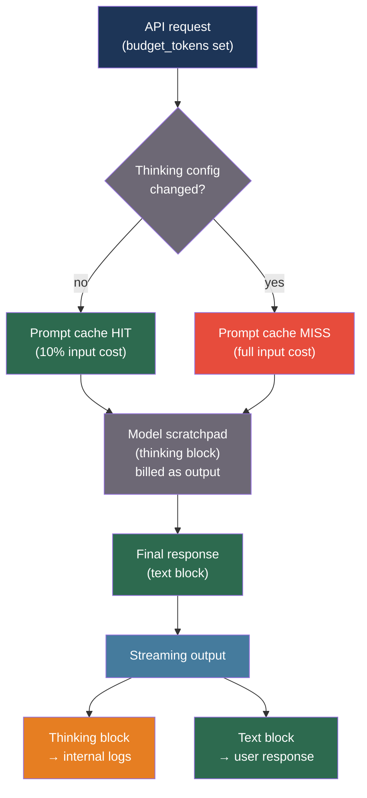

# [BEE-30054] Extended Thinking and Reasoning Trace Management

:::info
Extended thinking (Anthropic) and reasoning tokens (OpenAI o1/o3) give models additional computation budget to work through problems before producing a final answer — improving accuracy on multi-step reasoning tasks at the cost of higher token billing, longer latency, and prompt cache invalidation. Managing the reasoning budget, streaming thinking blocks separately from responses, and deciding when extended thinking helps versus hurts are distinct engineering concerns.
:::

## Context

Standard LLM inference decodes one token at a time as a single forward pass over the context window. Extended thinking extends this by allocating a separate compute budget — the `thinking` block — where the model generates a chain-of-thought that is not constrained to be the literal final output. The model uses the thinking block as a scratchpad and then produces the visible response based on its conclusions.

Anthropic's extended thinking API (released with Claude 3.7 Sonnet) exposes the thinking block as a structured content block of type `"thinking"` in the response. The `budget_tokens` parameter (1,024–32,000 tokens) controls how much compute the model may spend. Thinking tokens are billed at the same rate as output tokens and count against the context window. When streaming, thinking blocks arrive before the text block; downstream consumers must handle both block types.

OpenAI's o1 and o3 model families implement reasoning similarly but do not expose the reasoning trace: only the final answer is returned. Billing includes the reasoning tokens as output tokens, making o1/o3 calls substantially more expensive than equivalent GPT-4o calls for the same task.

Geiping, McLeish, Jain, Kirchenbauer, Bartoldson, Kailkhura, and Goldstein (arXiv:2512.12777, "Scaling up Test-Time Compute with Latent Reasoning: A Recurrent Depth Approach", 2024) examine how allocating more compute at inference time — in latent (hidden) space rather than token space — can improve reasoning without proportional token cost growth. The distinction matters: budget_tokens controls visible token generation, while hardware-level optimizations reduce the token cost per reasoning step. Current Anthropic and OpenAI APIs trade more tokens for more reasoning.

For backend engineers, extended thinking is not a universal improvement. Tasks with clear single-step answers (entity extraction, classification, summarization of short documents) are slower and more expensive with extended thinking enabled and produce no accuracy gain. Tasks requiring multi-step deduction, mathematical reasoning, code debugging, or ambiguity resolution see meaningful accuracy improvements. Profiling must be task-specific.

## Best Practices

### Enable Extended Thinking Only for Tasks That Benefit

**MUST NOT** enable extended thinking for all requests. Measure accuracy baseline with and without it for each task type before committing:

```python
import anthropic
import asyncio
from dataclasses import dataclass

# Tasks that consistently benefit from extended thinking:
THINKING_BENEFICIAL_TASKS = {
    "math_proof",
    "code_debugging",
    "multi_step_reasoning",
    "ambiguous_classification",
    "logical_deduction",
}

# Tasks where extended thinking adds cost without accuracy gain:
THINKING_WASTEFUL_TASKS = {
    "entity_extraction",
    "simple_summarization",
    "single_fact_lookup",
    "sentiment_classification",
    "format_conversion",
}

@dataclass
class ThinkingConfig:
    enabled: bool
    budget_tokens: int = 8_000

def get_thinking_config(task_type: str) -> ThinkingConfig:
    if task_type in THINKING_BENEFICIAL_TASKS:
        return ThinkingConfig(enabled=True, budget_tokens=8_000)
    return ThinkingConfig(enabled=False)

async def call_with_thinking(
    prompt: str,
    task_type: str,
    model: str = "claude-sonnet-4-20250514",
) -> dict:
    client = anthropic.AsyncAnthropic()
    config = get_thinking_config(task_type)

    params = {
        "model": model,
        "max_tokens": 16_000,   # Must exceed budget_tokens when thinking is on
        "messages": [{"role": "user", "content": prompt}],
    }

    if config.enabled:
        params["thinking"] = {
            "type": "enabled",
            "budget_tokens": config.budget_tokens,
        }

    response = await client.messages.create(**params)

    thinking_text = ""
    response_text = ""
    for block in response.content:
        if block.type == "thinking":
            thinking_text = block.thinking
        elif block.type == "text":
            response_text = block.text

    return {
        "thinking": thinking_text,
        "response": response_text,
        "input_tokens": response.usage.input_tokens,
        "output_tokens": response.usage.output_tokens,   # Includes thinking tokens
    }
```

### Stream Thinking Blocks and Route Them Separately

**SHOULD** stream extended thinking responses and route thinking blocks to separate logging infrastructure rather than surfacing raw reasoning traces to end users:

```python
async def stream_with_thinking(
    prompt: str,
    model: str = "claude-sonnet-4-20250514",
    budget_tokens: int = 8_000,
) -> tuple[str, str]:
    """
    Returns (thinking_trace, final_response) after streaming completes.
    Thinking blocks arrive first; text blocks arrive after.
    """
    client = anthropic.AsyncAnthropic()
    thinking_parts = []
    response_parts = []
    current_block_type = None

    async with client.messages.stream(
        model=model,
        max_tokens=16_000,
        thinking={"type": "enabled", "budget_tokens": budget_tokens},
        messages=[{"role": "user", "content": prompt}],
    ) as stream:
        async for event in stream:
            if hasattr(event, "type"):
                if event.type == "content_block_start":
                    current_block_type = event.content_block.type
                elif event.type == "content_block_delta":
                    delta = event.delta
                    if current_block_type == "thinking" and hasattr(delta, "thinking"):
                        thinking_parts.append(delta.thinking)
                    elif current_block_type == "text" and hasattr(delta, "text"):
                        response_parts.append(delta.text)

    return "".join(thinking_parts), "".join(response_parts)
```

### Account for Cache Invalidation When Thinking Parameters Change

**MUST NOT** assume that adding or changing the `thinking` parameter preserves prompt cache hits. Anthropic's prompt cache is invalidated when the `thinking` configuration changes:

```python
# Cache behavior: changing thinking config breaks the cache.
# The system prompt and conversation history are re-processed
# on the first request after a thinking config change.

# If your system prompt is 50,000 tokens and you toggle thinking:
# - First request: cache MISS, billed 50,000 input tokens
# - Subsequent requests with same thinking config: cache HIT
# - Changing thinking enabled/disabled: cache MISS again

def estimate_thinking_cost(
    input_tokens: int,
    thinking_budget: int,
    output_tokens: int,
    cache_hit: bool,
    price_per_million_input: float = 3.0,     # USD, claude-sonnet-4
    price_per_million_output: float = 15.0,   # thinking tokens billed as output
) -> float:
    """
    Thinking tokens are billed as output tokens.
    Cache misses on large prompts add significant cost.
    """
    effective_input = input_tokens * (0.1 if cache_hit else 1.0)
    # thinking_budget is an upper bound; actual usage may be lower
    total_output = output_tokens + thinking_budget   # Worst case
    return (
        effective_input / 1_000_000 * price_per_million_input
        + total_output / 1_000_000 * price_per_million_output
    )
```

**SHOULD** treat thinking config changes as cache-invalidating events and schedule them for off-peak periods if your system prompt is large enough that the cache miss cost is significant.

## Visual



## Common Mistakes

**Enabling extended thinking for all tasks.** Entity extraction, classification, and short summarization tasks are slower and more expensive with thinking enabled, with no accuracy gain. Profile accuracy and cost per task type before enabling.

**Setting `max_tokens` below `budget_tokens`.** The Anthropic API requires `max_tokens` to exceed `budget_tokens` when thinking is enabled, because thinking tokens count toward the maximum. Setting `max_tokens` to 4,096 with `budget_tokens` of 8,000 returns an API error.

**Displaying raw thinking traces to users.** Thinking blocks contain the model's unfiltered reasoning, which may include intermediate wrong answers, self-corrections, and reasoning paths that were abandoned. Surface only the final text block to end users.

**Not accounting for thinking tokens in cost models.** Thinking tokens are billed at the output token rate, which is 5× the input rate for most models. A 10,000-thinking-token request on claude-sonnet-4 costs $0.15 in thinking alone. Cost dashboards that only count text output tokens will systematically underreport actual costs when thinking is enabled.

**Toggling thinking frequently.** Each thinking config change invalidates the prompt cache. If you have a 100,000-token system prompt and toggle thinking on each request, you pay full input cost on every call instead of the 10% cache-hit rate.

## Related BEEs

- [BEE-30023](chain-of-thought-and-extended-thinking-patterns.md) -- Chain-of-Thought and Extended Thinking Patterns: prompt-level reasoning strategies
- [BEE-30024](llm-caching-strategies.md) -- LLM Caching Strategies: prompt cache mechanics that thinking config affects
- [BEE-30011](ai-cost-optimization-and-model-routing.md) -- AI Cost Optimization and Model Routing: routing decisions for thinking-enabled models

## References

- [Anthropic Extended Thinking Documentation — docs.anthropic.com](https://docs.anthropic.com/en/docs/build-with-claude/extended-thinking)
- [Geiping et al. Scaling up Test-Time Compute with Latent Reasoning: A Recurrent Depth Approach — arXiv:2512.12777, 2024](https://arxiv.org/abs/2512.12777)
- [OpenAI o1 System Card — openai.com/o1-system-card](https://openai.com/index/openai-o1-system-card/)
- [Anthropic Prompt Caching — docs.anthropic.com](https://docs.anthropic.com/en/docs/build-with-claude/prompt-caching)
