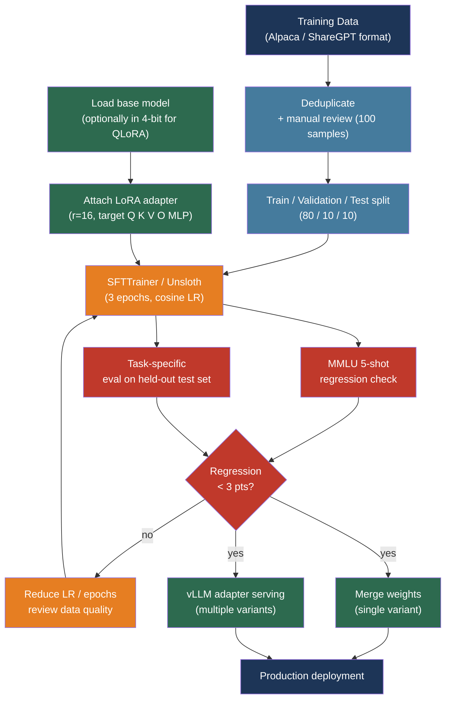

# [BEE-514] Fine-Tuning and PEFT Patterns

:::info
Fine-tuning adapts a pre-trained model to a specific style, domain, or task. Parameter-Efficient Fine-Tuning (PEFT) methods — particularly LoRA and QLoRA — make this practical on a single GPU: 1,000 high-quality training examples and a 48 GB GPU can produce a fine-tuned 65B-parameter model that matches the quality of full fine-tuning at a fraction of the cost.
:::

## Context

Large language models acquire broad knowledge during pretraining on internet-scale corpora. That pretraining is expensive — hundreds of thousands of GPU-hours — and is done once by the model provider. Fine-tuning is the second stage: starting from a pretrained checkpoint and continuing to train on a smaller, task-specific dataset to adjust the model's behavior.

For most engineering teams, fine-tuning addresses one of three problems. First, style and format consistency: a model trained on thousands of examples of the desired output format produces that format reliably without prompt engineering gymnastics. Second, domain specialization: a model exposed to large amounts of domain-specific text — medical records, legal contracts, internal code — learns vocabulary, abbreviations, and reasoning patterns that prompt engineering cannot reliably inject. Third, task performance: when a specific capability (function calling, structured extraction, classification accuracy) must improve beyond what prompt engineering achieves.

Full fine-tuning — updating all parameters of a model — requires GPU memory proportional to the model size times the optimizer state: for a 7B parameter model, roughly 112 GB with Adam optimizer. This exceeds the VRAM of most available hardware. Parameter-Efficient Fine-Tuning addresses this constraint by training only a small subset of parameters while keeping the pretrained weights frozen.

The dominant PEFT method is LoRA (Low-Rank Adaptation, arXiv:2106.09685). It injects trainable rank-decomposition matrices into the transformer layers. Instead of updating the weight matrix W directly, LoRA represents the update as W' = W + αAB, where A and B are low-rank matrices with rank r ≪ d. For r = 16 on a 7B parameter model, LoRA reduces trainable parameters by roughly 10,000× relative to full fine-tuning, while achieving comparable downstream performance.

QLoRA (arXiv:2305.14314) extends LoRA by quantizing the frozen base weights to 4-bit NormalFloat (NF4) format before training. This enables a 65B parameter model to be fine-tuned on a single 48 GB GPU — a configuration that would require eight 80 GB A100s with full fine-tuning. The Guanaco model, fine-tuned via QLoRA on a single GPU over 24 hours, reached 99.3% of ChatGPT performance on the Vicuna benchmark.

## Design Thinking

Fine-tuning is not the default solution. The decision order should be:

1. **Prompt engineering**: Iterate on the system prompt and few-shot examples. Resolve within days, costs nothing at training time.
2. **RAG**: For knowledge that changes or that exceeds context windows. Adds $70–1,000/month in infrastructure but requires no training.
3. **Fine-tuning**: When prompt engineering and RAG have been exhausted, or when the use case requires consistent format, reduced latency, or lower inference cost via a smaller specialized model.

Fine-tuning a model that already performs well at the general task produces marginal gains. Fine-tuning a model that cannot perform the task at all produces a model that fails in a more specialized way. The diagnostic test: can you write a prompt that produces correct output on 70–80% of your eval set? If yes, fine-tuning will likely close the remaining gap. If no, more data and better prompting are prerequisites.

Data quality dominates dataset size. The LIMA paper (arXiv:2305.11206) demonstrated that 1,000 carefully curated examples aligned a 65B model to be competitive with GPT-4 and Bard on user preference evaluations. In practice, 200 carefully reviewed examples outperform 2,000 noisy ones.

## Best Practices

### Choose the Right PEFT Method

**SHOULD** use LoRA as the default PEFT method. It is widely supported, well-understood, and achieves full fine-tuning quality on most tasks:

```python
from peft import LoraConfig, get_peft_model, TaskType

config = LoraConfig(
    task_type=TaskType.CAUSAL_LM,
    r=16,               # rank — higher = more capacity, more memory
    lora_alpha=32,      # scaling factor; effective_lr = alpha / r
    target_modules=["q_proj", "k_proj", "v_proj", "o_proj",
                    "gate_proj", "up_proj", "down_proj"],
    lora_dropout=0.05,
    bias="none",
)
model = get_peft_model(base_model, config)
model.print_trainable_parameters()
# trainable params: 83,886,080 || all params: 8,030,261,248 || trainable%: 1.045
```

Key hyperparameters and their effects:

| Parameter | Range | Guidance |
|-----------|-------|---------|
| Rank (`r`) | 4–64 | Start at 16. Increase for complex tasks or large datasets. Powers of 2. |
| Alpha (`lora_alpha`) | — | Set to `r` or `2r`. Controls effective learning rate scaling. |
| Target modules | — | At minimum: Q, K, V, O attention projections. Add MLP layers for harder tasks. |
| Dropout | 0.0–0.1 | 0.05 for small datasets; 0.0 for large datasets where regularization is less needed. |

**SHOULD** use QLoRA when GPU memory is constrained (below 24 GB VRAM for 7B models, or below 48 GB for 65B models):

```python
from transformers import BitsAndBytesConfig
import torch

bnb_config = BitsAndBytesConfig(
    load_in_4bit=True,
    bnb_4bit_quant_type="nf4",       # NormalFloat4 — best for LLM weights
    bnb_4bit_compute_dtype=torch.bfloat16,
    bnb_4bit_use_double_quant=True,  # double quantization saves ~0.4 bits/param
)

model = AutoModelForCausalLM.from_pretrained(
    model_id,
    quantization_config=bnb_config,
    device_map="auto",
)
```

**MAY** use DoRA (arXiv:2402.09353, ICML 2024 Oral) for tasks where LoRA shows quality gaps. DoRA decomposes weights into magnitude and direction components, applying LoRA only to directional updates. It consistently outperforms LoRA on reasoning benchmarks with no additional inference overhead. Enable it with `use_dora=True` in `LoraConfig`.

### Prepare Training Data Carefully

**MUST** use a consistent data format. The two standard formats are:

**Alpaca format** — for single-turn instruction following:
```json
{
  "instruction": "Classify the sentiment of the following review.",
  "input": "The delivery was late but the product quality is excellent.",
  "output": "mixed"
}
```

**ShareGPT/ChatML format** — for multi-turn conversation and tool use:
```json
{
  "messages": [
    {"role": "system", "content": "You are a structured data extractor."},
    {"role": "user", "content": "Extract the invoice number from: Invoice #INV-2024-0042, dated March 15"},
    {"role": "assistant", "content": "{\"invoice_number\": \"INV-2024-0042\", \"date\": \"2024-03-15\"}"}
  ]
}
```

**MUST** deduplicate the dataset before training. Near-duplicate examples cause the model to memorize rather than generalize. Use exact hash deduplication first, then MinHash LSH for near-duplicates.

**SHOULD** target 1,000–5,000 examples for task-specific fine-tuning and 100–500 for domain adaptation with a specialized base model. More is not always better: a 6 GB filtered dataset has been shown to match a 300 GB unfiltered dataset on downstream benchmarks.

**MUST NOT** include evaluation examples in the training set. Reserve at least 10% of examples as a held-out test set before any data cleaning or selection.

**SHOULD** review 100 random training examples manually before starting any training run. Systematic errors in data format, output quality, or label accuracy are common and compoundable — catching them early saves training time.

### Run Training with SFTTrainer

**SHOULD** use Hugging Face TRL's `SFTTrainer` for the training loop. It handles tokenization, packing short sequences into full context windows, and PEFT integration:

```python
from trl import SFTTrainer, SFTConfig
from transformers import TrainingArguments

training_args = SFTConfig(
    output_dir="./output",
    num_train_epochs=3,
    per_device_train_batch_size=2,
    gradient_accumulation_steps=4,   # effective batch = 8
    learning_rate=2e-4,
    lr_scheduler_type="cosine",
    warmup_ratio=0.05,
    bf16=True,                        # use bf16 on Ampere+ GPUs
    logging_steps=10,
    save_strategy="epoch",
    eval_strategy="epoch",
    load_best_model_at_end=True,
    max_seq_length=2048,
    packing=True,                     # pack short examples to fill context
)

trainer = SFTTrainer(
    model=model,
    args=training_args,
    train_dataset=train_dataset,
    eval_dataset=eval_dataset,
    peft_config=lora_config,
)
trainer.train()
```

**SHOULD** use Unsloth for 2× faster training and 70% lower VRAM on supported GPU architectures. Unsloth applies kernel-level optimizations to the LoRA forward and backward passes:

```python
from unsloth import FastLanguageModel

model, tokenizer = FastLanguageModel.from_pretrained(
    model_name="unsloth/Meta-Llama-3.1-8B",
    max_seq_length=2048,
    load_in_4bit=True,
)
model = FastLanguageModel.get_peft_model(
    model,
    r=16,
    target_modules=["q_proj", "k_proj", "v_proj", "o_proj",
                    "gate_proj", "up_proj", "down_proj"],
    lora_alpha=32,
    lora_dropout=0.05,
)
```

### Evaluate Against a Regression Baseline

**MUST** run an MMLU 5-shot evaluation on the base model before training and again after training. MMLU measures broad general knowledge across 57 subjects. A regression of more than 3 points indicates catastrophic forgetting:

```bash
# Using lm-evaluation-harness
lm_eval --model hf \
  --model_args pretrained=./output/checkpoint-final \
  --tasks mmlu \
  --num_fewshot 5 \
  --device cuda:0
```

**MUST** evaluate on a held-out task-specific test set before declaring the fine-tuning successful. Task-specific metrics (F1 for extraction, accuracy for classification, BLEU/ROUGE for generation) measure what prompt engineering cannot. Compare against the base model prompted with the best system prompt — fine-tuning should improve the metric, not merely change the output format.

**SHOULD** run MT-Bench evaluation for instruction-following quality when the application involves general chat or assistant behavior:

| Metric | Acceptable regression | Action if exceeded |
|--------|----------------------|-------------------|
| MMLU (5-shot) | ≤ 2–3 points | Reduce learning rate, reduce epochs |
| Task-specific F1 / Accuracy | Any improvement | — |
| MT-Bench | ≤ 0.3 points | Reduce dataset size, review data quality |

### Serve Fine-Tuned Models

Two strategies exist for deploying fine-tuned models, with distinct tradeoffs:

**Merged weights** — merge the LoRA adapter into the base model weights before deployment:

```python
from peft import PeftModel

base_model = AutoModelForCausalLM.from_pretrained(base_model_id)
model = PeftModel.from_pretrained(base_model, adapter_path)
merged = model.merge_and_unload()  # in-place merge
merged.save_pretrained("./merged-model")
```

Zero inference latency overhead. Appropriate when deploying a single adapter to a single endpoint.

**Adapter serving with vLLM** — serve the base model once and load adapters dynamically. vLLM supports concurrent LoRA adapters, enabling multi-tenant or multi-variant deployments:

```bash
python -m vllm.entrypoints.openai.api_server \
  --model meta-llama/Meta-Llama-3.1-8B \
  --enable-lora \
  --max-loras 4 \
  --max-lora-rank 64 \
  --lora-modules \
    customer-support=./adapters/cs-adapter \
    code-review=./adapters/code-adapter
```

Adapter serving adds 10–30% prompt processing overhead but serves multiple specialized models at the cost of one base model deployment. The S-LoRA architecture (MLSys 2024) extends this to thousands of concurrent adapters with paged memory management.

**SHOULD** use adapter serving when operating more than two fine-tuned variants of the same base model. The memory savings from sharing the base model weights outweigh the inference overhead beyond that point.

## Visual



## Related BEEs

- [BEE-30005](prompt-engineering-vs-rag-vs-fine-tuning.md) -- Prompt Engineering vs RAG vs Fine-Tuning: the decision framework for when fine-tuning is the right tool, and the tradeoffs against the alternatives
- [BEE-30001](llm-api-integration-patterns.md) -- LLM API Integration Patterns: serving the fine-tuned model through a provider-compatible API endpoint, streaming, and retry patterns
- [BEE-30011](ai-cost-optimization-and-model-routing.md) -- AI Cost Optimization and Model Routing: fine-tuned smaller models are cost-reduction tools — a fine-tuned 8B model serving specialized traffic avoids routing those calls to expensive frontier models
- [BEE-30009](llm-observability-and-monitoring.md) -- LLM Observability and Monitoring: evaluate adapter quality in production using the same TTFT, token throughput, and output quality metrics used for base models

## References

- [Edward Hu et al. LoRA: Low-Rank Adaptation of Large Language Models — arXiv:2106.09685, ICLR 2022](https://arxiv.org/abs/2106.09685)
- [Tim Dettmers et al. QLoRA: Efficient Finetuning of Quantized LLMs — arXiv:2305.14314, NeurIPS 2023](https://arxiv.org/abs/2305.14314)
- [Shih-Yang Liu et al. DoRA: Weight-Decomposed Low-Rank Adaptation — arXiv:2402.09353, ICML 2024 Oral](https://arxiv.org/abs/2402.09353)
- [Chunting Zhou et al. LIMA: Less Is More for Alignment — arXiv:2305.11206, NeurIPS 2023](https://arxiv.org/abs/2305.11206)
- [Ying Sheng et al. S-LoRA: Serving Thousands of Concurrent LoRA Adapters — MLSys 2024](https://proceedings.mlsys.org/paper_files/paper/2024/file/906419cd502575b617cc489a1a696a67-Paper.pdf)
- [Vladislav Lialin et al. Scaling Down to Scale Up: A Guide to Parameter-Efficient Fine-Tuning — arXiv:2303.15647, 2023](https://arxiv.org/abs/2303.15647)
- [Hugging Face. PEFT: Parameter-Efficient Fine-Tuning — huggingface.co/docs/peft](https://huggingface.co/docs/peft/en/index)
- [Hugging Face. TRL SFTTrainer — huggingface.co/docs/trl/sft_trainer](https://huggingface.co/docs/trl/sft_trainer)
- [Unsloth. Fine-Tuning LLMs Guide — unsloth.ai/docs](https://unsloth.ai/docs/get-started/fine-tuning-llms-guide)
- [Axolotl. Fine-Tuning Framework Documentation — docs.axolotl.ai](https://docs.axolotl.ai/)
- [vLLM. Using LoRA Adapters — docs.vllm.ai](https://docs.vllm.ai/en/stable/features/lora/)
