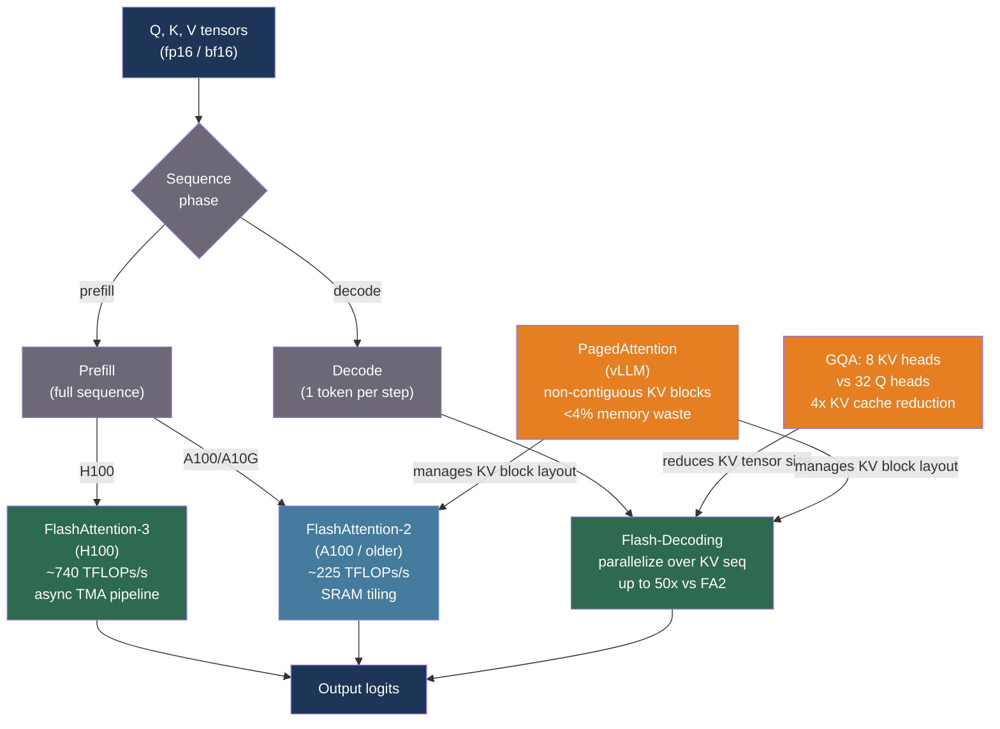

# [BEE-30062] FlashAttention and Efficient Attention Kernels

:::info
Standard attention materializes an N×N matrix in GPU HBM for every forward pass, making memory bandwidth — not compute — the binding constraint for large sequence lengths. FlashAttention and its successors tile attention into SRAM to avoid this, while Grouped-Query Attention shrinks the KV cache that stores attention state across decoding steps. Together these techniques are why modern LLMs can serve 128K-token contexts without requiring proportionally more GPUs.
:::

## Context

Self-attention's memory cost is O(N²) in sequence length: computing Q·Kᵀ for N tokens produces an N×N matrix that must be written to HBM and read back for the softmax and value-weighted sum. For N = 32,768 tokens and a model in fp16, this matrix alone occupies 2 GB — larger than the KV tensors for the entire sequence. At these lengths, the GPU spends more time transferring data between HBM and Tensor Cores than it spends computing; FLOPS utilization falls below 10%.

**FlashAttention** (Dao et al., arXiv:2205.14135, NeurIPS 2022) resolved this with IO-aware tiling. By computing attention in blocks that fit in on-chip SRAM (shared memory) and never writing the full N×N matrix to HBM, it reduces memory complexity to O(N) and cuts HBM reads/writes by a factor of N/block_size. On GPT-2 with 1K-token sequences, FlashAttention is 3× faster than PyTorch's standard attention. On BERT-large, end-to-end training is 15% faster. Path-X (64K tokens) became solvable for the first time, with accuracy reaching 63.1%.

**FlashAttention-2** (Dao, arXiv:2307.08691, ICLR 2024) improved FA1 by reducing non-matmul FLOPs (rescaling operations moved outside the inner loop) and parallelizing across the query sequence dimension within each attention head, increasing GPU occupancy. FA2 achieves ~2× the throughput of FA1: up to 225 TFLOPs/s on an A100 (72% model FLOPS utilization) versus FA1's roughly 25–40%.

**FlashAttention-3** (Shah et al., arXiv:2407.08608, 2024) targets the H100's Hopper architecture, where FA2 achieves only ~35% utilization because H100 Tensor Cores are fast enough that the softmax computation between GEMMs becomes the bottleneck. FA3 uses warp-specialization to pipeline GEMM and softmax asynchronously via the H100's Tensor Memory Accelerator (TMA), reaching ~740 TFLOPs/s (75% utilization) for FP16 forward passes and approaching 1.2 PFLOPs/s with FP8 using incoherent block quantization.

A key gap remained: these FA variants parallelize over batch size and query length. During autoregressive decoding, batch size is small and query length is 1 — so FA2 GPU utilization collapses below 1%. **Flash-Decoding** (Dao et al., 2023; Stanford CRFM blog) added a third parallelization dimension over the KV sequence length, splitting keys and values into chunks processed in parallel and reducing partial softmax results numerically stably. For CodeLlama-34B, attention computation is up to 50× faster than FA2 at long sequences; end-to-end generation is up to 8× faster.

Attention kernels optimize compute, but KV cache memory limits how many requests can be served concurrently. Two architectural changes reduce KV cache size. **Multi-Query Attention** (Shazeer, arXiv:1911.02150, 2019) shares a single set of K/V heads across all Q heads, reducing KV cache by a factor of H (the head count). **Grouped-Query Attention** (Ainslie et al., arXiv:2305.13245, EMNLP 2023) uses G groups (1 < G < H), recovering most of MQA's memory savings while maintaining near-MHA quality. GQA checkpoints can be converted from MHA using only 5% of original pre-training compute. Mistral 7B uses 32 query heads and 8 KV heads (4× reduction); Llama 3 all sizes and Gemma 2 use GQA.

## Best Practices

### Enable FlashAttention-2 for all GPU training and inference

**MUST** use FlashAttention for any sequence longer than 512 tokens on GPU. PyTorch 2.1+ dispatches it automatically through `scaled_dot_product_attention` (SDPA):

```python
import torch
import torch.nn.functional as F

# SDPA dispatches to FlashAttention-2 automatically for fp16/bf16 on CUDA.
# No code change needed if your model already uses this call.
out = F.scaled_dot_product_attention(
    query, key, value,       # (batch, heads, seq, head_dim)
    attn_mask=None,          # causal masking is handled by is_causal
    dropout_p=0.0,
    is_causal=True,          # enables causal masking without materializing the mask
)

# Explicitly select the backend (useful for debugging or when you need to force FA):
from torch.nn.attention import sdpa_kernel, SDPBackend
with sdpa_kernel(SDPBackend.FLASH_ATTENTION):
    out = F.scaled_dot_product_attention(query, key, value, is_causal=True)
```

For HuggingFace models, enable FA2 at load time:

```python
from transformers import AutoModelForCausalLM
import torch

# FA2 requires the model to be in fp16 or bf16
model = AutoModelForCausalLM.from_pretrained(
    "meta-llama/Llama-3.1-8B-Instruct",
    torch_dtype=torch.bfloat16,
    attn_implementation="flash_attention_2",
    device_map="auto",
)
```

**MUST NOT** use `attn_implementation="flash_attention_2"` with fp32 models — FA2 requires half-precision inputs. Use `attn_implementation="sdpa"` if you need fp32 support (SDPA's memory-efficient backend handles fp32).

### Use FA3 on H100 when available

**SHOULD** install FA3 on H100 deployments. FA2 achieves only ~35% H100 utilization because the GPU's GEMM throughput outpaces FA2's softmax pipeline. FA3 reaches ~75% utilization through async TMA pipelining:

```bash
# Install FlashAttention with FA3 support (requires CUDA 12.3+, H100)
pip install flash-attn --no-build-isolation

# In Python: FA3 is selected automatically when flash_attn >= 3.0 is installed
# on Hopper hardware; no API change required.
```

For vLLM on H100, FA3 is used automatically when the package is installed; no configuration flag is needed.

### Deploy models with GQA to reduce KV cache memory pressure

**SHOULD** prefer models that use GQA when KV cache is the binding memory constraint. At high concurrency, the KV cache for all active requests competes for GPU VRAM with model weights.

KV cache memory per token per layer (one sequence, fp16):

```
kv_cache_bytes_per_token_per_layer = 2 * n_kv_heads * head_dim * 2
# factor of 2: one K tensor + one V tensor
# factor of 2: 2 bytes per fp16 element

# Llama-3.1-8B: n_kv_heads=8, head_dim=128, 32 layers
kv_per_token = 2 * 8 * 128 * 2 = 4,096 bytes = 4 KB per token
# At 4K context: 4 KB * 4,096 = 16 MB per request
# At 128K context: 4 KB * 131,072 = 512 MB per request

# Llama-3.1-8B with MHA (32 KV heads): 4x more KV cache
# = 64 MB per 4K-context request — fills VRAM with far fewer concurrent requests
```

For a target of serving N concurrent requests at context length L on a GPU with V GB of free VRAM (after model weights):

```python
def max_concurrent_requests(
    vram_gb: float,
    n_kv_heads: int,
    head_dim: int,
    n_layers: int,
    context_length: int,
    dtype_bytes: int = 2,       # fp16
) -> int:
    kv_per_token_per_layer = 2 * n_kv_heads * head_dim * dtype_bytes
    kv_per_request = kv_per_token_per_layer * n_layers * context_length
    return int((vram_gb * 1e9) / kv_per_request)

# Llama-3.1-8B (GQA, 8 KV heads) at 4K context, 40 GB free VRAM:
print(max_concurrent_requests(40, n_kv_heads=8, head_dim=128, n_layers=32, context_length=4096))
# → 2,500 concurrent requests

# Hypothetical MHA variant (32 KV heads):
print(max_concurrent_requests(40, n_kv_heads=32, head_dim=128, n_layers=32, context_length=4096))
# → 625 concurrent requests — 4x fewer
```

### Enable FlashDecoding for long-context inference

**SHOULD** ensure the inference framework has FlashDecoding enabled for sequence lengths beyond ~8K tokens. In vLLM, FlashDecoding is used automatically during decode steps when the KV sequence is long. In raw FlashAttention:

```python
# flash_attn_with_kvcache enables Flash-Decoding automatically
# when sequence length exceeds a threshold
from flash_attn import flash_attn_with_kvcache

# k_cache, v_cache: (batch, seqlen_cache, n_kv_heads, head_dim) — paged or contiguous
output = flash_attn_with_kvcache(
    q=query_tokens,     # (batch, 1, n_heads, head_dim) — single decode token
    k_cache=k_cache,
    v_cache=v_cache,
    cache_seqlens=cache_seqlens,   # actual lengths per sequence
    causal=True,
)
# Flash-Decoding's parallel KV split is applied when seqlen_cache is large
```

**SHOULD NOT** benchmark attention kernels only at the prefill phase. FlashDecoding's up-to-50× acceleration applies to the decode phase; if your workload is generation-heavy (many output tokens per request), the decode phase dominates latency and FlashDecoding's impact is the most significant.

## Visual



## Common Mistakes

**Using fp32 models with `attn_implementation="flash_attention_2"`.** FA2 requires half-precision (fp16 or bf16). Passing fp32 tensors raises a runtime error. Always cast the model to bf16 before enabling FA2, or use `attn_implementation="sdpa"` which falls back to a memory-efficient fp32 kernel.

**Benchmarking only the prefill phase.** FlashAttention-2's speedup is most visible at long sequences during prefill. Flash-Decoding's speedup is most visible during decode at long KV lengths. A production LLM workload typically spends more wall time in decode than prefill. Benchmark both phases separately using TTFT (prefill) and ITL (decode) metrics (see BEE-30058).

**Ignoring KV cache size when scaling context length.** Extending context from 4K to 128K multiplies KV cache per request by 32×. Without GQA, this exhausts GPU VRAM at a fraction of the theoretical context limit. Always calculate KV cache memory before advertising a maximum context length to users.

**Treating GQA as a free lunch.** GQA reduces KV cache by H/G and slightly degrades quality at G=1 (MQA). Models use empirically chosen ratios (typically 4:1 to 8:1 query-to-KV groups) that balance quality and cache reduction. Converting a MHA checkpoint to GQA requires uptraining (~5% of pre-training compute per Ainslie et al.) — it cannot be done by simply reshaping weights.

**Installing FA2 but not confirming it is dispatched.** PyTorch SDPA silently falls back to math attention if FA2 is not installed or if inputs are in fp32. Verify with:

```python
import torch
from torch.nn.attention import SDPBackend

# Check which kernel SDPA will select for your inputs
q = torch.randn(1, 8, 512, 64, dtype=torch.bfloat16, device="cuda")
with torch.backends.cuda.sdp_kernel(
    enable_flash=True, enable_math=False, enable_mem_efficient=False
):
    try:
        out = torch.nn.functional.scaled_dot_product_attention(q, q, q)
        print("FlashAttention dispatched")
    except RuntimeError as e:
        print(f"FA not available: {e}")
```

## Related BEEs

- [BEE-30021](llm-inference-optimization-and-self-hosting.md) -- LLM Inference Optimization and Self-Hosting: the broader inference optimization landscape
- [BEE-30058](llm-load-testing-and-capacity-planning.md) -- LLM Load Testing and Capacity Planning: TTFT and ITL metrics for measuring FA and FlashDecoding gains
- [BEE-30059](speculative-decoding-for-llm-inference.md) -- Speculative Decoding for LLM Inference: orthogonal technique; FlashAttention and speculative decoding can be combined
- [BEE-30061](llm-quantization-for-inference.md) -- LLM Quantization for Inference: FA3 FP8 mode combines quantization and tiling

## References

- [Dao et al. FlashAttention: Fast and Memory-Efficient Exact Attention with IO-Awareness — arXiv:2205.14135, NeurIPS 2022](https://arxiv.org/abs/2205.14135)
- [Dao. FlashAttention-2: Faster Attention with Better Parallelism and Work Partitioning — arXiv:2307.08691, ICLR 2024](https://arxiv.org/abs/2307.08691)
- [Shah et al. FlashAttention-3: Fast and Accurate Attention with Asynchrony and Low-precision — arXiv:2407.08608, 2024](https://arxiv.org/abs/2407.08608)
- [Dao et al. Flash-Decoding for Long-Context Inference — crfm.stanford.edu, 2023](https://crfm.stanford.edu/2023/10/12/flashdecoding.html)
- [Shazeer. Fast Transformer Decoding: One Write-Head is All You Need — arXiv:1911.02150, 2019](https://arxiv.org/abs/1911.02150)
- [Ainslie et al. GQA: Training Generalized Multi-Query Transformer Models from Multi-Head Checkpoints — arXiv:2305.13245, EMNLP 2023](https://arxiv.org/abs/2305.13245)
- [Kwon et al. Efficient Memory Management for Large Language Model Serving with PagedAttention — arXiv:2309.06180, SOSP 2023](https://arxiv.org/abs/2309.06180)
- [Dao-AILab. FlashAttention GitHub — github.com/Dao-AILab/flash-attention](https://github.com/Dao-AILab/flash-attention)
- [HuggingFace. GPU Inference Documentation — huggingface.co/docs/transformers](https://huggingface.co/docs/transformers/main/en/perf_infer_gpu_one)
