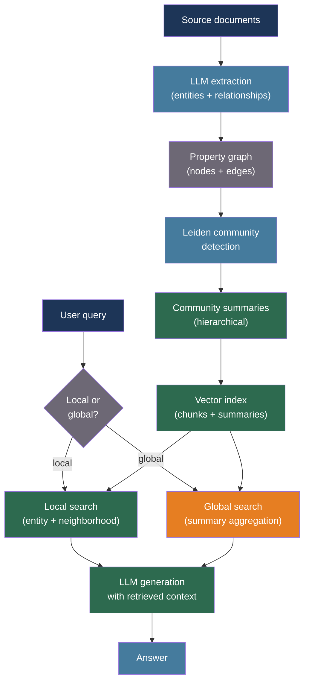

# [BEE-30052] GraphRAG and Knowledge Graph Augmented Generation

:::info
Standard vector RAG retrieves isolated chunks — it cannot traverse multi-hop relationships or reason over community structure. GraphRAG builds a knowledge graph from source documents, detects communities with the Leiden algorithm, and generates hierarchical summaries that enable both local entity lookup and global theme-level queries that flat retrieval cannot answer.
:::

## Context

Retrieval-Augmented Generation with dense vector search (BEE-30007) retrieves semantically similar chunks but treats each chunk as an independent unit. When a query requires aggregating information across many documents — "what are the main themes in this corpus?" or "how does entity A relate to entity B through intermediaries?" — vector similarity alone cannot traverse the graph of relationships.

Edge, Trinh, Cheng, Bradley, Chao, Mody, Truitt, and Larson (arXiv:2404.16130, Microsoft Research, 2024) introduced GraphRAG, a pipeline that extracts entity-relationship triples from source text using an LLM, builds a property graph, applies the Leiden community detection algorithm (Traag, Waltman, and van Eck, arXiv:1810.08473) to partition entities into hierarchical communities, and generates community summaries that are indexed alongside raw chunks. At query time, GraphRAG routes to either local search (entity lookup, neighborhood expansion) or global search (community summary aggregation), matching query type to retrieval strategy.

Peng, Xia, Galley, and Gao (arXiv:2408.08921, 2024) survey graph-enhanced LLM methods, categorizing approaches by how the graph structure is incorporated: as retrieved context (GraphRAG-style), as structured input to a graph-aware encoder, or as reasoning traces. Their analysis shows that global queries — those requiring cross-document synthesis — improve meaningfully only with graph-based retrieval; local factoid queries show comparable performance between graph and vector approaches, making hybrid retrieval the practical default.

For backend engineers, GraphRAG adds a construction phase that runs once (or incrementally as documents arrive), storing both raw embeddings and community summaries. Query routing logic must classify each query as local or global, and the cost model differs sharply: global queries aggregate over many summaries and are more expensive; local queries are comparable to standard vector RAG.

## Best Practices

### Build the Knowledge Graph with LLM-Extracted Triples

**MUST** extract entity-relationship triples from source documents rather than assuming noun phrases alone capture graph structure. A single LLM pass per chunk extracts entities, relationship types, and attributes:

```python
from dataclasses import dataclass, field
from typing import Literal
import json

@dataclass
class Entity:
    name: str
    type: str          # PERSON, ORG, CONCEPT, LOCATION, EVENT
    description: str
    source_chunk_id: str

@dataclass
class Relationship:
    source: str        # Entity name
    target: str        # Entity name
    relation: str      # e.g., "FOUNDED", "ACQUIRED", "PART_OF"
    description: str
    weight: float = 1.0

EXTRACTION_PROMPT = """\
Given the following text chunk, extract all entities and relationships.
Return JSON with keys "entities" and "relationships".

Each entity: {"name": str, "type": str, "description": str}
Each relationship: {"source": str, "target": str, "relation": str, "description": str}

Text:
{chunk_text}
"""

async def extract_graph_elements(
    chunk: str,
    chunk_id: str,
    client,
    model: str = "claude-haiku-4-5-20251001",
) -> tuple[list[Entity], list[Relationship]]:
    """
    Use a cheap, fast model for extraction — this runs once per chunk.
    The full corpus may have thousands of chunks; token cost accumulates.
    """
    response = await client.messages.create(
        model=model,
        max_tokens=2048,
        messages=[{"role": "user", "content": EXTRACTION_PROMPT.format(chunk_text=chunk)}],
    )
    data = json.loads(response.content[0].text)
    entities = [Entity(**e, source_chunk_id=chunk_id) for e in data.get("entities", [])]
    relationships = [Relationship(**r) for r in data.get("relationships", [])]
    return entities, relationships
```

**SHOULD** merge duplicate entities across chunks by normalizing names (lowercase, strip punctuation) and grouping by canonical form. Graph quality degrades sharply when "OpenAI", "Open AI", and "openai" are treated as separate nodes.

### Apply Leiden Community Detection for Hierarchical Summaries

**MUST** partition the graph into communities before generating summaries. The Leiden algorithm produces communities with provably high modularity and supports hierarchical resolution levels:

```python
import networkx as nx

def build_graph(entities: list[Entity], relationships: list[Relationship]) -> nx.Graph:
    G = nx.Graph()
    for entity in entities:
        G.add_node(entity.name, type=entity.type, description=entity.description)
    for rel in relationships:
        if G.has_edge(rel.source, rel.target):
            # Strengthen existing edge instead of duplicating
            G[rel.source][rel.target]["weight"] += rel.weight
        else:
            G.add_edge(rel.source, rel.target, relation=rel.relation, weight=rel.weight)
    return G

def detect_communities(G: nx.Graph, resolution: float = 1.0) -> dict[str, int]:
    """
    Use the Leiden algorithm via graspologic or igraph.
    resolution > 1.0 produces more, smaller communities.
    resolution < 1.0 produces fewer, larger communities.
    Run at multiple resolutions for hierarchical indexing.
    """
    try:
        from graspologic.partition import hierarchical_leiden
        partitions = hierarchical_leiden(G, resolution=resolution)
        return {node: partitions[node] for node in G.nodes()}
    except ImportError:
        # Fallback: Louvain (lower quality but widely available)
        from networkx.algorithms.community import louvain_communities
        communities = louvain_communities(G, resolution=resolution)
        return {node: i for i, comm in enumerate(communities) for node in comm}

async def generate_community_summary(
    community_nodes: list[str],
    G: nx.Graph,
    client,
    model: str = "claude-haiku-4-5-20251001",
) -> str:
    """
    Summarize the entities and relationships within one community.
    Summaries are stored and retrieved for global queries.
    """
    node_descriptions = [
        f"{node}: {G.nodes[node].get('description', '')}"
        for node in community_nodes
        if node in G.nodes
    ]
    edge_descriptions = [
        f"{u} --[{G[u][v].get('relation', 'related')}]--> {v}"
        for u, v in G.subgraph(community_nodes).edges()
    ]
    prompt = (
        "Summarize the following knowledge graph community in 3-5 sentences. "
        "Identify the central theme and key relationships.\n\n"
        "Entities:\n" + "\n".join(node_descriptions) + "\n\n"
        "Relationships:\n" + "\n".join(edge_descriptions)
    )
    response = await client.messages.create(
        model=model,
        max_tokens=512,
        messages=[{"role": "user", "content": prompt}],
    )
    return response.content[0].text
```

### Route Queries Between Local and Global Search

**MUST** classify queries before retrieval — local queries (entity-specific, factoid) benefit from neighborhood expansion; global queries (thematic, aggregative) require community summary aggregation:

```python
from enum import Enum

class QueryType(Enum):
    LOCAL = "local"    # Entity lookup, fact retrieval, relationship tracing
    GLOBAL = "global"  # Theme analysis, trend summarization, cross-entity synthesis

LOCAL_SIGNALS = ["who", "when", "where", "what did", "how did", "which company"]
GLOBAL_SIGNALS = ["what are the main themes", "summarize", "overall", "in general", "trends"]

def classify_query(query: str) -> QueryType:
    q_lower = query.lower()
    global_score = sum(1 for s in GLOBAL_SIGNALS if s in q_lower)
    local_score = sum(1 for s in LOCAL_SIGNALS if q_lower.startswith(s))
    return QueryType.GLOBAL if global_score > local_score else QueryType.LOCAL

async def hybrid_retrieve(
    query: str,
    vector_store,      # Standard embedding + FAISS/pgvector
    graph: nx.Graph,
    community_summaries: dict[int, str],  # community_id -> summary text
    embedder,
    top_k: int = 5,
) -> list[str]:
    query_type = classify_query(query)

    if query_type == QueryType.LOCAL:
        # Standard vector search, then expand entity neighborhood
        chunks = await vector_store.search(query, top_k=top_k)
        # Extract mentioned entities and pull their graph neighbors
        return chunks

    else:
        # Global: embed query, find similar community summaries
        query_embedding = await embedder.embed(query)
        summary_texts = list(community_summaries.values())
        # Rank summaries by relevance (cosine similarity or LLM scoring)
        # Return top summaries as context for the generation step
        return summary_texts[:top_k]
```

**SHOULD** log which retrieval path each query takes and monitor global query costs separately. A single global query that aggregates 50 community summaries can cost 10-50× a local query.

## Visual



## Common Mistakes

**Skipping entity deduplication.** Duplicate nodes fragment the graph and produce isolated communities. Always normalize entity names before building the graph.

**Generating community summaries at only one resolution.** Using a single Leiden resolution misses both fine-grained entity clusters and coarse thematic groupings. Generate summaries at two or three resolution levels and select by query type.

**Routing all queries through global search.** Global search aggregates many summaries and is significantly more expensive than local vector retrieval. Reserve global search for genuinely aggregative queries.

**Not caching community summaries.** The community detection and summary generation step is the most expensive part of the pipeline and produces stable outputs for static corpora. Always cache summaries; only regenerate when documents or the graph structure changes.

**Treating GraphRAG as a drop-in replacement for vector RAG.** The construction pipeline (extraction, graph build, community detection, summarization) may take minutes to hours for large corpora. Plan for incremental updates rather than full rebuilds on each document addition.

## Related BEEs

- [BEE-30007](rag-pipeline-architecture.md) -- RAG Pipeline Architecture: the vector retrieval foundation that GraphRAG extends
- [BEE-30029](advanced-rag-and-agentic-retrieval-patterns.md) -- Advanced RAG and Agentic Retrieval Patterns: multi-hop and agent-driven retrieval strategies
- [BEE-30015](retrieval-reranking-and-hybrid-search.md) -- Retrieval Reranking and Hybrid Search: combining vector and graph signals

## References

- [Edge et al. From Local to Global: A Graph RAG Approach to Query-Focused Summarization — arXiv:2404.16130, Microsoft Research 2024](https://arxiv.org/abs/2404.16130)
- [Peng et al. Graph Retrieval-Augmented Generation: A Survey — arXiv:2408.08921, 2024](https://arxiv.org/abs/2408.08921)
- [Traag, Waltman, and van Eck. From Louvain to Leiden: guaranteeing well-connected communities — arXiv:1810.08473, Scientific Reports 2019](https://arxiv.org/abs/1810.08473)
- [Microsoft GraphRAG — github.com/microsoft/graphrag](https://github.com/microsoft/graphrag)
- [Neo4j GraphRAG Python Package — neo4j.com/labs/genai-ecosystem/graphrag](https://neo4j.com/labs/genai-ecosystem/graphrag)
