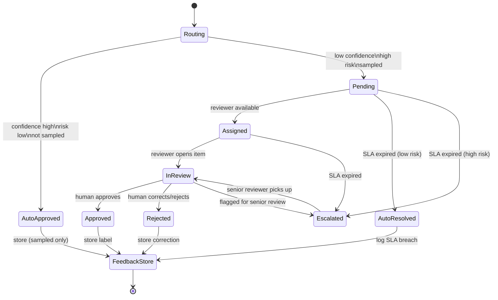

# [BEE-524] Human-in-the-Loop AI Patterns

:::info
Human-in-the-loop (HITL) is the architectural layer that routes AI outputs to human reviewers when the model's confidence is low, the action is irreversible, or audit compliance requires it — and feeds the results of that review back as labeled data for continued improvement.
:::

## Context

No production AI system operates without some form of human oversight. The question is how that oversight is structured. The naive version — a human manually reviews every output — does not scale. The degenerate version — no human ever sees what the model produces — fails under regulatory scrutiny and produces no signal for improvement. The engineering challenge is building a pipeline that places human attention where it has the highest leverage.

Amershi et al. documented this tension in their 2019 ICSE study of production ML systems at Microsoft: the processes that matter most in ML engineering are not model training but data management and the feedback loops that connect human judgment back to the model. Without a structured mechanism for collecting human corrections, models degrade silently as the world drifts away from their training distribution.

Active learning research (Settles, "Active Learning Literature Survey", 2009) formalized the insight that human annotation is most valuable on examples where the model is uncertain — not on easy cases the model already handles correctly. The query-by-committee and uncertainty sampling strategies that active learning developed translate directly into production HITL routing: send to humans the decisions where the model is least confident.

## Design Thinking

HITL has three architectural concerns that are often conflated:

**Routing** decides which outputs need human review. It is a classification problem applied to the model's own output or confidence. The routing layer should operate in the critical path but must be fast — a 500ms confidence check before every response is unacceptable. A cheap surrogate (token log-probability, verbalized uncertainty, rule-based triggers) is almost always sufficient.

**Review queue** is the infrastructure that holds work items, assigns them to reviewers, tracks SLAs, and handles escalation. It is a workflow system, not an ML system. Queue design decisions (priority, assignment, timeout policy) have more impact on reviewer efficiency than any model-side optimization.

**Feedback loop** closes the circuit from human review back to the model. This is where the operational value of HITL is realized — but it requires treating human corrections as a labeled dataset, storing them durably, and eventually acting on them (fine-tuning, rule updates, or retrieval corpus updates).

## Best Practices

### Route Based on Confidence, Risk, and Sampling

**SHOULD** implement routing as a three-factor decision rather than a single threshold:

```python
from dataclasses import dataclass
from enum import Enum

class ReviewReason(Enum):
    LOW_CONFIDENCE = "low_confidence"
    HIGH_RISK_ACTION = "high_risk_action"
    AUDIT_SAMPLE = "audit_sample"

@dataclass
class RoutingDecision:
    route_to_human: bool
    reason: ReviewReason | None
    priority: int  # 1 = high, 3 = low

import random

def route_output(
    output: str,
    confidence: float,
    action_risk: str,     # "low" | "medium" | "high" | "critical"
    audit_sample_rate: float = 0.05,
) -> RoutingDecision:
    # High-risk or irreversible actions always go to human review
    if action_risk in ("high", "critical"):
        return RoutingDecision(
            route_to_human=True,
            reason=ReviewReason.HIGH_RISK_ACTION,
            priority=1 if action_risk == "critical" else 2,
        )

    # Confidence-based routing
    if confidence < 0.75:
        return RoutingDecision(
            route_to_human=True,
            reason=ReviewReason.LOW_CONFIDENCE,
            priority=2,
        )

    # Random audit sampling — catch problems that confidence scores miss
    if random.random() < audit_sample_rate:
        return RoutingDecision(
            route_to_human=True,
            reason=ReviewReason.AUDIT_SAMPLE,
            priority=3,
        )

    return RoutingDecision(route_to_human=False, reason=None, priority=0)
```

**MUST NOT** rely solely on confidence scores from the model's own softmax probabilities. LLM softmax outputs are miscalibrated — a model can output a high-probability token sequence while being confidently wrong. Use calibrated proxies:

- **Verbalized uncertainty**: prompt the model to express its own confidence ("Rate your confidence from 0–100 and explain why"). This is noisier but correlates better with actual accuracy for LLMs than token log-probabilities.
- **Consistency sampling**: call the same prompt 3–5 times with temperature > 0 and measure output agreement. High variance = low reliability.
- **Rule-based triggers**: presence of phrases like "I'm not sure", "approximately", "I believe" in the output; absence of required structured fields; response length far outside the expected range.

**SHOULD** set the audit sample rate independently of the confidence threshold. Sampling catches systematic failures — cases where the model is confidently wrong — that confidence-based routing misses entirely. A 5% audit rate on auto-approved decisions is typically sufficient to catch distributional drift within days.

### Design the Review Queue as a State Machine

**SHOULD** model each review item as an explicit state machine rather than a simple status column. This prevents items from getting stuck silently:

```python
from enum import Enum
from datetime import datetime, timedelta, timezone

class ReviewState(Enum):
    PENDING = "pending"           # Waiting for reviewer assignment
    ASSIGNED = "assigned"         # Assigned to a reviewer
    IN_REVIEW = "in_review"       # Reviewer has opened the item
    APPROVED = "approved"         # Human approved the AI output
    REJECTED = "rejected"         # Human rejected; corrected output stored
    ESCALATED = "escalated"       # Timed out or flagged for senior review
    AUTO_RESOLVED = "auto_resolved"  # SLA expired, fallback applied

VALID_TRANSITIONS = {
    ReviewState.PENDING: {ReviewState.ASSIGNED, ReviewState.ESCALATED, ReviewState.AUTO_RESOLVED},
    ReviewState.ASSIGNED: {ReviewState.IN_REVIEW, ReviewState.ESCALATED, ReviewState.AUTO_RESOLVED},
    ReviewState.IN_REVIEW: {ReviewState.APPROVED, ReviewState.REJECTED, ReviewState.ESCALATED},
    ReviewState.ESCALATED: {ReviewState.IN_REVIEW, ReviewState.APPROVED, ReviewState.REJECTED},
    ReviewState.APPROVED: set(),
    ReviewState.REJECTED: set(),
    ReviewState.AUTO_RESOLVED: set(),
}

def transition(item: dict, to_state: ReviewState) -> dict:
    current = ReviewState(item["state"])
    if to_state not in VALID_TRANSITIONS[current]:
        raise ValueError(f"Invalid transition: {current} → {to_state}")
    item["state"] = to_state.value
    item["updated_at"] = datetime.now(timezone.utc).isoformat()
    return item
```

**MUST** set SLA deadlines at item creation time and run a background job that escalates or auto-resolves stale items. Letting items sit indefinitely blocks downstream workflows and destroys reviewer trust:

```python
async def process_sla_violations(review_queue, fallback_policy: str):
    """Run periodically (e.g., every minute) to handle timed-out items."""
    now = datetime.now(timezone.utc)
    stale_items = await review_queue.find_where(
        state__in=["pending", "assigned"],
        sla_deadline__lt=now.isoformat(),
    )
    for item in stale_items:
        if fallback_policy == "auto_approve":
            await review_queue.transition(item["id"], ReviewState.AUTO_RESOLVED)
            await downstream.release(item["id"], decision="approved", source="sla_timeout")
        elif fallback_policy == "escalate":
            await review_queue.transition(item["id"], ReviewState.ESCALATED)
            await pager.alert(f"Review SLA violated: {item['id']}")
        elif fallback_policy == "hold":
            # Do nothing — block downstream until a reviewer acts
            await audit_log.record(item["id"], "sla_violation", details={"age_minutes": ...})
```

**SHOULD** define SLA tiers by action risk rather than a single global SLA. A flagged payment authorization needs a 5-minute SLA; a low-confidence product description needs a 24-hour SLA.

### Build Approval Workflows for High-Stakes Agent Actions

When an AI agent is about to take an irreversible action — send a message, execute a database write, charge a payment — it should pause and request human approval rather than proceeding autonomously. BEE-504 establishes the principle; this is the implementation:

```python
import asyncio
import uuid

async def request_approval(
    action_type: str,
    action_payload: dict,
    agent_reasoning: str,
    timeout_seconds: int = 300,
) -> dict:
    """
    Pause the agent and wait for human approval.
    Returns {"approved": bool, "reviewer_id": str, "notes": str}.
    """
    approval_id = str(uuid.uuid4())
    await approval_queue.submit({
        "id": approval_id,
        "action_type": action_type,
        "action_payload": action_payload,
        "agent_reasoning": agent_reasoning,  # Show the model's chain-of-thought
        "state": "pending",
        "sla_deadline": (datetime.now(timezone.utc) + timedelta(seconds=timeout_seconds)).isoformat(),
    })

    # Poll until approved, rejected, or timed out
    deadline = asyncio.get_event_loop().time() + timeout_seconds
    while asyncio.get_event_loop().time() < deadline:
        item = await approval_queue.get(approval_id)
        if item["state"] in ("approved", "rejected"):
            return {
                "approved": item["state"] == "approved",
                "reviewer_id": item.get("reviewer_id"),
                "notes": item.get("reviewer_notes", ""),
            }
        await asyncio.sleep(2.0)

    # Timed out — apply the configured fallback (never auto-approve critical actions)
    await approval_queue.transition(approval_id, ReviewState.AUTO_RESOLVED)
    raise TimeoutError(f"Approval request {approval_id} timed out after {timeout_seconds}s")
```

**MUST** include the model's reasoning in the approval request, not just the proposed action. A reviewer who sees "DELETE user_id=12345" without context cannot make an informed decision. A reviewer who sees the agent's chain-of-thought and the triggering user request can assess whether the action is correct.

**MUST NOT** silently auto-approve critical or irreversible actions when the SLA expires. The timeout fallback for high-risk actions should be to hold or reject, not to approve.

### Collect and Store Feedback Durably

**SHOULD** treat every human review decision as a labeled training example and store it in a format suitable for future fine-tuning or retrieval:

```python
async def record_review_decision(
    original_input: str,
    ai_output: str,
    human_decision: str,   # "approved" | "corrected" | "rejected"
    corrected_output: str | None,
    reviewer_id: str,
    review_reason: ReviewReason,
):
    """Store in an append-only feedback table."""
    await feedback_store.insert({
        "id": str(uuid.uuid4()),
        "created_at": datetime.now(timezone.utc).isoformat(),
        "original_input": original_input,
        "ai_output": ai_output,
        "human_decision": human_decision,
        "corrected_output": corrected_output,  # Null if approved without changes
        "reviewer_id": reviewer_id,
        "review_reason": review_reason.value,
        # Do not store PII; anonymize reviewer_id if user data is involved
    })
```

**SHOULD** prefer pairwise preference annotations over binary approve/reject where feasible. "Version A is better than version B" is more signal-dense than "Version A is good" because it controls for reviewer strictness. This is the data format used for reward model training in RLHF pipelines.

**MUST NOT** allow feedback loops to introduce reviewer bias by showing the AI output first. When the goal is to collect the human's independent judgment (not to verify the AI), present the task without the AI's answer visible.

### Instrument the HITL Pipeline

**MUST** track these metrics as a minimum:

| Metric | What it reveals |
|--------|----------------|
| Escalation rate | Fraction of outputs routed to human review |
| Override rate | Fraction of reviewed items where human changed or rejected the output |
| Time-to-review (p50/p95) | Reviewer capacity and SLA health |
| SLA breach rate | Fraction of items that timed out before review |
| Reviewer disagreement rate | Fraction where two reviewers reached different decisions |
| Audit sample override rate | Whether confident AI decisions are actually correct |

**SHOULD** alert on override rate trends rather than absolute values. An override rate of 15% may be acceptable; an override rate rising from 5% to 15% over two weeks is a signal that the model has drifted.

## Visual



## Related BEEs

- [BEE-30002](ai-agent-architecture-patterns.md) -- AI Agent Architecture Patterns: BEE-504 establishes the principle of human checkpoints for high-risk agent actions; BEE-524 provides the queue and workflow implementation behind those checkpoints
- [BEE-30004](evaluating-and-testing-llm-applications.md) -- Evaluating and Testing LLM Applications: audit sampling and override rate tracking are evaluation signals that feed the continuous evaluation loop described in BEE-506
- [BEE-30017](ai-memory-systems-for-long-running-agents.md) -- AI Memory Systems for Long-Running Agents: human-corrected outputs are a form of episodic memory that can be stored and retrieved to improve future responses
- [BEE-30020](llm-guardrails-and-content-safety.md) -- LLM Guardrails and Content Safety: safety violations are one of the primary escalation triggers feeding the HITL queue

## References

- [Settles. Active Learning Literature Survey — University of Wisconsin-Madison TR1648, 2009](https://burrsettles.com/pub/settles.activelearning.pdf)
- [Amershi et al. Software Engineering for Machine Learning: A Case Study — ICSE-SEIP 2019](https://www.microsoft.com/en-us/research/wp-content/uploads/2019/03/amershi-icse-2019_Software_Engineering_for_Machine_Learning.pdf)
- [Guo et al. On Calibration of Modern Neural Networks — arXiv:1706.04599, ICML 2017](https://arxiv.org/abs/1706.04599)
- [Angelopoulos and Bates. A Gentle Introduction to Conformal Prediction — people.eecs.berkeley.edu](https://people.eecs.berkeley.edu/~angelopoulos/publications/downloads/gentle_intro_conformal_dfuq.pdf)
- [Hugging Face. Illustrating Reinforcement Learning from Human Feedback — huggingface.co](https://huggingface.co/blog/rlhf)
- [AWS. Using Amazon Augmented AI for Human Review — docs.aws.amazon.com](https://docs.aws.amazon.com/sagemaker/latest/dg/a2i-use-augmented-ai-a2i-human-review-loops.html)
- [Google Cloud. Human-in-the-Loop for Document AI — docs.cloud.google.com](https://docs.cloud.google.com/document-ai/docs/hitl)
- [Temporal. Workflow Engine Design Principles — temporal.io](https://temporal.io/blog/workflow-engine-principles)
