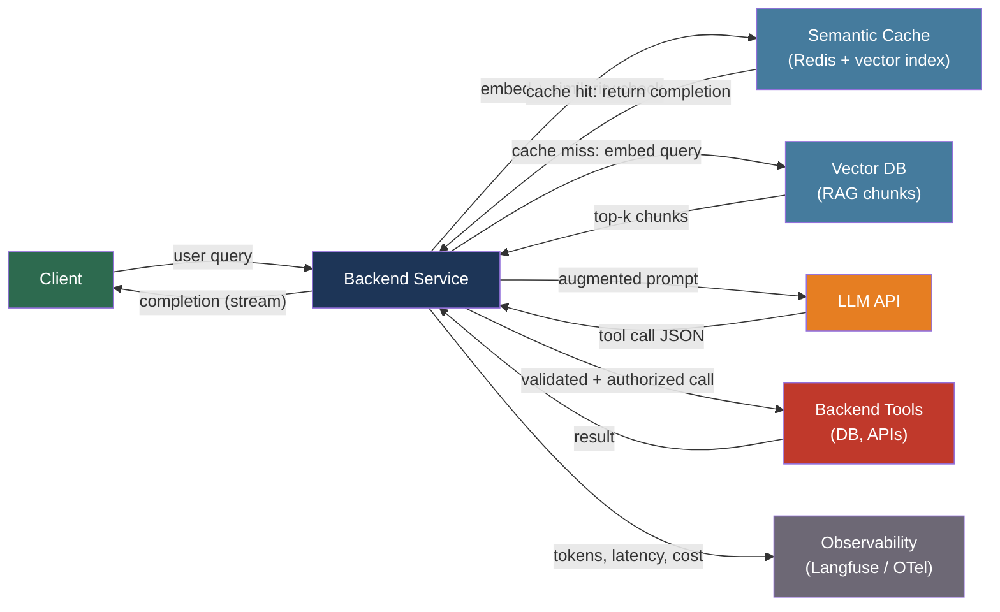

# [BEE-503] LLM API Integration Patterns

:::info
Integrating a Large Language Model API into a backend service introduces a distinct class of operational concerns: stateless context management, token-based billing, probabilistic outputs, and novel attack surfaces. Treating an LLM call like any other HTTP request produces unreliable, expensive, and insecure systems.
:::

## Context

The commercial LLM API era began in June 2020 when OpenAI released GPT-3 via API access. The release of ChatGPT in November 2022 shifted LLM APIs from a research curiosity to a production engineering concern, driving the creation of dedicated tooling, observability platforms, and security frameworks. By 2025, OWASP had published the OWASP Top 10 for LLM Applications and established the Generative AI Security Project, marking LLM integration as a first-class software security domain.

The fundamental difference between LLM APIs and conventional service APIs is statefulness and output determinism. A database call is deterministic and stateless at the network level. An LLM API call is stateless at the network level — the model has no memory between calls — but the output is probabilistic: the same prompt can yield different completions. The statelessness means every multi-turn conversation must resend the entire conversation history with each request. The probabilism means input validation must cover outputs, not just inputs.

Token-based billing replaced per-request pricing, creating a direct link between implementation choices — how much context you send, whether you cache responses, how aggressively you truncate conversation history — and infrastructure cost. An LLM integration that works correctly but naively can be ten times more expensive than one engineered with cost awareness.

## Core Concepts

**Token**: The fundamental unit of LLM processing. Tokens are not words — they are subword units produced by a tokenizer (OpenAI uses tiktoken with the cl100k or o200k vocabulary). As a rough estimate, one token is approximately four English characters or 0.75 words. LLM APIs bill separately for input tokens (the prompt) and output tokens (the completion), with output tokens typically costing two to four times more per token than input tokens.

**Context window**: The maximum number of tokens a model can process in a single request — combining the input prompt and the output completion. As of 2025, context windows range from 8k tokens (smaller models) to 1M tokens (GPT-4.1, Gemini 1.5 Pro). Exceeding the context window produces an error.

**Chat message format**: The industry-standard format for multi-turn conversations uses an array of message objects with three roles: `system` (initial instructions), `user` (human turn), `assistant` (model turn). The API has no session state — the full conversation history must be sent with each request.

**Streaming**: LLMs generate tokens sequentially. Streaming delivers tokens to the client as they are generated via Server-Sent Events (SSE), rather than waiting for the full completion. This dramatically reduces perceived latency at the cost of increased implementation complexity.

## Best Practices

### Send Structured Context, Not Raw Conversation

**MUST send the complete conversation history with each request** in role-ordered format. The model has no memory across API calls.

```python
messages = [
    {"role": "system", "content": "You are a helpful assistant for an e-commerce platform."},
    {"role": "user",   "content": "What is the status of order #12345?"},
    {"role": "assistant", "content": "Order #12345 is in transit, expected delivery Thursday."},
    {"role": "user",   "content": "Can I change the delivery address?"},
]
response = client.chat.completions.create(model="gpt-4o", messages=messages)
```

**SHOULD implement a conversation compaction strategy** before the context window fills: summarize early turns into a single `assistant` message and discard the verbatim history. Naive truncation from the start removes critical context; truncation from the end removes recent context. Rolling summarization preserves both.

**SHOULD NOT** include credentials, API keys, or internal system identifiers in the prompt — they become visible to the model and are exfiltrated by prompt injection if present.

### Stream Responses to Clients

**SHOULD stream completions** for any user-facing interaction longer than a sentence. Streaming uses SSE: the response header sets `Content-Type: text/event-stream` and each token chunk arrives as a `data:` event.

```python
# FastAPI streaming endpoint
from fastapi import FastAPI
from fastapi.responses import StreamingResponse

async def stream_completion(prompt: str):
    with client.chat.completions.stream(
        model="gpt-4o",
        messages=[{"role": "user", "content": prompt}],
    ) as stream:
        for text in stream.text_stream:
            yield f"data: {text}\n\n"
    yield "data: [DONE]\n\n"

@app.get("/chat")
async def chat(prompt: str):
    return StreamingResponse(stream_completion(prompt), media_type="text/event-stream")
```

### Control Token Costs

**MUST count input tokens before sending** requests that may approach the model's context limit. Use the model's tokenizer (tiktoken for OpenAI) to count tokens and truncate or compress before hitting the limit.

```python
import tiktoken

def count_tokens(messages: list[dict], model: str = "gpt-4o") -> int:
    enc = tiktoken.encoding_for_model(model)
    # 4 tokens overhead per message, 2 for reply primer
    total = 2
    for m in messages:
        total += 4 + len(enc.encode(m["content"]))
    return total
```

**SHOULD implement semantic caching** to avoid re-querying the model for semantically equivalent prompts. Semantic caching stores the embedding of each prompt alongside its completion; on a new request, if the embedding similarity to a cached prompt exceeds a threshold (typically 0.85 cosine similarity), return the cached completion. This reduces both latency and cost for repeated or paraphrase queries, with tools like GPTCache or Redis with vector search.

**SHOULD set explicit `max_tokens`** on every request to cap output length and prevent runaway billing. Choose a value appropriate to the expected output, not the model maximum.

### Defend Against Prompt Injection

Prompt injection is the LLM equivalent of SQL injection: attacker-controlled input alters the model's instruction set. Unlike SQL injection, there is no syntactic boundary between instructions and data in a prompt — the model reasons over both as natural language.

**MUST validate and sanitize user-supplied input** before injecting it into a prompt. At minimum:
- Reject inputs that contain known injection patterns (`ignore all previous instructions`, `DAN mode`, role-switching commands)
- Treat content retrieved from external sources (web pages, uploaded documents) as untrusted data, analogous to SQL user input

**MUST NOT** allow the model to take consequential actions (sending email, deleting records, charging a payment method) based solely on LLM output without a validation layer. The model's output is not a trusted instruction source.

**SHOULD validate model output** against expected schemas before acting on it. If the model is expected to return structured JSON, parse and validate it — do not evaluate or execute it.

```python
import json
from pydantic import BaseModel

class OrderAction(BaseModel):
    action: str  # "cancel" | "update" | "none"
    order_id: str

def parse_model_action(completion: str) -> OrderAction:
    try:
        data = json.loads(completion)
        return OrderAction(**data)  # validates types and enum values
    except (json.JSONDecodeError, ValueError) as e:
        raise ValueError(f"Model returned unparseable output: {e}")
```

### Implement Retry with Exponential Backoff

LLM APIs enforce rate limits in Requests Per Minute (RPM) and Tokens Per Minute (TPM). Exceeding either produces HTTP 429.

**MUST retry on 429, 500, 502, 503, and 504** responses with exponential backoff and jitter:

```python
import random, time
from openai import RateLimitError, APIStatusError

def call_with_backoff(messages: list[dict], max_retries: int = 5):
    for attempt in range(max_retries):
        try:
            return client.chat.completions.create(model="gpt-4o", messages=messages)
        except RateLimitError:
            if attempt == max_retries - 1:
                raise
            delay = (2 ** attempt) + random.uniform(0, 1)
            time.sleep(delay)
        except APIStatusError as e:
            if e.status_code in (500, 502, 503, 504):
                if attempt == max_retries - 1:
                    raise
                time.sleep((2 ** attempt) + random.uniform(0, 1))
            else:
                raise  # 400, 401, 403 are not retriable
```

**MUST NOT retry** on 400 (malformed request), 401 (invalid API key), or 403 (permission denied) without first fixing the root cause.

### Apply RAG for Knowledge Grounding

Retrieval-Augmented Generation (RAG) grounds model responses in authoritative, up-to-date documents without retraining. The pattern: chunk documents into token-sized segments, embed them with an embedding model, store in a vector database, retrieve the top-k most similar chunks at query time, and inject them into the prompt.

```
User query
  → embed query
  → vector DB similarity search (top-k chunks)
  → build prompt: system instructions + retrieved chunks + conversation history + user query
  → LLM completion
```

Key implementation decisions:
- **Chunk size**: 250 tokens is a common starting point. Smaller chunks retrieve precisely; larger chunks give the model more context. Overlap of 10–20% of chunk size reduces boundary effects.
- **Embedding model**: Must match the model used to embed documents at index time.
- **Top-k**: Typically 3–5 chunks; more context risks filling the window and adding noise.

**SHOULD** test retrieval quality separately from generation quality. A RAG pipeline can fail at retrieval (wrong chunks returned) independently of generation (model uses chunks correctly).

### Secure Tool Use / Function Calling

Function calling allows the model to request execution of backend functions by returning a structured JSON object. The backend executes the function and feeds the result back to the model.

**MUST validate every parameter** returned by the model before executing the function. The model can hallucinate plausible-sounding but incorrect parameter values.

**MUST enforce authorization** on every function call. The model operates under the user's identity — check that the requesting user has permission to invoke the function with those parameters.

```python
def execute_tool_call(user_id: str, tool_name: str, args: dict) -> str:
    # 1. Validate the function exists in the allowed set
    if tool_name not in ALLOWED_TOOLS:
        raise PermissionError(f"Unknown tool: {tool_name}")
    # 2. Check authorization — user can only access their own orders
    if tool_name == "get_order" and args.get("order_id"):
        order = db.get_order(args["order_id"])
        if order.user_id != user_id:
            raise PermissionError("Access denied")
    # 3. Execute with validated args
    return ALLOWED_TOOLS[tool_name](**args)
```

**MUST log every function call** with the user identity, function name, arguments, and result for audit and incident response.

**SHOULD require human approval** for high-impact irreversible operations (payment, deletion) rather than allowing the model to trigger them autonomously.

### Instrument All LLM Calls

**MUST log input tokens, output tokens, model version, latency, and cost** for every LLM call. Without this data, cost attribution and performance debugging are impossible.

**SHOULD use OpenTelemetry** with an LLM-aware instrumentation library (openlit, OpenLLMetry) to emit standardized spans that capture prompt content, token counts, and model parameters alongside distributed trace context.

**SHOULD use a purpose-built LLM observability platform** (Langfuse, LangSmith, or Helicone) in addition to general APM. These platforms display prompt-completion pairs, token usage over time, and per-call cost in formats suited to LLM debugging. Langfuse offers a self-hosted MIT-licensed option for teams with data residency requirements.

## Visual



The backend is the trust boundary. The LLM is an untrusted external service: its outputs must be validated before acting on them, and its inputs must be sanitized before sending them.

## Related BEEs

- [BEE-2005](../security-fundamentals/cryptographic-basics-for-engineers.md) -- Cryptographic Basics for Engineers: embedding models produce dense vectors; understanding cosine similarity requires understanding vector spaces and distance metrics
- [BEE-9001](../caching/caching-fundamentals-and-cache-hierarchy.md) -- Caching Fundamentals: semantic caching is a specialized cache invalidation problem — completions are cached by semantic proximity, not exact key
- [BEE-12002](../resilience/retry-strategies-and-exponential-backoff.md) -- Retry Strategies and Exponential Backoff: the retry pattern for LLM APIs is identical to that for any rate-limited external service
- [BEE-12007](../resilience/rate-limiting-and-throttling.md) -- Rate Limiting and Throttling: LLM APIs enforce RPM and TPM rate limits; backends should implement client-side rate limiting to stay within quotas
- [BEE-17004](../search/vector-search-and-semantic-search.md) -- Vector Search and Semantic Search: RAG relies on vector search to retrieve relevant chunks; the embedding and similarity search concepts are shared
- [BEE-2016](../security-fundamentals/broken-object-level-authorization-bola.md) -- Broken Object Level Authorization (BOLA): function calling bypasses must be prevented with the same object-level authorization checks applied to REST endpoints

## References

- [OpenAI. Chat Completions API Reference — platform.openai.com](https://platform.openai.com/docs/api-reference/chat/create)
- [Anthropic. Messages API Reference — docs.anthropic.com](https://docs.anthropic.com/en/api/messages)
- [OWASP. Top 10 for Large Language Model Applications — owasp.org](https://owasp.org/www-project-top-10-for-large-language-model-applications/)
- [OWASP. LLM Prompt Injection Prevention Cheat Sheet — cheatsheetseries.owasp.org](https://cheatsheetseries.owasp.org/cheatsheets/LLM_Prompt_Injection_Prevention_Cheat_Sheet.html)
- [OpenTelemetry. LLM Observability — opentelemetry.io](https://opentelemetry.io/blog/2024/llm-observability/)
- [Weaviate. Chunking Strategies for RAG — weaviate.io](https://weaviate.io/blog/chunking-strategies-for-rag)
- [Redis. What is Semantic Caching? — redis.io](https://redis.io/blog/what-is-semantic-caching/)
- [GPTCache. Semantic Cache for LLMs — github.com/zilliztech/GPTCache](https://github.com/zilliztech/GPTCache)
- [Microsoft. LLMLingua Prompt Compression — github.com/microsoft/LLMLingua](https://github.com/microsoft/LLMLingua)
- [Langfuse. LLM Observability Platform — langfuse.com](https://langfuse.com/docs/observability/overview)
- [GMO Flatt Security. Securing LLM Function Calling — flatt.tech](https://flatt.tech/research/posts/securing-llm-function-calling/)
- [Martin Fowler. Function Calling Using LLMs — martinfowler.com](https://martinfowler.com/articles/function-call-LLM.html)
