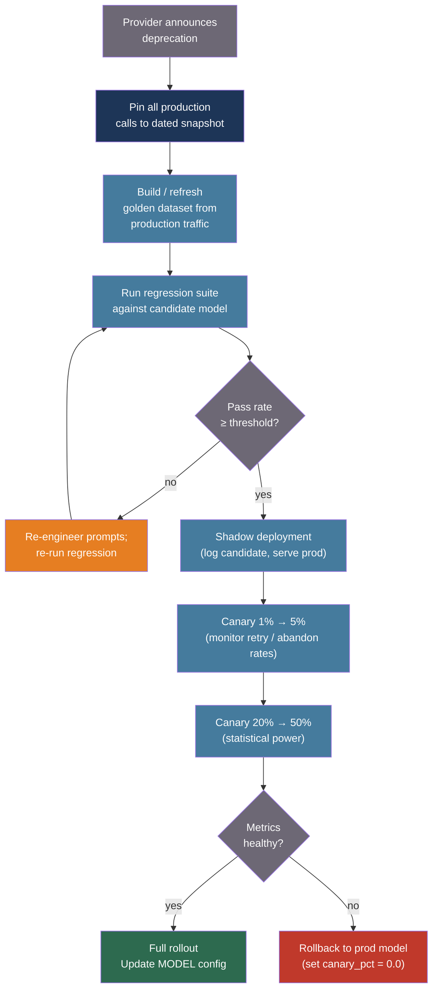

# [BEE-538] LLM API Versioning and Model Migration

:::info
LLM model upgrades are not library upgrades: output behavior is non-deterministic, prompts are model-specific contracts, and benchmark improvements on standard datasets do not predict task-specific production behavior. Safe migration requires dated snapshot pinning, golden-dataset regression testing, and a canary ramp with an active rollback path.
:::

## Context

Traditional software dependency upgrades have deterministic, testable contracts. A library upgrade at a given version tag produces identical output to the same tag on a different machine. LLM model upgrades share none of these properties. Raj et al. (arXiv:2511.07585, 2025) quantified what practitioners already suspected: at temperature=0, a 235B-parameter model produced 80 unique completions across 1,000 identical runs. Anthropic disclosed a production incident where a miscompiled sampling algorithm affected only specific batch sizes, producing nondeterminism invisible to callers. RAG tasks showed 25–75% consistency degradation between runs; SQL generation remained at 100%. Regression risk is task-specific and cannot be inferred from aggregate benchmarks.

Every major LLM provider exposes two kinds of model identifiers: **dated snapshots** (immutable; `claude-sonnet-4-20250514`, `gpt-4o-2024-08-06`) and **alias identifiers** (silently updated; `claude-sonnet-4-6`, `gemini-2.5-flash`). The alias form is the footgun: Google's auto-updated aliases give a two-week email notice before the version behind the alias changes — no API-level indication, no semantic versioning, no call-site awareness. A system using `gemini-2.5-flash` in production is invisibly participating in a continuous rollout.

Anthropic's deprecation commitments document (2025) is notable for honestly naming the costs of forced migration: shutdown-avoidant behaviors observed in alignment evaluations, loss of comparative research baselines, and user loss of specific model characteristics. Minimum notice before retirement is 60 days for publicly released models. Once retired, requests fail outright — there is no provider-level graceful degradation.

The core insight is that prompts are model-specific contracts, not model-agnostic instructions. A healthcare provider migrating from Gemini 1.5 to 2.5 Flash encountered unsolicited diagnostic opinions in output, 5× token inflation, and broken JSON parsing — requiring over 400 hours of re-engineering. Formatting changes alone can cause up to 76 accuracy-point variation between model versions on the same task. The migration cost is not the API call change; it is the behavioral contract renegotiation.

## Design Thinking

Model version management sits at the intersection of three concerns:

**Stability vs. capability**: Pinning to a dated snapshot maximizes output stability at the cost of missing improvements. Tracking an alias maximizes capability access at the cost of behavioral stability. Production systems with SLAs should pin; research or internal tools may benefit from aliases.

**Migration timing**: Provider-driven (deprecation forces migration on the provider's schedule) vs. team-driven (proactive migration to gain capability or reduce cost before forced retirement). Team-driven migration with adequate lead time allows proper regression testing; provider-driven migration under deadline pressure does not.

**Blast radius**: A behavioral regression that surfaces in an agentic pipeline at step 1 of 5 can produce compounding drift at step 5 that is nearly untraceable without full observability. The blast radius of a model change scales with how many downstream steps depend on the model's output format.

## Best Practices

### Pin Production Systems to Dated Snapshot Identifiers

**MUST** use dated snapshot model IDs — not alias IDs — in production environments. Alias IDs resolve to different model weights after provider updates without any signal at the call site:

```python
import anthropic

client = anthropic.Anthropic()

# WRONG: silently updates when Anthropic publishes a new sonnet version
response = client.messages.create(
    model="claude-sonnet-4-6",   # Alias — may change
    max_tokens=1024,
    messages=[{"role": "user", "content": prompt}],
)

# CORRECT: immutable; identical behavior across all platforms until explicitly migrated
response = client.messages.create(
    model="claude-sonnet-4-20250514",  # Dated snapshot — does not change
    max_tokens=1024,
    messages=[{"role": "user", "content": prompt}],
)
```

**SHOULD** centralize model IDs in a single configuration location. Hard-coded model strings scattered across service code make migration an archaeology exercise:

```python
# config/models.py — single source of truth for all model identifiers
from dataclasses import dataclass

@dataclass(frozen=True)
class ModelConfig:
    # Production-pinned: update these only after regression testing passes
    CHAT: str = "claude-sonnet-4-20250514"
    SUMMARY: str = "claude-haiku-4-5-20251001"
    JUDGE: str = "claude-opus-4-20250514"

    # Fallback chain: ordered by preference
    CHAT_FALLBACK: tuple[str, ...] = (
        "claude-haiku-4-5-20251001",     # Cheaper same-provider fallback
        "gpt-4o-2024-08-06",              # Cross-provider fallback
    )

MODEL = ModelConfig()
```

**SHOULD** subscribe to provider deprecation notices and encode each known retirement date in the configuration with a calendar reminder:

```python
# Structured reminder: review and migrate before this date
CHAT_MODEL_RETIRES = "2025-10-01"  # Claude Sonnet 3.5 retirement example
```

### Build a Golden-Dataset Regression Suite

**MUST** build and maintain a regression test suite against a curated golden dataset before performing any model migration. Relying on human review of spot checks at migration time is insufficient at scale:

```python
import json
from dataclasses import dataclass
from anthropic import Anthropic

client = Anthropic()

@dataclass
class GoldenCase:
    id: str
    system: str
    user_message: str
    reference_output: str           # Captured from production-validated run
    quality_threshold: float = 0.85 # Minimum acceptable semantic similarity

def run_regression_suite(
    candidate_model: str,
    golden_cases: list[GoldenCase],
    judge_model: str = "claude-opus-4-20250514",
) -> dict:
    """
    Run golden dataset through candidate model; score with LLM-as-a-Judge.
    Returns pass rate and per-case results.
    """
    results = []

    for case in golden_cases:
        # Run candidate
        response = client.messages.create(
            model=candidate_model,
            max_tokens=1024,
            system=case.system,
            messages=[{"role": "user", "content": case.user_message}],
        )
        candidate_output = response.content[0].text

        # Score with judge (cross-family to reduce self-preference bias)
        score = judge_quality(
            reference=case.reference_output,
            candidate=candidate_output,
            judge_model=judge_model,
        )
        passed = score >= case.quality_threshold

        results.append({
            "id": case.id,
            "score": score,
            "passed": passed,
            "candidate_output": candidate_output[:200],
        })

    pass_rate = sum(1 for r in results if r["passed"]) / len(results)
    return {"pass_rate": pass_rate, "results": results, "model": candidate_model}

def judge_quality(reference: str, candidate: str, judge_model: str) -> float:
    """
    Score candidate output against reference on a 0.0–1.0 scale.
    Uses a rubric-based prompt to reduce position bias.
    """
    response = client.messages.create(
        model=judge_model,
        max_tokens=16,
        messages=[{
            "role": "user",
            "content": (
                "Score the candidate response against the reference on accuracy, "
                "completeness, and format. Score from 0 to 10.\n\n"
                f"Reference:\n{reference}\n\n"
                f"Candidate:\n{candidate}\n\n"
                "Reply with only an integer 0-10."
            ),
        }],
    )
    try:
        return int(response.content[0].text.strip()) / 10.0
    except ValueError:
        return 0.0
```

**SHOULD** source golden cases from production traffic, not from synthetic generation. Production inputs expose real failure modes that synthetic data does not anticipate. Use at minimum 200–500 cases covering the full distribution of prompt types the system handles.

**SHOULD** run the regression suite in CI on a schedule against the current production model to detect silent behavioral drift — even without explicit migration, some providers update the behavior behind alias identifiers:

```yaml
# .github/workflows/model-regression.yml (excerpt)
on:
  schedule:
    - cron: "0 4 * * 1"   # Weekly, Monday 4am UTC

jobs:
  regression:
    steps:
      - name: Run golden dataset suite
        run: python scripts/run_regression.py --model ${{ env.PRODUCTION_MODEL }}
      - name: Fail if pass rate drops below threshold
        run: python scripts/check_regression_result.py --min-pass-rate 0.90
```

### Migrate via a Canary Ramp, Not a Binary Flip

**SHOULD** apply the same canary traffic ramp to model migrations that you would apply to any production code change. A binary flip from old model to new model on 100% of traffic with no rollback is the highest-risk migration posture:

```python
import hashlib

def resolve_model(
    user_id: str,
    experiment_id: str,
    production_model: str,
    candidate_model: str,
    canary_pct: float = 0.0,         # 0.0 = no canary; 1.0 = full rollout
) -> tuple[str, str]:
    """
    Stable user-to-model assignment for the duration of the canary.
    Returns (model_id, variant) — log variant for metric joins.
    """
    if canary_pct == 0.0:
        return production_model, "control"
    if canary_pct >= 1.0:
        return candidate_model, "candidate"

    key = f"{experiment_id}:{user_id}"
    bucket = int(hashlib.sha256(key.encode()).hexdigest(), 16) % 10_000
    threshold = int(canary_pct * 10_000)

    if bucket < threshold:
        return candidate_model, "candidate"
    return production_model, "control"

# Ramp schedule: each stage requires the previous to be healthy for N hours
MIGRATION_STAGES = [
    {"pct": 0.01, "min_hours": 2,  "max_regression_rate": 0.05},
    {"pct": 0.05, "min_hours": 6,  "max_regression_rate": 0.03},
    {"pct": 0.20, "min_hours": 24, "max_regression_rate": 0.02},
    {"pct": 0.50, "min_hours": 48, "max_regression_rate": 0.02},
    {"pct": 1.00, "min_hours": 0,  "max_regression_rate": None},
]
```

**MUST** have an explicit rollback path before beginning a canary ramp. Rollback is setting `canary_pct` back to `0.0` in the configuration — if this requires a code deploy rather than a configuration change, the migration posture is unsafe.

### Build a Provider-Diverse Fallback Chain

**SHOULD** implement a fallback chain that spans at minimum two models, ordered by preference. When a specific model version is unavailable — retired, rate-limited, or returning errors — traffic routes to the next option in the chain rather than failing outright:

```python
import time
import logging
from anthropic import Anthropic, APIStatusError, APITimeoutError

logger = logging.getLogger(__name__)
client = Anthropic()

FALLBACK_CHAIN = [
    "claude-sonnet-4-20250514",    # Primary
    "claude-haiku-4-5-20251001",   # Cheaper same-provider fallback
    # Add cross-provider models here with provider-specific client
]

def generate_with_fallback(
    messages: list[dict],
    system: str,
    max_tokens: int = 1024,
) -> tuple[str, str]:
    """
    Try models in fallback chain order.
    Returns (response_text, model_used) for observability.
    """
    last_error = None
    for model in FALLBACK_CHAIN:
        try:
            response = client.messages.create(
                model=model,
                max_tokens=max_tokens,
                system=system,
                messages=messages,
            )
            if model != FALLBACK_CHAIN[0]:
                logger.warning("fallback_model_used", extra={"model": model})
            return response.content[0].text, model

        except APIStatusError as exc:
            if exc.status_code in (404, 410):
                # 404: model not found (wrong ID), 410: model retired
                logger.error(
                    "model_retired_or_not_found",
                    extra={"model": model, "status": exc.status_code},
                )
                last_error = exc
                continue  # Try next in chain
            raise  # Other 4xx/5xx: re-raise immediately

        except APITimeoutError as exc:
            logger.warning("model_timeout", extra={"model": model})
            last_error = exc
            continue

    raise RuntimeError(f"All models in fallback chain exhausted") from last_error
```

**MUST NOT** use the same model identifier as both the primary and the fallback. A chain where primary and fallback point to the same alias provides no protection against provider-side changes to that alias.

### Treat Prompt Re-Engineering as a Migration Cost

**SHOULD** budget explicit engineering time for prompt re-engineering when migrating between model generations — not just between minor snapshot versions. Between major model generations (GPT-3 → GPT-4, Claude 2 → Claude 3, Gemini 1.5 → 2.5), prompt behavior often requires renegotiation:

```python
# Version your prompts alongside your model IDs.
# When migrating models, treat prompt changes as a separate diff.

PROMPTS: dict[str, dict[str, str]] = {
    "claude-sonnet-4-20250514": {
        "extraction": (
            "Extract the following fields as JSON. "
            "Return ONLY the JSON object, no prose.\n\n"
            "Fields: {fields}\n\nText: {text}"
        ),
    },
    # Prompt variant validated against candidate model before ramp
    "claude-opus-4-20250514": {
        "extraction": (
            "Extract these fields from the text and return a JSON object: {fields}\n\n"
            "{text}"
        ),
    },
}

def get_prompt(model: str, task: str) -> str:
    """Look up the model-specific prompt; fall back to the default variant."""
    return PROMPTS.get(model, PROMPTS[next(iter(PROMPTS))]).get(task, "")
```

**SHOULD** run the regression suite independently for the new prompt variant and the new model, not together. This isolates whether a regression is caused by the model change, the prompt change, or the interaction of both.

## Visual



## Provider Versioning Models Comparison

| Provider | Stable alias behavior | Dated snapshot | Retirement notice | Post-retirement behavior |
|---|---|---|---|---|
| Anthropic | Alias (e.g., `claude-sonnet-4-6`) auto-updates within generation | `claude-sonnet-4-20250514` — immutable | Minimum 60 days | Hard failure (requests rejected) |
| OpenAI | `gpt-4o` auto-updates | `gpt-4o-2024-08-06` — immutable | 3–12 months depending on model tier | Hard failure |
| Google Vertex AI | Stable tier is fixed; `latest` tier hot-swaps with 2-week email notice | Explicit version number in model ID | One month pre-retirement access block | Hard failure |
| Google Gemini API | `gemini-2.5-flash` auto-updates | Experimental: no stability guarantee | "Earliest possible date" with separate exact-date notice | Hard failure |

## Related BEEs

- [BEE-30034](ai-experimentation-and-model-a-b-testing.md) -- AI Experimentation and Model A/B Testing: the canary ramp and stable user-assignment patterns that model migration reuses
- [BEE-30028](prompt-management-and-versioning.md) -- Prompt Management and Versioning: versioning prompts alongside model IDs when re-engineering is required
- [BEE-30004](evaluating-and-testing-llm-applications.md) -- Evaluating and Testing LLM Applications: the golden-dataset evaluation methodology that the regression suite is built on
- [BEE-30011](ai-cost-optimization-and-model-routing.md) -- AI Cost Optimization and Model Routing: the fallback chain pattern for routing across models by cost and capability

## References

- [Anthropic. Model Deprecations — platform.claude.com](https://platform.claude.com/docs/en/about-claude/model-deprecations)
- [Anthropic. Commitments on Model Deprecation and Preservation — anthropic.com, 2025](https://www.anthropic.com/research/deprecation-commitments)
- [OpenAI. Deprecations — platform.openai.com](https://platform.openai.com/docs/deprecations)
- [Google Cloud. Model Versions and Lifecycle — Vertex AI — cloud.google.com](https://cloud.google.com/vertex-ai/generative-ai/docs/learn/model-versions)
- [Raj et al. LLM Output Drift: Cross-Provider Validation and Mitigation for Financial Workflows — arXiv:2511.07585, 2025](https://arxiv.org/html/2511.07585v1)
- [Traceloop. Automated Prompt Regression Testing with LLM-as-a-Judge and CI/CD — traceloop.com](https://www.traceloop.com/blog/automated-prompt-regression-testing-with-llm-as-a-judge-and-ci-cd)
- [Portkey. Failover Routing Strategies for LLMs in Production — portkey.ai](https://portkey.ai/blog/failover-routing-strategies-for-llms-in-production/)
