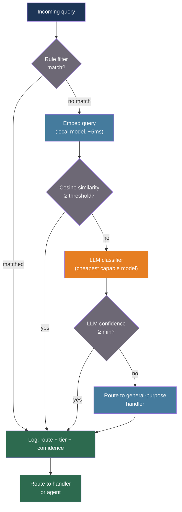

# [BEE-30037] LLM-Based Classification and Semantic Routing

:::info
Semantic routing replaces keyword and regex dispatch with embedding-space classification — an incoming query is encoded into a vector and compared against pre-encoded route examples, producing a routing decision in single-digit milliseconds at zero LLM API cost. Hybrid layering (rules → embedding router → LLM fallback) achieves over 90% routing precision while reducing expensive model calls by up to 85%.
:::

## Context

Traditional request routing in backend systems uses string predicates: exact match, prefix check, regex pattern, or a decision tree of keyword tests. These approaches are brittle under natural-language variation — a support question phrased four different ways forks to four different code paths unless each variant is explicitly enumerated. The vocabulary mismatch problem is well established in information retrieval; it is equally damaging in routing.

Yin et al. (arXiv:1909.00161, 2019) demonstrated that natural language inference (NLI) models can perform zero-shot text classification by framing each candidate label as a hypothesis and scoring entailment probability — the model asks "does this text entail the claim that it is about {label}?" No fine-tuning required; labels are arbitrary strings defined at inference time. This made semantic classification practical for cases where route definitions change frequently.

The RouteLLM paper (Ong et al., ICLR 2025, arXiv:2406.18665) formalized the connection between routing and preference prediction: given a query, which model tier — strong-and-expensive or weak-and-cheap — will produce an answer users prefer? Their matrix factorization router, trained on Chatbot Arena human preference data, reduces LLM costs by up to 85% while maintaining 95% of GPT-4 quality on MT Bench. The router learns query complexity signals, not model-specific features, and transfers to model pairs it was not trained on.

The 2025 survey (arXiv:2502.00409) taxonomizes routing strategies into four families: similarity-based (cosine in embedding space), supervised classification (BERT-family), reinforcement learning (contextual bandits), and generative/LLM-based (prompt scoring). The key finding: pre-generation routing — deciding the target before any expensive model call — consistently outperforms post-generation cascades on cost grounds. The best pre-generation systems reach 97% of GPT-4 accuracy at 24% of the cost.

The BTZSC benchmark (2026, arXiv:2603.11991) provides the most current cross-family comparison under zero-shot conditions across 22 datasets. Embedding models (GTE-large-en-v1.5) occupy the practical production sweet spot: ~0.62 macro F1 with the lowest latency. Rerankers (Qwen3-Reranker-8B) achieve the highest accuracy (~0.72 F1) at moderate latency cost. LLM-based classifiers (Mistral-Nemo 12B) reach 0.67 F1 but are too slow for real-time routing at high request volumes.

## Design Thinking

Every routing system balances three variables:

**Latency budget**: An embedding nearest-neighbor lookup runs in ~5ms on CPU. An NLI cross-encoder runs in ~50–200ms. An LLM API call adds 500ms–2s. The appropriate classifier tier depends on which latency budget is acceptable and how large a fraction of traffic hits that tier.

**Label stability**: If routes are static and well-defined (a support bot with 20 fixed intent categories), a trained embedding-based router is optimal. If routes are added, renamed, or redefined frequently, NLI zero-shot classification (no retraining) or prompt-based LLM classification (labels in the prompt) is more maintainable.

**Confidence distribution**: Real traffic is not cleanly separable. A fraction of queries will fall near decision boundaries and be misclassified by any single classifier. The correct response is a cascade — not a fallback to raw error, but escalation to a more capable (and more expensive) classifier tier. A well-calibrated confidence threshold at the embedding layer can reduce LLM fallback invocations to under 10% of traffic.

The dominant production pattern is **hybrid layering**:

1. Rule filters handle the highest-confidence known cases first (keyword match, user tier, explicit flags) at near-zero cost.
2. Embedding similarity router handles the bulk of traffic in milliseconds.
3. LLM classifier handles genuinely ambiguous cases the embedding layer cannot resolve.

## Best Practices

### Define Routes as Semantic Clusters, Not Keyword Lists

**SHOULD** define each route as a set of representative example utterances rather than a keyword list. Example utterances are encoded once at startup and stored as a centroid (mean of embeddings) or full vector set. At runtime, the incoming query embedding is compared against all route centroids:

```python
from dataclasses import dataclass, field
from anthropic import Anthropic

client = Anthropic()

@dataclass
class Route:
    name: str
    examples: list[str]
    description: str = ""
    _centroid: list[float] = field(default=None, init=False, repr=False)

    def encode(self, embed_fn) -> None:
        """Pre-encode examples; store mean as centroid."""
        vecs = [embed_fn(ex) for ex in self.examples]
        n = len(vecs[0])
        self._centroid = [sum(v[i] for v in vecs) / len(vecs) for i in range(n)]

    @property
    def centroid(self) -> list[float]:
        if self._centroid is None:
            raise RuntimeError(f"Route '{self.name}' not encoded — call encode() first")
        return self._centroid

# Define routes with natural-language examples, not keyword lists
ROUTES = [
    Route(
        name="billing",
        description="Questions about invoices, payments, refunds, or subscriptions",
        examples=[
            "I was charged twice this month",
            "How do I update my payment method?",
            "Can I get a refund for last month?",
            "Where can I see my invoice?",
            "Cancel my subscription",
        ],
    ),
    Route(
        name="technical_support",
        description="Issues with the product, bugs, errors, or how-to questions",
        examples=[
            "The app keeps crashing when I upload a file",
            "I'm getting a 500 error",
            "How do I configure the webhook URL?",
            "My API key isn't working",
            "Error: connection timeout in the dashboard",
        ],
    ),
    Route(
        name="account",
        description="Account settings, access, login, and team management",
        examples=[
            "I can't log in to my account",
            "How do I reset my password?",
            "Add a team member to my workspace",
            "Change my email address",
            "Two-factor authentication setup",
        ],
    ),
]
```

**MUST NOT** use the same example utterances for multiple routes. Overlapping examples degrade the centroid separation and increase misclassification at the decision boundary.

### Use Embedding Similarity for the Bulk of Traffic

**SHOULD** implement the main routing tier as a cosine similarity comparison against precomputed route centroids. This requires no LLM API call and runs in single-digit milliseconds:

```python
import math

def cosine_similarity(a: list[float], b: list[float]) -> float:
    dot = sum(x * y for x, y in zip(a, b))
    mag_a = math.sqrt(sum(x * x for x in a))
    mag_b = math.sqrt(sum(x * x for x in b))
    if mag_a == 0 or mag_b == 0:
        return 0.0
    return dot / (mag_a * mag_b)

def embed_text(text: str) -> list[float]:
    """
    Use any embedding model appropriate for your latency budget.
    For low-latency routing, prefer local models (sentence-transformers,
    FastEmbed) over API calls to keep routing overhead under 5ms.
    """
    import voyageai  # Example: Voyage AI embedding API
    result = voyageai.Client().embed([text], model="voyage-3-lite")
    return result.embeddings[0]

@dataclass
class RoutingResult:
    route_name: str | None      # None = no route met the threshold
    confidence: float           # 0.0–1.0 cosine similarity
    second_best: str | None     # Used for monitoring ambiguity
    second_confidence: float

def route_query(
    query: str,
    routes: list[Route],
    threshold: float = 0.75,
) -> RoutingResult:
    """
    Embed query and find the highest-similarity route.
    Returns None route_name if similarity is below threshold.
    """
    query_vec = embed_text(query)
    scores = [
        (route.name, cosine_similarity(query_vec, route.centroid))
        for route in routes
    ]
    scores.sort(key=lambda x: x[1], reverse=True)

    best_name, best_score = scores[0]
    second_name, second_score = scores[1] if len(scores) > 1 else (None, 0.0)

    return RoutingResult(
        route_name=best_name if best_score >= threshold else None,
        confidence=best_score,
        second_best=second_name,
        second_confidence=second_score,
    )
```

**SHOULD** choose the similarity threshold through offline calibration against a labeled validation set — not by picking an arbitrary round number. A threshold that works for a billing-vs-technical binary case may be too low for a 20-intent support bot where routes are semantically closer.

### Layer Rules, Embedding, and LLM in a Cascade

**MUST** implement routing as a cascade, not a single classifier. The cascade applies cheaper classifiers first and escalates to more expensive ones only for queries the cheaper tier cannot confidently resolve:

```python
import logging
from dataclasses import dataclass

logger = logging.getLogger(__name__)

@dataclass
class CascadeConfig:
    embedding_threshold: float = 0.75   # Below this, escalate to LLM
    high_confidence_threshold: float = 0.90  # Above this, skip all logging overhead
    lm_fallback_model: str = "claude-haiku-4-5-20251001"  # Cheapest capable model

def rule_filter(query: str, metadata: dict) -> str | None:
    """
    Tier 0: Deterministic rules for the highest-confidence cases.
    Returns route name if matched, None to pass through to embedding tier.
    """
    user_tier = metadata.get("user_tier", "")
    if user_tier == "enterprise" and "dedicated" in query.lower():
        return "enterprise_support"
    if query.strip().startswith("/"):
        return "command"   # Slash-command interface
    return None

def llm_classify(query: str, routes: list[Route], model: str) -> RoutingResult:
    """
    Tier 2: LLM-based classification for ambiguous queries.
    Uses structured output to extract route name and confidence.
    """
    route_descriptions = "\n".join(
        f"- {r.name}: {r.description}" for r in routes
    )
    response = client.messages.create(
        model=model,
        max_tokens=64,
        messages=[{
            "role": "user",
            "content": (
                f"Classify this query into exactly one of these categories:\n"
                f"{route_descriptions}\n\n"
                f"Query: {query}\n\n"
                f"Reply with JSON: "
                f'{"{"}"route": "<name>", "confidence": <0.0-1.0>{"}"}'
            ),
        }],
    )
    import json
    data = json.loads(response.content[0].text)
    return RoutingResult(
        route_name=data.get("route"),
        confidence=float(data.get("confidence", 0.5)),
        second_best=None,
        second_confidence=0.0,
    )

def cascade_route(
    query: str,
    routes: list[Route],
    metadata: dict,
    config: CascadeConfig = CascadeConfig(),
) -> tuple[str | None, str, float]:
    """
    Three-tier cascade: rules → embedding → LLM.
    Returns (route_name, tier_used, confidence).
    """
    # Tier 0: Rule filters
    rule_result = rule_filter(query, metadata)
    if rule_result:
        logger.info("route_via_rule", extra={"route": rule_result, "query_len": len(query)})
        return rule_result, "rule", 1.0

    # Tier 1: Embedding similarity
    embedding_result = route_query(query, routes, threshold=config.embedding_threshold)
    if embedding_result.route_name:
        logger.info(
            "route_via_embedding",
            extra={
                "route": embedding_result.route_name,
                "confidence": round(embedding_result.confidence, 3),
                "second_best": embedding_result.second_best,
                "second_conf": round(embedding_result.second_confidence, 3),
            },
        )
        return embedding_result.route_name, "embedding", embedding_result.confidence

    # Tier 2: LLM fallback for genuinely ambiguous queries
    logger.info(
        "route_via_llm_fallback",
        extra={"embedding_confidence": round(embedding_result.confidence, 3)},
    )
    llm_result = llm_classify(query, routes, config.lm_fallback_model)
    return llm_result.route_name, "llm", llm_result.confidence
```

**MUST** log `tier_used` and `confidence` for every routing decision. Without this, you cannot monitor how much traffic hits the expensive LLM tier, detect confidence distribution drift, or tune thresholds with data.

### Calibrate Thresholds with a Labeled Validation Set

**SHOULD** measure routing accuracy and tier distribution against a hand-labeled validation set before deploying thresholds to production. Threshold tuning is an empirical problem, not an analytical one:

```python
def evaluate_thresholds(
    validation_set: list[dict],   # [{"query": ..., "expected_route": ...}, ...]
    routes: list[Route],
    thresholds: list[float] = None,
) -> list[dict]:
    """
    Evaluate routing accuracy and LLM fallback rate across threshold values.
    Use this to pick the threshold that maximizes accuracy within cost constraints.
    """
    if thresholds is None:
        thresholds = [round(t, 2) for t in [x / 100 for x in range(60, 96, 5)]]

    results = []
    for threshold in thresholds:
        correct = 0
        llm_escalations = 0
        unrouted = 0

        for item in validation_set:
            result = route_query(item["query"], routes, threshold=threshold)
            if result.route_name is None:
                unrouted += 1
                llm_escalations += 1  # Would escalate to LLM tier
            elif result.route_name == item["expected_route"]:
                correct += 1
            # Misrouted queries would also escalate in a production cascade

        total = len(validation_set)
        results.append({
            "threshold": threshold,
            "accuracy": correct / total,
            "llm_escalation_rate": llm_escalations / total,
            "unrouted_rate": unrouted / total,
        })

    return results
```

**SHOULD** re-run calibration quarterly or after a significant change in traffic distribution. Embedding models are frozen, but the query distribution shifts as the product evolves and new user intents emerge.

### Monitor Route Distribution and Confidence Drift

**SHOULD** track the distribution of routed intents and the P50/P95 confidence score per route as operational metrics. A sustained drop in average confidence on a specific route signals that incoming queries have diverged from the example utterances and the route definition needs updating:

```python
from collections import defaultdict

class RoutingMetrics:
    def __init__(self):
        self.route_counts: dict[str, int] = defaultdict(int)
        self.route_confidences: dict[str, list[float]] = defaultdict(list)
        self.tier_counts: dict[str, int] = defaultdict(int)

    def record(self, route: str | None, tier: str, confidence: float) -> None:
        label = route or "__unrouted__"
        self.route_counts[label] += 1
        self.route_confidences[label].append(confidence)
        self.tier_counts[tier] += 1

    def p50_confidence(self, route: str) -> float:
        values = sorted(self.route_confidences.get(route, [0.0]))
        if not values:
            return 0.0
        return values[len(values) // 2]

    def llm_tier_fraction(self) -> float:
        total = sum(self.tier_counts.values())
        return self.tier_counts.get("llm", 0) / total if total > 0 else 0.0

metrics = RoutingMetrics()
```

**SHOULD** alert when the LLM tier fraction exceeds a defined threshold (e.g., 15% of traffic). This indicates that the embedding router's coverage is degrading — either the query distribution has drifted or new intents are appearing that have no matching route.

## Visual



## Classifier Approach Comparison

| Approach | Latency | Cost per request | Accuracy (zero-shot) | Label flexibility | Best for |
|---|---|---|---|---|---|
| Embedding cosine (centroid) | ~5ms (local) | Near-zero | ~90% on well-separated routes | Requires examples | High-volume, stable intent sets |
| NLI zero-shot (BART-MNLI) | 50–200ms (local) | Near-zero | ~0.58 macro F1 | Labels as natural language | Sparse/changing labels, no examples |
| Embedding (BTZSC best, GTE-large) | ~15ms | Near-zero | ~0.62 macro F1 | Requires examples | Production sweet spot for zero-shot |
| Reranker (Qwen3-Reranker-8B) | ~200ms (GPU) | Near-zero | ~0.72 macro F1 | Requires examples or descriptions | Highest accuracy, moderate latency |
| LLM prompt-based | 500ms–2s | API cost per request | ~0.67 macro F1 | Arbitrary (in prompt) | Ambiguous, low-volume, dynamic labels |
| RouteLLM learned router | ~10ms (inference) | Near-zero (post-training) | 95% GPT-4 quality at 24% cost | Binary: strong vs weak model | Cost-optimal model tier selection |

## Related BEEs

- [BEE-30011](ai-cost-optimization-and-model-routing.md) -- AI Cost Optimization and Model Routing: using routing to select cheaper model tiers based on query complexity
- [BEE-30014](embedding-models-and-vector-representations.md) -- Embedding Models and Vector Representations: the embedding model choice that underlies similarity-based routing
- [BEE-30002](ai-agent-architecture-patterns.md) -- AI Agent Architecture Patterns: routing to different specialized agents rather than model tiers
- [BEE-30015](retrieval-reranking-and-hybrid-search.md) -- Retrieval Reranking and Hybrid Search: rerankers repurposed as high-accuracy zero-shot classifiers

## References

- [Ong et al. RouteLLM: Learning to Route LLMs with Preference Data — arXiv:2406.18665, ICLR 2025](https://arxiv.org/abs/2406.18665)
- [Survey: Routing Strategies for Resource Optimisation in LLM-Based Systems — arXiv:2502.00409, 2025](https://arxiv.org/html/2502.00409)
- [BTZSC Benchmark: Zero-Shot Text Classification Across Encoders, Embeddings, Rerankers and LLMs — arXiv:2603.11991, 2026](https://arxiv.org/html/2603.11991)
- [Yin et al. Benchmarking Zero-shot Text Classification — arXiv:1909.00161, 2019](https://arxiv.org/abs/1909.00161)
- [Aurelio AI. Semantic Router — github.com/aurelio-labs/semantic-router](https://github.com/aurelio-labs/semantic-router)
- [Red Hat. LLM Semantic Router: Intelligent Request Routing — developers.redhat.com, 2025](https://developers.redhat.com/articles/2025/05/20/llm-semantic-router-intelligent-request-routing)
