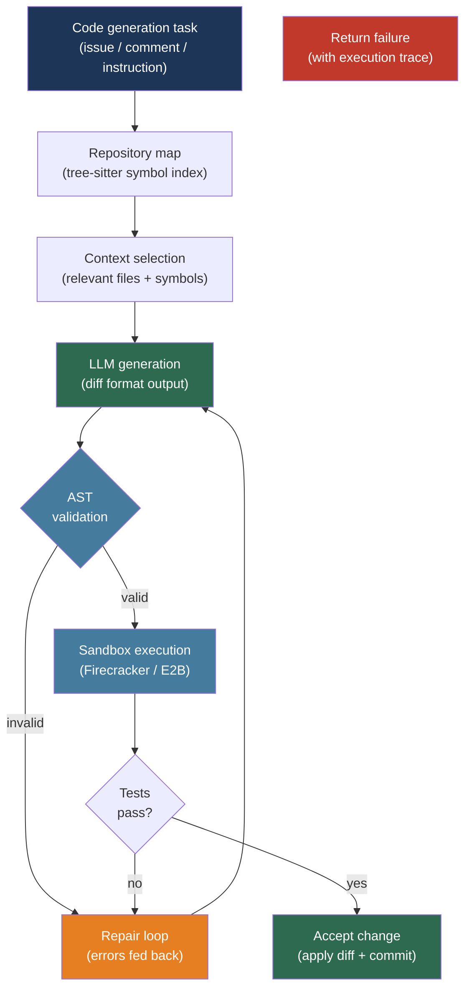

# [BEE-30033] LLM-Based Code Generation and Review Patterns

:::info
Integrating LLMs into a code generation or review pipeline requires more than a prompt and a text response — it requires repo-level context management, AST-based validation, isolated execution sandboxing, and structured output formats that downstream tooling can act on.
:::

## Context

Li et al. (AlphaCode, arXiv:2203.07814, Science 2022) demonstrated that LLMs could solve competitive programming problems at a level comparable to human participants — not by generating one perfect solution, but by generating millions of diverse candidates and filtering them down to the ten most likely to pass. The key engineering insight from AlphaCode is that code generation at production quality is a pipeline, not a single call: generate broadly, filter by structure, execute against tests, and return only surviving candidates.

Rozière et al. (Code Llama, arXiv:2308.12950, Meta 2023) introduced fill-in-the-middle (FIM) pretraining, which Bavarian et al. (arXiv:2207.14255, 2022) had formalized: rather than always generating from left to right, the model learns to infill a missing span given surrounding context. FIM is the capability that makes inline completions possible — the model sees the code before and after the cursor and generates only the middle.

The hardest problem in production code generation is not generating plausible-looking code — modern models do this reliably. It is providing enough context. Jimenez et al. (SWE-bench, arXiv:2310.06770, ICLR 2024) evaluated models on real GitHub issues from 12 Python repositories; even with repository access, early state-of-the-art models resolved fewer than 2% of issues. The bottleneck was context: knowing which of thousands of files are relevant to a given change. Systems that solve this — by building call graphs, ranking files by reference, or constructing repository maps — perform significantly better.

## Design Thinking

Code generation pipelines compose four layers:

1. **Context selection** — identify which files, symbols, and dependencies are relevant to the current task; distill them to fit the model's context window
2. **Generation** — invoke the model with the selected context; use structured output or diff format to constrain the response
3. **Validation** — parse the generated code through AST analysis before accepting it; reject structurally invalid output
4. **Execution** — run tests or user code in an isolated sandbox; feed failures back to the model for self-repair

Each layer is independently optimizable. A system with excellent context selection but no validation will produce syntactically broken code at non-trivial rates. A system with validation but no sandbox will fail when generated code tries to write to disk, make network calls, or consume unbounded memory.

## Best Practices

### Build a Repository Map for Context Selection

**SHOULD** construct a repository map — a compact symbol index of the codebase — rather than naively including entire files. An entire 10,000-line file consumes context budget without contributing proportionally to relevance:

```python
import subprocess
import json
from pathlib import Path

def build_repo_map(repo_path: str, query_files: list[str] = None) -> str:
    """
    Build a compact repository map using tree-sitter to extract
    function/class definitions and rank by reference frequency.
    Returns a string representation suitable for LLM context injection.

    For production use, Aider's RepoMap implementation (aider.chat/docs/repomap.html)
    applies PageRank over the symbol reference graph to rank importance.
    """
    repo = Path(repo_path)
    definitions = []

    for py_file in repo.rglob("*.py"):
        relative = py_file.relative_to(repo)
        try:
            source = py_file.read_text(encoding="utf-8", errors="ignore")
        except OSError:
            continue

        # Extract top-level definitions (simplified; use tree-sitter for accuracy)
        import ast as py_ast
        try:
            tree = py_ast.parse(source)
        except SyntaxError:
            continue

        for node in py_ast.walk(tree):
            if isinstance(node, (py_ast.FunctionDef, py_ast.AsyncFunctionDef, py_ast.ClassDef)):
                if node.col_offset == 0:  # Top-level only
                    sig = f"{relative}:{node.lineno} — {node.name}"
                    definitions.append(sig)

    # Truncate to fit context budget (~500 symbols → ~2,000 tokens)
    return "\n".join(definitions[:500])


def select_relevant_files(
    repo_path: str,
    task_description: str,
    repo_map: str,
    k: int = 5,
) -> list[str]:
    """
    Ask the model which files are relevant to a task, given the repo map.
    Returns a list of relative file paths.
    """
    import anthropic
    client = anthropic.Anthropic()

    response = client.messages.create(
        model="claude-sonnet-4-6",
        max_tokens=256,
        messages=[{
            "role": "user",
            "content": (
                f"Given this repository map:\n\n{repo_map}\n\n"
                f"Which {k} files are most relevant to this task: {task_description}\n\n"
                f"Return only a JSON array of relative file paths."
            ),
        }],
    )
    import json
    return json.loads(response.content[0].text)
```

**SHOULD NOT** include entire file contents for files with more than ~200 lines when other files are also needed. Prefer symbol-level context (function signatures, class definitions, docstrings) supplemented by full content only for the directly modified file.

### Request Code in Diff Format

**SHOULD** instruct the model to return changes as a unified diff rather than a complete rewritten file. Diffs are smaller (fit more changes per context), clearly express intent, and apply deterministically:

```python
import anthropic

DIFF_SYSTEM_PROMPT = """\
You are a code editing assistant. When asked to modify code, respond ONLY with a unified diff
in the format produced by `diff -u`. Do not include any explanation outside the diff block.

Example format:
--- a/path/to/file.py
+++ b/path/to/file.py
@@ -10,6 +10,8 @@
 def existing_function():
-    old_line
+    new_line
+    added_line
     unchanged_line
"""

def generate_code_change(
    task: str,
    file_path: str,
    file_content: str,
    context_files: dict[str, str],  # {path: content}
) -> str:
    """Returns a unified diff string."""
    client = anthropic.Anthropic()

    context_block = "\n\n".join(
        f"# {path}\n```python\n{content}\n```"
        for path, content in context_files.items()
    )

    response = client.messages.create(
        model="claude-sonnet-4-6",
        max_tokens=2048,
        system=DIFF_SYSTEM_PROMPT,
        messages=[{
            "role": "user",
            "content": (
                f"Task: {task}\n\n"
                f"File to modify ({file_path}):\n```python\n{file_content}\n```\n\n"
                f"Related context:\n{context_block}"
            ),
        }],
    )
    return response.content[0].text

def apply_diff(original: str, diff_text: str) -> str:
    """Apply a unified diff to file content using the patch utility."""
    import tempfile, os
    with tempfile.NamedTemporaryFile(mode="w", suffix=".py", delete=False) as f:
        f.write(original)
        orig_path = f.name
    with tempfile.NamedTemporaryFile(mode="w", suffix=".patch", delete=False) as f:
        f.write(diff_text)
        patch_path = f.name
    try:
        result = subprocess.run(
            ["patch", "--output=-", orig_path, patch_path],
            capture_output=True, text=True,
        )
        if result.returncode != 0:
            raise ValueError(f"Patch failed: {result.stderr}")
        return result.stdout
    finally:
        os.unlink(orig_path)
        os.unlink(patch_path)
```

### Validate Generated Code with AST Parsing Before Accepting

**MUST** parse generated code through a language-appropriate AST parser before writing it to disk or executing it. LLMs produce syntactically invalid code at a non-trivial rate, especially near context limits and for less-common languages:

```python
import ast as py_ast
from dataclasses import dataclass

@dataclass
class ValidationResult:
    valid: bool
    errors: list[str]

def validate_python(source: str) -> ValidationResult:
    """
    Two-level validation:
    1. Parse-level: catch syntax errors
    2. Semantic-level: catch common structural issues
    """
    errors = []

    # Level 1: Syntax check
    try:
        tree = py_ast.parse(source)
    except SyntaxError as e:
        return ValidationResult(valid=False, errors=[f"SyntaxError at line {e.lineno}: {e.msg}"])

    # Level 2: Structural checks
    for node in py_ast.walk(tree):
        # Detect dangerous builtins that should not appear in generated code
        if isinstance(node, py_ast.Call):
            if isinstance(node.func, py_ast.Name) and node.func.id in ("exec", "eval", "__import__"):
                errors.append(f"Unsafe builtin call '{node.func.id}' at line {node.lineno}")

        # Detect imports of restricted modules
        if isinstance(node, (py_ast.Import, py_ast.ImportFrom)):
            module = (node.names[0].name if isinstance(node, py_ast.Import)
                      else node.module or "")
            if module.startswith(("os.system", "subprocess", "socket")):
                errors.append(f"Restricted module import '{module}' at line {node.lineno}")

    return ValidationResult(valid=len(errors) == 0, errors=errors)

def validate_and_repair(
    source: str,
    task: str,
    max_attempts: int = 3,
) -> str:
    """
    Validate → repair loop. On failure, feed errors back to the model
    as context for correction.
    """
    import anthropic
    client = anthropic.Anthropic()

    for attempt in range(max_attempts):
        result = validate_python(source)
        if result.valid:
            return source

        error_msg = "\n".join(result.errors)
        response = client.messages.create(
            model="claude-sonnet-4-6",
            max_tokens=2048,
            messages=[{
                "role": "user",
                "content": (
                    f"The following code has errors:\n\n```python\n{source}\n```\n\n"
                    f"Errors:\n{error_msg}\n\n"
                    f"Fix the code to resolve these errors. "
                    f"Return only the corrected code, no explanation."
                ),
            }],
        )
        source = response.content[0].text.strip().removeprefix("```python").removesuffix("```")

    raise ValueError(f"Code failed validation after {max_attempts} attempts")
```

### Execute in an Isolated Sandbox

**MUST** execute LLM-generated code in an isolated environment. Code generation systems that execute untrusted code directly on the host are vulnerable to file system access, network exfiltration, and resource exhaustion:

```python
# Using E2B (e2b.dev) — Firecracker microVM-based sandboxes
# pip install e2b-code-interpreter

from e2b_code_interpreter import Sandbox

def execute_in_sandbox(
    code: str,
    timeout_seconds: int = 30,
) -> dict:
    """
    Execute code in an E2B Firecracker microVM.
    Each sandbox is isolated: no host filesystem access, no network by default.
    Sandboxes boot in ~150ms and are destroyed after the call.
    """
    with Sandbox(timeout=timeout_seconds) as sandbox:
        execution = sandbox.run_code(code)

        return {
            "stdout": execution.logs.stdout,
            "stderr": execution.logs.stderr,
            "error": str(execution.error) if execution.error else None,
            "results": [r.text for r in execution.results if hasattr(r, "text")],
        }

def generate_and_run(task: str, test_code: str) -> dict:
    """
    Full pipeline: generate → validate → sandbox execute → repair if tests fail.
    """
    import anthropic
    client = anthropic.Anthropic()

    # Generate solution
    response = client.messages.create(
        model="claude-sonnet-4-6",
        max_tokens=1024,
        messages=[{
            "role": "user",
            "content": f"Write a Python function to: {task}\nReturn only the function code.",
        }],
    )
    generated = response.content[0].text.strip().removeprefix("```python").removesuffix("```")

    # Validate AST
    result = validate_python(generated)
    if not result.valid:
        generated = validate_and_repair(generated, task)

    # Execute solution + test code in sandbox
    combined = f"{generated}\n\n{test_code}"
    execution_result = execute_in_sandbox(combined)

    return {
        "code": generated,
        "execution": execution_result,
        "passed": execution_result["error"] is None and not execution_result["stderr"],
    }
```

**MUST NOT** run LLM-generated code with host-level filesystem or network access. Even code that looks safe can exfiltrate secrets via DNS lookups or write to unexpected paths. Use a sandbox that enforces isolation at the kernel level (Firecracker, gVisor) rather than relying on LLM-level safety filters.

### Structure Code Review Output for Actionability

**SHOULD** instruct the model to return code review findings in a structured format that CI systems and GitHub Actions can parse, rather than freeform prose:

```python
from pydantic import BaseModel
from enum import Enum
import instructor

class Severity(str, Enum):
    CRITICAL = "critical"   # Security vulnerability, data loss risk
    HIGH = "high"           # Bug that will cause incorrect behavior
    MEDIUM = "medium"       # Code quality issue, maintainability risk
    LOW = "low"             # Style, minor improvement

class ReviewFinding(BaseModel):
    file_path: str
    line_start: int
    line_end: int
    severity: Severity
    category: str           # "security", "correctness", "performance", "style"
    message: str
    suggestion: str | None  # Concrete fix suggestion

class CodeReview(BaseModel):
    summary: str
    findings: list[ReviewFinding]
    approved: bool          # True if no CRITICAL or HIGH findings

def review_pull_request(
    diff: str,
    context: str = "",
) -> CodeReview:
    anthropic_client = instructor.from_anthropic(__import__("anthropic").Anthropic())

    return anthropic_client.messages.create(
        model="claude-sonnet-4-6",
        max_tokens=4096,
        messages=[{
            "role": "user",
            "content": (
                f"Review this code diff for correctness, security, and code quality.\n\n"
                f"Diff:\n```\n{diff}\n```\n\n"
                f"Additional context:\n{context}"
            ),
        }],
        response_model=CodeReview,
    )
```

## Visual



## Sandbox Technology Comparison

| Technology | Isolation level | Boot time | GPU support | Best for |
|---|---|---|---|---|
| Docker (no sandbox) | Process | ~500ms | Yes | Dev/testing only |
| gVisor | Syscall interception | ~200ms | Limited | General untrusted code |
| Firecracker | KVM microVM | ~125ms | No | High-throughput code execution |
| E2B | Firecracker-backed | ~150ms | No | Agent code execution, cloud-hosted |
| Modal | gVisor + GPU | ~1s | Yes (A100/H100) | GPU workloads at scale |

## Related BEEs

- [BEE-30006](structured-output-and-constrained-decoding.md) -- Structured Output and Constrained Decoding: the grammar-constrained and function-calling mechanisms that keep generated code in parseable formats
- [BEE-30018](llm-tool-use-and-function-calling-patterns.md) -- LLM Tool Use and Function Calling Patterns: code generation agents use tool calling to invoke the sandbox executor, linter, and test runner
- [BEE-30004](evaluating-and-testing-llm-applications.md) -- Evaluating and Testing LLM Applications: SWE-bench and HumanEval are code-specific instances of the golden dataset evaluation pattern

## References

- [Li et al. Competition-Level Code Generation with AlphaCode — arXiv:2203.07814, Science 2022](https://arxiv.org/abs/2203.07814)
- [Rozière et al. Code Llama: Open Foundation Models for Code — arXiv:2308.12950, Meta 2023](https://arxiv.org/abs/2308.12950)
- [Bavarian et al. Efficient Training of Language Models to Fill in the Middle — arXiv:2207.14255, 2022](https://arxiv.org/abs/2207.14255)
- [Jimenez et al. SWE-bench: Can Language Models Resolve Real-World GitHub Issues? — arXiv:2310.06770, ICLR 2024](https://arxiv.org/abs/2310.06770)
- [Aider. RepoMap: Repository-level context for LLMs — aider.chat/docs/repomap.html](https://aider.chat/docs/repomap.html)
- [E2B. Open-source secure sandboxes for AI code execution — e2b.dev](https://e2b.dev/)
- [Python. ast — Abstract Syntax Trees — docs.python.org](https://docs.python.org/3/library/ast.html)
