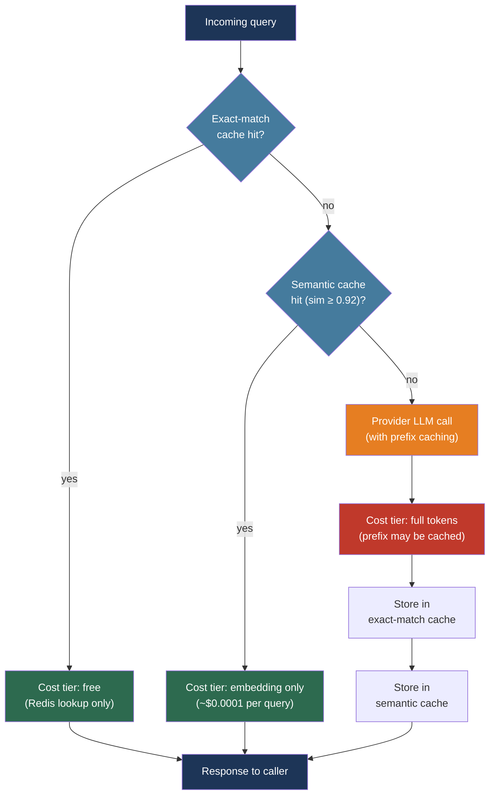

# [BEE-30024] LLM Caching Strategies

:::info
LLM caching operates at three layers — exact-match, semantic, and provider prefix caching — each with different hit rates, invalidation logic, and cost profiles. Building all three in sequence can reduce effective token spend by 70–95% for repetitive workloads.
:::

## Context

LLM API calls are expensive and slow compared to almost every other network call a backend makes. A GPT-4o completion on a 50,000-token context costs $0.375 in input tokens alone and adds hundreds of milliseconds of latency. Traditional caching principles — store expensive results, serve from cache, invalidate on change — apply directly, but LLM workloads present challenges that traditional caches do not face.

First, the input space is enormous and high-dimensional. Two queries that mean the same thing ("How do I reset my password?" and "What's the process for resetting a forgotten password?") produce identical or near-identical responses but have different byte sequences, so exact-match caches miss them entirely. Second, there is no authoritative source of staleness: a cached response from yesterday may be just as valid today, or it may reference outdated pricing or a deprecated API. Third, the most expensive part of an LLM call is often not the output but the input: a system prompt or RAG context that is identical across thousands of requests is nonetheless billed as input tokens on every call.

Provider-side prefix caching addresses the third problem. OpenAI introduced automatic prefix caching in 2024 (applied automatically for prompts ≥1,024 tokens, 50% cost discount on cache hits). Anthropic introduced the `cache_control` API, giving applications explicit control over which prefix regions are cached, with read costs at 10% of base input price. Both reduce the marginal cost of repeated prefixes dramatically without requiring application-side cache infrastructure.

## Design Thinking

Three caching layers address different parts of the problem:

**Exact-match caching** catches repeated identical queries (same bytes, same model parameters). Hit rate is low for conversational text but very high for classification tasks, structured prompts, and FAQ responses. Implementation is a hash-map lookup — zero vector math, sub-millisecond cost.

**Semantic caching** catches paraphrased queries. Embed the incoming query, search a vector store for similar past queries above a cosine similarity threshold, return the cached response if found. Hit rate is higher than exact-match for natural language workloads. The threshold must be tuned: too low produces incorrect responses for similar-but-distinct questions; too high degrades to near-exact-match behavior.

**Provider prefix caching** operates server-side. Structure requests so that static content (system prompt, RAG context, tool definitions) appears first and is identical across requests; the provider caches that prefix and charges read rates on cache hits. This is not a substitute for application-side caching — it applies to the input tokens of a full LLM call — but it substantially reduces the cost of cache misses.

The three layers are not mutually exclusive. A request first checks exact-match; if missed, checks semantic cache; if missed, makes the provider call (which internally benefits from prefix caching). All three together compound their savings.

## Best Practices

### Structure Requests for Provider Prefix Caching

**MUST** place static content before dynamic content in every request. Provider prefix caches operate on the exact byte sequence of the prompt prefix: any difference in characters before the cache boundary causes a miss.

For Anthropic, mark the boundary of the cacheable prefix with `cache_control`:

```python
import anthropic

client = anthropic.Anthropic()

def call_with_prompt_cache(system_prompt: str, user_message: str, budget_tokens: int = 0) -> str:
    """
    Places the system prompt under cache_control so Anthropic caches it.
    Minimum cacheable length: 2,048 tokens for Sonnet, 4,096 for Opus/Haiku.
    Cache TTL: 5 minutes (refreshed on each hit). 1-hour TTL available on some models.
    Cost: write = 1.25x base, read = 0.10x base (90% discount).
    """
    messages_params = {
        "model": "claude-sonnet-4-6",
        "max_tokens": 2048,
        "system": [
            {
                "type": "text",
                "text": system_prompt,
                "cache_control": {"type": "ephemeral"},  # Mark prefix for caching
            }
        ],
        "messages": [{"role": "user", "content": user_message}],
    }

    response = client.messages.create(**messages_params)

    # Inspect cache usage in response
    usage = response.usage
    # usage.cache_creation_input_tokens: tokens written to cache (charged at 1.25x)
    # usage.cache_read_input_tokens: tokens read from cache (charged at 0.10x)
    # usage.input_tokens: new tokens after the last cache boundary
    cache_hit = usage.cache_read_input_tokens > 0
    return response.content[0].text
```

For OpenAI, prefix caching is automatic — no API changes are required. Check whether the cache was hit via `usage.prompt_tokens_details.cached_tokens`:

```python
from openai import OpenAI

client = OpenAI()

def call_with_prefix_cache(system_prompt: str, user_message: str) -> str:
    """
    OpenAI caches automatically for prompts >= 1,024 tokens.
    Cache hit discount: 50% on cached input tokens (GPT-4o and newer).
    No API changes required — just put static content first.
    """
    response = client.chat.completions.create(
        model="gpt-4o",
        messages=[
            {"role": "system", "content": system_prompt},
            {"role": "user", "content": user_message},
        ],
    )

    cached_tokens = response.usage.prompt_tokens_details.cached_tokens
    return response.choices[0].message.content
```

**MUST** keep the prefix content byte-for-byte identical across requests. Even a single character difference (a timestamp, a session ID, a randomly chosen greeting embedded in the system prompt) defeats the provider cache. Move all per-request variability to the end of the prompt, after the cache breakpoint.

**SHOULD** set Anthropic cache breakpoints at natural content boundaries: after the system prompt, after injected documents, after tool definitions. Up to four breakpoints are supported per request.

### Implement Exact-Match Caching

**SHOULD** add exact-match caching as the first lookup layer. It costs almost nothing to check and has zero false-positive risk:

```python
import hashlib
import json
import redis
from typing import Any

cache = redis.Redis(host="localhost", port=6379, decode_responses=True)

def _cache_key(model: str, messages: list[dict], **params) -> str:
    """Deterministic cache key from all inputs that affect the response."""
    payload = {"model": model, "messages": messages, **params}
    canonical = json.dumps(payload, sort_keys=True, ensure_ascii=True)
    return "llm:exact:" + hashlib.sha256(canonical.encode()).hexdigest()

def exact_match_get(model: str, messages: list[dict], ttl_seconds: int = 3600, **params) -> str | None:
    return cache.get(_cache_key(model, messages, **params))

def exact_match_set(model: str, messages: list[dict], response: str, ttl_seconds: int = 3600, **params):
    cache.setex(_cache_key(model, messages, **params), ttl_seconds, response)
```

**SHOULD** include the model name and any parameters that affect output (temperature, max_tokens, tool definitions) in the cache key. Omitting them causes stale cache hits when parameters change.

**MUST NOT** cache responses produced with `temperature > 0` for tasks where correctness matters. Non-zero temperature produces different outputs on each call; caching one of them and serving it as the canonical answer defeats the purpose of sampling.

### Implement Semantic Caching

**SHOULD** add a semantic cache layer after exact-match and before the provider call. Embed the incoming query, search for similar past queries above a similarity threshold, and serve the cached response if found:

```python
import numpy as np
from openai import OpenAI

# Requires: redis with vector search enabled (e.g., Redis Stack or Redis Cloud)
# pip install redis[hiredis] openai numpy

client = OpenAI()

SIMILARITY_THRESHOLD = 0.92  # Tune per domain; start at 0.92, lower carefully

def embed(text: str) -> list[float]:
    """Generate embedding using text-embedding-3-small (1536 dimensions)."""
    response = client.embeddings.create(model="text-embedding-3-small", input=text)
    return response.data[0].embedding

def cosine_similarity(a: list[float], b: list[float]) -> float:
    va, vb = np.array(a), np.array(b)
    return float(np.dot(va, vb) / (np.linalg.norm(va) * np.linalg.norm(vb)))

def semantic_cache_get(query: str, namespace: str = "default") -> str | None:
    """Search semantic cache. Returns cached response or None."""
    query_embedding = embed(query)
    # Retrieve candidate embeddings from Redis (simplified — use FT.SEARCH with KNN in production)
    candidates = cache.hgetall(f"llm:semantic:{namespace}:index")
    best_similarity = 0.0
    best_key = None
    for stored_key, stored_embedding_json in candidates.items():
        stored_embedding = json.loads(stored_embedding_json)
        sim = cosine_similarity(query_embedding, stored_embedding)
        if sim > best_similarity:
            best_similarity = sim
            best_key = stored_key
    if best_similarity >= SIMILARITY_THRESHOLD and best_key:
        return cache.get(f"llm:semantic:{namespace}:response:{best_key}")
    return None

def semantic_cache_set(query: str, response: str, namespace: str = "default", ttl: int = 3600):
    """Store query embedding and response."""
    query_embedding = embed(query)
    key = hashlib.sha256(query.encode()).hexdigest()
    pipe = cache.pipeline()
    pipe.hset(f"llm:semantic:{namespace}:index", key, json.dumps(query_embedding))
    pipe.setex(f"llm:semantic:{namespace}:response:{key}", ttl, response)
    pipe.execute()
```

**SHOULD** start the similarity threshold at 0.92–0.95 and lower it only after measuring the false-positive rate on a representative query sample. A false positive — returning a cached response for a different question — is worse than a cache miss. Monitor the false-positive rate; keep it below 3%.

**MUST NOT** share a semantic cache across domains with different response requirements. A customer support cache and a legal document cache should have separate namespaces; a query similarity in the legal domain may produce very different valid answers than the superficially similar customer support query.

### Build the Three-Tier Lookup

**SHOULD** combine all three layers in a single function that applications call instead of the LLM client directly:

```python
async def cached_llm_call(
    system_prompt: str,
    user_message: str,
    model: str = "claude-sonnet-4-6",
    exact_ttl: int = 3600,
    semantic_ttl: int = 3600,
    use_semantic: bool = True,
) -> dict:
    """
    Returns {"response": str, "cache_layer": str, "cost_tier": str}.
    cache_layer: "exact" | "semantic" | "provider_hit" | "miss"
    """
    messages = [{"role": "user", "content": user_message}]

    # Layer 1: exact-match
    exact = exact_match_get(model, messages, exact_ttl, system=system_prompt)
    if exact:
        return {"response": exact, "cache_layer": "exact", "cost_tier": "free"}

    # Layer 2: semantic cache
    if use_semantic:
        semantic = semantic_cache_get(user_message)
        if semantic:
            return {"response": semantic, "cache_layer": "semantic", "cost_tier": "embedding_only"}

    # Layer 3: provider call (Anthropic prompt caching handles prefix internally)
    response_text = call_with_prompt_cache(system_prompt, user_message)

    # Populate both caches for future requests
    exact_match_set(model, messages, response_text, exact_ttl, system=system_prompt)
    if use_semantic:
        semantic_cache_set(user_message, response_text, ttl=semantic_ttl)

    return {"response": response_text, "cache_layer": "miss", "cost_tier": "full"}
```

### Invalidate Caches Correctly

**MUST** include model version, system prompt version, and RAG corpus version in cache keys. Increment any version when its content changes; stale cache entries then automatically produce misses without requiring a manual flush:

```python
import os

def versioned_cache_key(base_key: str) -> str:
    model_version = os.environ["LLM_MODEL_VERSION"]        # e.g., "claude-sonnet-4-6-20250915"
    prompt_version = os.environ["SYSTEM_PROMPT_VERSION"]   # e.g., "v3"
    corpus_version = os.environ.get("RAG_CORPUS_VERSION", "none")  # e.g., "2026-04-15"
    return f"{base_key}:{model_version}:{prompt_version}:{corpus_version}"
```

**MUST** invalidate the entire semantic cache when upgrading the embedding model. Embeddings from different models live in incompatible vector spaces; a cache hit against old embeddings using a new query embedding will produce incorrect similarity scores. Flush the namespace and rebuild:

```python
def invalidate_semantic_cache(namespace: str = "default"):
    """Call this whenever the embedding model changes."""
    keys = cache.keys(f"llm:semantic:{namespace}:*")
    if keys:
        cache.delete(*keys)
```

**SHOULD** set TTLs that reflect the staleness risk of each content type, not a single global value:

| Content type | Recommended TTL |
|---|---|
| Static FAQ, policy text | 24 hours |
| Product descriptions, documentation | 4–8 hours |
| Pricing, inventory, live data | 5–15 minutes |
| Personalized responses | Do not cache |

## Visual



## Related BEEs

- [BEE-9001](../caching/caching-fundamentals-and-cache-hierarchy.md) -- Caching Fundamentals and Cache Hierarchy: the eviction policies, cache stampede prevention, and TTL strategies described in BEE-9001 apply directly to the exact-match and semantic cache layers here
- [BEE-30001](llm-api-integration-patterns.md) -- LLM API Integration Patterns: retry and timeout logic for provider calls; provider prefix caching interacts with streaming responses discussed there
- [BEE-30007](rag-pipeline-architecture.md) -- RAG Pipeline Architecture: RAG context injected into the system prompt is the largest single candidate for prefix caching; corpus version must be reflected in cache keys
- [BEE-30011](ai-cost-optimization-and-model-routing.md) -- AI Cost Optimization and Model Routing: provider prefix caching is one of the primary cost reduction levers alongside model routing and batch processing

## References

- [Anthropic. Prompt Caching — platform.claude.com](https://platform.claude.com/docs/en/build-with-claude/prompt-caching)
- [OpenAI. Prompt Caching — platform.openai.com](https://platform.openai.com/docs/guides/prompt-caching)
- [OpenAI. API Prompt Caching (blog) — openai.com](https://openai.com/index/api-prompt-caching/)
- [Zilliztech. GPTCache — github.com/zilliztech/GPTCache](https://github.com/zilliztech/GPTCache)
- [Redis. What Is Semantic Caching? — redis.io](https://redis.io/blog/what-is-semantic-caching/)
- [Gim et al. Semantic Caching for LLMs — arXiv:2411.05276, 2024](https://arxiv.org/abs/2411.05276)
- [AWS. Optimize LLM Response Costs and Latency with Effective Caching — aws.amazon.com](https://aws.amazon.com/blogs/database/optimize-llm-response-costs-and-latency-with-effective-caching/)
