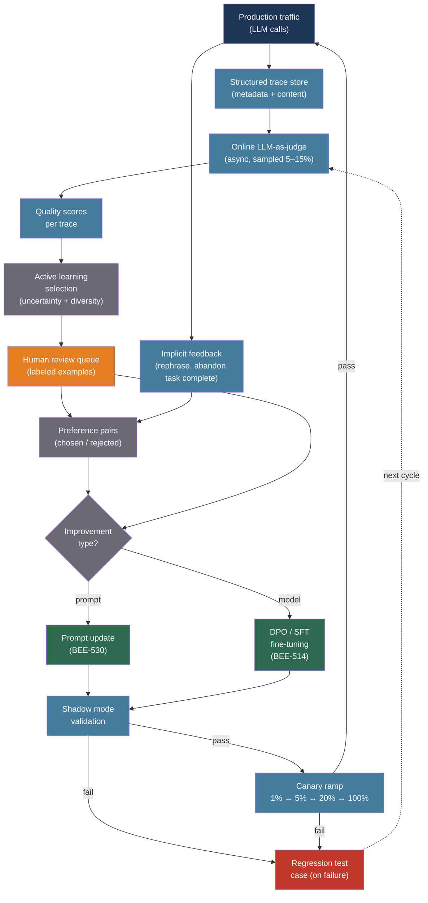

# [BEE-540] LLM Data Flywheel and Continuous Improvement

:::info
A data flywheel is a self-reinforcing loop where production usage generates traces, traces feed evaluation pipelines, evaluations surface failures, failures drive prompt or model improvements, and improvements raise quality — which in turn generates higher-value future traces. Without deliberately closing this loop, a deployed LLM application degrades silently as user behavior and query distribution evolve.
:::

## Context

The term "data flywheel" entered the AI engineering vocabulary with Tesla's Autopilot data engine. During Tesla's 2019 Autonomy Day, Andrej Karpathy described a system that could "ask the fleet to source us examples that look like [this scenario]" — production vehicles continuously provided labeled driving scenarios that improved the next model, which improved Autopilot quality, which sold more vehicles, which generated more driving data. More data enabled faster iteration, which generated more data. The loop was self-reinforcing.

LLM applications face the same dynamics at software scale. Anthropic's landmark "Training a Helpful and Harmless Assistant with Reinforcement Learning from Human Feedback" (Bai et al., arXiv:2204.05862, 2022) established the canonical data collection methodology: 161,000 annotated multi-turn conversations where human raters chose between two model responses. Each annotation round fed reward model training, which fed model improvement, which changed the conversation distribution, which required new annotation. The system was never static.

The engineering reality documented in production deployments is stark. NVIDIA's internal employee support flywheel started with a 70B parameter model. By continuously fine-tuning smaller 1B–8B models on production traces scored by the 70B model as pseudo-ground-truth, the system reached 94–96% routing accuracy at 98% lower cost and 70× lower latency. The compounding came not from a single training run but from the accumulation of improvement cycles. Rafailov et al. (arXiv:2305.18290, 2023) introduced Direct Preference Optimization (DPO), which replaced the two-stage PPO RLHF pipeline (train reward model → train policy with RL) with a single classification loss on chosen/rejected pairs. DPO made the improvement step feasible for small engineering teams — no reward model, no RL training loop, just preference pairs and a fine-tuning run.

What separates a flywheel from a monitoring dashboard is loop closure. Metrics that trigger no downstream action do not constitute a flywheel. The loop closes when a detected failure automatically creates a labeled example in the improvement pipeline.

## Design Thinking

The flywheel has four phases that must all be deliberately engineered:

**Collect**: every production LLM interaction is a potential training signal. The question is which signals to retain and at what fidelity. Storing every token of every prompt at full resolution is expensive; storing nothing makes the flywheel impossible. The answer is structured trace schemas with sampling policies.

**Evaluate**: online evaluation runs asynchronously on a sample of production traces to produce quality scores. This is distinct from offline evaluation on golden datasets (BEE-506) — online evaluation operates on real user queries, in real production conditions, and surfaces failure modes that curated datasets never anticipated.

**Select**: not every low-scoring trace is equally valuable to review. Active learning selects the traces that, when labeled, would give the most information gain for the next improvement cycle. Random sampling from the failure set is wasteful; uncertainty-weighted, diversity-preserving selection is more efficient.

**Improve**: the selected traces feed one of three improvement actions — a prompt update (fastest, reversible), supervised fine-tuning on preferred examples (SFT), or preference optimization on chosen/rejected pairs (DPO). Each action requires its own validation step before deployment.

## Best Practices

### Instrument Traces with a Structured Schema

**MUST** log every production LLM call with a structured schema that captures the inputs, outputs, and metadata needed for downstream evaluation and training. Unstructured logs are not queryable; unstructured logs at scale are unrecoverable:

```python
import uuid
import time
import logging
from dataclasses import dataclass, field, asdict
from datetime import datetime, timezone

logger = logging.getLogger(__name__)

@dataclass
class LLMTrace:
    """
    Structured trace record for a single LLM call.
    Follows the OpenInference span attribute naming conventions.
    Store prompt content in the events field, not as a top-level attribute,
    so it can be filtered before indexing for PII compliance.
    """
    trace_id: str = field(default_factory=lambda: str(uuid.uuid4()))
    session_id: str = ""              # Groups multi-turn conversations
    user_id: str = ""                 # Anonymized; used for cohort analysis
    application: str = ""            # Feature name (e.g., "support_bot", "code_review")
    model: str = ""                   # Exact snapshot ID, e.g., "claude-sonnet-4-20250514"
    prompt_tokens: int = 0
    completion_tokens: int = 0
    cached_tokens: int = 0
    ttfb_ms: float = 0.0              # Time to first byte (milliseconds)
    total_ms: float = 0.0
    finish_reason: str = ""           # "end_turn", "max_tokens", "stop_sequence"
    timestamp_utc: str = field(
        default_factory=lambda: datetime.now(timezone.utc).isoformat()
    )
    # Prompt/response stored separately; omit from default logging for PII
    # Add to trace.events when full content is needed for eval pipeline
    tags: dict = field(default_factory=dict)  # Feature flags, prompt version, etc.

def traced_call(
    messages: list[dict],
    system: str,
    model: str,
    session_id: str,
    user_id: str,
    application: str,
    tags: dict = None,
) -> tuple[str, LLMTrace]:
    """
    Make an LLM call and return the response plus a structured trace.
    The caller decides whether to persist the trace with or without content.
    """
    import anthropic
    client = anthropic.Anthropic()

    t0 = time.monotonic()
    response = client.messages.create(
        model=model,
        max_tokens=2048,
        system=system,
        messages=messages,
    )
    total_ms = (time.monotonic() - t0) * 1000

    trace = LLMTrace(
        session_id=session_id,
        user_id=user_id,
        application=application,
        model=model,
        prompt_tokens=response.usage.input_tokens,
        completion_tokens=response.usage.output_tokens,
        total_ms=total_ms,
        finish_reason=response.stop_reason or "",
        tags=tags or {},
    )

    output_text = response.content[0].text
    logger.info("llm_trace", extra=asdict(trace))
    return output_text, trace
```

**SHOULD** store prompt and response content in a separate, access-controlled store (not in the application log stream). Content storage is required for evaluation and training; it must be subject to data retention policies and PII handling independently of the metadata trace:

```python
@dataclass
class TraceContent:
    trace_id: str
    system_prompt: str
    user_messages: list[dict]   # Full conversation turn list
    assistant_response: str
    # PII scan status tracked separately before content enters eval pipeline
    pii_scanned: bool = False
    pii_redacted: bool = False

def persist_trace(trace: LLMTrace, content: TraceContent, store) -> None:
    """
    Persist metadata and content to separate stores with separate retention policies.
    Content store is restricted to the eval pipeline; metadata store is for dashboards.
    """
    store.write_metadata(asdict(trace))
    if content:  # Content is optional; omit for endpoints handling sensitive data
        store.write_content(trace.trace_id, content)
```

### Run Asynchronous Online Evaluation on Sampled Production Traffic

**SHOULD** evaluate a sample of production traces automatically using an LLM-as-judge. The evaluation runs asynchronously (not in the request path) at a configurable sampling rate to manage cost:

```python
import random
import anthropic

eval_client = anthropic.Anthropic()

EVALUATORS = {
    "helpfulness": {
        "prompt": (
            "Score this assistant response for helpfulness on a scale of 1–3.\n"
            "1 = unhelpful (wrong, irrelevant, or incomplete)\n"
            "2 = partially helpful (correct but incomplete or unclear)\n"
            "3 = fully helpful (correct, complete, and clear)\n\n"
            "User question: {user_message}\n"
            "Assistant response: {assistant_response}\n\n"
            'Reply with JSON: {"score": <1|2|3>, "reason": "<one sentence>"}'
        ),
        "model": "claude-haiku-4-5-20251001",
    },
    "groundedness": {
        "prompt": (
            "Does this assistant response contain claims not supported by the retrieved context?\n"
            "Context: {context}\n"
            "Response: {assistant_response}\n\n"
            'Reply with JSON: {"grounded": <true|false>, "unsupported_claims": [...]}'
        ),
        "model": "claude-haiku-4-5-20251001",
    },
}

def evaluate_trace_async(
    trace: LLMTrace,
    content: TraceContent,
    evaluator_names: list[str],
    sample_rate: float = 0.10,   # Evaluate 10% of production traces
) -> list[dict] | None:
    """
    Run configured evaluators on a trace. Returns None if the trace is not sampled.
    Runs asynchronously relative to the user request — schedule in a background queue.
    """
    if random.random() > sample_rate:
        return None   # Not sampled this request

    results = []
    for name in evaluator_names:
        evaluator = EVALUATORS.get(name)
        if not evaluator:
            continue

        user_message = content.user_messages[-1].get("content", "") if content.user_messages else ""
        prompt = evaluator["prompt"].format(
            user_message=user_message,
            assistant_response=content.assistant_response,
            context=content.tags.get("retrieved_context", "N/A"),
        )

        import json
        response = eval_client.messages.create(
            model=evaluator["model"],
            max_tokens=256,
            temperature=0,   # Deterministic scoring
            messages=[{"role": "user", "content": prompt}],
        )
        try:
            result = json.loads(response.content[0].text)
        except json.JSONDecodeError:
            result = {"error": "parse_failure"}

        results.append({
            "trace_id": trace.trace_id,
            "evaluator": name,
            "model": evaluator["model"],
            **result,
        })

    return results
```

**MUST** use a different model family as the evaluator than the model being evaluated. Self-evaluation exhibits self-preference bias — Claude models rate Claude outputs higher, GPT models rate GPT outputs higher (see BEE-536 for the cross-family judge pattern).

**SHOULD** use low-precision scoring (1–3 scale, or boolean) rather than a fine-grained Likert scale. LLM judges show high variance at high precision; binary and 3-point scales produce more reproducible scores across evaluation runs.

### Use Active Learning to Prioritize the Human Review Queue

**SHOULD** select traces for human review using informativeness criteria rather than pure random sampling. Random sampling from low-scoring traces surfaces redundant failure modes; active learning selects the failures that would be most informative to label:

```python
import math
from dataclasses import dataclass

@dataclass
class EvalResult:
    trace_id: str
    helpfulness_score: float       # Normalized to 0.0–1.0
    application: str
    embedding: list[float] | None  # Content embedding for diversity selection

def uncertainty_score(helpfulness: float) -> float:
    """
    Higher score for outputs near the decision boundary (score ~0.5).
    Low-scoring outputs (0.0) are clear failures but may be redundant;
    near-boundary outputs are most informative for calibrating the system.
    """
    return 1.0 - abs(helpfulness - 0.5) * 2

def cosine_distance(a: list[float], b: list[float]) -> float:
    dot = sum(x * y for x, y in zip(a, b))
    mag_a = math.sqrt(sum(x * x for x in a))
    mag_b = math.sqrt(sum(x * x for x in b))
    if mag_a == 0 or mag_b == 0:
        return 1.0
    return 1.0 - dot / (mag_a * mag_b)

def select_for_review(
    candidates: list[EvalResult],
    already_selected: list[EvalResult],
    budget: int = 50,
    uncertainty_weight: float = 0.6,
    diversity_weight: float = 0.4,
) -> list[EvalResult]:
    """
    Hybrid active learning: score each candidate by uncertainty + diversity.
    Diversity is measured as minimum cosine distance to already-selected traces.
    Selects the `budget` highest-scoring traces for the human review queue.
    """
    scored = []
    for candidate in candidates:
        u_score = uncertainty_score(candidate.helpfulness_score)

        # Diversity: how different is this from traces already queued?
        if already_selected and candidate.embedding:
            min_dist = min(
                cosine_distance(candidate.embedding, sel.embedding)
                for sel in already_selected
                if sel.embedding
            ) if any(s.embedding for s in already_selected) else 1.0
        else:
            min_dist = 1.0

        combined = uncertainty_weight * u_score + diversity_weight * min_dist
        scored.append((combined, candidate))

    scored.sort(reverse=True)
    return [c for _, c in scored[:budget]]
```

**MUST NOT** use raw user actions (copy, share, click) directly as ground truth for training data without human review. User actions introduce selection bias — power users who share responses systematically differ from average users. Build golden datasets reviewed by your own team, not derived directly from user behavior.

### Collect Explicit and Implicit Preference Signals

**SHOULD** instrument the application to collect preference signals at multiple fidelity levels. Explicit ratings are sparse (1–5% of interactions); implicit behavioral signals are available for every interaction:

```python
from enum import Enum
from dataclasses import dataclass
from datetime import datetime, timezone

class ExplicitFeedback(Enum):
    THUMBS_UP = "thumbs_up"
    THUMBS_DOWN = "thumbs_down"
    REGENERATE = "regenerate"          # User requested a new response

class ImplicitSignal(Enum):
    REPHRASE = "rephrase"              # User immediately rephrased the same question
    COPY_WITHOUT_SUBMIT = "copy_no_submit"  # Copied text but did not proceed
    SESSION_ABANDONED = "session_abandoned" # No follow-up within N minutes
    TASK_COMPLETED = "task_completed"  # User proceeded to next workflow step
    FOLLOW_UP_CLARIFICATION = "clarification"  # Indicates partial success

@dataclass
class FeedbackEvent:
    trace_id: str
    session_id: str
    signal_type: str           # ExplicitFeedback or ImplicitSignal value
    is_positive: bool | None   # True, False, or None (neutral/ambiguous)
    timestamp_utc: str = ""

    def __post_init__(self):
        if not self.timestamp_utc:
            self.timestamp_utc = datetime.now(timezone.utc).isoformat()

# Implicit signal polarity mapping
IMPLICIT_POLARITY: dict[ImplicitSignal, bool | None] = {
    ImplicitSignal.REPHRASE: False,
    ImplicitSignal.COPY_WITHOUT_SUBMIT: False,
    ImplicitSignal.SESSION_ABANDONED: False,
    ImplicitSignal.TASK_COMPLETED: True,
    ImplicitSignal.FOLLOW_UP_CLARIFICATION: None,   # Ambiguous
}

def record_feedback(
    trace_id: str,
    session_id: str,
    signal: ExplicitFeedback | ImplicitSignal,
    feedback_store,
) -> FeedbackEvent:
    if isinstance(signal, ImplicitSignal):
        polarity = IMPLICIT_POLARITY.get(signal)
    else:
        polarity = signal == ExplicitFeedback.THUMBS_UP

    event = FeedbackEvent(
        trace_id=trace_id,
        session_id=session_id,
        signal_type=signal.value,
        is_positive=polarity,
    )
    feedback_store.append(event)
    return event
```

**SHOULD** build preference pairs for DPO training by pairing a thumbs-up response with a regenerated response for the same prompt — or by pairing model responses with human-written corrections for the same input. The DPO objective requires `(prompt, chosen, rejected)` triples; these can be assembled from logged traces and feedback events:

```python
@dataclass
class PreferencePair:
    prompt_messages: list[dict]
    system: str
    chosen: str      # Higher-quality response
    rejected: str    # Lower-quality response
    source: str      # "explicit_feedback", "regenerate_pair", "human_correction"

def build_preference_pairs_from_feedback(
    feedback_store,
    content_store,
) -> list[PreferencePair]:
    """
    Assemble DPO training pairs from feedback events.
    A thumbs-down followed by a regenerate creates a chosen/rejected pair.
    """
    pairs = []
    thumbs_down_traces: dict[str, str] = {}  # session_id -> rejected trace_id

    for event in feedback_store.events:
        if event.signal_type == ExplicitFeedback.THUMBS_DOWN.value:
            thumbs_down_traces[event.session_id] = event.trace_id

        elif event.signal_type == ExplicitFeedback.THUMBS_UP.value:
            rejected_trace_id = thumbs_down_traces.pop(event.session_id, None)
            if rejected_trace_id:
                chosen_content = content_store.get(event.trace_id)
                rejected_content = content_store.get(rejected_trace_id)
                if chosen_content and rejected_content:
                    pairs.append(PreferencePair(
                        prompt_messages=chosen_content.user_messages,
                        system=chosen_content.system_prompt,
                        chosen=chosen_content.assistant_response,
                        rejected=rejected_content.assistant_response,
                        source="explicit_feedback",
                    ))

    return pairs
```

### Close the Loop: Deploy Improvements Through Staged Rollout

**MUST** deploy all improvements — whether prompt updates or fine-tuned model weights — through the same staged rollout process used for any production change: shadow mode validation followed by a canary ramp (see BEE-536). The flywheel's value is compounded iteration; each improvement must be validated before the next cycle begins:

```python
from enum import Enum

class ImprovementType(Enum):
    PROMPT_UPDATE = "prompt_update"   # Fastest; no model retraining
    SFT = "sft"                       # Fine-tuning on preferred examples
    DPO = "dpo"                       # Preference optimization on pairs
    MODEL_MIGRATION = "model_migration"  # New model version (see BEE-538)

@dataclass
class FlyWheelCycle:
    """Tracks one full improvement iteration through the flywheel."""
    cycle_id: str
    improvement_type: ImprovementType
    baseline_pass_rate: float     # Online eval pass rate before improvement
    shadow_pass_rate: float       # Pass rate in shadow mode
    canary_pass_rate: float       # Pass rate at canary traffic fraction
    deployed: bool = False
    rollback_reason: str | None = None

SHADOW_THRESHOLD = 0.90   # Must beat baseline by ≥ 5% in shadow to proceed to canary
CANARY_THRESHOLD = 0.88   # Must maintain ≥ 88% pass rate at canary to proceed to rollout

def evaluate_cycle_gate(cycle: FlyWheelCycle, stage: str) -> bool:
    """Decide whether to advance the improvement to the next deployment stage."""
    if stage == "shadow":
        improvement = cycle.shadow_pass_rate - cycle.baseline_pass_rate
        if improvement < 0.05:
            cycle.rollback_reason = (
                f"Shadow improvement {improvement:.1%} < 5% threshold"
            )
            return False
        return True

    if stage == "canary":
        if cycle.canary_pass_rate < CANARY_THRESHOLD:
            cycle.rollback_reason = (
                f"Canary pass rate {cycle.canary_pass_rate:.1%} < {CANARY_THRESHOLD:.0%}"
            )
            return False
        return True

    return False
```

**SHOULD** treat every production failure that triggers a rollback as a new golden test case in the offline evaluation suite. This is how the flywheel's regression test suite grows — each failed deployment teaches the system what not to regress on in the next cycle:

```python
def capture_regression_case(
    cycle: FlyWheelCycle,
    failing_trace: LLMTrace,
    failing_content: TraceContent,
    golden_suite,
) -> None:
    """
    When a canary or rollout fails, capture the triggering trace as a regression case.
    Prevents the same failure from recurring in future improvement cycles.
    """
    if cycle.rollback_reason:
        golden_suite.add(
            trace_id=failing_trace.trace_id,
            system=failing_content.system_prompt,
            messages=failing_content.user_messages,
            reference=None,   # Human-reviewed response added separately
            tags={"source": "regression", "cycle_id": cycle.cycle_id},
        )
```

## Visual



## Online vs. Offline Evaluation

| Dimension | Offline (golden dataset) | Online (production sampling) |
|---|---|---|
| Input source | Curated, fixed, hand-labeled | Real user queries, live distribution |
| When it runs | On demand during development | Continuously in production |
| Failure modes detected | Known, anticipated failures | Emerging, unanticipated failures |
| Cost control | Fixed per evaluation run | Sampling rate (default 5–15%) |
| Lag to detection | Next evaluation run (days/weeks) | Hours to days at 10% sample rate |
| Training signal | High quality (human-labeled) | Variable (judge-labeled); human review needed for high-value cases |
| Best for | Pre-deployment validation | Distribution drift, new failure mode discovery |

Use both: offline evaluation gates deployment (BEE-506); online evaluation drives the next improvement cycle.

## Related BEEs

- [BEE-30004](evaluating-and-testing-llm-applications.md) -- Evaluating and Testing LLM Applications: the offline golden-dataset evaluation that gates deployments
- [BEE-30009](llm-observability-and-monitoring.md) -- LLM Observability and Monitoring: the trace collection and metrics infrastructure that feeds the flywheel
- [BEE-30012](fine-tuning-and-peft-patterns.md) -- Fine-Tuning and PEFT Patterns: the SFT and LoRA mechanisms that the flywheel drives
- [BEE-30022](human-in-the-loop-ai-patterns.md) -- Human-in-the-Loop AI Patterns: the human review queue that labels selected traces
- [BEE-30028](prompt-management-and-versioning.md) -- Prompt Management and Versioning: prompt updates as a fast-path improvement action
- [BEE-30032](synthetic-data-generation-for-ai-systems.md) -- Synthetic Data Generation for AI Systems: synthetic preference pairs for verifiable domains
- [BEE-30034](ai-experimentation-and-model-a-b-testing.md) -- AI Experimentation and Model A/B Testing: the shadow mode and canary ramp used for improvement deployment

## References

- [Bai et al. Training a Helpful and Harmless Assistant with RLHF — arXiv:2204.05862, Anthropic 2022](https://arxiv.org/abs/2204.05862)
- [Rafailov et al. Direct Preference Optimization: Your Language Model is Secretly a Reward Model — arXiv:2305.18290, Stanford 2023](https://arxiv.org/abs/2305.18290)
- [Survey: LLM-based Active Learning — arXiv:2502.11767, 2025](https://arxiv.org/html/2502.11767v1)
- [NVIDIA. Data Flywheel — nvidia.com](https://www.nvidia.com/en-us/glossary/data-flywheel/)
- [Arize + NVIDIA. Building the Data Flywheel for Smarter AI Systems — arize.com](https://arize.com/blog/building-the-data-flywheel-for-smarter-ai-systems-with-arize-ax-and-nvidia-nemo/)
- [ZenML. What 1,200 Production Deployments Reveal about LLMOps in 2025 — zenml.io](https://www.zenml.io/blog/what-1200-production-deployments-reveal-about-llmops-in-2025)
- [Lambert. RLHF Book, Chapter 11: Preference Data — rlhfbook.com](https://rlhfbook.com/c/11-preference-data)
- [OpenTelemetry. LLM Observability — opentelemetry.io, 2024](https://opentelemetry.io/blog/2024/llm-observability/)
