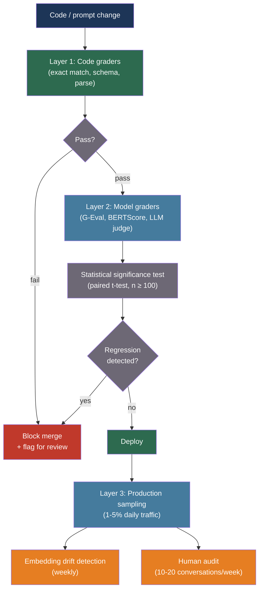

# [BEE-30049] LLM Evaluation Metrics and Automated Scoring Pipelines

:::info
Production LLM quality assurance requires a layered evaluation pipeline — fast code-based graders on every commit, model-based scoring (G-Eval, LLM-as-judge) on pull requests, and sampled production monitoring — with statistical rigor to distinguish genuine regressions from measurement noise, and bias controls to prevent LLM judges from rewarding verbosity over accuracy.
:::

## Context

Deploying an LLM feature without automated evaluation is flying blind: prompt changes, model version upgrades, and retrieval pipeline edits all affect output quality in ways that are invisible without a measurement system. The unique difficulty of LLM evaluation is that outputs are not point-valued — two responses can both be "correct" while differing significantly in accuracy, tone, completeness, and factual faithfulness. Traditional software tests (exact match, regex, schema validation) catch only syntax failures and miss the semantic quality that determines whether users find the system useful.

The research community has produced a progression of automated metrics. ROUGE (Lin, 2004) measures n-gram overlap between a generated and a reference text, capturing lexical fidelity but not semantic equivalence — a valid paraphrase scores poorly while a near-verbatim but partially wrong answer scores well. BERTScore (Zhang et al., 2019, arXiv:1904.09675) addresses this by computing contextual embedding similarity using BERT, processing ~192 candidate-reference pairs per second and correlating significantly better with human judgments on paraphrase tasks. G-Eval (Liu et al., 2023, arXiv:2303.16634, EMNLP 2023) takes a different approach: prompt GPT-4 with evaluation criteria and chain-of-thought instructions, then score outputs on a Likert scale. G-Eval achieves Spearman correlation of 0.514 with human judgments on summarization — nearly double the ~0.3 achievable with ROUGE.

Zheng et al. (2023, arXiv:2306.05685, NeurIPS 2023) systematically studied LLM-as-judge reliability using MT-Bench and Chatbot Arena. GPT-4 judges achieve 80%+ agreement with human preferences, but exhibit three systematic biases: position bias (favoring the first or last presented option, varying with quality gap between responses), verbosity bias (preferring longer responses regardless of accuracy), and self-enhancement bias (rating outputs from the same model family higher). These biases are measurable and partially controllable, but not eliminable — any production use of LLM judges must account for them.

## Best Practices

### Build a Three-Layer Evaluation Stack

**MUST** implement evaluation at three layers, each catching failures that the layer above it misses:

- **Layer 1 — Code-based graders:** Deterministic, sub-millisecond, run on every commit. Exact match, schema validation, regex patterns, code execution correctness.
- **Layer 2 — Model-based graders:** Run on PRs and pre-deployment. G-Eval, BERTScore, LLM-as-judge on a fixed test dataset.
- **Layer 3 — Production sampling:** Daily sampling of live traffic with LLM-as-judge scoring and weekly human audit.

**MUST NOT** rely on Layer 1 alone for LLM features. Code-based graders catch format violations but cannot detect that a response is factually wrong, off-topic, or subtly harmful.

### Implement G-Eval for Reference-Free Scoring

**SHOULD** use G-Eval when reference responses are unavailable (which is the common case for open-ended generation). G-Eval uses chain-of-thought evaluation criteria defined per task, and averages the token probability of each possible score rather than sampling a single score — reducing variance significantly:

```python
import anthropic
import json
import re

GEVAL_SYSTEM = """You are an expert evaluator. Evaluate the response based on the given
criteria. First, write a detailed analysis following the evaluation steps. Then provide
a score. Be critical and objective."""

SUMMARIZATION_CRITERIA = {
    "coherence": {
        "description": "The summary presents ideas in a logical, well-organized way.",
        "steps": [
            "Read the source document and identify key facts.",
            "Read the summary and check whether it presents those facts coherently.",
            "Identify any abrupt transitions, contradictions, or illogical ordering.",
        ],
    },
    "consistency": {
        "description": "The summary contains only facts that are supported by the source.",
        "steps": [
            "Extract all factual claims from the summary.",
            "Verify each claim against the source document.",
            "Note any claims that contradict or are absent from the source.",
        ],
    },
    "fluency": {
        "description": "The summary is written in clear, grammatical English.",
        "steps": [
            "Check for grammatical errors, awkward phrasing, and unclear expressions.",
        ],
    },
}

async def geval_score(
    source: str,
    response: str,
    dimension: str,
    criteria: dict,
    *,
    judge_model: str = "claude-sonnet-4-20250514",
) -> float:
    """
    Score a response on a 1-5 scale using G-Eval methodology.
    Returns a float score (1.0 = worst, 5.0 = best).
    """
    client = anthropic.AsyncAnthropic()
    criterion = criteria[dimension]
    steps_text = "\n".join(
        f"{i+1}. {step}" for i, step in enumerate(criterion["steps"])
    )

    prompt = f"""Evaluation task: {dimension}
Criterion: {criterion['description']}

Evaluation steps:
{steps_text}

Source document:
{source}

Summary to evaluate:
{response}

Follow the evaluation steps above, then end your response with:
Score: <integer from 1 to 5>"""

    resp = await client.messages.create(
        model=judge_model,
        max_tokens=512,
        system=GEVAL_SYSTEM,
        messages=[{"role": "user", "content": prompt}],
    )
    text = resp.content[0].text
    match = re.search(r"Score:\s*([1-5])", text)
    return float(match.group(1)) if match else 3.0   # Default to midpoint on parse failure

async def run_geval_suite(
    test_cases: list[dict],   # Each: {"source": ..., "response": ...}
    dimensions: list[str] = None,
) -> dict[str, float]:
    """
    Run G-Eval across all test cases and return mean score per dimension.
    """
    import asyncio
    dimensions = dimensions or list(SUMMARIZATION_CRITERIA.keys())
    all_scores: dict[str, list[float]] = {d: [] for d in dimensions}

    for case in test_cases:
        for dim in dimensions:
            score = await geval_score(
                case["source"], case["response"], dim, SUMMARIZATION_CRITERIA
            )
            all_scores[dim].append(score)

    return {dim: sum(scores) / len(scores) for dim, scores in all_scores.items()}
```

### Detect Regressions with Statistical Significance Testing

**MUST** apply significance testing before declaring a regression. A 5-point drop in pass rate on a 50-example test set has approximately 70% probability of being random noise. A threshold-only check blocks good PRs and approves bad ones:

```python
from scipy import stats
import math

def detect_regression(
    baseline_scores: list[float],
    candidate_scores: list[float],
    *,
    practical_threshold: float = 0.05,   # 5% absolute drop
    alpha: float = 0.05,                 # Statistical significance level
) -> dict:
    """
    Determine whether a candidate model/prompt regresses from the baseline.
    Uses paired t-test (scores are paired per test case) to exploit positive correlation.
    Returns: is_regression (bool), p_value, effect_size, recommendation.
    """
    if len(baseline_scores) != len(candidate_scores):
        raise ValueError("Score lists must be same length (paired test cases)")

    differences = [c - b for c, b in zip(candidate_scores, baseline_scores)]
    n = len(differences)

    mean_diff = sum(differences) / n
    std_diff = math.sqrt(sum((d - mean_diff) ** 2 for d in differences) / (n - 1))
    t_stat = mean_diff / (std_diff / math.sqrt(n)) if std_diff > 0 else 0
    p_value = 2 * stats.t.sf(abs(t_stat), df=n - 1)   # Two-tailed

    # Cohen's d for effect size
    effect_size = mean_diff / std_diff if std_diff > 0 else 0

    # Both conditions must hold for a true regression:
    # 1. Practical significance (5% drop)
    # 2. Statistical significance (p < 0.05)
    is_regression = (mean_diff < -practical_threshold) and (p_value < alpha)

    return {
        "is_regression": is_regression,
        "mean_diff": mean_diff,
        "p_value": p_value,
        "effect_size": effect_size,
        "n_samples": n,
        "recommendation": (
            "Block merge — statistically significant regression detected"
            if is_regression else
            "Pass — no significant regression"
        ),
    }

def minimum_sample_size(
    baseline_pass_rate: float = 0.90,
    detectable_drop: float = 0.05,
    alpha: float = 0.05,
    power: float = 0.80,
) -> int:
    """
    Calculate the minimum test set size to reliably detect a given regression.
    Default: detect a 5% drop from 90% baseline with 80% power.
    """
    p = baseline_pass_rate
    z_alpha = stats.norm.ppf(1 - alpha / 2)
    z_beta = stats.norm.ppf(power)
    n = 2 * ((z_alpha + z_beta) ** 2) * p * (1 - p) / (detectable_drop ** 2)
    return math.ceil(n)

# Minimum test cases to detect 5% regression from 90% baseline: ~139
# Minimum test cases to detect 10% regression from 90% baseline: ~35
```

**SHOULD** use a minimum of 100 test cases for CI/CD evals. Below 100 cases, the statistical power is insufficient to distinguish a 5% quality regression from noise at standard significance levels.

### Mitigate LLM Judge Biases

**MUST NOT** use a single judge model for all evaluations without bias controls. LLM judges exhibit systematic biases that corrupt absolute scores, though pairwise comparisons are more robust:

```python
import asyncio
import random

async def judge_with_bias_controls(
    question: str,
    response_a: str,
    response_b: str,
    *,
    judge_model: str = "claude-sonnet-4-20250514",
    n_trials: int = 2,
) -> dict:
    """
    Compare two responses with position bias mitigation.
    Runs the judgment twice with swapped order; consistent winner is preferred.
    Flags cases where the judge is inconsistent (likely tied quality or high bias).
    """
    client = anthropic.AsyncAnthropic()

    JUDGE_SYSTEM = """You are an impartial judge evaluating two responses to a question.
Evaluate based on accuracy, completeness, and relevance — NOT length or style.
Output exactly: A or B (the better response), then a one-line reason.
If both are equal quality, output: TIE"""

    async def judge_pair(first: str, second: str, label_first: str, label_second: str) -> str:
        r = await client.messages.create(
            model=judge_model, max_tokens=128, temperature=0,
            system=JUDGE_SYSTEM,
            messages=[{
                "role": "user",
                "content": (
                    f"Question: {question}\n\n"
                    f"Response {label_first}:\n{first}\n\n"
                    f"Response {label_second}:\n{second}\n\n"
                    "Which response is better?"
                ),
            }],
        )
        return r.content[0].text.strip()

    # Trial 1: A first, B second
    result_ab = await judge_pair(response_a, response_b, "A", "B")
    # Trial 2: B first, A second (positions swapped)
    result_ba = await judge_pair(response_b, response_a, "A", "B")

    # Normalize swapped trial: "A wins" in BA ordering means B won originally
    winner_ab = "A" if result_ab.startswith("A") else ("B" if result_ab.startswith("B") else "TIE")
    winner_ba_raw = "A" if result_ba.startswith("A") else ("B" if result_ba.startswith("B") else "TIE")
    # Swap back: if BA trial said "A wins", that means B of the original ordering wins
    winner_ba = "B" if winner_ba_raw == "A" else ("A" if winner_ba_raw == "B" else "TIE")

    consistent = winner_ab == winner_ba
    final_winner = winner_ab if consistent else "INCONSISTENT"

    return {
        "winner": final_winner,
        "consistent": consistent,
        "trial_ab": winner_ab,
        "trial_ba": winner_ba,
        "bias_suspected": not consistent,
    }
```

**SHOULD** use multiple judge models and take the majority. A GPT-4 judge and a Claude judge disagreeing is a signal that the quality difference is small — agreement on the same winner is a stronger signal.

## Visual



## Metric Selection Guide

| Metric | Reference needed | Semantic understanding | Speed | Best for |
|---|---|---|---|---|
| ROUGE-L | Yes | No (n-gram overlap) | Very fast | Summarization regression checks |
| BERTScore | Yes | Partial (embedding sim) | Fast (~200/s GPU) | Translation, paraphrase |
| G-Eval | No | Yes (LLM reasoning) | Slow (1 LLM call/eval) | Open-ended generation |
| LLM-as-judge (pairwise) | No | Yes | Slow | A/B comparison, ranking |
| Code execution | No | N/A | Fast | Code generation tasks |

## Common Mistakes

**Using only ROUGE for open-ended generation.** ROUGE measures surface overlap, not meaning. A valid rephrasing of the correct answer scores 0; a near-verbatim but misleading answer scores high. Reserve ROUGE for regression checks on extractive tasks where the answer should match a reference closely.

**Declaring a regression without statistical testing.** A 3-point drop on a 30-example test set is almost certainly noise. Require both practical significance (≥5% drop) and statistical significance (p < 0.05) before blocking.

**Using a single LLM judge without bias controls.** Position bias alone can shift a judge's decision 10–15% of the time on close calls. Always run at least two trials with swapped order; flag inconsistent judgments for human review.

**Building the eval set from synthetic data.** Eval datasets built from synthetically generated questions overfit to the model's known strengths and miss real failure modes. Build from production logs — actual queries where users encountered problems.

**Not refreshing the eval set.** A fixed eval set that represents the user distribution from 6 months ago becomes misleading as the product evolves. Refresh quarterly with new production samples.

## Related BEEs

- [BEE-30004](evaluating-and-testing-llm-applications.md) -- Evaluating and Testing LLM Applications: the foundational framework for LLM testing strategy; this article focuses specifically on metrics and CI/CD pipeline architecture
- [BEE-30050](rag-evaluation-and-quality-measurement.md) -- RAG Evaluation and Quality Measurement: evaluation decomposed into retrieval vs. generation components for RAG-specific pipelines
- [BEE-30034](ai-experimentation-and-model-a-b-testing.md) -- AI Experimentation and Model A/B Testing: controlled experiments in production to validate that eval improvements translate to user outcomes

## References

- [Liu et al. G-Eval: NLG Evaluation using GPT-4 with Better Human Alignment — arXiv:2303.16634, EMNLP 2023](https://arxiv.org/abs/2303.16634)
- [Zhang et al. BERTScore: Evaluating Text Generation with BERT — arXiv:1904.09675, ICLR 2020](https://arxiv.org/abs/1904.09675)
- [Zheng et al. Judging LLM-as-a-Judge with MT-Bench and Chatbot Arena — arXiv:2306.05685, NeurIPS 2023](https://arxiv.org/abs/2306.05685)
- [Shi et al. Judging the Judges: A Systematic Study of Position Bias in LLM-as-a-Judge — arXiv:2406.07791, AACL-IJCNLP 2025](https://arxiv.org/abs/2406.07791)
- [Gu et al. A Survey on LLM-as-a-Judge — arXiv:2411.15594, 2024](https://arxiv.org/abs/2411.15594)
- [Es et al. Ragas: Automated Evaluation of Retrieval Augmented Generation — arXiv:2309.15217, EACL 2024](https://arxiv.org/abs/2309.15217)
- [Anthropic Engineering. Demystifying Evals for AI Agents — anthropic.com](https://www.anthropic.com/engineering/demystifying-evals-for-ai-agents)
