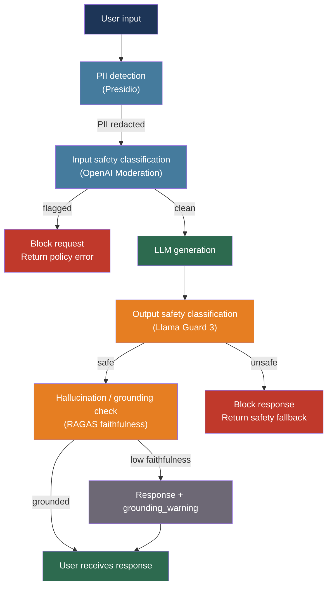

# [BEE-30020] LLM Guardrails and Content Safety

:::info
Guardrails are the pre- and post-processing checks that sit between users and LLM-generated content — detecting toxic input, redacting PII before it reaches the model, classifying harmful output, and verifying factual grounding — tasks that the model itself cannot be relied upon to perform consistently.
:::

## Context

An LLM that passes all unit tests can still produce harmful, fabricated, or privacy-violating output in production. The source of these failures is not adversarial intent (covered in BEE-30008) but ordinary model behavior: LLMs are statistical predictors that will occasionally generate content that violates policy, hallucinate facts not in any training set, or reflect user PII back in unexpected places.

The field coalesced around two distinct problems. First, content safety: classifying inputs and outputs along dimensions like toxicity, harassment, and self-harm. Google's Perspective API (Jigsaw, 2017) pioneered production-scale toxicity scoring. Meta's Llama Guard (Chi et al., arXiv:2312.06674, 2023) reframed safety classification as an LLM task itself — a fine-tuned model that reasons about whether a given prompt-response pair violates a taxonomy of hazards, now aligned to the MLCommons standard of 13 hazard categories.

Second, factual grounding: detecting when a model's output is not supported by the source documents it was given. Es et al. (arXiv:2309.15217, EACL 2024) introduced RAGAS, a reference-free evaluation framework that decomposes faithfulness into statement-level claims verified against retrieved context. Manakul et al. (arXiv:2303.08896, EMNLP 2023) showed that sampling the same model multiple times and checking consistency — SelfCheckGPT — can detect hallucination without any external knowledge base.

The NIST AI Risk Management Framework (AI RMF 1.0, January 2023) and the EU AI Act frame these technical measures as risk management obligations, not optional quality improvements. High-risk AI systems under the EU AI Act (Article 16) must implement logging, traceability, and human oversight mechanisms that guardrails directly enable.

## Design Thinking

The guardrail pipeline has two positions: input (before the LLM call) and output (after it). These positions have different latency and accuracy tradeoffs.

**Input guardrails** run on user-supplied content before any tokens are sent to the model. They are fast (dedicated classifiers, regex, NER models) and can short-circuit the request entirely if a violation is found. They do not need to know what the model will say.

**Output guardrails** run on the model's response before it reaches the user. They can be slower and more accurate — using another LLM to judge the response — because the request has already been priced. They can catch problems that input guardrails cannot anticipate: fabricated citations, hallucinated facts, PII that the model generated rather than reflected.

**Fail-open vs fail-closed** is the key policy decision. Fail-closed returns an error when the guardrail cannot complete (network failure, timeout). Fail-open passes the content through. For toxicity and safety, fail-closed is the safer default. For optional quality checks like hallucination scoring, fail-open avoids availability impact when the scoring service is degraded.

## Best Practices

### Detect and Redact PII Before the LLM Call

**MUST** scan user-supplied content for PII before it enters the context window. Once PII reaches the model, it may appear in the response, in logs, or in training data if the provider uses inputs for model improvement:

```python
from presidio_analyzer import AnalyzerEngine
from presidio_anonymizer import AnonymizerEngine
from presidio_anonymizer.entities import OperatorConfig

analyzer = AnalyzerEngine()
anonymizer = AnonymizerEngine()

def redact_pii(text: str) -> tuple[str, list]:
    """
    Replace PII entities with type placeholders before sending to LLM.
    Returns (redacted_text, detected_entities) for audit logging.
    """
    results = analyzer.analyze(
        text=text,
        entities=["PERSON", "EMAIL_ADDRESS", "PHONE_NUMBER", "CREDIT_CARD", "US_SSN"],
        language="en",
    )
    anonymized = anonymizer.anonymize(
        text=text,
        analyzer_results=results,
        operators={
            "PERSON": OperatorConfig("replace", {"new_value": "<PERSON>"}),
            "EMAIL_ADDRESS": OperatorConfig("replace", {"new_value": "<EMAIL>"}),
            "PHONE_NUMBER": OperatorConfig("replace", {"new_value": "<PHONE>"}),
            "CREDIT_CARD": OperatorConfig("replace", {"new_value": "<CREDIT_CARD>"}),
            "US_SSN": OperatorConfig("replace", {"new_value": "<SSN>"}),
        },
    )
    return anonymized.text, results  # Log results for audit; do not log original text
```

**MUST** log the fact that PII was detected (entity type and count), but not the PII values themselves. The audit trail needs to show that the system operated correctly without creating new exposure.

### Apply Input Safety Classification

**SHOULD** call a content safety classifier on user input before passing it to the primary LLM. The OpenAI moderation endpoint is free, fast, and covers the major harm categories:

```python
from openai import OpenAI

moderation_client = OpenAI()

BLOCKED_CATEGORIES = {
    "hate", "hate/threatening", "harassment", "harassment/threatening",
    "self-harm", "self-harm/intent", "self-harm/instructions",
    "sexual/minors", "violence/graphic",
}

def check_input_safety(text: str) -> tuple[bool, str | None]:
    """
    Returns (is_safe, violated_category_or_None).
    """
    response = moderation_client.moderations.create(
        model="omni-moderation-latest",
        input=text,
    )
    result = response.results[0]
    if result.flagged:
        # Find the triggered category
        categories = result.categories.model_dump()
        for category, flagged in categories.items():
            if flagged and category in BLOCKED_CATEGORIES:
                return False, category
        return False, "policy_violation"
    return True, None
```

**SHOULD** distinguish between categories that block the request (CSAM, violence/graphic) and categories that may only require a softer response (mild profanity, off-topic content). Not all policy violations warrant the same treatment.

### Classify Outputs with Llama Guard

For self-hosted or privacy-sensitive deployments where calling the OpenAI moderation API on outputs is unacceptable, Meta's Llama Guard 3 provides an open-weight safety classifier that runs on the same inference stack as the primary model:

```python
from transformers import AutoTokenizer, AutoModelForCausalLM
import torch

# Load once at startup — 8B parameter model, requires ~16GB VRAM (or 1B-INT4 for lighter deployments)
tokenizer = AutoTokenizer.from_pretrained("meta-llama/Llama-Guard-3-8B")
guard_model = AutoModelForCausalLM.from_pretrained(
    "meta-llama/Llama-Guard-3-8B",
    torch_dtype=torch.bfloat16,
    device_map="auto",
)

def classify_with_llama_guard(user_message: str, assistant_response: str) -> dict:
    """
    Returns {"safe": bool, "violated_categories": list[str]}.
    Llama Guard evaluates the full conversation turn.
    """
    chat = [
        {"role": "user", "content": user_message},
        {"role": "assistant", "content": assistant_response},
    ]
    input_ids = tokenizer.apply_chat_template(chat, return_tensors="pt").to(guard_model.device)
    output = guard_model.generate(input_ids, max_new_tokens=20, pad_token_id=tokenizer.eos_token_id)
    result_text = tokenizer.decode(output[0][input_ids.shape[1]:], skip_special_tokens=True).strip()

    if result_text.startswith("safe"):
        return {"safe": True, "violated_categories": []}
    else:
        categories = result_text.replace("unsafe", "").strip().split("\n")
        return {"safe": False, "violated_categories": [c.strip() for c in categories if c.strip()]}
```

Llama Guard 3's 13 hazard categories follow the MLCommons taxonomy: violent crimes, non-violent crimes, sex-related crimes, child sexual exploitation, defamation, specialized advice, privacy violations, intellectual property, indiscriminate weapons, hate, suicide/self-harm, sexual content, and elections.

**SHOULD** run Llama Guard classification asynchronously after the response is sent to the user when latency is the priority. Violations are logged and trigger review queues rather than blocking the user in real time:

```python
import asyncio

async def generate_and_guard(user_message: str) -> str:
    """Stream response to user; classify output in background."""
    response_text = await llm_generate(user_message)

    # Fire-and-forget safety classification
    asyncio.create_task(
        log_safety_result(
            user_message=user_message,
            response=response_text,
        )
    )
    return response_text

async def log_safety_result(user_message: str, response: str):
    result = classify_with_llama_guard(user_message, response)
    if not result["safe"]:
        await safety_incident_queue.publish({
            "categories": result["violated_categories"],
            "response_hash": hash(response),  # Do not log response text in the queue
        })
```

### Detect Hallucinations via Faithfulness Scoring

In RAG applications, the model's response should be grounded in the retrieved documents. RAGAS faithfulness decomposes the response into atomic claims and checks each claim against the source context:

```python
from ragas import evaluate
from ragas.metrics import faithfulness, answer_relevancy
from datasets import Dataset

def evaluate_rag_response(
    question: str,
    answer: str,
    contexts: list[str],
) -> dict:
    """
    Returns faithfulness score (0–1). Score < 0.5 indicates significant hallucination.
    Requires: pip install ragas
    """
    data = {
        "question": [question],
        "answer": [answer],
        "contexts": [contexts],
    }
    result = evaluate(Dataset.from_dict(data), metrics=[faithfulness, answer_relevancy])
    return {
        "faithfulness": result["faithfulness"],
        "answer_relevancy": result["answer_relevancy"],
    }

FAITHFULNESS_THRESHOLD = 0.7  # Tune based on acceptable risk

async def rag_with_grounding_check(question: str, retrieved_docs: list[str]) -> dict:
    answer = await llm_generate_with_context(question, retrieved_docs)
    scores = evaluate_rag_response(question, answer, retrieved_docs)

    if scores["faithfulness"] < FAITHFULNESS_THRESHOLD:
        return {
            "answer": answer,
            "grounding_warning": True,
            "faithfulness_score": scores["faithfulness"],
        }
    return {"answer": answer, "faithfulness_score": scores["faithfulness"]}
```

**SHOULD** surface faithfulness scores to downstream consumers as metadata rather than silently suppressing low-grounding responses. A warning field lets the application layer decide whether to show a disclaimer or trigger a human review.

For lightweight hallucination detection without RAGAS, NLI-based entailment can check whether individual sentences in the response are entailed by the source documents:

```python
from transformers import pipeline

# Smaller model, faster than RAGAS, no sampling required
nli_pipe = pipeline(
    "text-classification",
    model="cross-encoder/nli-deberta-v3-small",
    device=0,
)

def check_sentence_grounding(sentence: str, context: str) -> float:
    """Returns entailment probability (0–1). Below 0.5 = likely hallucination."""
    result = nli_pipe(f"{context} [SEP] {sentence}", top_k=None)
    entailment = next((r["score"] for r in result if r["label"] == "entailment"), 0.0)
    return entailment
```

### Structure the Guardrail Pipeline

**SHOULD** organize guardrails as composable middleware steps with a consistent interface, so they can be added, removed, or reordered without touching application logic:

```python
from dataclasses import dataclass
from typing import Callable

@dataclass
class GuardrailResult:
    passed: bool
    reason: str | None = None
    metadata: dict | None = None

GuardrailFn = Callable[[str], GuardrailResult]

class GuardrailPipeline:
    def __init__(self, fail_open: bool = False):
        self._input_rails: list[GuardrailFn] = []
        self._output_rails: list[GuardrailFn] = []
        self.fail_open = fail_open

    def add_input_rail(self, fn: GuardrailFn):
        self._input_rails.append(fn)

    def add_output_rail(self, fn: GuardrailFn):
        self._output_rails.append(fn)

    def run_input(self, text: str) -> GuardrailResult:
        for rail in self._input_rails:
            try:
                result = rail(text)
                if not result.passed:
                    return result
            except Exception as e:
                if not self.fail_open:
                    return GuardrailResult(passed=False, reason=f"guardrail_error: {e}")
                # fail_open: log and continue
        return GuardrailResult(passed=True)

    def run_output(self, text: str) -> GuardrailResult:
        for rail in self._output_rails:
            try:
                result = rail(text)
                if not result.passed:
                    return result
            except Exception:
                if not self.fail_open:
                    return GuardrailResult(passed=False, reason="output_guardrail_error")
        return GuardrailResult(passed=True)
```

**MUST** set timeouts on every guardrail call. A slow external classifier should not block the user indefinitely:

```python
import asyncio

async def with_timeout(coro, timeout_s: float, fail_open: bool):
    try:
        return await asyncio.wait_for(coro, timeout=timeout_s)
    except asyncio.TimeoutError:
        if fail_open:
            return GuardrailResult(passed=True, reason="timeout_fail_open")
        return GuardrailResult(passed=False, reason="guardrail_timeout")
```

## Visual



## Related BEEs

- [BEE-2017](../security-fundamentals/data-privacy-and-pii-handling.md) -- Data Privacy and PII Handling: PII redaction at the guardrail layer enforces the privacy principles defined in BEE-2017; same entities, same sensitivity classifications
- [BEE-30007](rag-pipeline-architecture.md) -- RAG Pipeline Architecture: faithfulness scoring and grounding checks are quality gates specific to RAG pipelines; the retrieved context is what the model's claims are checked against
- [BEE-30008](llm-security-and-prompt-injection.md) -- LLM Security and Prompt Injection: BEE-30008 covers adversarial attacks; BEE-30020 covers content safety for non-adversarial production traffic — they are complementary layers
- [BEE-30009](llm-observability-and-monitoring.md) -- LLM Observability and Monitoring: guardrail violation rates, faithfulness score distributions, and PII detection counts are operational metrics that belong in the LLM observability stack
- [BEE-30011](ai-cost-optimization-and-model-routing.md) -- AI Cost Optimization and Model Routing: running Llama Guard on every output adds inference cost; the fail-open/async pattern balances safety coverage against cost

## References

- [Chi et al. Llama Guard: LLM-based Input-Output Safeguard — arXiv:2312.06674, 2023](https://arxiv.org/abs/2312.06674)
- [Es et al. RAGAS: Automated Evaluation of Retrieval Augmented Generation — arXiv:2309.15217, EACL 2024](https://arxiv.org/abs/2309.15217)
- [Manakul et al. SelfCheckGPT: Zero-Resource Black-Box Hallucination Detection — arXiv:2303.08896, EMNLP 2023](https://arxiv.org/abs/2303.08896)
- [Liu et al. G-Eval: NLG Evaluation using GPT-4 — arXiv:2303.16634, 2023](https://arxiv.org/abs/2303.16634)
- [Bai et al. Constitutional AI: Harmlessness from AI Feedback — arXiv:2212.08073, Anthropic 2022](https://arxiv.org/abs/2212.08073)
- [NIST. AI Risk Management Framework 1.0 — nvlpubs.nist.gov, January 2023](https://nvlpubs.nist.gov/nistpubs/ai/nist.ai.100-1.pdf)
- [MLCommons. AI Safety v0.5 Taxonomy — arXiv:2404.12241, 2024](https://arxiv.org/abs/2404.12241)
- [OpenAI. Moderation API — platform.openai.com](https://developers.openai.com/api/docs/guides/moderation)
- [Microsoft Presidio. PII Detection — microsoft.github.io/presidio](https://microsoft.github.io/presidio/)
- [NVIDIA. NeMo Guardrails — github.com/NVIDIA-NeMo/Guardrails](https://github.com/NVIDIA-NeMo/Guardrails)
