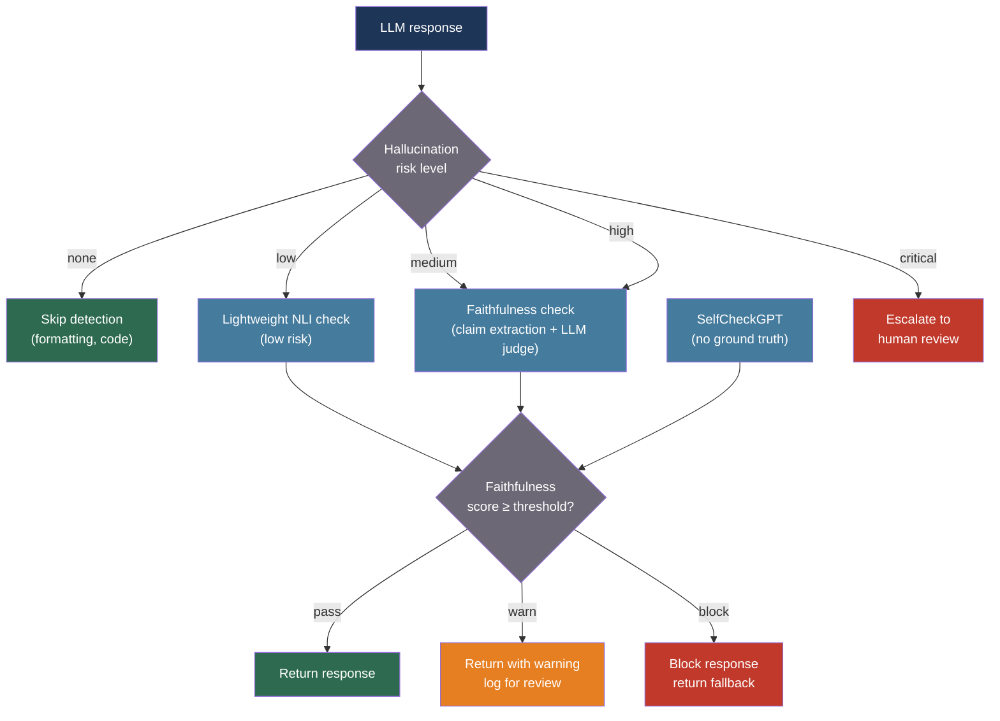

# [BEE-30043] LLM Hallucination Detection and Factual Grounding

:::info
LLM hallucinations — outputs that are fabricated, unsupported, or contradictory to source material — require a multi-layer production detection pipeline: atomic claim decomposition, NLI or LLM-based claim verification against retrieved context, and self-consistency sampling as a reference-free fallback when no ground truth is available.
:::

## Context

Hallucination — the generation of plausible but unfaithful or factually incorrect content — is the most consequential failure mode in production LLM deployments. The term was formalized in NLP research by Maynez et al. (2020) for abstractive summarization: an LLM may produce **intrinsic hallucinations** (output that contradicts the source document) or **extrinsic hallucinations** (output that neither contradicts nor is supported by the source — it simply cannot be verified). Ji et al. (2023) extended this taxonomy across dialogue, question answering, machine translation, and LLMs, providing the survey now cited by over 3,000 follow-on papers.

A counterintuitive finding from the TruthfulQA benchmark (Lin et al., 2022): larger models are not more truthful. The benchmark of 817 questions across 38 categories — designed to capture questions where humans commonly hold false beliefs — showed that GPT models achieved only 58% truthfulness while human performance was 94%. Larger models proved better at mimicking the style of confident falsehoods they had seen in pre-training data, making scale alone an insufficient remedy.

For RAG systems specifically, the research community developed RAGAS (Saad-Falcon et al., 2023), a reference-free evaluation framework that scores faithfulness (is the answer grounded in the retrieved context?), answer relevance (does it address the question?), and context relevance (is the retrieved context focused?). RAGAS uses an LLM-as-judge approach to decompose outputs into atomic statements and verify each against the retrieved documents. Separately, Manakul et al. (2023) introduced SelfCheckGPT: a zero-resource method that detects hallucinations by sampling the same prompt multiple times — facts the model genuinely knows will appear consistently across samples, while hallucinated facts diverge, analogous to self-consistency (BEE-30041) used in reverse.

HaluEval (Li et al., 2023) established that ChatGPT generates hallucinated content approximately 19.5% of the time across question answering, dialogue, and summarization tasks. FActScore (Min et al., 2023) showed that even GPT-4 achieves only 58% atomic factual precision on open-domain biography generation.

## Best Practices

### Classify Hallucination Risk Before Choosing a Detection Strategy

**SHOULD** classify each LLM call by hallucination risk profile before applying detection overhead. Not all tasks carry the same risk: a JSON formatting task cannot hallucinate facts; a biographical summary with no retrieved context has no verifiable ground truth; a RAG Q&A response has a retrievable ground truth. Match the detection mechanism to the risk:

```python
from enum import Enum

class HallucinationRisk(Enum):
    NONE = "none"           # Formatting, translation, code tasks with test suites
    LOW = "low"             # Classification, summarization of provided text
    MEDIUM = "medium"       # Open-domain Q&A with RAG
    HIGH = "high"           # Medical, legal, financial factual claims
    CRITICAL = "critical"   # High-stakes decisions; human review mandatory

DETECTION_STRATEGY = {
    HallucinationRisk.NONE: "skip",
    HallucinationRisk.LOW: "nli_lightweight",
    HallucinationRisk.MEDIUM: "faithfulness_check",
    HallucinationRisk.HIGH: "factscore_plus_human",
    HallucinationRisk.CRITICAL: "human_review",
}
```

### Implement Faithfulness Checking for RAG Responses

**MUST** verify that every claim in a RAG response is supported by the retrieved context when the response is used in a high-stakes context. The RAGAS faithfulness metric operationalizes this as atomic claim extraction followed by NLI classification:

```python
import anthropic
from dataclasses import dataclass

@dataclass
class Claim:
    text: str
    supported: bool        # True = entailed by retrieved context
    support_excerpt: str   # The excerpt that supports (or contradicts) the claim

@dataclass
class FaithfulnessResult:
    claims: list[Claim]
    faithfulness_score: float   # Fraction of claims supported by context
    response_text: str

async def check_faithfulness(
    response: str,
    retrieved_context: list[str],
    *,
    model: str = "claude-haiku-4-5-20251001",   # Cheaper model for claim extraction
) -> FaithfulnessResult:
    """
    Decompose the response into atomic claims, then verify each against
    the retrieved context using LLM-as-judge.
    """
    client = anthropic.AsyncAnthropic()
    context_block = "\n\n".join(
        f"[Source {i+1}]\n{doc}" for i, doc in enumerate(retrieved_context)
    )

    # Step 1: Extract atomic claims from the response
    extraction_response = await client.messages.create(
        model=model,
        max_tokens=1024,
        temperature=0,
        messages=[{
            "role": "user",
            "content": (
                f"Extract all factual claims from the following response as a "
                f"numbered list. Each claim should be a single, self-contained "
                f"atomic statement.\n\nResponse:\n{response}"
            ),
        }],
    )
    raw_claims = extraction_response.content[0].text

    # Step 2: Verify each claim against context
    verification_response = await client.messages.create(
        model=model,
        max_tokens=2048,
        temperature=0,
        messages=[{
            "role": "user",
            "content": (
                f"For each claim below, determine if it is supported by the context. "
                f"Output JSON: [{{'claim': '...', 'supported': true/false, "
                f"'excerpt': '...'}}]\n\n"
                f"Context:\n{context_block}\n\n"
                f"Claims:\n{raw_claims}"
            ),
        }],
    )

    import json, re
    raw = verification_response.content[0].text
    match = re.search(r"\[.*\]", raw, re.DOTALL)
    claims_data = json.loads(match.group(0)) if match else []

    claims = [
        Claim(
            text=c.get("claim", ""),
            supported=c.get("supported", False),
            support_excerpt=c.get("excerpt", ""),
        )
        for c in claims_data
    ]
    supported = [c for c in claims if c.supported]
    score = len(supported) / len(claims) if claims else 1.0

    return FaithfulnessResult(
        claims=claims,
        faithfulness_score=score,
        response_text=response,
    )
```

**MUST** set a faithfulness threshold below which the response is either suppressed, flagged for human review, or regenerated with a more constrained prompt. A threshold of 0.85 means at most 15% of claims can be unverified — the right threshold depends on the domain's risk profile:

```python
FAITHFULNESS_THRESHOLDS = {
    HallucinationRisk.MEDIUM: 0.80,
    HallucinationRisk.HIGH: 0.95,
    HallucinationRisk.CRITICAL: 1.00,   # Zero unverified claims
}

def disposition(result: FaithfulnessResult, risk: HallucinationRisk) -> str:
    threshold = FAITHFULNESS_THRESHOLDS.get(risk, 0.80)
    if result.faithfulness_score >= threshold:
        return "pass"
    elif result.faithfulness_score >= threshold - 0.10:
        return "warn"    # Return with warning, log for review
    else:
        return "block"   # Suppress response, return fallback
```

### Use SelfCheckGPT for Reference-Free Hallucination Detection

When no ground truth or retrieved context is available, **SHOULD** use self-consistency sampling as a reference-free hallucination detector. Claims the model knows well appear consistently across multiple samples; hallucinated facts appear in only some samples:

```python
import asyncio
from collections import Counter

async def selfcheck_sentence(
    sentence: str,
    context_sentences: list[str],   # Other sentences sampled from same prompt
    *,
    model: str = "claude-haiku-4-5-20251001",
) -> float:
    """
    Score a single sentence for hallucination risk using SelfCheckGPT.
    Returns a score in [0, 1]: 1.0 = definitely hallucinated, 0.0 = consistent.
    Each context sentence is from an independent sample of the same prompt.
    """
    client = anthropic.AsyncAnthropic()

    async def check_one(other_sample: str) -> bool:
        """Check if `sentence` is contradicted by `other_sample`."""
        r = await client.messages.create(
            model=model,
            max_tokens=64,
            temperature=0,
            messages=[{
                "role": "user",
                "content": (
                    f"Is the following statement contradicted by or absent from "
                    f"the passage below? Answer YES or NO only.\n\n"
                    f"Statement: {sentence}\n\nPassage: {other_sample}"
                ),
            }],
        )
        return "YES" in r.content[0].text.upper()

    contradictions = await asyncio.gather(
        *[check_one(s) for s in context_sentences]
    )
    # Fraction of samples that contradict this sentence
    return sum(contradictions) / len(context_sentences)

async def selfcheck_response(
    prompt: str,
    *,
    n_samples: int = 5,
    model: str = "claude-sonnet-4-20250514",
    checker_model: str = "claude-haiku-4-5-20251001",
) -> dict[str, float]:
    """
    Sample `n_samples` completions, then score each sentence for hallucination
    by checking consistency across the other samples.
    Returns a dict mapping sentence → hallucination_score.
    """
    client = anthropic.AsyncAnthropic()

    async def sample() -> str:
        r = await client.messages.create(
            model=model, max_tokens=512, temperature=0.7,
            messages=[{"role": "user", "content": prompt}],
        )
        return r.content[0].text

    samples = await asyncio.gather(*[sample() for _ in range(n_samples)])

    # Score each sentence in the first sample against the others
    primary = samples[0]
    sentences = [s.strip() for s in primary.split(".") if s.strip()]
    others = samples[1:]

    scores = await asyncio.gather(
        *[selfcheck_sentence(sent, others, model=checker_model) for sent in sentences]
    )
    return {sent: score for sent, score in zip(sentences, scores)}
```

### Prompt for Citations and Self-Verification

**SHOULD** instruct the model to cite the specific source passage for each factual claim when operating in RAG mode. This makes the model's grounding auditable and surfaces when it is extrapolating beyond the retrieved context:

```python
CITATION_SYSTEM_PROMPT = """You answer questions based only on the provided documents.
For each factual claim in your response, cite the source document number in brackets: [1], [2], etc.
If a claim cannot be supported by any provided document, explicitly state:
"I cannot find this in the provided sources."
Do not make claims beyond what the documents support."""
```

**SHOULD** add a self-verification step after generation that asks the model to review its own response and retract any claims it cannot support with a specific quotation. This is most effective for high-stakes CRITICAL-risk tasks where latency permits an extra round trip:

```python
SELF_VERIFICATION_PROMPT = """Review your previous response.
For each claim you made:
1. Find the exact supporting quote from the sources
2. If you cannot find a supporting quote, retract the claim and say so

Revised response (retract unsupported claims):"""
```

### Monitor Hallucination Rates in Production

**MUST** track faithfulness scores per model, per prompt template, and per document category in production. A faithfulness score that degrades over time indicates retrieval quality decay (documents becoming stale), model update regressions, or prompt drift:

```python
import time
import logging

logger = logging.getLogger(__name__)

def log_hallucination_check(
    *,
    call_id: str,
    model: str,
    prompt_template: str,
    risk_level: HallucinationRisk,
    faithfulness_score: float,
    disposition: str,
    n_claims: int,
    n_supported: int,
) -> None:
    logger.info(
        "hallucination_check",
        extra={
            "call_id": call_id,
            "model": model,
            "prompt_template": prompt_template,
            "risk_level": risk_level.value,
            "faithfulness_score": round(faithfulness_score, 3),
            "disposition": disposition,
            "n_claims": n_claims,
            "n_supported": n_supported,
            "timestamp": time.time(),
        },
    )
```

Alert when the rolling 24-hour mean faithfulness score drops below 0.90 across any prompt template — this is the early warning signal before users encounter bad outputs at scale.

## Visual



## Detection Method Comparison

| Method | Reference needed | Works for | Cost | Best for |
|---|---|---|---|---|
| NLI-based faithfulness | Retrieved context | RAG Q&A | Low (NLI model call) | High-volume RAG |
| LLM-as-judge faithfulness | Retrieved context | RAG Q&A | Medium (LLM call per check) | High-stakes RAG |
| SelfCheckGPT | None | Any open-ended generation | High (N samples) | No-retrieval contexts |
| FActScore | Knowledge base (e.g., Wikipedia) | Biographical, factual | High (claim decomposition + KB lookup) | Offline evaluation |
| Citation prompting | Prompt-level | RAG, document Q&A | Free | First line of defense |

## Related BEEs

- [BEE-30007](rag-pipeline-architecture.md) -- RAG Pipeline Architecture: hallucination is the primary failure mode of RAG; RAGAS faithfulness is the primary RAG quality metric
- [BEE-30041](llm-self-consistency-and-ensemble-sampling.md) -- LLM Self-Consistency and Ensemble Sampling: SelfCheckGPT uses self-consistency sampling to detect hallucination without a ground truth
- [BEE-30020](llm-guardrails-and-content-safety.md) -- LLM Guardrails and Content Safety: guardrails intercept harmful outputs; hallucination detection intercepts factually incorrect ones — both are needed
- [BEE-30004](evaluating-and-testing-llm-applications.md) -- Evaluating and Testing LLM Applications: faithfulness score and hallucination rate are the primary offline evaluation metrics for knowledge-intensive tasks

## References

- [Maynez et al. On Faithfulness and Factuality in Abstractive Summarization — ACL 2020](https://aclanthology.org/2020.acl-main.173/)
- [Ji et al. Survey of Hallucination in Natural Language Generation — arXiv:2202.03629, ACM Computing Surveys 2023](https://arxiv.org/abs/2202.03629)
- [Lin et al. TruthfulQA: Measuring How Models Mimic Human Falsehoods — arXiv:2109.07958, ACL 2022](https://arxiv.org/abs/2109.07958)
- [Min et al. FActScore: Fine-grained Atomic Evaluation of Factual Precision in Long Form Text Generation — arXiv:2305.14251, EMNLP 2023](https://arxiv.org/abs/2305.14251)
- [Li et al. HaluEval: A Large-Scale Hallucination Evaluation Benchmark for Large Language Models — arXiv:2305.11747, EMNLP 2023](https://arxiv.org/abs/2305.11747)
- [Saad-Falcon et al. RAGAS: Automated Evaluation of Retrieval Augmented Generation — arXiv:2309.15217, 2023](https://arxiv.org/abs/2309.15217)
- [Manakul et al. SelfCheckGPT: Zero-Resource Black-Box Hallucination Detection — arXiv:2303.08896, EMNLP 2023](https://arxiv.org/abs/2303.08896)
