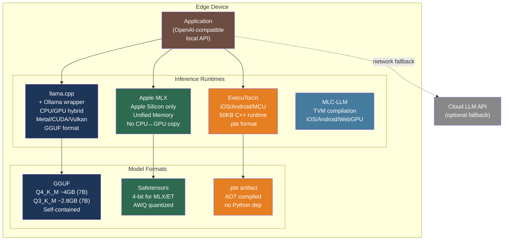

# [BEE-30075] LLM Inference on Edge and Mobile Devices

:::info
Running LLM inference on-device eliminates cloud API round-trips, keeps sensitive data off external servers, and enables offline operation — at the cost of quantization-induced accuracy loss and thermal throttling constraints that fundamentally differ from server-side deployments.
:::

## Context

The dominant LLM deployment model — send a prompt to a cloud API, receive a completion — breaks down under three conditions: the data cannot leave the device (healthcare, finance, personal data), the device has no reliable network connection (field operations, remote areas, embedded systems), or the latency of an API round trip is unacceptable (real-time speech, game dialogue, UI completion). On-device LLM inference addresses all three.

The enabling technology is quantization: a 7B-parameter model in FP16 requires ~14 GB of memory and a GPU to run at practical speeds, but the same model at 4-bit precision (Q4_K_M) fits in ~4 GB — within the available RAM of a flagship smartphone — and runs at 9–14 tokens/second on a modern mobile chip, which is sufficient for most interactive applications.

**llama.cpp** (https://github.com/ggml-org/llama.cpp), developed by Georgi Gerganov beginning in March 2023, established that a highly optimized C++ runtime with hand-written SIMD kernels could run quantized LLMs on commodity hardware including Apple Silicon, x86 CPUs, and ARM. It introduced the **GGUF** file format (August 2023) as a self-describing container for quantized model weights and metadata, now the dominant distribution format for edge-deployed LLMs. The ecosystem around llama.cpp — Ollama, LM Studio, Jan, and others — makes local LLM deployment accessible without ML engineering expertise.

For Apple Silicon specifically, Apple's **MLX** framework (https://github.com/ml-explore/mlx) provides a higher-performance alternative by exploiting the Unified Memory Architecture of M-series chips: CPU and GPU share the same physical DRAM, so model weights are never copied between processor domains. For cross-platform mobile (iOS, Android, microcontrollers), Meta's **ExecuTorch** (https://github.com/pytorch/executorch) compiles PyTorch models to a 50 KB runtime-deployable artifact that runs on 13+ hardware backends without any Python dependency.

## GGUF Format and Quantization

GGUF replaced the earlier GGML format on August 21, 2023. Its key design property is self-containment: a single `.gguf` file stores model weights, tokenizer vocabulary, special tokens, positional encoding parameters, and all architecture hyperparameters needed to reconstruct the model without a separate config file.

**File layout:** 4-byte magic (`0x47475546`), version (currently 3), tensor count, metadata key-value pairs, then tensor data. Tensor data is aligned to enable `mmap`-based loading — the OS pages in only the weight blocks accessed during a forward pass, reducing peak resident memory.

**Quantization types:** GGUF defines both legacy integer types and modern K-quant types. K-quants use **per-block quantization**: weights are partitioned into blocks of 32–256 elements, and each block gets its own learned scale and minimum value rather than one global scale per tensor. This dramatically reduces quantization error on weights with locally varying magnitudes:

| Type | Bits/weight (effective) | 7B model size | Notes |
|---|---|---|---|
| FP16 | 16.0 | ~14 GB | Full precision |
| Q8_0 | 8.0 | ~7 GB | Legacy, simple scale per block |
| Q6_K | 6.5625 | ~5.5 GB | Near FP16 quality |
| Q5_K_M | 5.5 | ~4.5 GB | Good quality/size balance |
| Q4_K_M | 4.5 | ~3.8–4.1 GB | **Recommended default**: ~97–99% of FP16 quality |
| Q3_K_M | 3.4375 | ~2.8 GB | Noticeable degradation on complex tasks |
| Q2_K | 2.625 | ~2.5 GB | Experimental only — significant quality loss |

The `K_M` suffix ("Medium") applies mixed precision: attention layers and embeddings remain at a slightly higher bit depth than feed-forward layers, capturing most of the quality difference from using a uniform lower precision.

**Choosing quantization:** Q4_K_M is the practical default for 7B models on devices with 6–8 GB available. On devices with only 4 GB (e.g., older iPhones, budget Android), Q3_K_M or a smaller model class (3B, 1.5B) is needed. KV cache adds 2–4 GB at 2048-token context on top of weight memory.

## Runtimes

### llama.cpp

The reference implementation for CPU-primary edge inference. Compute backends are pluggable: Metal for Apple GPU, CUDA for NVIDIA, Vulkan for cross-platform GPU, and optimized BLAS for CPU. The `--n-gpu-layers` flag offloads a specified number of transformer layers to GPU while keeping the rest on CPU, enabling hybrid inference on devices where the model exceeds GPU VRAM but fits in combined CPU+GPU memory:

```bash
# Pull a Q4_K_M GGUF model and run it
./llama-cli \
  --model Llama-3.2-3B-Instruct-Q4_K_M.gguf \
  --n-gpu-layers 32 \      # offload all 32 layers to Metal/CUDA
  --ctx-size 4096 \        # context window size
  --threads 4 \            # CPU thread count (for hybrid or CPU-only)
  --prompt "Explain what GGUF is in one sentence."
```

Performance on representative hardware (Mistral/LLaMA 7B, Q4_0, community benchmarks):

| Device | Generation (t/s) |
|---|---|
| M2 Ultra (76-core GPU, Metal) | ~94 |
| M1 (7-core GPU, Metal) | ~14 |
| iPhone 15 Pro (A17 Pro, Metal) | ~9 |
| Raspberry Pi 5 (ARM Cortex-A76) | 2–5 |

Apple M1 Max with Core ML Int4 block quantization achieves ~33 t/s for Llama-3.1-8B-Instruct.

### Apple MLX

MLX is an array computation framework designed for Apple Silicon's Unified Memory Architecture. Unlike llama.cpp's CPU/GPU split, MLX operates on arrays that exist in one shared physical memory pool, eliminating the CPU↔GPU data transfer overhead that is the primary bottleneck on non-UMA hardware:

```python
# mlx-lm: install via pip install mlx-lm
from mlx_lm import load, generate

# Model loads into shared CPU+GPU memory pool — no transfer overhead
model, tokenizer = load("mlx-community/Llama-3.2-3B-Instruct-4bit")

response = generate(
    model,
    tokenizer,
    prompt="Explain quantization in one sentence.",
    max_tokens=256,
    temp=0.0,
)
print(response)
```

MLX uses lazy evaluation: operations are not executed until results are materialized, allowing the runtime to fuse operations and schedule across CPU and GPU optimally. It consistently outperforms Ollama (which uses llama.cpp) and PyTorch MPS for LLM generation on Apple Silicon in comparative benchmarks.

### ExecuTorch (Meta / PyTorch)

ExecuTorch compiles PyTorch models ahead-of-time into a `.pte` artifact that runs on a 50 KB C++ runtime with no Python dependency. The compilation pipeline converts a model through several intermediate representations before emitting a target-specific binary:

```python
import torch
from executorch.exir import to_edge_transform_and_lower
from executorch.backends.xnnpack.partition.xnnpack_partitioner import XnnpackPartitioner

# Step 1: Export the model computation graph
model = load_your_model()
example_args = (torch.randn(1, 512),)
exported = torch.export.export(model, example_args)

# Step 2: Lower to Edge dialect and partition to hardware backend
edge_program = to_edge_transform_and_lower(
    exported,
    partitioner=[XnnpackPartitioner()],  # or CoreMLPartitioner, VulkanPartitioner, etc.
)

# Step 3: Serialize to .pte — deployable on iOS, Android, or embedded target
with open("model.pte", "wb") as f:
    f.write(edge_program.to_executorch().buffer)
```

ExecuTorch powers on-device AI in Meta's production apps — Instagram, WhatsApp, Quest 3, and Ray-Ban Meta Smart Glasses. It supports 13+ backends including XNNPACK (optimized CPU), Core ML, Apple MPS, Qualcomm AI Engine, MediaTek, and ARM Cortex-M for microcontrollers.

### Ollama

Ollama (https://ollama.com) wraps llama.cpp to provide single-command model management, automatic quantization selection, and an OpenAI-compatible REST API on `localhost:11434`. It is the most practical entry point for teams that want to deploy local LLMs without managing GGUF files or build toolchains:

```bash
# Install (macOS/Linux)
curl -fsSL https://ollama.com/install.sh | sh

# Pull and run a model (automatic GGUF download and GPU detection)
ollama run llama3.2:3b "Explain what GGUF is."

# OpenAI-compatible REST API — drop-in replacement for client code targeting OpenAI
curl http://localhost:11434/v1/chat/completions \
  -H "Content-Type: application/json" \
  -d '{"model": "llama3.2:3b", "messages": [{"role": "user", "content": "Hello"}]}'
```

Custom model configuration uses a Modelfile — a Dockerfile-like declarative format:

```dockerfile
FROM llama3.2:3b

# Override system prompt for a specialized use case
SYSTEM """You are a concise code review assistant. Review code snippets and
identify only critical bugs and security issues. Skip style comments."""

# Runtime parameters
PARAMETER temperature 0.2
PARAMETER num_ctx 8192
PARAMETER top_p 0.9
```

## Best Practices

### Choose Q4_K_M as the default quantization for 7B models on consumer hardware

**SHOULD** default to Q4_K_M for 7B-class models on devices with 6–8 GB of usable memory. At ~4 GB, it fits within a typical flagship smartphone's memory budget while retaining 97–99% of FP16 quality on standard benchmarks. Go to Q5_K_M (4.5 GB) when quality matters more than headroom; go to Q3_K_M (2.8 GB) only when the device genuinely cannot fit Q4_K_M after accounting for OS overhead and KV cache.

**MUST NOT** assume memory budget equals total device RAM. On iOS, the system may terminate the process if it uses more than 50–70% of total device RAM. On Android, the available budget depends on what other apps are active. Always add 1.5–2× safety margin for KV cache and activation memory on top of raw weight size.

### Design for thermal throttling in sustained workloads

**MUST** account for thermal throttling when specifying sustained inference performance. Research on the iPhone 16 Pro shows it peaks at 40 t/s but throttles to ~23 t/s sustained (a 44% reduction) within two consecutive inference runs, remaining in a degraded state for 65% of benchmark duration. Any SLA or UX design that assumes peak benchmark performance will fail in production for workloads longer than 30–60 seconds:

```python
import time

def generate_with_pacing(
    model,
    prompts: list[str],
    pause_between_seconds: float = 2.0,  # allow thermal recovery between queries
) -> list[str]:
    """
    Insert short pauses between inference calls to reduce thermal buildup
    on mobile devices. Sustained generation without pauses degrades performance.
    """
    results = []
    for prompt in prompts:
        result = model.generate(prompt)
        results.append(result)
        time.sleep(pause_between_seconds)  # brief cooldown
    return results
```

### Use model size matched to device capability, not maximum available

**SHOULD** select model size based on target device's practical memory budget and performance floor, not the largest model that technically fits. On a device with 8 GB RAM (3.8 GB consumed by OS and apps), a 7B Q4_K_M model (~4 GB) leaves almost no headroom. A 3B Q4_K_M model (~2 GB) leaves sufficient buffer for a larger context window and produces acceptable results for most interactive tasks. Prefer 3B–4B models for mainstream mobile; reserve 7B for high-end devices (iPhone 15 Pro, M-series Mac, Galaxy S24+).

### Benchmark on cold and warm device state separately

**SHOULD** measure inference performance in both cold (fresh boot or no recent inference) and warm (after 2+ minutes of sustained inference) states. Cold benchmarks overstate real-world sustained performance by 30–50% on mobile silicon due to thermal throttling. Production performance profiles must use warm-state measurements for any SLA commitment.

### On Apple Silicon, prefer MLX over llama.cpp Metal for throughput-sensitive applications

**SHOULD** use mlx-lm instead of Ollama for applications that need maximum generation throughput on M-series Macs. MLX's unified memory model eliminates CPU↔GPU buffer transfers that llama.cpp's architecture requires even when using Metal. For development and ad-hoc use, Ollama's simplicity often outweighs the throughput difference; for batch processing or high-frequency inference, MLX is measurably faster.

### Serve an OpenAI-compatible local API for application portability

**SHOULD** expose a local inference server with an OpenAI-compatible API interface so application code does not hardcode a specific runtime. Ollama's `/v1/chat/completions` endpoint is a drop-in replacement. This allows switching the underlying runtime (llama.cpp → MLX → ExecuTorch) without application changes:

```python
from openai import OpenAI

# Same client code works against Ollama (local), OpenAI (cloud), or any other
# OpenAI-compatible endpoint — change only the base_url
client = OpenAI(
    base_url="http://localhost:11434/v1",
    api_key="ollama",  # Ollama ignores this but the client requires a non-empty value
)

response = client.chat.completions.create(
    model="llama3.2:3b",
    messages=[{"role": "user", "content": "Explain GGUF in one sentence."}],
    max_tokens=256,
)
```

## Visual



## Common Mistakes

**Using total device RAM as the available memory budget.** iOS can terminate processes that consume more than ~50–70% of total RAM. Android has variable limits depending on active apps. A 7B Q4_K_M model that "fits" in 4 GB on an 8 GB device frequently causes out-of-memory crashes in production because the OS memory pressure was not measured. Always leave at least 2 GB headroom on mobile devices.

**Trusting cold-device benchmark numbers for SLA commitments.** A 40 t/s benchmark result measured immediately after device reboot will not hold for sessions lasting more than a minute. Sustained inference on mobile Silicon throttles to 60% or less of peak throughput due to thermal constraints. Test with 5-minute continuous inference sessions at representative prompt/completion lengths.

**Ignoring context window memory scaling.** KV cache memory grows linearly with context length. A 7B model at 2048-token context needs ~2 GB of KV cache; at 8192 tokens, that becomes ~8 GB — which can exceed the weight budget itself. Constrain `--ctx-size` (llama.cpp) or `num_ctx` (Ollama) to the minimum needed for the application's actual use pattern.

**Deploying without a graceful cloud fallback.** On-device models will fail for requests that exceed the device's context window, for tasks requiring knowledge more recent than the model's training cutoff, or when the device is thermally throttled. Design the application with an explicit fallback path: detect failure or quality degradation and offer the user an option to route to a cloud API.

**Using the same quantization across all device tiers.** A Q4_K_M 7B model runs well on an iPhone 15 Pro but causes OOM kills on an iPhone 12 (4 GB RAM). Target-specific model selection is required: load device capabilities at runtime and choose the appropriate model size and quantization level for that specific device.

## Related BEEs

- [BEE-30061](llm-quantization-for-inference.md) -- LLM Quantization for Inference: server-side quantization (GPTQ, AWQ, FP8) for GPU clusters; edge quantization uses the same techniques but must work within far tighter memory budgets with no VRAM
- [BEE-30021](llm-inference-optimization-and-self-hosting.md) -- LLM Inference Optimization and Self-Hosting: server-side inference optimization with vLLM, TensorRT-LLM, and continuous batching; conceptually similar but assumes GPU cluster, not mobile hardware
- [BEE-30053](llm-multi-provider-resilience-and-api-fallback-patterns.md) -- LLM Multi-Provider Resilience and API Fallback Patterns: the cloud fallback pattern for when on-device inference fails or is insufficient
- [BEE-30010](llm-context-window-management.md) -- LLM Context Window Management: context window constraints are even more acute on edge devices where KV cache memory competes directly with model weights for the same limited DRAM

## References

- [llama.cpp — github.com/ggml-org/llama.cpp](https://github.com/ggml-org/llama.cpp)
- [GGUF format specification — github.com/ggml-org/ggml/blob/master/docs/gguf.md](https://github.com/ggml-org/ggml/blob/master/docs/gguf.md)
- [GGUF on Hugging Face Hub — huggingface.co/docs/hub/gguf](https://huggingface.co/docs/hub/gguf)
- [Apple MLX — github.com/ml-explore/mlx](https://github.com/ml-explore/mlx)
- [MLX Unified Memory — ml-explore.github.io/mlx](https://ml-explore.github.io/mlx/build/html/usage/unified_memory.html)
- [Apple ML Research. Core ML on-device Llama — machinelearning.apple.com](https://machinelearning.apple.com/research/core-ml-on-device-llama)
- [ExecuTorch — github.com/pytorch/executorch](https://github.com/pytorch/executorch)
- [Ollama — ollama.com](https://ollama.com/)
- [Ollama Modelfile reference — docs.ollama.com/modelfile](https://docs.ollama.com/modelfile)
- [MLC-LLM — github.com/mlc-ai/mlc-llm](https://github.com/mlc-ai/mlc-llm)
- [llama.cpp Apple Silicon benchmarks — github.com/ggml-org/llama.cpp/discussions/4167](https://github.com/ggml-org/llama.cpp/discussions/4167)
- [llama.cpp iPhone benchmarks — github.com/ggml-org/llama.cpp/discussions/4508](https://github.com/ggml-org/llama.cpp/discussions/4508)
- [LLM thermal throttling on mobile devices — arxiv.org/html/2603.23640](https://arxiv.org/html/2603.23640)
- [LLM inference on Raspberry Pi 5 — stratosphereips.org](https://www.stratosphereips.org/blog/2025/6/5/how-well-do-llms-perform-on-a-raspberry-pi-5)
