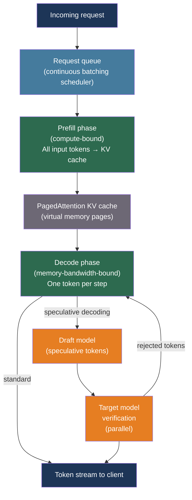

# [BEE-30021] LLM Inference Optimization and Self-Hosting

:::info
Self-hosting open-weight LLMs requires understanding the algorithms that turn raw model weights into low-latency, high-throughput serving — continuous batching, speculative decoding, quantization, and the VRAM arithmetic that determines whether a model fits at all.
:::

## Context

The landscape of LLM deployment split into two paths after GPT-3: call a provider API, or run the model yourself. The API path has zero infrastructure overhead but carries cost, latency, data residency, and availability risks that make it untenable for some workloads. The self-hosting path requires understanding the serving layer — the software and hardware decisions that determine whether a 70B parameter model can serve 100 concurrent users or falls over after 10.

Three algorithmic developments made self-hosted serving practical. First, Kwon et al. (arXiv:2309.06180, SOSP 2023) introduced PagedAttention: managing the KV cache like virtual memory, eliminating fragmentation and allowing continuous batching — the technique of interleaving tokens from multiple requests in a single GPU pass. The result, vLLM, achieves 2-4× higher throughput than static batching at the same latency. Second, Leviathan et al. (arXiv:2211.17192, ICML 2023) showed that speculative decoding — using a small draft model to propose tokens that the large model verifies in parallel — reduces latency by 2-3× on long outputs without changing the model or its outputs. Third, Frantar et al. (arXiv:2210.17323) (GPTQ) and Lin et al. (arXiv:2306.00978) (AWQ) showed that post-training quantization to 4 bits reduces model size by 4× with negligible quality loss, making models that previously required 4 GPUs fit on 1.

Dao et al. (arXiv:2205.14135, 2022) contributed FlashAttention, which reduces the memory bandwidth cost of the attention operation by fusing the softmax and matrix multiplication into a single kernel, enabling efficient long-context processing that underpins all modern serving frameworks.

## Design Thinking

LLM generation has two computationally distinct phases with different bottlenecks:

**Prefill** processes the entire input prompt in a single forward pass. It is compute-bound — the GPU must perform matrix multiplications over all input tokens at once. Prefill latency dominates time-to-first-token (TTFT).

**Decode** generates one token at a time, each requiring a full forward pass. It is memory-bandwidth-bound — the GPU must load all model weights from HBM on every single step. Decode throughput determines tokens-per-second.

These phases require different optimizations. Reducing TTFT means reducing prefill time: shorter prompts, prefix caching (reusing KV activations for shared prefixes), or speculative decoding. Increasing throughput means batching more decode steps together: continuous batching maximizes GPU occupancy during decode.

A common mistake is optimizing for the wrong metric. A customer-facing chatbot needs low TTFT. A batch document processing pipeline needs high throughput. Both benefit from continuous batching but require different batch size tuning.

## Best Practices

### Size the Deployment Before Selecting Hardware

**MUST** estimate VRAM requirements before attempting deployment. The calculation has two parts: model weights and KV cache overhead.

Model weight memory (bytes) = parameter count × bytes per parameter:

| Model | FP16 (2B) | INT8 (1B) | INT4 (0.5B) |
|-------|-----------|-----------|-------------|
| 7B | ~14 GB | ~7 GB | ~3.5 GB |
| 13B | ~26 GB | ~13 GB | ~6.5 GB |
| 34B | ~68 GB | ~34 GB | ~17 GB |
| 70B | ~140 GB | ~70 GB | ~35 GB |

**SHOULD** add ~20% overhead above the weight size for activations, intermediate tensors, and the framework itself. KV cache grows with batch size and context length; for a 70B model with 128K context and batch size 1, the cache alone can reach ~40 GB.

**SHOULD** apply this hardware selection heuristic:
- Model fits on one GPU: single GPU, no parallelism
- Model fits on one node (multiple GPUs): tensor parallelism within the node
- Model requires multiple nodes: tensor parallelism within each node + pipeline parallelism between nodes

### Select Quantization Based on Deployment Target

**SHOULD** use AWQ or GPTQ for GPU-based production serving. Both quantize weights to 4 bits with negligible perplexity degradation and provide 3-4× memory reduction:

```bash
# AWQ quantization (recommended for quality/speed balance)
pip install autoawq
python -c "
from awq import AutoAWQForCausalLM
from transformers import AutoTokenizer

model = AutoAWQForCausalLM.from_pretrained('meta-llama/Llama-3-8B')
tokenizer = AutoTokenizer.from_pretrained('meta-llama/Llama-3-8B')
quant_config = {'zero_point': True, 'q_group_size': 128, 'w_bit': 4, 'version': 'GEMM'}
model.quantize(tokenizer, quant_config=quant_config)
model.save_quantized('./llama3-8b-awq')
"

# GPTQ quantization (higher throughput for large batches)
pip install auto-gptq
python -c "
from transformers import AutoTokenizer
from auto_gptq import AutoGPTQForCausalLM, BaseQuantizeConfig

tokenizer = AutoTokenizer.from_pretrained('meta-llama/Llama-3-8B')
quant_config = BaseQuantizeConfig(bits=4, group_size=128, desc_act=False)
model = AutoGPTQForCausalLM.from_pretrained('meta-llama/Llama-3-8B', quant_config)
# Calibration dataset required for GPTQ
model.quantize(calibration_dataset)
model.save_quantized('./llama3-8b-gptq')
"
```

**SHOULD** use GGUF format for CPU-only deployments. llama.cpp's GGUF format packs quantized weights into a portable single file and runs 3-8× faster than Python-based frameworks on CPU:

```bash
# Convert to GGUF and quantize (run via llama.cpp CLI)
python llama.cpp/convert_hf_to_gguf.py meta-llama/Llama-3-8B --outfile llama3-8b.gguf
./llama.cpp/llama-quantize llama3-8b.gguf llama3-8b-q4_k_m.gguf Q4_K_M  # Best quality/size tradeoff

# Serve with llama-server (OpenAI-compatible API)
./llama.cpp/llama-server -m llama3-8b-q4_k_m.gguf --port 8080 --ctx-size 8192
```

Quantization selection guide:

| Scenario | Recommended | Reason |
|----------|-------------|--------|
| GPU, high throughput | AWQ W4A16 | Best quality/speed balance, strong generalization |
| GPU, max throughput, H100+ | FP8 (TensorRT-LLM) | Native hardware support, 2× throughput vs FP16 |
| CPU inference | GGUF Q4_K_M | Optimized SIMD kernels, portable |
| Memory-constrained GPU | INT4 (BitsAndBytes) | Easy to apply, good quality |

### Run vLLM for Production GPU Serving

**SHOULD** deploy vLLM as the primary serving layer for production GPU workloads. vLLM provides an OpenAI-compatible API, continuous batching, and PagedAttention out of the box:

```python
# Start vLLM server (OpenAI-compatible API)
# vllm serve meta-llama/Llama-3.1-8B-Instruct \
#   --quantization awq \
#   --tensor-parallel-size 2 \        # 2 GPUs
#   --max-model-len 32768 \
#   --gpu-memory-utilization 0.90 \   # Leave 10% for overhead
#   --enable-prefix-caching           # Reuse KV cache for shared prefixes

from openai import OpenAI

# Drop-in replacement for OpenAI API calls
client = OpenAI(
    base_url="http://localhost:8000/v1",
    api_key="not-required",  # vLLM ignores the key by default
)

response = client.chat.completions.create(
    model="meta-llama/Llama-3.1-8B-Instruct",
    messages=[{"role": "user", "content": "Explain PagedAttention."}],
    max_tokens=512,
)
```

**MUST** set `--gpu-memory-utilization` to at most 0.90. The remaining 10% prevents OOM errors from KV cache growth under burst load.

**SHOULD** enable `--enable-prefix-caching` for workloads that share long system prompts across requests. Prefix caching reuses KV activations for the shared portion, cutting TTFT for the cached prefix to near zero. This is the single highest-leverage TTFT optimization for chatbot and RAG workloads.

### Enable Speculative Decoding for Latency-Sensitive Workloads

**SHOULD** use speculative decoding when p50 latency matters more than maximum throughput, and when the output is typically 50+ tokens. Speculative decoding uses a small draft model to propose tokens; the large target model verifies them in parallel and accepts the longest consistent prefix:

```bash
# vLLM speculative decoding with a small draft model
vllm serve meta-llama/Llama-3.1-70B-Instruct \
  --speculative-model meta-llama/Llama-3.2-1B-Instruct \
  --num-speculative-tokens 5 \   # Draft generates 5 tokens per step
  --tensor-parallel-size 4
```

The theoretical speedup is bounded by the acceptance rate: if the draft model's proposals are accepted 80% of the time with 5 draft tokens per step, the average number of tokens produced per target model call approaches 4.5 rather than 1 — a 4.5× reduction in target model invocations.

For workloads without a suitable small model, vLLM's n-gram speculative decoding uses matches in the prompt itself as draft proposals, requiring no additional model weights:

```bash
vllm serve meta-llama/Llama-3.1-70B-Instruct \
  --speculative-model "[ngram]" \
  --ngram-prompt-lookup-min 4 \
  --num-speculative-tokens 4
```

### Implement Production Health Checks and Warm-Up

**MUST** configure a three-tier probe strategy for Kubernetes deployments. Model servers have two distinct slow phases: initial model loading (minutes) and warm-up (seconds). Standard liveness probes fire before the model is ready and restart the container in a loop:

```yaml
# Kubernetes deployment spec for vLLM
containers:
  - name: vllm
    image: vllm/vllm-openai:latest
    startupProbe:
      httpGet:
        path: /health          # Returns 200 once model is loaded
        port: 8000
      initialDelaySeconds: 30
      periodSeconds: 10
      failureThreshold: 120    # 20 minutes for large model loading
    livenessProbe:
      httpGet:
        path: /health
        port: 8000
      periodSeconds: 10
      failureThreshold: 3
    readinessProbe:
      httpGet:
        path: /v1/models       # Returns model list when ready to serve
        port: 8000
      periodSeconds: 5
      failureThreshold: 3
```

**SHOULD** send warm-up requests after the model loads but before the readiness probe marks the pod available. Cold inference is slower than steady-state inference because GPU caches are unpopulated:

```python
import httpx
import asyncio

async def warm_up_server(base_url: str, num_warmup_requests: int = 5):
    """Send synthetic requests to warm GPU caches before accepting production traffic."""
    client = httpx.AsyncClient(base_url=base_url, timeout=60.0)
    warmup_payload = {
        "model": "meta-llama/Llama-3.1-8B-Instruct",
        "messages": [{"role": "user", "content": "Hello"}],
        "max_tokens": 32,
    }
    tasks = [
        client.post("/v1/chat/completions", json=warmup_payload)
        for _ in range(num_warmup_requests)
    ]
    await asyncio.gather(*tasks)
    await client.aclose()
```

### Monitor the Right Metrics

**MUST** track TTFT and TPOT separately — they measure different parts of the serving pipeline and degrade under different load patterns:

| Metric | What degrades it | How to improve |
|--------|-----------------|----------------|
| TTFT (time to first token) | Long prompts, high prefill concurrency, cold cache | Prefix caching, shorter prompts, dedicated prefill instances |
| TPOT (time per output token) | High decode batch size, memory bandwidth saturation | Reduce batch size, use faster memory (HBM3), quantize KV cache |
| Throughput (tok/s) | Small batch sizes, underutilized GPU | Increase batch size, continuous batching, larger requests |
| P99 latency | Request queuing under load | Horizontal scaling, request prioritization |

## Visual



## Related BEEs

- [BEE-30001](llm-api-integration-patterns.md) -- LLM API Integration Patterns: API integration patterns apply whether calling a hosted provider or a self-hosted vLLM endpoint; the OpenAI-compatible API surface is identical
- [BEE-30011](ai-cost-optimization-and-model-routing.md) -- AI Cost Optimization and Model Routing: self-hosting is a cost optimization strategy; the same model routing logic applies when routing between self-hosted models and cloud providers
- [BEE-30016](llm-streaming-patterns.md) -- LLM Streaming Patterns: vLLM and TGI both support SSE streaming; TTFT is the primary latency metric for streaming endpoints
- [BEE-14003](../observability/distributed-tracing.md) -- Distributed Tracing: TTFT, TPOT, and queue time are the three spans to instrument in a self-hosted inference trace

## References

- [Kwon et al. Efficient Memory Management for Large Language Model Serving with PagedAttention — arXiv:2309.06180, SOSP 2023](https://arxiv.org/abs/2309.06180)
- [Leviathan et al. Fast Inference from Transformers via Speculative Decoding — arXiv:2211.17192, ICML 2023](https://arxiv.org/abs/2211.17192)
- [Frantar et al. GPTQ: Accurate Post-Training Quantization for Generative Pre-trained Transformers — arXiv:2210.17323, 2022](https://arxiv.org/abs/2210.17323)
- [Lin et al. AWQ: Activation-aware Weight Quantization for LLM Compression and Acceleration — arXiv:2306.00978, 2023](https://arxiv.org/abs/2306.00978)
- [Dao et al. FlashAttention: Fast and Memory-Efficient Exact Attention with IO-Awareness — arXiv:2205.14135, NeurIPS 2022](https://arxiv.org/abs/2205.14135)
- [vLLM. Easy, Fast, and Cheap LLM Serving — docs.vllm.ai](https://docs.vllm.ai/)
- [NVIDIA. TensorRT-LLM Documentation — nvidia.github.io](https://nvidia.github.io/TensorRT-LLM/)
- [llama.cpp. Local LLM Inference — github.com/ggml-org/llama.cpp](https://github.com/ggml-org/llama.cpp)
- [Hugging Face. Text Generation Inference — github.com/huggingface/text-generation-inference](https://github.com/huggingface/text-generation-inference)
- [Hugging Face. Assisted Generation — huggingface.co](https://huggingface.co/docs/transformers/main/assisted_decoding)
