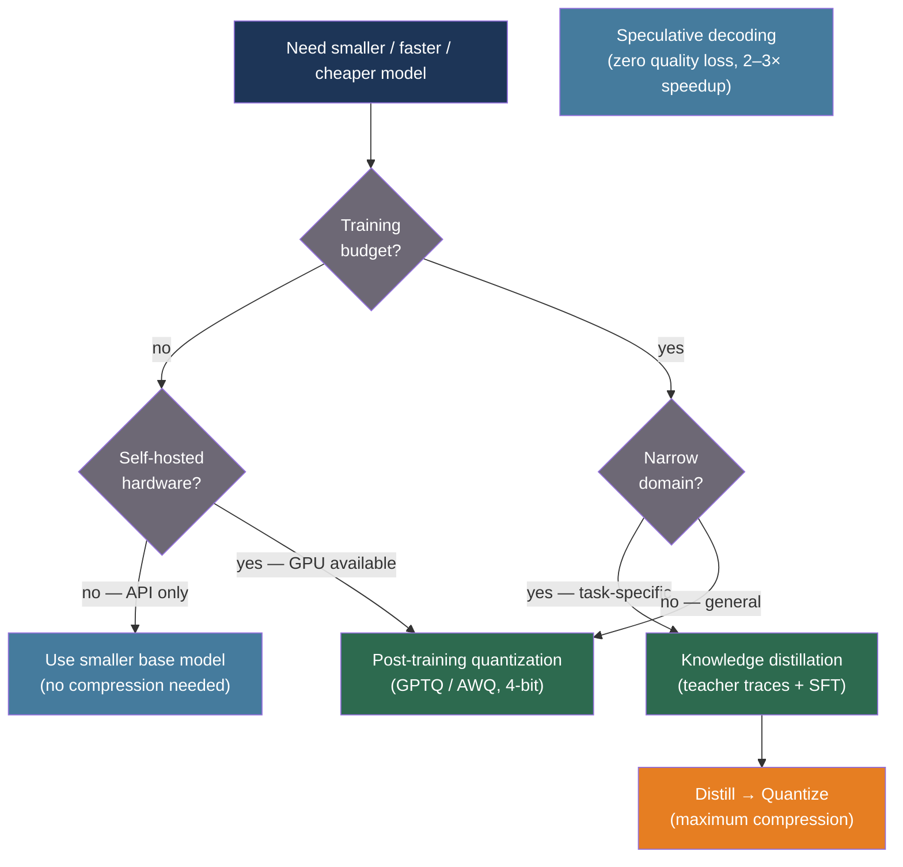

# [BEE-550] LLM Knowledge Distillation and Model Compression

:::info
Deploying a frontier LLM in production means choosing between paying per-token API costs or running a compressed model that is smaller, faster, and cheaper — knowledge distillation transfers a teacher model's behavior to a smaller student, while post-training quantization reduces weight precision without retraining, with each technique making different tradeoffs between compression ratio, accuracy retention, and infrastructure cost.
:::

## Context

Frontier language models are large by design: GPT-4, Claude, and Llama 3 405B deliver state-of-the-art results because scaling laws reward more parameters. But the same size that produces quality creates cost: serving a 405B model requires multiple high-end GPUs, introduces latency proportional to parameter count, and carries a per-token API price that scales with usage. Most production tasks — document classification, entity extraction, customer support routing, code review feedback — do not require frontier capability. They require a model that is good enough on a narrow domain, fast enough to meet latency SLOs, and cheap enough to run profitably.

Hinton, Vinyals, and Dean (2015, arXiv:1503.02531) introduced knowledge distillation as a general framework: train a smaller "student" model to mimic the output distribution of a larger "teacher" model, not just its hard labels. The key insight is that soft probability distributions over the vocabulary contain more information than the one-hot correct answer — they encode which outputs the teacher found plausible, which is richer signal for training. A softmax temperature T > 1 amplifies the differences in small probabilities, making this "dark knowledge" available to the student.

LLM-era distillation diverged from Hinton's original approach because frontier models are too large to directly backpropagate through. Mukherjee et al. (2023, arXiv:2306.02707) introduced Orca: rather than matching token distributions, generate GPT-4's step-by-step reasoning traces on complex tasks and fine-tune a 13B Llama model on those traces. The student learns not just what the teacher answers, but how the teacher thinks. Orca-13B matched or exceeded ChatGPT on BigBench Hard despite being 10–15× smaller. Orca 2 (arXiv:2311.11045) extended this with Prompt Erasure — stripping system prompts from student training so it learns reasoning strategies rather than surface patterns.

Quantization takes a different approach: do not change the model's architecture or training procedure, but reduce the numerical precision of existing weights. Frantar et al. (2023, arXiv:2210.17323) introduced GPTQ, a post-training quantization algorithm that compresses model weights to 3–4 bits using Hessian-aware rounding without retraining. A 175B GPT model that requires ~350 GB in fp16 fits in ~87 GB at 4-bit GPTQ precision, with 3.25–4.5× inference speedup and negligible accuracy loss on most benchmarks. Lin et al. (2024, arXiv:2306.00978) introduced AWQ (Activation-aware Weight Quantization), winner of the MLSys 2024 Best Paper: by identifying the 1% of weight channels that receive the largest activation magnitudes and protecting those channels from aggressive quantization, AWQ achieves comparable compression with better accuracy on edge hardware.

## Best Practices

### Choose the Technique Based on Your Infrastructure and Accuracy Constraint

**SHOULD** select the compression technique based on three factors: (a) whether you have a training budget (GPU-hours for distillation), (b) your accuracy constraint (how much quality loss is acceptable), and (c) your target hardware:

| Situation | Recommended approach |
|---|---|
| API-hosted model, no GPU, need lower cost | Quantization via provider (not applicable) or switch to smaller base model |
| Self-hosted, model fits in VRAM, need faster inference | GPTQ or AWQ quantization (4-bit, no retraining) |
| Narrow domain, training data available, need 10× smaller | Knowledge distillation (Orca-style fine-tune on teacher traces) |
| Mobile or edge deployment, extreme size constraint | AWQ + structured pruning combined |
| Need zero quality loss at 2× speedup | Speculative decoding (draft model + target model verification) |

**MUST NOT** apply distillation when: (a) the student model is less than 5% of the teacher's parameter count, (b) the task requires out-of-distribution generalization (mathematics, novel domains), or (c) you have only access to the student's own outputs (self-distillation degrades OOD performance by up to 40% per Fu et al., 2025, arXiv:2603.25562).

### Apply Post-Training Quantization for Self-Hosted Models

**SHOULD** use GPTQ or AWQ quantization as the first compression step when running self-hosted inference. Both are post-training techniques requiring no retraining — the computation cost is a one-time offline quantization pass:

```python
# Requires: pip install auto-gptq transformers accelerate
from transformers import AutoTokenizer
from auto_gptq import AutoGPTQForCausalLM, BaseQuantizeConfig

def quantize_to_gptq(
    model_name: str,
    output_dir: str,
    bits: int = 4,
    group_size: int = 128,
    calibration_texts: list[str] | None = None,
) -> None:
    """
    One-shot GPTQ quantization using Hessian-aware rounding.
    bits=4 achieves 4x size reduction with negligible accuracy loss on most tasks.
    bits=3 achieves 5.3x but shows measurable degradation on reasoning tasks.
    group_size=128 is the standard grouping for per-group quantization.
    """
    tokenizer = AutoTokenizer.from_pretrained(model_name, use_fast=True)

    quantize_config = BaseQuantizeConfig(
        bits=bits,
        group_size=group_size,
        desc_act=False,   # False is faster; True is more accurate at lower bits
    )

    # Calibration data: 128 examples from the target domain
    # More domain-specific calibration = better accuracy on that domain
    if calibration_texts is None:
        calibration_texts = [
            "The quick brown fox jumps over the lazy dog."
        ] * 128

    examples = [
        tokenizer(text, return_tensors="pt")
        for text in calibration_texts[:128]
    ]

    from auto_gptq import AutoGPTQForCausalLM
    model = AutoGPTQForCausalLM.from_pretrained(
        model_name,
        quantize_config=quantize_config,
    )
    model.quantize(examples)
    model.save_quantized(output_dir, use_safetensors=True)
    tokenizer.save_pretrained(output_dir)
    print(f"Quantized model saved to {output_dir}")


def load_quantized_for_inference(model_dir: str):
    """
    Load a pre-quantized GPTQ model for inference.
    Uses 4-bit weights but fp16 activations — no accuracy loss at inference time.
    """
    from auto_gptq import AutoGPTQForCausalLM
    from transformers import AutoTokenizer

    tokenizer = AutoTokenizer.from_pretrained(model_dir)
    model = AutoGPTQForCausalLM.from_quantized(
        model_dir,
        device_map="auto",
        use_safetensors=True,
    )
    return model, tokenizer
```

**SHOULD** use domain-specific calibration data rather than generic text. GPTQ's Hessian approximation is computed over the calibration set — calibrating on a sample of your actual production traffic gives better quantization for your task and measurably lower perplexity than using Wikipedia.

### Distill Using Teacher-Generated Reasoning Traces

**SHOULD** use the Orca approach — generate rich step-by-step explanations from a teacher model on a task-specific dataset, then fine-tune a smaller student model on those traces — rather than pure output imitation. Imitation on final answers transfers only what, not how:

```python
import anthropic
import json

TEACHER_SYSTEM = """You are an expert reasoning assistant. When answering questions,
always:
1. Think through the problem step-by-step, showing your reasoning
2. Identify the key information and constraints
3. Arrive at a conclusion with explicit justification

Your response should model careful, systematic thinking that a student could learn from."""

async def generate_teacher_traces(
    questions: list[str],
    teacher_model: str = "claude-opus-4-6",
    output_path: str = "distillation_dataset.jsonl",
) -> None:
    """
    Generate Orca-style reasoning traces from a teacher model.
    The resulting dataset is used to fine-tune a smaller student model.
    Cost estimate: ~$0.015 per trace at Opus pricing for a 200-token question.
    """
    client = anthropic.AsyncAnthropic()
    import asyncio

    async def trace_one(question: str) -> dict:
        resp = await client.messages.create(
            model=teacher_model,
            max_tokens=1024,
            system=TEACHER_SYSTEM,
            messages=[{"role": "user", "content": question}],
        )
        return {
            "question": question,
            "teacher_response": resp.content[0].text,
            "teacher_model": teacher_model,
        }

    # Batch in groups of 10 to respect rate limits
    results = []
    for i in range(0, len(questions), 10):
        batch = questions[i:i + 10]
        batch_results = await asyncio.gather(*[trace_one(q) for q in batch])
        results.extend(batch_results)

    with open(output_path, "w") as f:
        for record in results:
            f.write(json.dumps(record) + "\n")

    print(f"Generated {len(results)} traces → {output_path}")
```

After generating traces, fine-tune a smaller base model (7B–13B) using standard supervised fine-tuning (SFT) with the teacher traces as targets. The Orca 2 paper found that fine-tuning a 13B Llama model on GPT-4 traces achieved ChatGPT-level performance on BigBench Hard.

**MUST NOT** distill from a single question-answer pair per example. Traces must include intermediate reasoning steps — models that only see the final answer cannot learn the teacher's systematic problem decomposition.

### Use Quantization-Aware Loading for Quick Wins

**SHOULD** use BitsAndBytes 4-bit loading (NF4 quantization) when you need to run an oversized model on available hardware without an offline quantization step:

```python
from transformers import AutoModelForCausalLM, AutoTokenizer, BitsAndBytesConfig
import torch

def load_with_4bit_quantization(model_name: str):
    """
    Load a model in 4-bit NF4 precision using BitsAndBytes.
    NF4 (Normal Float 4) is optimized for normally-distributed weights.
    Double quantization further compresses quantization constants by ~0.37 bits/param.
    Enables running a 70B model on 2× A100 40GB instead of 4× A100 80GB.
    """
    bnb_config = BitsAndBytesConfig(
        load_in_4bit=True,
        bnb_4bit_quant_type="nf4",          # NF4 vs fp4: NF4 is more accurate
        bnb_4bit_compute_dtype=torch.bfloat16,  # bf16 for compute (not storage)
        bnb_4bit_use_double_quant=True,     # ~0.37 bits/param savings on constants
    )

    tokenizer = AutoTokenizer.from_pretrained(model_name)
    model = AutoModelForCausalLM.from_pretrained(
        model_name,
        quantization_config=bnb_config,
        device_map="auto",
    )
    return model, tokenizer
```

## Visual



## Compression Technique Comparison

| Technique | Compression | Accuracy retention | Training cost | Inference hardware |
|---|---|---|---|---|
| GPTQ 4-bit | 4× | ~99% on most tasks | One-time offline quantization | GPU with CUDA |
| AWQ 4-bit | 4× | Slightly better than GPTQ on edge | One-time offline quantization | GPU/mobile GPU |
| BitsAndBytes NF4 | ~4× | ~98% | None (load-time only) | Any CUDA GPU |
| Orca distillation | 10–15× params | ~100% on narrow domain | High (SFT on teacher traces) | Standard GPU |
| Orca + GPTQ | 40–60× | ~97% on narrow domain | High | Standard GPU |

## Common Mistakes

**Applying distillation to a student less than 5% of the teacher.** A 7B student cannot absorb the general reasoning of a 405B teacher. Distillation works best when the student has sufficient capacity to represent the task. Domain-specific distillation to a well-chosen student size is more effective than general distillation to an undersized model.

**Using self-distillation to improve quality.** Distilling a model from its own outputs removes diversity and suppresses self-correction. OOD performance can drop 40% (Fu et al., 2025). Always use an external, stronger teacher.

**Calibrating GPTQ on generic text for a domain-specific model.** GPTQ's quantization decisions depend on the activation patterns observed during calibration. Using Wikipedia for a legal document model produces worse quantization than calibrating on legal text.

**Skipping accuracy evaluation after quantization.** GPTQ at 3-bit and below produces measurable accuracy loss on reasoning tasks. Always evaluate the quantized model on a representative held-out set before deploying.

## Related BEEs

- [BEE-30021](llm-inference-optimization-and-self-hosting.md) -- LLM Inference Optimization and Self-Hosting: vLLM, continuous batching, and KV cache optimization for serving quantized models efficiently
- [BEE-30012](fine-tuning-and-peft-patterns.md) -- Fine-Tuning and PEFT Patterns: LoRA and QLoRA for adapting a quantized model to a specific task without full retraining
- [BEE-30011](ai-cost-optimization-and-model-routing.md) -- AI Cost Optimization and Model Routing: routing requests to the smallest capable model is the operational complement to model compression

## References

- [Hinton et al. Distilling the Knowledge in a Neural Network — arXiv:1503.02531, 2015](https://arxiv.org/abs/1503.02531)
- [Frantar et al. GPTQ: Accurate Post-Training Quantization for Generative Pre-trained Transformers — arXiv:2210.17323, ICLR 2023](https://arxiv.org/abs/2210.17323)
- [Lin et al. AWQ: Activation-aware Weight Quantization for LLM Compression and Acceleration — arXiv:2306.00978, MLSys 2024 Best Paper](https://arxiv.org/abs/2306.00978)
- [Mukherjee et al. Orca: Progressive Learning from Complex Explanation Traces of GPT-4 — arXiv:2306.02707, 2023](https://arxiv.org/abs/2306.02707)
- [Mitra et al. Orca 2: Teaching Small Language Models How to Reason — arXiv:2311.11045, 2023](https://arxiv.org/abs/2311.11045)
- [Ko et al. DistiLLM: Towards Streamlined Distillation for Large Language Models — arXiv:2402.03898, ICML 2024](https://arxiv.org/abs/2402.03898)
- [Dettmers et al. QLoRA: Efficient Finetuning of Quantized LLMs — arXiv:2305.14314, NeurIPS 2023](https://arxiv.org/abs/2305.14314)
- [Fu et al. Revisiting On-Policy Distillation: Empirical Failure Modes and Simple Fixes — arXiv:2603.25562, 2025](https://arxiv.org/abs/2603.25562)
- [Hugging Face Transformers Quantization Guide — huggingface.co](https://huggingface.co/docs/transformers/main_classes/quantization)
