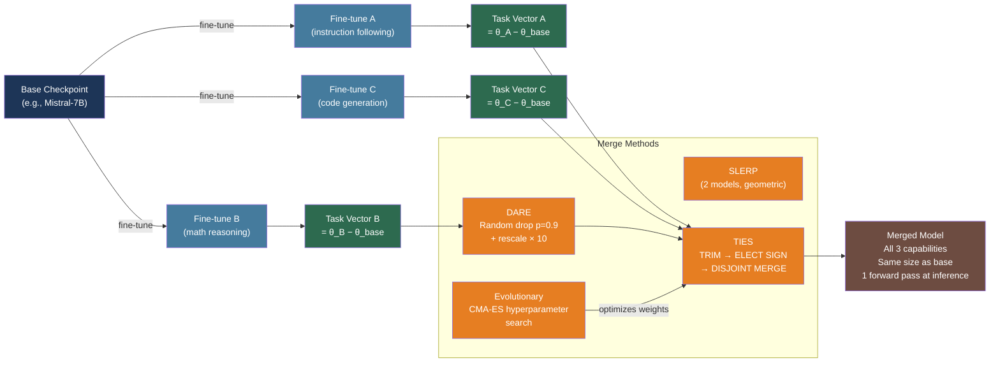

# [BEE-30074] LLM Model Merging and Weight-Space Composition

:::info
Merging two fine-tuned models by averaging their weights produces a single model with the combined capabilities of both — and the same memory footprint and inference latency as either constituent alone. Unlike classical ensembles that require N forward passes, a merged model requires exactly one, making weight-space merging the most compute-efficient form of multi-model combination.
:::

## Context

Two independently fine-tuned models that share a common pre-trained checkpoint tend to occupy nearby regions of the loss landscape. This geometric proximity enables a counterintuitive operation: interpolating between their weight tensors produces a model that performs well on both of their target tasks. Wortsman et al. ("Model Soups", arXiv:2203.05482, ICML 2022) formalized this as the **model soup** — averaging the weights of multiple models fine-tuned with different hyperparameters from the same checkpoint improves accuracy and out-of-distribution robustness without any additional compute. A greedy soup of CLIP ViT-G/14 models achieved 90.94% ImageNet top-1 accuracy, beating the best single constituent (90.72%) while using no extra parameters and setting a new state of the art.

Ilharco et al. ("Editing Models with Task Arithmetic", arXiv:2212.04089, ICLR 2023) made the geometry explicit with **task vectors**: the difference between fine-tuned and pre-trained weights `τ = θ_ft − θ_pretrained` encodes the knowledge acquired during fine-tuning as a direction in weight space. Adding multiple task vectors simultaneously transfers multiple capabilities into one model. Negating a task vector selectively removes a capability while leaving unrelated behaviors intact.

The practical challenge is **weight interference**: when multiple fine-tuned models push the same parameter in opposite directions, simple averaging cancels both contributions. TIES-Merging (Yadav et al., arXiv:2306.01708, NeurIPS 2023) and DARE (Yu et al., arXiv:2311.03099, ICML 2024) address this by pruning low-magnitude changes and resolving sign conflicts before combining. These methods, together with SLERP and evolutionary search, are unified in **mergekit** (Goddard et al., arXiv:2403.13257), the open-source toolkit that has become the standard infrastructure for model merging.

## Merge Methods

### SLERP (Spherical Linear Interpolation)

Interpolates between two models along the geodesic on a unit hypersphere, preserving vector magnitude throughout the interpolation — unlike linear averaging, which shrinks the resulting vector at the midpoint:

```
SLERP(θ_A, θ_B, t) = [sin((1-t)·Ω) / sin(Ω)] · θ_A + [sin(t·Ω) / sin(Ω)] · θ_B
```

where `Ω = arccos(θ_A · θ_B / (|θ_A| · |θ_B|))` is the angle between weight tensors and `t ∈ [0,1]` is the interpolation factor. SLERP is limited to two models; merging three or more requires chaining SLERP calls hierarchically.

**When to use:** Smoothly blending two stylistically or behaviorally similar fine-tunes from the same base model — e.g., a creative writing model and an instruction-following model based on the same Mistral-7B checkpoint.

### Task Arithmetic

Constructs task vectors (delta parameters) and adds them to the pre-trained base, with a scaling coefficient λ that controls the contribution strength:

```python
def task_arithmetic_merge(
    pretrained: dict,
    finetuned_models: list[dict],
    lam: float = 0.3,
) -> dict:
    """
    Merge N fine-tuned models via task arithmetic.
    All models must share the same base checkpoint.
    """
    merged = {k: v.clone() for k, v in pretrained.items()}
    for ft_model in finetuned_models:
        for key in merged:
            task_vector = ft_model[key] - pretrained[key]
            merged[key] = merged[key] + lam * task_vector
    return merged
```

**Negation** (removing a capability): subtract a task vector instead of adding it.

**When to use:** Adding a specific capability (math reasoning, coding style, domain vocabulary) to a base model; removing an undesired behavior with minimal side effects on other capabilities.

### TIES-Merging

Resolves weight interference through three steps applied to each parameter position:

1. **TRIM:** Zero out delta parameters (θ_ft − θ_base) whose absolute value is below the top-k% threshold. Removes low-magnitude noise.
2. **ELECT SIGN:** For each parameter, compute the sign that has greater aggregate magnitude across all models. This is the "elected sign" for that position.
3. **DISJOINT MERGE:** Average only the parameters from models that agree with the elected sign. Parameters with the opposing sign are excluded.

```python
import torch

def ties_merge(
    base: dict[str, torch.Tensor],
    models: list[dict[str, torch.Tensor]],
    density: float = 0.5,      # retain top-50% of task vector by magnitude
    lam: float = 1.0,
) -> dict[str, torch.Tensor]:
    merged = {}
    for key in base:
        # Compute task vectors
        deltas = torch.stack([m[key].float() - base[key].float() for m in models])
        # TRIM: zero out small-magnitude parameters per model
        k = max(1, int(density * deltas.shape[1]) if deltas.dim() > 1 else 1)
        if deltas.dim() > 1:
            threshold = deltas.abs().topk(k, dim=1).values.min(dim=1).values
            trimmed = deltas * (deltas.abs() >= threshold.unsqueeze(1))
        else:
            trimmed = deltas
        # ELECT SIGN: majority sign by aggregate magnitude
        pos_mass = (trimmed * (trimmed > 0)).sum(dim=0)
        neg_mass = (trimmed * (trimmed < 0)).abs().sum(dim=0)
        elected_sign = torch.where(pos_mass >= neg_mass, torch.ones_like(pos_mass),
                                   -torch.ones_like(pos_mass))
        # DISJOINT MERGE: average agreeing parameters only
        agree_mask = (trimmed.sign() == elected_sign.unsqueeze(0)) | (trimmed == 0)
        agree_count = agree_mask.float().sum(dim=0).clamp(min=1)
        merged_delta = (trimmed * agree_mask).sum(dim=0) / agree_count
        merged[key] = base[key] + lam * merged_delta.to(base[key].dtype)
    return merged
```

**When to use:** Merging three or more specialized models (e.g., a coding model, a math model, and a multilingual model) where sign conflicts are frequent and simple averaging degrades all capabilities.

### DARE (Drop And REscale)

Sparsifies each model's task vector by randomly zeroing out a fraction `p` of parameters and rescaling the survivors by `1/(1-p)`:

```python
def dare_sparsify(
    delta: torch.Tensor,
    drop_rate: float = 0.9,
    seed: int = 42,
) -> torch.Tensor:
    """
    Apply DARE sparsification to a task vector.
    drop_rate=0.9 zeros out 90% of parameters, rescales survivors by 10x.
    """
    generator = torch.Generator().manual_seed(seed)
    mask = torch.bernoulli(
        torch.full(delta.shape, 1 - drop_rate),
        generator=generator,
    )
    return delta * mask / (1 - drop_rate)

# After DARE, task vectors are sparse and can be summed with minimal interference
def dare_ties_merge(base, models, drop_rate=0.9, density=0.5, lam=1.0):
    sparsified = [{k: v + dare_sparsify(v - base[k], drop_rate)
                   for k, v in m.items()} for m in models]
    return ties_merge(base, sparsified, density=density, lam=lam)
```

Yu et al. demonstrated DARE's practical power: merging WizardLM-7B (instruction-following, near 0% on GSM8K) and WizardMath-7B using DARE produced a merged model scoring **66.3% on GSM8K zero-shot** — surpassing WizardMath standalone (64.2%) while retaining WizardLM's instruction-following behavior. The merged 7B model ranked first on the Open LLM Leaderboard at publication.

## mergekit: Production Tool

All the above methods are implemented in **mergekit** (`pip install mergekit`, https://github.com/arcee-ai/mergekit). It operates out-of-core (minimal GPU/CPU RAM) and produces standard HuggingFace-format checkpoints that load identically to any other model:

```bash
# Install
pip install mergekit

# Merge via YAML config
mergekit-yaml merge_config.yaml ./output-model \
  --copy-tokenizer \
  --out-shard-size 1B \
  --lazy-unpickle    # reduces peak RAM by streaming tensors
```

**DARE-TIES config (three models into one):**

```yaml
# merge_config.yaml
models:
  - model: mistralai/Mistral-7B-v0.1      # base model (no delta)
  - model: WizardLM/WizardLM-7B-V1.2
    parameters:
      density: 0.53      # retain 53% of task vector by magnitude
      weight: 0.5        # contribution weight
  - model: WizardMath-7B-V1.1
    parameters:
      density: 0.53
      weight: 0.4
merge_method: dare_ties
base_model: mistralai/Mistral-7B-v0.1
parameters:
  normalize: true    # normalize merged task vector by sum of weights
dtype: bfloat16
```

**SLERP config (two models, layer-varying interpolation):**

```yaml
# Different layers interpolate differently: attention vs MLP can favor different models
slices:
  - sources:
      - model: mistralai/Mistral-7B-Instruct-v0.2
        layer_range: [0, 32]
      - model: teknium/OpenHermes-2.5-Mistral-7B
        layer_range: [0, 32]
merge_method: slerp
base_model: mistralai/Mistral-7B-Instruct-v0.2
parameters:
  t:
    - filter: self_attn    # attention layers: 50% each at boundaries, varied in middle
      value: [0, 0.5, 0.3, 0.7, 1]
    - filter: mlp
      value: [1, 0.5, 0.7, 0.3, 0]
    - value: 0.5           # default for all other parameters
dtype: bfloat16
```

**Serving the merged model** — no special handling needed; the output is an ordinary checkpoint:

```python
from transformers import AutoModelForCausalLM, AutoTokenizer

# Load exactly like any other model — vLLM, ollama, and HuggingFace all work identically
model = AutoModelForCausalLM.from_pretrained("./output-model", torch_dtype="bfloat16")
tokenizer = AutoTokenizer.from_pretrained("./output-model")
```

## Evolutionary Merge Search

Choosing merge methods, density, and per-layer weights manually is guesswork. Akiba et al. ("Evolutionary Optimization of Model Merging Recipes", arXiv:2403.13187, Nature Machine Intelligence 2025) automated this with CMA-ES (Covariance Matrix Adaptation Evolution Strategy), searching over merge hyperparameters without training data or GPU compute for the search itself.

Their EvoLLM-JP model (evolved from Japanese and math-specialized models at 7–10B parameters) achieved **55.2% on MGSM-JA** (Japanese math), compared to 9.6–30.0% for the source models individually, while also reaching 70.5 on the JP-LMEH 9-task Japanese NLP benchmark — surpassing a 70B Japanese StableLM (68.3) with 10× fewer parameters. mergekit supports evolutionary search via `mergekit-evolve`.

## Best Practices

### Verify all models share the same base checkpoint before merging

**MUST** confirm that all models being merged were fine-tuned from the same exact base checkpoint (same revision, same architecture). Models fine-tuned from different bases reside in different loss basins; averaging their weights produces a model that is poor at everything. A mismatch in vocabulary size, embedding dimension, or number of layers makes merging impossible without layer concatenation (Frankenmerging), which has its own instability.

### Apply DARE or TIES rather than simple averaging for three or more models

**SHOULD** use DARE-TIES instead of plain averaging or task arithmetic when merging three or more models. Simple averaging with many models amplifies sign conflicts — parameters where different fine-tunes pulled in opposite directions cancel to near-zero, degrading all constituent capabilities. DARE's random sparsification reduces the probability of collisions; TIES's sign election recovers a consistent direction. Use `dare_ties` as the default merge method for 3+ model combinations.

### Tune the density and weight parameters with a held-out evaluation set

**SHOULD** evaluate merged models against a sample of target-task prompts before deploying. The `density` parameter (what fraction of each task vector to retain) and `weight` (relative contribution) have significant effects on downstream quality. A sweep over density in [0.3, 0.5, 0.7] and weight combinations typically identifies the optimal configuration within 10–20 merges. Because mergekit operates CPU-only, each merge takes minutes rather than hours.

### Measure L2 distance from base to detect loss-basin departure

**SHOULD** compute the L2 distance between merged weights and base weights as a stability proxy. Research on Llama-3B and Qwen-4B models shows that merged models with L2 distance above ~100–300 from the base checkpoint exhibit degraded general performance, regardless of task-specific gains. This can be computed before any inference:

```python
import torch
from transformers import AutoModelForCausalLM

def weight_distance(base_path: str, merged_path: str) -> float:
    """Compute L2 distance between base and merged model weights."""
    base = AutoModelForCausalLM.from_pretrained(base_path, torch_dtype=torch.float32)
    merged = AutoModelForCausalLM.from_pretrained(merged_path, torch_dtype=torch.float32)

    total_sq_diff = 0.0
    for (name, bp), (_, mp) in zip(base.named_parameters(), merged.named_parameters()):
        total_sq_diff += (bp - mp).pow(2).sum().item()

    del base, merged  # free memory
    return total_sq_diff ** 0.5
```

### Treat merged models as ordinary checkpoints in serving infrastructure

**MAY** deploy merged models without any special serving configuration. The output of mergekit is a standard HuggingFace model directory. Load it with `AutoModelForCausalLM.from_pretrained`, serve it with vLLM (`vllm serve ./merged-model`), quantize it to GGUF with llama.cpp, or push it to HuggingFace Hub — all workflows are identical to any other model.

## Visual



## Common Mistakes

**Merging models from different base checkpoints.** Even two models with identical architectures and the same parameter count cannot be meaningfully merged if they were initialized from different base models. The weight spaces are unrelated — averaging them produces a model in the interior of a region that neither model's training has visited, with uniformly poor performance. Always verify base model SHA/revision before merging.

**Using simple averaging with many models without addressing sign conflicts.** Adding ten task vectors with equal weights is dominated by cancellation: parameters that half the models want to increase and half want to decrease average to near-zero, eliminating both capabilities. Use TIES or DARE-TIES for any merge involving three or more models.

**Selecting merge parameters without evaluation.** The density and weight parameters interact non-linearly with specific model combinations. A density of 0.5 that works well for two coding models may destroy general reasoning when applied to a merge including an instruction-following model. Always run a small evaluation sweep (10–20 configurations) before fixing the production merge recipe.

**Trusting public leaderboard results for merged models.** Many top-ranked merged models on public benchmarks exhibit benchmark contamination — their constituent fine-tunes were trained on data overlapping with the test sets. Evaluate on held-out tasks and your own production workload rather than relying on public rankings.

**Ignoring the L2 distance stability signal.** Aggressive merge settings (high λ, many models, high per-model weights) can push the merged model far from the base checkpoint's loss basin. Check L2 distance from base to base before deploying; values above ~200 for 7B models are a warning sign worth investigating with capability probes.

## Related BEEs

- [BEE-30012](fine-tuning-and-peft-patterns.md) -- Fine-Tuning and PEFT Patterns: LoRA fine-tunes are the most common input to model merging — mergekit can merge LoRA adapters by converting them to full-rank task vectors before merging
- [BEE-30071](rlhf-and-alignment-training-infrastructure.md) -- RLHF and Alignment Training Infrastructure: negating a task vector (task arithmetic) can reduce harmful behaviors; merging a safety-fine-tuned model with a capability-specialized one is a common alignment workflow
- [BEE-30060](multi-lora-serving-and-adapter-management.md) -- Multi-LoRA Serving and Adapter Management: model merging is the static alternative to dynamic adapter switching — merging adapters into one checkpoint eliminates runtime overhead at the cost of flexibility
- [BEE-30070](distributed-training-infrastructure-for-large-language-models.md) -- Distributed Training Infrastructure for Large Language Models: understanding weight-space geometry (loss basins, task vectors) motivates why distributed training must preserve model provenance for future merging

## References

- [Wortsman et al. Model Soups: Averaging Weights of Multiple Fine-Tuned Models Improves Accuracy without Increasing Inference Time — arXiv:2203.05482, ICML 2022](https://arxiv.org/abs/2203.05482)
- [Ilharco et al. Editing Models with Task Arithmetic — arXiv:2212.04089, ICLR 2023](https://arxiv.org/abs/2212.04089)
- [Yadav et al. TIES-Merging: Resolving Interference When Merging Models — arXiv:2306.01708, NeurIPS 2023](https://arxiv.org/abs/2306.01708)
- [Yu et al. Language Models are Super Mario: Absorbing Abilities from Homologous Models as a Free Lunch (DARE) — arXiv:2311.03099, ICML 2024](https://arxiv.org/abs/2311.03099)
- [Akiba et al. Evolutionary Optimization of Model Merging Recipes — arXiv:2403.13187, Nature Machine Intelligence 2025](https://arxiv.org/abs/2403.13187)
- [Goddard et al. Arcee's MergeKit: A Toolkit for Merging Large Language Models — arXiv:2403.13257, 2024](https://arxiv.org/abs/2403.13257)
- [mergekit — github.com/arcee-ai/mergekit](https://github.com/arcee-ai/mergekit)
- [Labonne. Merge Large Language Models with mergekit — huggingface.co/blog/mlabonne/merge-models](https://huggingface.co/blog/mlabonne/merge-models)
- [NVIDIA. An Introduction to Model Merging for LLMs — developer.nvidia.com/blog/an-introduction-to-model-merging-for-llms](https://developer.nvidia.com/blog/an-introduction-to-model-merging-for-llms/)
