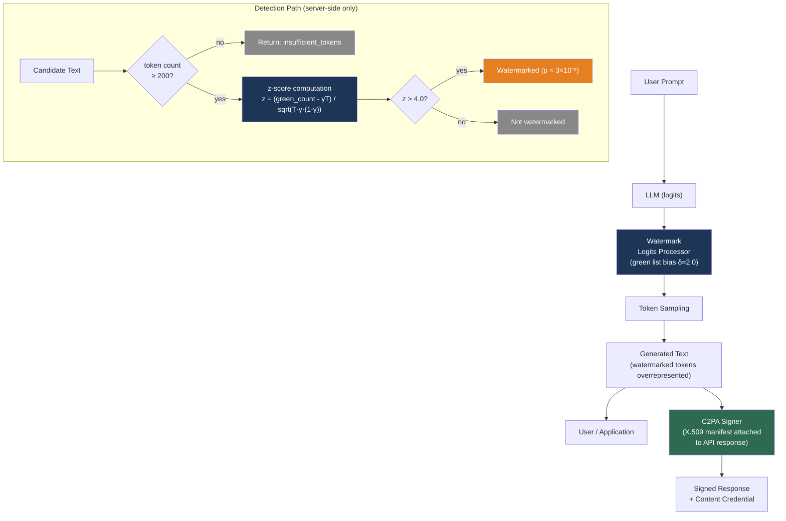

# [BEE-30077] LLM Output Watermarking and AI Content Provenance

:::info
LLM watermarking embeds a statistically detectable signal into generated text at inference time without modifying the model or degrading output quality. It enables a provider to verify whether a given piece of text was produced by their system — and to prove it was not when it wasn't. The signal is invisible to readers but measurable by a detector with access to the secret key. The fundamental limitation: a determined attacker who can query the generation API repeatedly can reconstruct the key for under $50 in API costs.
:::

## Context

When an LLM produces text, that text is indistinguishable by eye from human-written content. This creates several problems backend engineers must address: academic integrity enforcement, tracking AI-generated content in user-generated content platforms, legal liability for AI-produced misinformation, and compliance with emerging regulations (the EU AI Act requires disclosure of AI-generated content above certain thresholds).

Two fundamentally different approaches address AI content provenance. **Statistical watermarking** modifies the token sampling distribution at inference time to embed a detectable bias that persists in the output text. **Cryptographic provenance** (C2PA) attaches a signed metadata manifest to the file or document recording its AI origin without altering the text itself. These approaches are complementary: watermarking can identify AI origin even after metadata stripping, while C2PA provides verifiable chain-of-custody without requiring white-box model access.

The seminal watermarking paper is Kirchenbauer et al. "A Watermark for Large Language Models" (arXiv:2301.10226, ICML 2023), which introduced a practical, model-agnostic approach that requires no retraining and adds negligible inference latency. Google DeepMind independently developed SynthID for text (Dathathri et al., Nature 2024), which is deployed in Gemini and available in HuggingFace Transformers. OpenAI developed a similar scheme internally but decided not to deploy it, citing usability concerns and robustness limitations.

## Statistical Watermarking

### The Green/Red List Algorithm (Kirchenbauer et al.)

At each token generation step, the model assigns probabilities to all tokens in the vocabulary. If we deterministically bias the probability distribution toward a pseudorandomly chosen subset ("green list") of the vocabulary, those tokens will be overrepresented in the output. A detector who knows the seed and partition rule can measure this bias statistically.

**Watermarking step (per token at position t):**

1. Hash the previous token (or a window of preceding tokens) with a secret key to produce a deterministic seed.
2. Use the seed to partition the vocabulary into a **green list** (γ fraction, typically 0.25–0.5) and a **red list** (remaining fraction).
3. Add a constant δ (logit bias) to the log-probability of every green-list token before softmax sampling. Red-list tokens remain available but are disfavored.

With γ = 0.5 and δ = 2.0 (the recommended defaults for quality/detectability balance), the output text will contain green-list tokens at an anomalously high rate while preserving natural fluency — the boosted tokens are still chosen by the model's own probability estimates, just with a consistent thumb on the scale.

**Detection (z-score test):**

Given candidate text of T scored tokens with |s|_G green-list tokens observed, compute:

```
z = (|s|_G − γ × T) / sqrt(T × γ × (1 − γ))
```

Under the null hypothesis (no watermark, human-written text), green tokens appear at rate γ by chance, so z ~ N(0,1). A high z-score indicates systematic green-list bias was applied during generation. At z > 4, the one-sided p-value is approximately 3 × 10⁻⁵ — extremely unlikely by chance.

**Verified performance (γ = 0.5, δ = 2.0, T ≈ 200 tokens, multinomial sampling):**

| Metric | Value |
|---|---|
| False positive rate (unwatermarked text flagged) | ~3 × 10⁻⁵ at z > 4 |
| True positive rate (watermarked text detected) | ~98.4% |
| Minimum tokens for reliable detection | ~200 (soft variant) |
| Latency overhead per token | < 1 ms (one hash + vocabulary partition) |

**HuggingFace integration:**

```python
from transformers import AutoModelForCausalLM, AutoTokenizer
# pip install lm-watermarking or use the research repo
from watermark_processor import WatermarkLogitsProcessor, WatermarkDetector

model = AutoModelForCausalLM.from_pretrained("meta-llama/Llama-3.2-3B-Instruct")
tokenizer = AutoTokenizer.from_pretrained("meta-llama/Llama-3.2-3B-Instruct")

watermark_processor = WatermarkLogitsProcessor(
    vocab=list(tokenizer.get_vocab().values()),
    gamma=0.25,              # green list = 25% of vocabulary
    delta=2.0,               # logit boost for green tokens
    seeding_scheme="simple_1",  # previous-token hash seeds the partition
)

inputs = tokenizer("Explain what GGUF is.", return_tensors="pt")
output_ids = model.generate(
    **inputs,
    logits_processor=[watermark_processor],
    max_new_tokens=200,
)
output_text = tokenizer.decode(output_ids[0], skip_special_tokens=True)

# Detection — run server-side, never expose key material client-side
detector = WatermarkDetector(
    vocab=list(tokenizer.get_vocab().values()),
    gamma=0.25,
    seeding_scheme="simple_1",
    device="cpu",
    tokenizer=tokenizer,
    z_threshold=4.0,
)
result = detector.detect(output_text)
# {"prediction": True, "z_score": 6.3, "p_value": 1.5e-10, "num_tokens_scored": 198}
```

### SynthID for Text (Google DeepMind, Nature 2024)

SynthID replaces the discrete binary vocabulary partition with a continuous pseudo-random logit bias via tournament sampling. Instead of a fixed green/red boundary, SynthID defines a **g-function** that hashes an n-gram context (default: 5 preceding tokens) against each of 20–30 secret integer keys to produce per-token, per-key scores. Tokens with higher g-values for the current key systematically "win" elimination rounds, introducing a smoothly varying bias rather than a binary one.

The tournament approach makes the bias harder to detect by inspection and harder to reconstruct by querying the API, compared to the explicit partition of Kirchenbauer's scheme. SynthID offers three detectors: a Weighted Mean detector (no training required), a basic Mean detector, and a Bayesian classifier (requires training on watermarked/unwatermarked pairs; outputs "watermarked," "unwatermarked," or "uncertain").

**HuggingFace integration (Transformers v4.46.0+):**

```python
from transformers import AutoModelForCausalLM, AutoTokenizer, SynthIDTextWatermarkingConfig

model = AutoModelForCausalLM.from_pretrained("google/gemma-2-9b-it")
tokenizer = AutoTokenizer.from_pretrained("google/gemma-2-9b-it")

# Keys must be kept secret — rotate periodically via secrets manager
watermarking_config = SynthIDTextWatermarkingConfig(
    keys=[654, 400, 836, 123, 340, 717, 982, 234, 567, 891,
          112, 443, 776, 209, 538, 871, 304, 637, 970, 403],
    ngram_len=5,      # hash window of 5 preceding tokens
)

outputs = model.generate(
    input_ids,
    watermarking_config=watermarking_config,
    max_new_tokens=512,
)
```

SynthID detection in clean conditions achieves AUC ≈ 1.00. At 70% synonym substitution, AUC remains above 0.94.

## Cryptographic Provenance: C2PA

C2PA (Coalition for Content Provenance and Authenticity, https://spec.c2pa.org/) is an open standard (ISO submission pending, current v2.2) that attaches a cryptographically signed metadata manifest to media files. Unlike statistical watermarking, C2PA does not modify the content itself — it records origin and editing history in the file's metadata.

A C2PA **Content Credential** contains:
- Asset origin claim (camera capture, AI generation, human editing)
- AI model or tool identity
- Editing history with timestamps and actor identity
- Training data provenance assertions
- X.509 certificate chain enabling chain-of-custody verification

**Adoption:** OpenAI joined C2PA's steering committee in May 2024. Amazon and Meta joined in September 2024. Google integrates C2PA metadata in Images, Lens, and Circle to Search.

**Key limitation for LLM text:** C2PA manifest metadata can be stripped by copy-paste or screenshot, breaking the chain of custody. The standard is most mature and reliable for images, audio, and video files. For LLM chat output, there is no mechanism to preserve a C2PA manifest across text copy operations. C2PA is best used as a provenance signal at the API response level (embedding metadata in API response headers or structured documents), not as a guarantee for arbitrary text snippets shared through other channels.

## Attack Vectors

### Watermark Stealing

Jovanović, Staab, and Vechev demonstrated that an attacker with black-box API access can reconstruct the secret green/red partition through systematic querying — **for under $50 in API calls** (ICML 2024, arXiv:2402.19361). The attack strategy:

1. Sample many completions for carefully crafted prompts
2. Observe which tokens appear frequently across completions — these are likely green-list tokens
3. Build an approximate model of the partition

Once the approximate partition is known:
- **Spoofing** (making human text appear watermarked): >80% success rate
- **Scrubbing** (making watermarked text evade detection): >80% success rate

The attack targets the detection API as much as the generation API. Exposing a detection endpoint is itself a vulnerability.

### Paraphrasing

Strong paraphrase attacks reduce detectability but do not eliminate it. After DIPPER paraphrase at moderate strength, the Kirchenbauer soft watermark remains detectable in texts of approximately 800+ tokens. SynthID's tournament mechanism is somewhat more robust to synonym substitution (AUC > 0.94 at 70% synonym substitution rate), but independent research found scrubbing success rates above 90% even without a key-stealing attack.

### The Robustness–Security Trade-off

A stronger statistical signal is easier to detect reliably — and easier to learn from API queries. A weaker signal is harder to steal but also harder to detect. NeurIPS 2024 ("No Free Lunch in LLM Watermarking") formalized this as a fundamental information-theoretic constraint, not an engineering limitation.

## Best Practices

### Keep the watermark key strictly server-side and rate-limit detection

**MUST** store watermark keys (Kirchenbauer seed / SynthID key list) in a secrets manager (AWS Secrets Manager, HashiCorp Vault) and never expose them to client code. The Jovanović et al. attack requires multiple API queries to reconstruct the key. Rate-limit the detection endpoint to prevent systematic probing: enforce per-user, per-IP, and per-session query limits on any endpoint that reveals watermark scores:

```python
from functools import lru_cache

@lru_cache(maxsize=None)
def get_watermark_keys() -> list[int]:
    """Load from secrets manager, not from config files or environment variables."""
    import boto3
    client = boto3.client("secretsmanager", region_name="us-east-1")
    secret = client.get_secret_value(SecretId="prod/llm/watermark-keys")
    return json.loads(secret["SecretString"])["keys"]
```

### Enforce a minimum token threshold before reporting detection results

**MUST NOT** report watermark detection results for texts shorter than 200 tokens (Kirchenbauer) or 100 tokens (SynthID Bayesian detector). The z-score distribution is unreliable on short sequences: false positives increase significantly, and the statistical test's independence assumption is more likely to be violated. Return "insufficient text" rather than a detection verdict for short inputs:

```python
def detect_watermark(text: str, tokenizer, detector) -> dict:
    tokens = tokenizer.encode(text)
    if len(tokens) < 200:
        return {"prediction": None, "reason": "insufficient_tokens", "token_count": len(tokens)}
    return detector.detect(text)
```

### Use statistical watermarking and C2PA as complementary layers

**SHOULD** deploy both statistical watermarking (for text content identification) and C2PA credential embedding (for API response provenance) for high-stakes applications. C2PA provides instant, machine-verifiable provenance at the response level with a cryptographic certificate chain; statistical watermarking provides a signal that persists even if C2PA metadata is stripped from the text. Neither is sufficient alone:

- C2PA without watermarking: undetectable once metadata is stripped
- Watermarking without C2PA: resistant to scrubbing but vulnerable to key stealing

### Do not build user-facing detection products on current watermarking technology

**MUST NOT** promise users that detection results are definitive proof of AI generation. The current false positive rate for Kirchenbauer (3 × 10⁻⁵) means that in a corpus of 33,000 human texts, one will statistically be flagged as AI-generated. Adversarial attacks can further manipulate scores in both directions. Detection results are probabilistic evidence, not forensic proof, and presenting them as such creates liability and harm potential. Internal abuse detection and content policy enforcement are appropriate uses; public accusation of plagiarism is not.

### Rotate watermark keys periodically

**SHOULD** rotate watermark keys on a periodic schedule (quarterly or annually) and maintain a key registry that maps key versions to their active time windows. This limits the damage from a key-stealing attack: a reconstructed key becomes invalid after rotation. The key registry enables historical detection (text generated before a rotation can still be checked against the key in use at that time):

```python
@dataclass
class WatermarkKeyRecord:
    key_version: str
    keys: list[int]
    active_from: datetime
    active_until: datetime | None  # None = currently active

def detect_with_key_history(
    text: str,
    key_registry: list[WatermarkKeyRecord],
    detector_factory,
) -> dict:
    """Try all historical keys to detect watermarks from any time period."""
    for record in sorted(key_registry, key=lambda r: r.active_from, reverse=True):
        detector = detector_factory(record.keys)
        result = detector.detect(text)
        if result["prediction"]:
            return {**result, "key_version": record.key_version, "generated_period": record.active_from}
    return {"prediction": False, "key_version": None}
```

## Visual



## Common Mistakes

**Exposing a public watermark detection API without rate limiting.** Providing an endpoint that reports z-scores or "watermarked/not watermarked" per API call is the primary attack surface for key reconstruction. The Jovanović et al. attack requires systematic sampling of the response to reconstruct the partition. If you must expose detection, limit it to authenticated, rate-limited users and monitor for anomalous query patterns.

**Using hard watermarking (red-list logits set to -inf) in production.** The hard variant causes some tokens to have probability zero, which creates perplexity spikes on any prompt that would naturally continue with a red-list token. This produces detectable artifacts (elevated perplexity on watermarked text vs. baseline) that can be exploited for detection without access to the key. The soft variant (δ bias) avoids this while remaining statistically detectable.

**Applying watermarking to constrained generation tasks.** Code generation, SQL generation, structured JSON output, and regex-constrained completions have narrow valid vocabularies. Biasing a fixed 25–50% of the vocabulary toward green tokens drastically reduces the effective output space and introduces correctness regressions. Disable watermarking for constrained generation tasks, or use n-gram seeded variants that adapt the partition to the constrained context.

**Relying solely on watermarking to detect all AI-generated content.** Watermarks only detect content generated by your own system with your own key. Text generated by other providers' models, open-source models deployed locally, or paraphrased AI content will not be flagged. Detection coverage is never 100%, and any content policy built on watermarking must account for what it cannot detect.

## Related BEEs

- [BEE-30008](llm-security-and-prompt-injection.md) -- LLM Security and Prompt Injection: adversarial inputs that attempt to manipulate model output can also be used to probe watermarking systems; the security posture for both overlaps
- [BEE-30020](llm-guardrails-and-content-safety.md) -- LLM Guardrails and Content Safety: watermarking identifies AI origin; guardrails control AI content — they address different concerns and are commonly deployed together
- [BEE-30028](prompt-management-and-versioning.md) -- Prompt Management and Versioning: the secret keys and gamma/delta parameters used in watermarking are configuration that must be versioned and managed with the same discipline as prompts
- [BEE-30042](ai-red-teaming-and-adversarial-testing.md) -- AI Red Teaming and Adversarial Testing: watermark evasion (paraphrasing, back-translation, special character injection) is a standard red-team scenario for AI content policy systems

## References

- [Kirchenbauer et al., "A Watermark for Large Language Models" — arXiv:2301.10226](https://arxiv.org/abs/2301.10226)
- [Kirchenbauer et al., ICML 2023 proceedings — proceedings.mlr.press/v202/kirchenbauer23a.html](https://proceedings.mlr.press/v202/kirchenbauer23a.html)
- [lm-watermarking reference implementation — github.com/jwkirchenbauer/lm-watermarking](https://github.com/jwkirchenbauer/lm-watermarking)
- [Dathathri et al., "Scalable watermarking for identifying large language model outputs" — Nature 634, 2024](https://www.nature.com/articles/s41586-024-08025-4)
- [HuggingFace: Introducing SynthID-Text — huggingface.co/blog/synthid-text](https://huggingface.co/blog/synthid-text)
- [Google DeepMind SynthID implementation — github.com/google-deepmind/synthid-text](https://github.com/google-deepmind/synthid-text)
- [Google AI developer docs — SynthID — ai.google.dev/responsible/docs/safeguards/synthid](https://ai.google.dev/responsible/docs/safeguards/synthid)
- [Jovanović, Staab, Vechev, "Watermark Stealing in Large Language Models" (ICML 2024) — arXiv:2402.19361](https://arxiv.org/abs/2402.19361)
- [Watermark stealing project site — watermark-stealing.org](https://watermark-stealing.org)
- [Zhao et al., "On the Reliability of Watermarks for LLMs" — arXiv:2306.04634](https://arxiv.org/abs/2306.04634)
- [C2PA specification — spec.c2pa.org](https://spec.c2pa.org/)
- [NeurIPS 2024 — No Free Lunch in LLM Watermarking](https://proceedings.neurips.cc/paper_files/paper/2024/file/fa86a9c7b9f341716ccb679d1aeb9afa-Paper-Conference.pdf)
- [MarkLLM: open-source watermarking toolkit (EMNLP 2024) — arXiv:2405.10051](https://arxiv.org/abs/2405.10051)
- [MarkLLM GitHub — github.com/THU-BPM/MarkLLM](https://github.com/THU-BPM/MarkLLM)
- [SRI Lab: Probing SynthID-Text Watermark — sri.inf.ethz.ch/blog/probingsynthid](https://www.sri.inf.ethz.ch/blog/probingsynthid)
